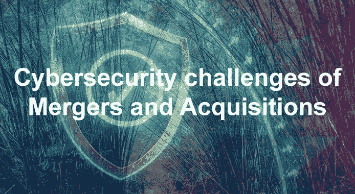

# 并购带来的网络安全挑战

> 原文：<https://medium.com/codex/cybersecurity-challenges-of-mergers-and-acquisitions-642505a84c28?source=collection_archive---------3----------------------->

*原载于 2021 年 11 月 13 日*[*【https://cyberbakery.net】*](https://cyberbakery.net/mergers-and-acquisitions/)*。*

我们每天都听到新的合并和收购。公司宣布收购另一项数百万/数十亿美元的交易。大多数时候，这样的交易对投资者和公司来说都是好消息。然而，在这种交易中，网络安全往往被忽视，从而使他们面临网络攻击。这篇文章探讨了 M & As 的网络安全风险和挑战。

合并组织的网络安全漏洞会对 M&A 的活动产生毁灭性的影响。不良的网络风险尽职调查和未能实施并购后流程往往会带来灾难性的风险。网络安全问题的复杂程度从万豪国际和 Equifax 数据泄露事件中可见一斑。万豪国际在 2016 年收购了喜达屋酒店。喜达屋的 IT 系统在 2014 年的某个时候被攻破，直到 2018 年万豪开始整合他们的预订系统时才为人所知。Marriot 在 2018 年报告称，内部安全部门发现了访问内部客人数据库的可疑企图。这促使内部调查发现，黑客加密并窃取了他们预订系统中多达 5 亿条记录的数据。

2017 年 3 月，Equifax 报告了涉及 1.48 亿条记录的数据泄露，导致 14 亿美元的损失。Equifax 的增长战略被认为是此次违规的罪魁祸首，该战略基于积极的并购。被收购的公司带来了完全不同的系统、糟糕的基本卫生条件和不一致的安全措施，使公司面临这样的损失。

这两起事件凸显了 M&A 活动的问题，除非在收购前后得到精心管理。收购后，IT 团队在整合被收购公司方面承受着巨大的压力。人们经常发现，在收购前的尽职调查过程中，从未咨询过 It 团队，导致风险评估与整体业务环境不符。

应对 M&A 尽职调查采取什么方法，以避免类似万豪国际和 Equifax 违规事件的发生？要了解安全差距，了解相关公司的收购或合并策略非常重要。一旦我们理解了战略，就更容易确定和解决 M&A 风险。以下是发现过程中必须了解的一些关键信息:

# 商业背景

这些公司通过在 M&A 的活动来丰富产品种类和市场，或者增加市场份额。了解当地法律法规要求对政策和流程的影响很重要，这些政策和流程可能需要修改以满足这些要求。例如，不同于母公司的某个地理区域或行业的隐私立法可能不同。可能需要将被收购公司置于母公司的架构下，但有不同的本地隐私立法。这种本地要求带来了巨大的安全挑战。

# 公司位置

如前一点所述，公司可能位于不同的地理位置。位置可能跨越不同的国家、城镇或城市。收购方或被收购公司的子公司也可能位于不同的地点。当地法律推动网络安全政策，信息、语言和文化的交流将影响系统集成的方式。即使收购发生在同一个国家，各州的法律也会有所不同。

公司以不同的方式使用技术来支持他们的业务流程。不同级别的预算和态度推动了对 IT 平台的投资。了解 It 组织的结构非常重要。有多少员工、承包商和顾问参与其中？实施什么类型的网络架构，如何维护和管理？公司中是否存在网络安全组织，它在组织结构中处于什么位置？

同样，系统考虑应该包括发现当前的网络体系结构。必须检查局域网和广域网的连通性，并评估相连网络的潜在漏洞。审查并理解变更和发布管理流程、灾难恢复策略、监控工具和 IT 资产清单。了解公司是否持有个人身份信息(PII)并加以保护是很重要的。

# 从现在开始……

一旦交易完成，新收购的未来关系或商业战略会是什么样的？被收购公司是自主经营还是会被母公司兼并。是否制定了合并后计划来整合两家公司？将整合哪些 IT 系统？被收购或合并的公司规模越小，由于控制薄弱或没有控制，整合就越困难。因此，必须首先围绕集成提出严格的要求。同样重要的是要记住，即使在整合之后，It 系统也可能不适合未来。因此，了解未来的战略和合适的计划可以大大防止未来的悲痛。

# 关键的网络安全考虑因素

我们可以列出一系列安全要求，但以下是 M&A 活动中必须考虑的一些关键因素。

## 人身和人员安全

此类别包括与公司的实物和人力资产相关的问题。对设施(包括运营大楼、总部、数据中心或服务器机房)的实际访问在很大程度上取决于业务的性质。在某些业务中，物理访问仅限于前门访问，但一旦您进入该场所，就没有有限的访问监控。承包商可以在一段延长的时间内不受限制地进入。在物理安全控制薄弱的公司中，对手可以物理访问关键信息或系统，从而导致盗窃、损坏或复制。

## 信息和技术安全

在技术安全领域有许多问题需要考虑。了解身份和访问管理、网络通信(包括局域网和广域网技术)、防火墙、入侵检测系统和远程访问功能等控制措施的实施非常重要。谁有权访问组织外部的网络？在未来的关系中数据会如何交换？作为尽职调查流程的一部分，必须记录完整的 IT 资产清单。必须制定零周和零日活动的预先计划，并确定关键人员来执行这些计划。M&A 的大部分活动可能不会在两家公司公开，因此，没有多少人会参与尽职调查。但是，必须在适当的时候确定关键人物并让他们参与执行这些计划。

## 业务连续性和灾难恢复

M&A 活动有可能会中断业务运营，并在过渡期造成风险。因此，必须审查业务连续性和灾难恢复计划，以确保建立适当的流程。在业务运营中断的情况下，业务活动继续进行，不会产生重大影响。审查灾难恢复和备份计划也很重要，以确保业务关键型数据可以在收购后恢复。

## 网络安全治理

实施网络安全治理计划是任何组织了解公司对网络安全实践态度的良好标志。如果可能，网络安全计划有效性审查应作为尽职调查的一部分进行。该审查将揭示网络安全控制的健康状况，并打开可能在集成时削弱业务的蠕虫罐。

## 网络保险

公司应确定两个组织中存在哪些网络保险安排。网络保险政策旨在覆盖单个事件造成的损失，或在覆盖期内为安全事件的总成本设定上限。有些保险还可以涵盖合并后可能发生的事故。但是，由于所有权变更或转移到被收购公司，网络保险可能会有影响保险范围的条款。因此，重要的是审查和确定覆盖缺口，以确保收购公司没有走错一步。

# 下一步是什么？？

交易完成了，并宣布了一个令人高兴的消息。一项新的收购完成了，这是两家公司历史上一个激动人心的时刻。现在是时候收获尽职调查期间辛勤工作的成果了。然而，现在不是放弃的时候。这是确保在 M&A 活动期间制定的计划得到认真执行的时候了。必须整合人员和技术流程，以确保这两个组织尽快达到稳定状态。在系统集成之前，开发并实施漏洞评估和缓解计划。必须实施全面的监控工具来监控网络流量，如果观察到可疑活动，必须采取必要的措施来最小化业务影响。

M&A 会议期间的网络安全风险管理不是一次性的活动。在整个收购过程中，这需要是一个连续的过程。公司在尽职调查期间花费的时间越多，M&A 期间的网络安全就越好，保护各自公司资产的结果就越好，从而确保平稳过渡。

*原载于 2021 年 11 月 13 日*[*【https://cyberbakery.net】*](https://cyberbakery.net/mergers-and-acquisitions/)*。*