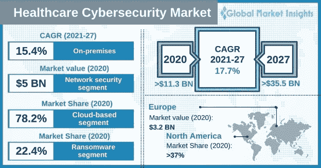
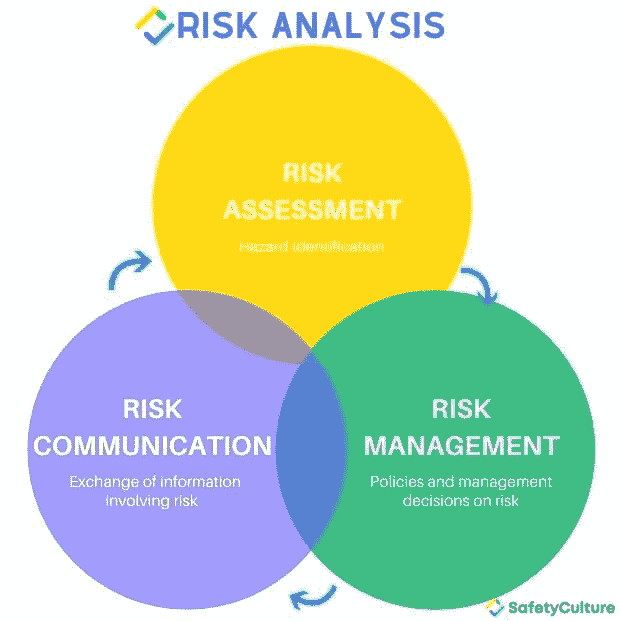
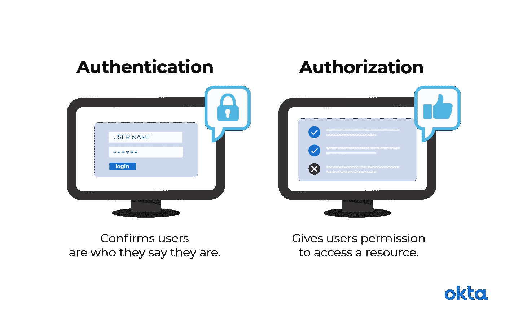

# 医疗保健中的网络安全:如何保护在线存储的敏感数据

> 原文：<https://medium.com/codex/cybersecurity-in-healthcare-how-to-protect-sensitive-data-stored-online-d0bee5a4327?source=collection_archive---------13----------------------->

你知道吗？根据最近的 [*报告*](https://www.gminsights.com/industry-analysis/healthcare-cybersecurity-market) *，医疗网络安全市场将在 2027 年增长 360 亿美元(CAGR 超过 17.7%)。*

医院、医疗机构、药店和其他医疗保健机构在网站或其他在线平台上存储关于其患者的敏感信息。

虽然让这些信息易于访问很好，这样患者可以在家检查预约、支付账单等，但如果外部人员未经授权访问这些数据，也会带来很大的风险。

为了保护患者的信息免受网络罪犯的侵害，您需要实施有效的网络安全计划，保护您的敏感数据免受潜在黑客和其他未授权用户的侵害。

然而，在快节奏的医疗保健领域，记住所有应该采取的安全措施来保护敏感数据和患者记录可能是一项挑战。

本文涵盖了您需要了解的关于医疗保健网络安全的一些最重要的事情，以便您可以保护您组织的机密信息。

但是在我们深入博客之前，先看一下显示医疗保健市场增长速度的图表。

[来源](https://www.gminsights.com/industry-analysis/healthcare-cybersecurity-market)

所以，请继续阅读，了解这些技巧！

# 找出保护在线存储的医疗保健数据的最佳技巧

1.  **确保员工接受医疗网络安全协议培训**

任何存储敏感信息的地方都可能成为网络安全威胁的切入点。这就是为什么培训你的员工快速发现和报告问题是至关重要的，这样你就可以在问题造成损害之前解决它们。

如果您的员工了解某些威胁如何影响他们的系统，他们可以通过发现这些威胁的迹象并立即通知管理员来帮助降低风险。

这对于阻止攻击从一个员工的计算机蔓延到整个系统至关重要。

在当今世界，任何连接到网络的设备都可能构成威胁，员工培训对于保持敏感数据的在线安全尤为重要。

因此，确保他们了解网络安全协议以及如何正确存储和传输敏感信息。

你也可以要求他们签署一份保密协议，详细说明侵犯病人隐私的后果。而且，你还可以联系一家[定制软件开发公司](https://www.valuecoders.com/custom-software-development-services-company?utm_source=cust_soft&utm_medium=Web_page&utm_campaign=Medium&utm_id=NKY)，开发一款高效的医疗保健 app。

**这里有一个例子:**

犹他大学健康科学中心对所有直接处理电子病历的工作人员进行强制性的每月网络安全培训。

培训的重点是哪些类型的信息不能以电子方式披露，网络安全如何影响合规性法规，以及每个人为了安全使用互联网而需要了解的一般互联网安全措施。

“整体目标…是让员工了解什么是安全行为，”

**2。控制和限制访问以保护患者数据**

仅仅因为你没有在纸上存储数据并不意味着它不容易受到攻击。通过控制和限制对患者数据的访问，您可以更好地保护敏感信息不被他人窃取。

使用技术确保只有授权用户才能随时访问重要信息。为每个用户设置唯一的密码，并定期更改。

也考虑使用多因素身份验证——这需要除了密码之外的第二个密码(你拥有的密码或你是谁的密码),这样黑客就无法进入你的密码。很费时间但是很值得。

**这里有一个例子:**

作为医务人员，您可以为接待员和医生设置单独的登录信息。因此，它将根据工作创建不同的数据访问级别。

您还需要确保您的员工没有将您的登录和密码信息保存在他们的 web 浏览器中(称为“记忆”信息)，这样，如果他们被黑客攻击，他们不会泄露您的网络访问权限的多个级别。

如果你只为每个人创建一个单一的用户名和密码，或者把他们的密码保存在他们的浏览器中，那么无论是谁被黑客攻击，都可以访问你网络的每一部分。

**3。定期进行风险评估**

[来源](https://safetyculture.com/topics/risk-assessment/)

为执行安全风险评估创建一个定期的时间表可能看起来令人生畏，但它实际上是管理您的网络安全工作的一个很好的方法。

定期分析您的数据(以及数据的保护方式)对于捕捉新威胁和保护敏感信息的安全至关重要。研究表明，定期评估也可以降低公司的整体风险。

因为你会发现你可能几个月或几年都不会注意到的问题，所以，现在就花些时间来确定你什么时候执行风险评估——然后坚持这个时间表。

**这里有一个例子:**

如果您是医疗保健提供商，您应该定期进行风险评估，以确保患者数据的安全。

这可能包括评估网络的安全性、评估员工的计算机安全知识以及测试灾难恢复计划。

**4。不要使用相同的密码**

为每个帐户创建单独的密码是保护数据的最重要步骤之一。被黑的帐户可能导致被盗的钱和被盗的信息，如社会安全号码、健康记录、财务帐户或信用卡号码。

确保每个帐户都使用不规则字母、数字和符号组合的唯一密码。如果你不能马上记住它们，试着使用密码管理器。

这些工具可以安全地存储您的登录凭证，并在您点击登录网站时自动填写您的密码。

不过要小心——这些程序通常有自己的漏洞，可能会危及你的敏感信息；在登录任何敏感数据之前，请确保它们是安全的。此外，您还可以联系任何医疗保健移动应用开发公司，创建动态医疗保健应用。

**5。安全通信**

如果您需要与患者、医生或其数据存储在您的电子健康记录(EHR)中的任何其他人进行通信，则对话有可能不安全。

确保你使用的是顶级的加密程序，并警惕你实际发送和接收的信息。例如，不要以为所有通过电子邮件进行的交流都会自动受到加密保护。

了解您的 EHR 系统使用的安全协议，并确保在与有权访问您的数据库的其他人通信时使用这些协议。

然而，通过使用安全的通信工具，如加密软件或虚拟专用网络(VPN ),您可以安全地保存您的数据，防止他人窥探。

**这里有一个例子:**

如果您是医疗保健提供商，您可以使用加密软件来帮助保护您的患者数据的安全。这个软件会对你的数据进行加密，这样只有应该看到它的人才能看到它。

您也可以使用 VPN 在您的电脑和互联网之间创建安全连接。

这将有助于您保护数据安全，防止黑客和其他人窃取数据。

**6。认证和授权**

[来源](https://www.okta.com/identity-101/authentication-vs-authorization/)

当我们谈到保护系统免受未经授权的访问时，我们通常谈论两件事:身份验证和授权。

身份验证本质上是某人自称的身份。你可以有好的密码和防火墙，但是如果你为你的所有员工使用它们，那么攻击者只需要找到一个员工的密码就可以侵入你的整个系统。

单一因素身份认证不再足够安全，尤其是在医疗保健领域，网络犯罪分子可能会利用患者的健康信息来勒索赎金。

多因素身份验证确保每个访问您数据的人不仅仅只有一个获得访问权限的密码；他们可能还需要安全令牌或指纹等生物特征数据。

每当您授权访问一段敏感数据时，问问自己是否真的需要多因素身份认证。任何给定的个人能够独自获得那么多个人信息吗？

如果是这样，在授予完全访问权限之前，请确保它受到 MFA(多因素身份验证)的保护。如果您不需要为组织内的每个应用程序和用户身份类型提供多因素身份验证保护，至少需要强密码或密码短语，而不是简单的 PINs 密码。

无论您的基础架构有多安全——无论是物理的还是虚拟的——在授予用户访问敏感数据的权限时，请始终至少为用户提供某种层次的 MFA。

7 .**。设备和服务更新**

新设备通常比旧设备更安全。如今，随着新设备的发布，包含一些安全改进的更新并不少见。

此外，定期更新连接到您电脑的所有设备上的软件也很重要。这样，您就能掌握新出现的问题，并能在发现漏洞时及时更新。

保持操作系统、网络浏览器、防病毒软件和防火墙等程序处于最新状态非常重要，因为恶意黑客通常会找到新的方法来渗透计算机。

尽可能使用内置工具来更新应用程序也是一个好主意(比如 Windows Update for Microsoft 程序)。您也不希望恶意软件伪装成应用程序或程序更新。

因此，设备更新应该自动发生；确保苹果、谷歌和 Windows 提供的服务设置为自动更新，这样你就不会忘记。

**8。安装更好的软件**

保护数据最重要的一步是确保您没有运行旧的、过时的软件。过时的软件或未打补丁的软件是医疗网络安全中许多常见漏洞之一。

它可能成为黑客和其他恶意行为者访问您的计算机网络的渠道。检查 IT 系统是否过时的一个好方法是对网络中所有计算机的所有硬件和软件组件进行审核。

这将让您了解哪些硬件或应用程序可能需要更新，以及哪些需要完全更换。

此外，您还可以通过雇佣您所在地区的任何医疗保健软件开发公司来利用 [**医疗保健应用程序开发服务**](https://www.valuecoders.com/industries/healthcare-software-development-services?utm_source=health_Soft&utm_medium=Web_page&utm_campaign=Medium&utm_id=NKY) 。

**9。为侵权做好计划，并制定补救计划**

无论是对您的企业还是对您的客户而言，健康数据泄露都很常见，并且经常会导致声誉受损和经济损失。

通过遵循适当的程序来保护数据、保护对敏感信息的访问，并在出现问题时制定计划，为潜在的违规行为做好准备。采取这些步骤将有助于确保在发生事故时做出适当的响应。

确保通过关于最佳实践(例如，如何不点击可疑链接)的特殊培训课程，让员工了解与网络安全相关的潜在风险。

如果发生事故，确保每个人都知道他们下一步需要做什么，以及如果他们不确定接下来会发生什么，他们应该打电话给谁，以便最大限度地减少风险，防止进一步的损害发生。

# 结束了！

网络安全对于任何类型的企业都是一个至关重要的问题，医疗保健提供商也不例外。为了保护您的数据，您需要采取多层次的方法，包括使用更新的软件、安装更好的软件，以及在发生违规时制定恢复计划。

而且，现在的黑客，足智多谋，锲而不舍。他们总是试图寻找新的方法来渗透计算机，窃取敏感数据，或以其他方式破坏您的网络安全。

考虑到这一点，医疗保健提供商采取必要的措施来保护他们的数据是非常重要的。这包括提供多协议端到端加密解决方案、使用强密码和口令短语，以及在您的所有硬件和软件系统上实施设备更新。

这些努力将提高网络安全，并有助于防止潜在的攻击伤害你或你的客户的业务。

因此，拥有如上所述的强有力的网络安全措施将使您的组织在现在和将来都保持安全。

仅此而已！