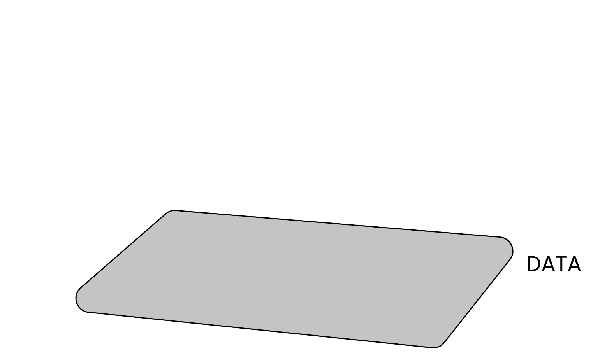
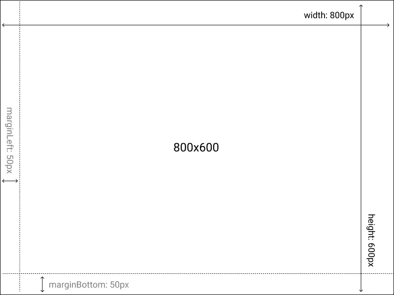

# D3.js 变得简单

> 原文：<https://medium.com/codex/d3-js-made-easy-103a5c36e852?source=collection_archive---------7----------------------->

# 摘要

> 为什么要用 D3？
> 
> 逻辑结构
> 
> 1.数据—起点
> 
> 2.规模——最基本的元素
> 
> 3.轴-参照导向
> 
> 4.标记——几何图元

D3 的例子

# 为什么要用 D3？

D3 或数据驱动文档是世界上最著名的开源数据可视化项目之一。简而言之，它是一个基于数据操作 HTML 元素的 JavaScript 图表库。

过去 20 年来，可视化行业的发展导致了成熟的可视化分析软件的广泛传播，如 Qlik、Tableau、SAS Visual Analytics、Power BI 等。这些软件通过提供极其**简单和快速**的方式来构建图表，从而迅速占领了市场。但是使用预构建的工具有一系列的缺点:

*   通常有付费许可证
*   他们的免费版本，当存在时，对所产生的图表的使用有限制
*   图表选择仅限于界面可选择的图表
*   同一个工具可以附带无限数量的要学习的不同应用程序(例如，参见 Tableau 的服务器/公共/桌面/阅读器/移动/ PrepBuilder…版本)
*   更多地强调商业智能方面，而不是 web 标准
*   难以连续编程和复制的图形
*   无法创建非常具体的自定义数据交互
*   普遍缺乏对低级元素的定制

另一方面，D3 克服了所有这些限制，代价是更大的**复杂性，**与浏览器文档对象模型(DOM)、SVG 标记语言和 JavaScript 的处理相关，后者通常冗长，难以学习、理解和调试。

比较这两种工具并不容易，因为选择往往是强制性的:如果你不是一个 Web 开发人员，你可能会倾向于放弃 D3，而倾向于上面提到的那些更加用户友好的解决方案。然而，所有这些都失去了一个发展个人设计和创造难以置信的独特可视化的好机会，利用一个开放的图书馆，总而言之，通过正确的指示，每个人都可以达到。

所以，如果你对这个世界有更多的好奇，让我们深入了解一下吧！

# 逻辑结构

在本文中，我们将重点关注用这个库构建一个基本图表的主要方面，将整个过程分解为 4 个构建块，使其易于理解和快速执行。

这 4 个构件是:

💾**数据**数据
📏**音阶**音阶
📊**坐标轴**✍
🏾**标记**

我们将使用模块化方法来定义一个简单的**逻辑结构**，这将帮助我们从小处着手，并快速了解必要步骤的顺序，从而为库提供我们希望呈现的图表所需的所有信息。

这篇文章的全部代码可以通过以下链接获得一个可观察的实时可编辑版本:【https://observablehq.com/@danilofiumi/d3-js-made-easy。

> NB: **Observable** 让我们有可能只关注代码的主要方面，而不用担心导入模块、创建外部 HTML 或样式表。此外，它允许我们按单元格执行 JavaScript 代码(即使有一些差异)，在笔记本中实时显示结果。如果你不熟悉 Observable，你可以在这里找到更多信息。



4 个构建模块

# 1.数据-起点

数据是任何数据驱动表示的起点。
我们将在本文中考虑的数据集代表了一类学生的性别、年龄、身高和体重信息。在这个例子中，我们将分析“身高”和“体重”之间的经典关系。

```
data = FileAttachment(“CLASS.csv”).csv({ typed: true })var_x = “Height”var_y = “Weight”
```

> 注意:在 observable 中，没有必要使用 var / let / const 来声明变量

# 2.规模-最基本的元素

音阶是 D3 整个语法中真正跳动的心脏。
它们将某个**域**中的一个数字映射到一个视觉表示**范围**(如果你熟悉的话，这非常类似于数学上的归一化概念)。

在深入使用缩放函数之前，我们必须定义几个结构元素，这些元素允许我们定义工作面，在这个工作面上我们可以一步一步地构建模块。

首先，让我们定义一个包含所有维度的对象，我们将使用这些维度来构建我们的表示。

```
dms = {
  let dms = {
    width: 800,
    height: 600,
    marginTop: 0,
    marginRight: 0,
    marginBottom: 50,
    marginLeft: 50
  };
  dms.boundedWidth = dms.width - dms.marginLeft - dms.marginRight;
  dms.boundedHeight = dms.height - dms.marginTop - dms.marginBottom;return dms;
}
```

让我们创建一个超级简单的 **SVG** 容器，它现在将作为一个空画布工作，我们随后将在其上用普通的 JavaScript 和 D3 方法进行干预。

```
<svg id="chart"></svg>
```

通过 d3.select，我们可以访问具有给定 id 的元素，并为其分配 **viewBox** 属性，以使用前一点中建立的度量来裁剪平面。我们将图表的构造函数定义如下:

```
chart = {
  const svg = d3.select("#chart"); 
// select the element with id="chart" svg.selectAll("*").remove(); 
// clean all the eventual old/unwanted marks svg.attr("viewBox", [-30, -10, dms.width, dms.height]); 
// define all the dimensions with some manual adjustments to better fit the screen size
}
```

现在我们已经创建了如下的空白绘图框。



现在我们终于可以定义尺度函数了。

```
xScale = d3
  .scaleLinear()
  .domain(d3.extent(data, (d) => d[var_x]))
  .range([0, dms.boundedWidth])yScale = d3
  .scaleLinear()
  .domain(d3.extent(data, (d) => d[var_y]))
  .nice()
  .range([dms.boundedHeight, 0])
```

让我们以 xScale 为例。 **scaleLinear** 函数获取 var_x (Weight) 域的所有值，从最小 50kg 扩展到最大 72kg，并将它们重新映射到 0px 到 800px(像素)的连续范围内。yScale 也是如此。

```
// Example Function
xScale(56.6kg) --> 137px
yScale(84cm) --> 363px// Example Proportion
data[1][var_x]:56.6kg = xScale(data[1][var_x]):137px
data[1][var_y]:84cm = yScale(data[1][var_y]):363px
```

这样，体重=56.6kg，身高=84cm 的学生将在平面中被一组位置坐标(137px，363px)，
识别，该坐标允许浏览器的渲染引擎将数值信息翻译并表示到 viewBox 空间范围中。

# 3.轴-参考*导轨*

以下赋值用于声明轴:

```
xAxis = d3.axisBottom(xScale).ticks(15)
yAxis = d3.axisLeft(yScale).ticks(15)
```

**axisBottom** 和 **axisLeft** 是 D3 的预建函数，从上一点定义的刻度开始，构建笛卡尔轴并将其放置在底部(xAxis)和左侧(yAxis)。

这些轴函数不返回值，而是生成可视的 SVG 元素，这些元素可以被呈现以供查看。

我们可以使用许多属性来定制它们，但是现在让我们保持简单，只定义我们想要显示的最大刻度数(每个轴 15 个)。

然后使用**将它们添加到图表的构造函数中。调用【轴】方法后的**D3 选择器:

```
chart = {
  const svg = d3.select("#chart");
  svg.selectAll("*").remove();
  svg.attr("viewBox", [-30, -10, dms.width, dms.height]);//this creates the axes elements
  svg.append("g").call(xAxis);
  svg.append("g").call(yAxis);
}
```

错误的轴

这就是我们得到的。总比没有好，但是 xAxis 完全被搞乱了！

这是因为默认情况下，SVG 的(0，0)原点位于左上角，而不是左下角。为了解决这个问题，我们可以简单地**将 x 轴向下移动**一个等于参考框高度的值。

```
chart = {
  const svg = d3.select("#chart");
  svg.selectAll("*").remove();
  svg.attr("viewBox", [-30, -10, dms.width, dms.height]);//this creates the axes elements
  svg.append("g")
   .attr("transform",move(0,dms.boundedHeight)).call(xAxis)
  svg.append("g")
   .call(yAxis);
}
```

正确的轴

现在看起来刚刚好！

让我们将轴调用封装在一个函数中，这样我们就可以在以后将它与下一步的绘图函数组合在一起。

```
function drawAxes(bounds) {
  bounds.append("g")
   .attr("transform",move(0,dms.boundedHeight)).call(xAxis);
  bounds.append("g")
   .call(yAxis);
}
```

# 4.标记——几何图元

在这一步中，我们将创建区分可视化类型的标记。为了创建这些标记，我们将利用 SVGs **基本几何图形**。

在进入实际的图表之前，让我们定义几个不同的元素，看看这些 SVG 基本形状的用法。让我们创建 1 个矩形、4 个半径递减的圆、1 条垂直线、1 个文本元素和 1 条沿路径的线。它们都需要一个由空间坐标定义的给定的**位置**，而其他的**属性**根据标记的类型而变化。

```
<svg width="400" height="250">
  <rect x="0" y="0" width="50" height="250"/> <circle cx="100" cy="100" r="25"/>
  <circle cx="100" cy="150" r="15"/>
  <circle cx="100" cy="190" r="10"/>
  <circle cx="100" cy="220" r="5"/> <line x1="150" y1="250" x2="150" y2="0" stroke="black"/> <text x="180" y="55" font-size="22" >SVG Primitives</text> <path d="M200.5 149.5L231 117L241 130.5L268 111.5L285 192L304.5        167L322 180.5L375.5 117" stroke="black" fill="none"/>
</svg>
```

SVG 基本形状

通过使用这些原始几何元素，我们可以创建散点图(使用“圆”元素)、折线图(使用“线”或“路径”元素)、条形图(使用“矩形”元素)等

现在让我们关注一下**“circle”**元素。我们的目标是通过**散点图**来表示“身高”和“体重”之间的关系。

```
function drawMarks(bounds, data) {
  bounds
    .selectAll("circle")
    .data(data)
    .join("circle")
    .attr("cx", (d) => xScale(d[var_x]))
    .attr("cy", (d) => yScale(d[var_y]))
    .attr("r", 6)
    .attr("fill", "darkred")
    .attr("opacity", 0.9);
}
```

**。数据**和**。join** 方法读取输入数据集，并创建与类中读取的观察一样多的圆形元素。

**cx** 和 **cy** 属性是指圆心的位置。它们被设置为等于 xScale 和 yScale 为数据集行中的每个重量和高度数值生成的值，将它们重新映射到不同的空间坐标集。

圆圈标记

即使从分析和探索的角度来看完全没有意义，但是看到仅仅通过使用原语来改变图表的类型是多么容易，这是很有用的。对于本例，我们可以使用“path”元素创建一个折线图。

```
function drawMarks(bounds, data) {
  bounds
    .append("path")
    .datum(aq.from(data).orderby(var_x).objects())
    .attr("fill", "none")
    .attr("stroke", "darkblue")
    .attr("stroke-width", 2.5)
    .attr("d",d3.line()
        .x((d) => xScale(d[var_x]))
        .y((d) => yScale(d[var_y]))
    );
}
```

线条标记

现在我们有了所有的 4 个构建模块，我们终于可以组合它们来构建最终的结果了。

```
chart = {
  const svg = d3.select("#chart");
  svg.selectAll("*").remove();
  svg.attr("viewBox", [-30, -10, dms.width, dms.height]); drawAxes(svg);
  drawMarks(svg, data);
}
```

决赛成绩

D3 有这么多不同的方法可以实现相同的结果，你对这个库的经验越多，你就会发现越多人使用不同的特性、功能和代码语法。正因为如此，你有时会感到无所适从。在这种情况下，请记住这四个基本要素数据/比例/轴/标记始终是每一种表现形式的基础，从最简单到最复杂。一旦理解并正确处理，您就可以轻松地调整代码参数，立即获得显著的结果。

更复杂的图表