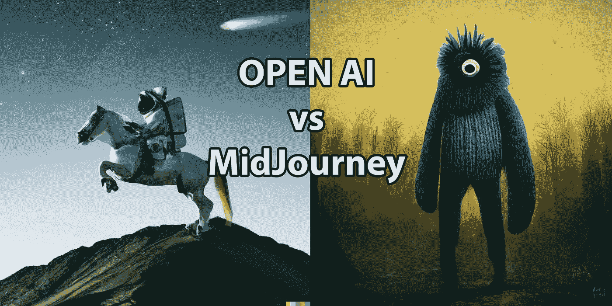

# Dall-E2 与 midway—同样的提示，不同的结果

> 原文：<https://medium.com/codex/dall-e2-vs-midjourney-same-prompt-different-results-bf64cb66d90b?source=collection_archive---------0----------------------->

图片作者[作者](/@jimclydemonge)

对于今天的故事，我将比较 [OpenAI 的 Dall-E2](https://openai.com/dall-e-2/) 和[midway](https://www.midjourney.com/app/)具有相同提示的 AI 艺术生成器工具。

我已经尝试了其他几种艺术发生器，但这两个是目前为止最强大的。两者都还处于封闭测试阶段，所以如果你想试用它们，最好现在就加入等待名单。