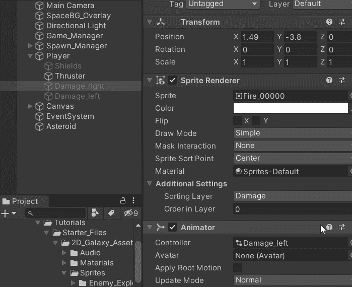

# 在 Unity 中使用动画精灵伤害 VFX

> 原文：<https://medium.com/codex/damage-vfx-using-animated-sprites-in-unity-c13e2dbb68bb?source=collection_archive---------6----------------------->

在[生命计数器文章](/codex/creating-a-lives-counter-ui-element-in-unity-9d48b485555e)中，我谈到了作为一个好游戏设计的原则，在视频游戏中失去生命是如何让玩家明白的。虽然有多种方法可以实现这一点，但直接视觉反馈是最好的方法之一。随着极简 ui 越来越受欢迎，越来越多的游戏越来越不依赖于这个方面来表示玩家数据。《神秘海域》是引领潮流的游戏之一，它的 HUD 只显示弹药，玩家的伤害通过将屏幕的角落变成红色来直观地显示。

神秘海域 2:小偷中

在这篇文章中，我们将看看当播放器损坏时如何添加 VFX。

# 为玩家伤害设置 VFX

1.  使所需的精灵成为玩家对象的子对象，然后根据需要缩放它。这样做是因为 VFX 的伤害需要随着玩家一起移动，而养育本质上意味着孩子的所有的变形变化都是在那个游戏对象而不是游戏世界的视角下进行的。

2.如果你的伤害精灵出现在玩家的下面，添加一个新的层，使它总是显示在玩家的上面。我的情况，已经加了一个。底部的层将出现在顶部的层之上。

3.动画损坏的精灵。在我的例子中，我为[精灵动画](/codex/animating-a-sprite-with-unitys-animation-window-b049493f69a1)使用了一系列精灵图像。

4.禁用检查器中的损坏 VFX。这样，我们可以在适当的时候通过代码激活。我复制了一个损坏的 VFX，以便每个引擎都有一个。

# 当播放器损坏时显示

下面的例子演示了我的播放器代码的一部分。VFX 的伤害代码应该放在剧本中玩家的生命被减去的地方。

1.  创建游戏对象变量来引用检查器中的伤害 VFX。

> **注意**:这是两个独立的变量，但是因为它们共享相同的类型和 over 结构，所以可以这样声明。

2.将损坏的 VFX 放入步骤 1 创建的相应空间中。这将允许我们通过代码操纵它。

3.激活 VFX 造成的伤害玩家失去 X 条生命/当生命等于你选择的数量时。

**结果:**

下一篇文章，我们就来看看 [**如何在 Unity 中使用后期处理！**](/codex/how-to-use-post-processing-in-unity-2de1b7b9d44d)