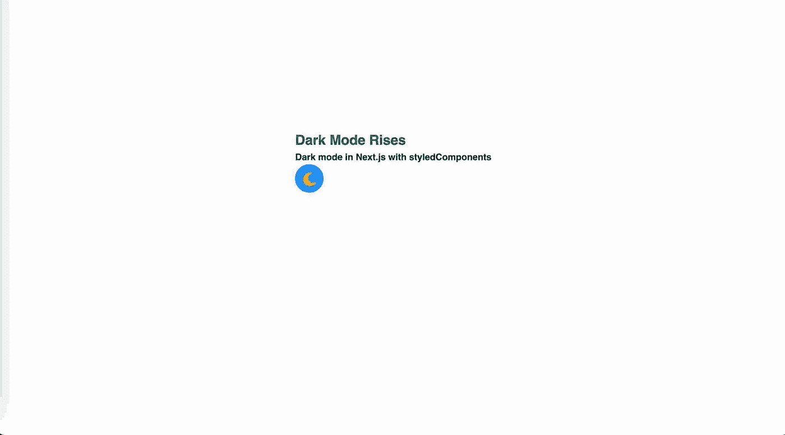
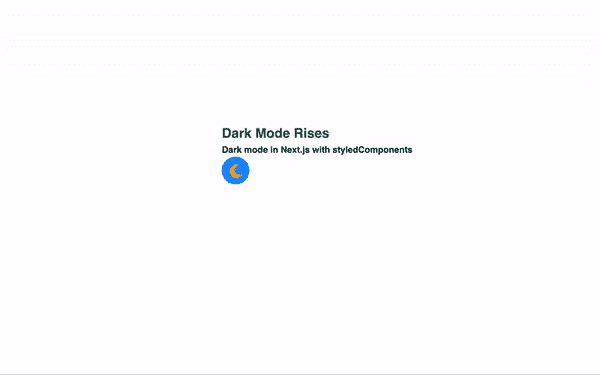

# 黑暗模式上升

> 原文：<https://medium.com/codex/dark-mode-rises-8068d8892efa?source=collection_archive---------13----------------------->

## 这是一个初学者分步指南，介绍如何使用 Rob Morieson 的 CSS 变量技术，在 Next.js 应用程序中使用 Styled-components 实现黑暗模式，而不使用“刷新闪烁”。


照片由[谢尔盖·库图佐夫](https://unsplash.com/@serge_k?utm_source=medium&utm_medium=referral)在 [Unsplash](https://unsplash.com?utm_source=medium&utm_medium=referral) 拍摄

关于如何在网站上实现黑暗模式，有大量的博客文章。(不只是在 Next.js one 上)。当我在我的站点上添加这个特性之前研究这个主题的时候。我偶然发现了 Rob Morieson 的文章[并喜欢他的方法。我决定在我的博客上写下他的技术的实现和我的小调整。](https://electricanimals.com/articles/next-js-dark-mode-toggle)

我不打算解释什么是`a dark mode`或者为什么你想把它添加到你的网站上。无论是设计选择、节能考虑，还是尊重用户的偏好。我们假设你想要它。

虽然黑暗模式的切换表面上看起来很简单，但只用纯 CSS 就可以完成。然而，如果你考虑到可访问性，然后进一步如果设备或浏览器支持，我们应该致力于在初始加载时显示用户的首选主题，并保存他们的偏好，如果他们决定切换主题。

由于这篇博客的副标题是关于 [Next.js](https://nextjs.org/) 的实现，我们首先需要谈谈如何绕过`server side rendering(SSR)`的约束，以及 Next.js 应用程序是如何被水合的。

这只是一个简单的教程，绝不是一个全面的帖子(参见最后的链接，深入了解黑暗模式)。

如果你只是想看完整的代码，请点击这里查看我在 GitHub 上的回购

# 让我们开始吧

# 初始设置

我将为由`create-next-app`用 StyledComponents 创建的 Next.js 项目使用一个样板文件。

```
npx create-next-app --example with-styled-components with-styled-components-app
```

基本的 create-next-app 提供了一个全局 CSS 文件，这是为暗模式和亮模式定义 CSS 变量的最佳位置。然而，带有样式化组件的引导示例并没有为我们提供一个全局 CSS 文件，我们可以利用样式化组件`createGlobalStyle function`。

尽管我们将使用 StyledComponents 进行一些样式设计，但对于我们的黑暗主题挑战，我们将冒险使用 CSS 变量。这种方法背后的原因将在后面解释。

## createGlobalStyle

createGlobalStyle 是一个助手函数，它将生成一个处理全局样式的特殊 StyledComponent。通常情况下，样式化组件的作用域自动限定在一个本地 CSS 类中，因此与其他组件隔离开来。在 createGlobalStyle 的情况下，这种限制被消除，可以应用 CSS 重置或基本样式表之类的东西。

`createGlobalStyle`返回不接受子级的 StyledComponent。将它放在 React 树的顶部，当组件被“渲染”时，全局样式将被注入。

在根目录下创建一个`styles folder`。

然后导入到`_app.js`

让我们为我们的黑暗模式主题添加一些样式。

你可能已经从上面的 CSS 中猜到了，我们将通过对`<body>`标签应用`data-theme attribute`来切换主题，而不是传统的`ThemeProvider`方法。

我应该指出，我见过将它应用于`<html>`标签而不是主体的方法。感谢 [Rob Morieson](https://electricanimals.com/) (这篇文章深受其启发)和 [Kent C. Dodds](https://epicreact.dev/css-variables/) 向 ThemeProvider 解释了使用 CSS 变量的区别。

CSS 方法的要点是，如果我们要使用 StyledComponents 提供的`ThemeProvider`，它在幕后使用 useContext 钩子，我们将不得不更新每个组件的样式，然后浏览器将不得不绘制这些更新。

但是使用 CSS 变量方法，我们将样式更新到单个组件(主体)，然后浏览器只绘制这些更新。理论上，浏览器画图应该在浏览器上花费相同的工作量，所以唯一的区别是我们让浏览器做了多少工作来让 React 重新渲染我们所有的组件，并让情感更新每个组件的样式。

让我们着手构建我们的切换组件。我们将创建一个名为`themeToggle.js`的新文件，并将其放在`components directory`中。

我使用了几个自定义的 SVG 图标作为我们的切换主题指示器。

偶像孙此刻被注释掉了。稍后将通过单击事件来显示它。

在从示例模板中移除引导内容并在`index.js`中导入主题切换按钮之后。这就是我们的 index.js 文件的样子。

该任务的基本静态部分应该呈现如下内容:



# 交互性

初始的和静态的东西都不存在了，是时候添加逻辑了。我们将从 React 的`useState hook`开始，这样我们就可以存储和更新活动主题。

我们的默认主题设置为“light”——我们将在后面更多地关注这一点，这将包括考虑用户的首选配色方案设置，以及使用 localStorage 在刷新时保持首选项的一些调整。

让我们也用 onClick 事件向切换按钮添加相应更新状态的功能。

接下来，我们将利用 React 的`useEffect hook`在`<body>` 标签上设置数据主题属性。将`[activeTheme]`作为依赖项添加到依赖项数组中意味着它将在活动主题改变时运行。

最后，我们需要使用`activeTheme`来有条件地呈现我们的 SVG 图标主题指示器

我们应该会得到这样的结果。



# 易接近

可访问性是一个非常广泛的话题。对于像我这样的编码新手来说，这仍然是我需要学习的东西。

有很多关于这个问题的深入的博客文章和教程。为了博客的简单起见…

*   对于屏幕阅读器，不要忽略焦点事件及其相关的可访问性。
*   使用 aria 标签

# 持续主题偏好

如果你选择`'dark'`模式，然后点击刷新，你会注意到网站恢复到`'light'`模式。由于 localStorage 属性，这是一个简单的修复方法。

上面我们添加了一个新的`useEffect`钩子，它只在挂载/卸载时运行，以检查一个名为“theme”的本地存储项目是否存在。如果是，那么我们相应地设置活动主题。我们还会在用户切换主题时更新本地存储。

这很好，但是如果你切换到“黑暗”模式并点击刷新，你可能会注意到在`useEffect`开始之前，我们会看到一个“光”主题的闪烁。这是我们想要消除的可怕的闪烁。这是由于 Next 的“水合”过程，你可以在 nextjs.org 了解更多。

[乔希·w·科莫](https://www.joshwcomeau.com/)在他的博客上写了一篇关于处理这种“闪烁时刻”的精彩博文[。我见过它叫各种(屁👉不准确颜色主题的闪光)。Rob Morieson 提出的从 StyledComponents 转移到 CSS 变量 land 的解决方案将更加简单，因为我们将利用 CSS 变量(与他的方法相反，我们在 createGlobalStyle 函数的帮助下留在 styled-components 中)和`<body>`标签上的数据属性来提供主题值，但仍然有几个步骤，因此如果您想在这一点上称之为工作完成，则无需判断。好吧，也许是一些判断...刷新的那个小图标看起来不太好。](https://www.joshwcomeau.com/react/dark-mode/)

# 色彩方案偏好和可怕的闪光/闪烁

我们需要修改自定义的`_document.js`文件，这样我们就可以在`<body>`中注入一个`<script>` 标签。这将允许我们在 Next 有机会“水合”标记之前设置主题。

在 Next 识别自定义“文档”之前，您的本地服务器需要重新启动。查看 Next.js [文档](https://nextjs.org/docs/advanced-features/custom-document)以了解更多关于定制“文档”页面的信息。

让我们将下一个方法分成几个步骤:

*   检查用户是否已经通过与开关交互选择了主题。
*   如果没有，那么我们将检查他们的浏览器/设备是否有首选的配色方案集。
*   如果这些检查中的任何一项失败，我们将默认为默认的“轻”模式。
*   最后，我们将上面的结果保存到`<body>` 标签的数据主题属性中

为了防止 XSS 攻击，React DOM 在渲染之前会对任何原始 JavaScript 进行转义。因此，我们需要使用 dangerouslySetInnerHTML 属性嵌入 JavaScript。在这种情况下，它是安全的，因为我们可以完全控制被注入的 JavaScript。

既然我们将`data-theme`属性设置为调用的第一顺序，我们可以返回到我们的`ToggleTheme`组件并重构它是如何检索其默认值的。

我们不再需要初始的`useEffect`，相反，我们现在可以简单地用`data-theme`属性的值初始化我们的`activeTheme`状态。

当你现在看你的页面时，你会得到一个“错误”提示`document is not defined.`

这是因为 Next 试图在服务器上呈现`ToggleTheme`组件，它没有对`document`的引用——它只对浏览器可用。

令人欣慰的是 Next.js 已经考虑到了这一点，并允许在浏览器级别动态导入某些组件，而无需 SSR。

让我们将我们将`ThemeToggle`组件导入到`index.js`页面的方式更新为“动态”方法，将`ssr`设置为`false`。

就是这样！我们现在有了一个黑暗模式切换，它遵循一些可访问性最佳实践，在重新加载时保持不变，并考虑用户偏好的配色方案。它也不会在初次加载时出现可怕的不正确颜色的“闪光”。

我首先要感谢罗布·莫里森和他在这个问题上的文章。我只是添加了一些调整。点击查看[。](https://electricanimals.com/articles/next-js-dark-mode-toggle)

只是一些旁注:

设计一个配色方案本身就是一个挑战。正确的对比，正确的调色板…我还在学习📚我对技术写作还是新手。🙇‍♂️

# 资源

*   [https://CSS-tricks . com/a-complete-guide-to-dark-mode-on-the-web/](https://css-tricks.com/a-complete-guide-to-dark-mode-on-the-web/)
*   [https://CSS-tricks . com/flash-of-incorrect-color-theme-fart/](https://css-tricks.com/flash-of-inaccurate-color-theme-fart/)
*   [https://mxb.dev/blog/color-theme-switcher/](https://mxb.dev/blog/color-theme-switcher/)
*   [https://www.joshwcomeau.com/react/dark-mode/](https://www.joshwcomeau.com/react/dark-mode/)
*   [https://web.dev/prefers-color-scheme/](https://web.dev/prefers-color-scheme/)
*   [https://electric animals . com/articles/next-js-dark-mode-toggle](https://electricanimals.com/articles/next-js-dark-mode-toggle)/

*原载于【https://www.justasemicolon.com】[](https://www.justasemicolon.com/blog/dark-mode-rises)**。***