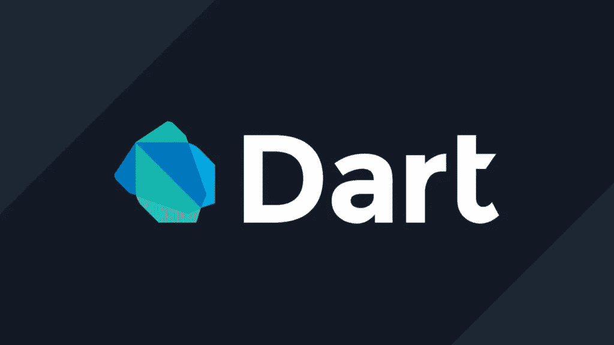
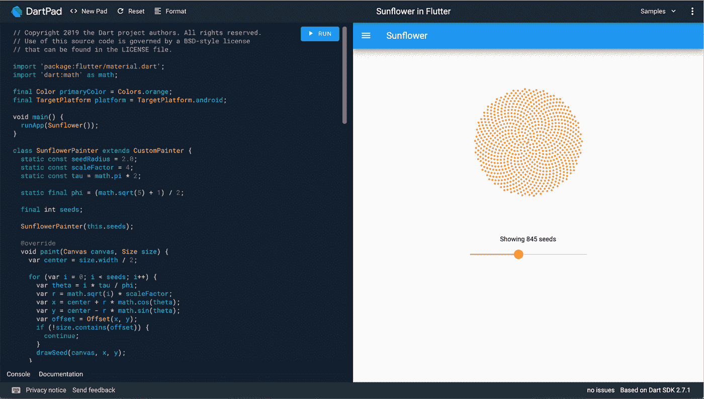

# 飞镖学徒—第一部分

> 原文：<https://medium.com/codex/dart-apprentice-part-i-2ba5aaaa0f4c?source=collection_archive---------8----------------------->

开发跨平台软件的最新技术之一是 Flutter，它不仅可以用来开发 IOS 和 Android 应用程序，还可以用来开发 Windows、Linux 和 Macos 等桌面软件。



在这篇文章中，我将介绍 Raywenderlich 的 Dart Apprentice 一书的摘要，这对于想要迁移到开发 Flutter 的 Android 和 IOS 开发人员来说都是一本非常好的书。它甚至对那些想开始移动应用开发并且没有足够的 Android 或 IOS 经验的程序员也有好处。正如我所说的，我将做一个总结，所以如果你想学得更深，你应该参考这本书并完整地阅读它。此外，书中有更多的细节是不可能带到这里的。

# Dart 是什么，如何使用？

Dart 是由 Google 开发的通用编程语言。这是什么意思？这意味着，一旦你学会了 dart，你就可以使用 Dart 的移动和网站和桌面软件，你不需要学习更多的编程语言，如 Kotlin 和 Swift 和 C#和其他一些。

接下来我将讲述 dart 语法，你需要一个工具来测试和尝试这些代码片段。有一些工具你很容易就能接触到，或者很有可能你已经拥有并使用了它们。第一个工具是 DartPad，这是一个基于浏览器的工具，您可以通过下面的链接访问它:

[](https://dartpad.dev/) [## 镖靶

### 编辑描述

镖靶](https://dartpad.dev/) 

镖靶很有用，因为它随时可以使用。这意味着你不需要安装任何 SDK 或插件或其他附件。

添加替代文本



第二个是 Intellij IDEA，是我见过的最好的 IDE 之一。我代表这本书的作者推荐这本书，因为你不再需要任何工具了。微软的 VScode 是最终版本，它是开发代码的一个非常好的工具。像 Intellij 一样，VScode 对其他语言也很有用，如果你想测试它们，你可以继续使用它。虽然这本书向你推荐 Intellij，但作者会使用 VScode，因为它的轻量级和简单的接口。

现在我们准备测试 Dart 命令。

# 评论:

编程从表达式开始。一些对编译器有意义的句子，比如值和操作。编程中最中性的句子就是注释。注释是程序员用来向他人或自己解释代码的作用的句子。您可以通过以下方式使用注释:

```
// This is a comment. It is not executed.// This is also a comment,// over multiple lines./* This is also a comment. Over many...
many...
many lines. */
```

上面的代码片段显示了一些注释，这些注释不会产生任何代码，只是为了在一段时间后给下一个程序员或上一个程序员解释一些信息。注释也可以嵌套。这意味着当您在彼此内部使用多行注释时，如下所示:

```
/* This is a comment.
/* And inside it is
another comment. */
Back to the first. */
```

还有另一种注释代码的方法，叫做文档注释。它用于单线过孔///以及/**和*/之间的多线过孔，如下所示:

```
/// I am a documentation comment
/// at your service.
/**
* Me, too!
*/
```

文档注释对文档代码很有用，因为它们支持标记格式，所以您甚至可以在注释中添加链接。

# 陈述和表达:

在编程语言文档中，你会经常听到两个重要的词:语句和表达式。了解两者的区别是有帮助的。

# 声明:

语句是命令，是你告诉计算机去做的事情。比如:

```
print('Hello, Dart Apprentice reader!');
```

Print 是在输出面板中显示引号内句子的代码。

# 表情:

与语句不同，表达式不做任何事情；这很了不起。也就是说，表达式是一个值，或者是可以作为值计算的东西。

```
423 + 2'Hello, Dart Apprentice reader!'
```

这些值可以是数字、文本或其他类型。

# 操作员:

运算符是可在表达式中使用的操作，有三种常见类型:

用于算术运算的算术运算符，如+(加)、-(减)、*(乘)、/(除)

和

用来给变量赋值的赋值操作符，比如=(赋值)，+=(加然后赋值)，-=(减然后赋值)

和

用于检查逻辑运算的逻辑或布尔运算符，如==(相等)，(大于)，！=(不相等)

# 操作顺序:

当然，当你计算一个值时，你可能想要使用多个操作符。以下是如何在 Dart 中实现这一点的示例:

```
((8000 / (5 * 10)) - 32) ~/ (29 % 5)
```

注意括号的使用，它在 Dart 中有两个目的:让任何阅读代码的人(包括您自己)都清楚您的意思，并消除操作顺序的歧义。例如，考虑以下情况:

```
350 / 5 + 2
```

这等于 72 ( 350 除以 5，再加 2)还是 50 ( 350 除以 7)？在学校里注意听讲的人会尖叫，“72”！你是对的。

像大多数编程语言一样，在 Dart 中，操作的顺序如下(从左到右):

```
()    then     %     then     /*    then    +-
```

Dart 中有更多的操作符，但是这本书只满足于这些情况。欲了解更多操作和详情，请打开以下链接并阅读操作部分:

[](https://dart.dev/guides/language/language-tour) [## Dart 语言之旅

### 本页将向您展示如何使用 Dart 的每个主要功能，从变量和运算符到类和库，以及…

dart.dev](https://dart.dev/guides/language/language-tour) 

# 变量和常数:

变量和常量就像盛值的盘子。例如，假设您想编写一个软件，该软件将对 20 名学生的数学数字进行排序，然后计算班级的最佳人数和平均人数。因此，您需要一些东西来保存学生的数字，以便对它们进行处理并获得请求的值。

在运行期间保存值的编程中，需要变量和常量。他们的区别在名字上很明显。变量可以更改，但常量必须声明一次，然后就不能更改了。

在下面的代码片段中，您可以看到不同类型的变量和常量是如何声明的:

```
int age = 30;
double pi = 3.14159;
const x = 46;
```

在上面的代码片段中,“年龄”和“圆周率”是两个变量，它们本身包含 30 和 3.14159 个数字。在声明之后，你可以随意改变它们的值，但是你不能在声明之后改变 x 的值，因为它是一个常数。它将保持其值，直到程序停止工作。

# 命名数据变量常量:

总是尝试为你的变量和常量选择有意义的名字。好的名字就像文档一样，让你的代码易于阅读。一个好的名字具体描述了变量或常数的作用。这里有一些好名字的例子:人物，人数，平均分数

通常一个坏名字是不够描述的。这里有一些坏名字的例子:a，temp，average

# 类型和操作:

在 Dart 中，类型是一种告诉编译器你打算如何使用一些数据的方式。到目前为止，在本书中，您已经看到了以下类型:

*   （同 Internationalorganizations）国际组织
*   两倍
*   数字
*   线
*   弯曲件
*   动态的

你熟悉 int 和 double，第一个保存整数，第二个保存浮点数。第三个，num 同时做 int 和 double 任务。这意味着 num 既可以保存整数也可以保存浮点数，但是要注意，一旦将变量声明为 num 并设置了 int 或 double 值，就不能将其更改为其他类型。这将导致运行时错误。

```
num someNumber = 3;double someDouble = someNumber as double;
```

这将导致崩溃，并显示以下消息:

```
CastError (type 'int' is not a subtype of type 'double' in type cast)
```

数字在编程中是必不可少的，但它们不是你在应用程序中需要处理的唯一数据类型。文本也是一种常见的数据类型，表示人名、地址，甚至是一本书的完整文本。所有这些都是应用程序可能需要处理的文本的例子。大多数计算机编程语言以一种称为字符串的数据类型存储文本。

```
String name = 'Hamed';
```

“bool”是一种只能包含 true 或 false 的类型。有时在编程中你需要保存比较的结果，例如如下:

```
int myAge = 30;
int yourAge = 20;bool areWeSameAge = (myAge == yourAge);   //false
```

在上面的代码片段中，我们有两个 int 变量以及它们之间的比较。==符号是一个比较运算符，用于检查符号两边是否相等。如果它们相等，则比较返回 true，否则返回 false。比较的结果将保存在声明的布尔变量中。其他比较运算符有！=(非等式)、>(大于)、

[](https://dart.dev/guides/language/language-tour) [## Dart 语言之旅

### 本页将向您展示如何使用 Dart 的每个主要功能，从变量和运算符到类和库，以及…

dart.dev](https://dart.dev/guides/language/language-tour) 

“动态”允许你将任何你喜欢的数据类型赋给你的变量，编译器不会警告你任何事情。

```
dynamic myVariable;
myVariable = 10;      // OK
myVariable = 3.14159; // OK
myVariable = 'ten';   // OK
myVariable = true;    // OK
```

在上面的代码片段中，没有错误。

还有另一种方法来声明变量。因为你不必告诉变量的类型，编译器会找到它的类型。

```
var someNumber = 10;
```

通过将' someNumber '声明为 var 并为其赋值 10，编译器将使用 someNumber 作为 int。下面的片段讲述了更多的例子:

```
var someDouble = 3.14159;var name = 'hamed';
```

但是要注意，一旦将值赋给声明的 var，就设置了它的类型，不能从其他类型赋值。见下文:

```
var someNumber = 10;someNumber = 15;      // OK
someNumber = 3.14159; // No, no, no.
```

这将导致运行时错误，因为当 10 被赋给某个数字时，编译器将知道它是 int，如果程序员试图赋给另一种类型的值，就会导致错误。

# 控制流程:

在编写计算机程序时，你需要能够告诉计算机在不同的场景下做什么。例如，如果用户点击加法按钮，计算器应用程序将需要执行一个操作，如果用户点击减法按钮，则需要执行另一个操作。在计算机编程术语中，这个概念被称为控制流，因为您可以控制代码在多个点做出的决策流。

下面介绍一些像其他编程语言一样的语句来控制代码流:

# if 语句:

控制程序流程的第一种也是最常见的方法是使用 if 语句，它允许程序只有在某个条件为真时才执行某些操作。

```
if (2 > 1) {
    print('Yes, 2 is greater than 1.');
}
```

在上面的代码片段中，在“if”关键字之后，括号中有一个条件。该条件检查 2 是否大于 1，然后在块中运行代码(在花括号之间)。如果不是，那就什么都不做。

# else 子句:

您可以扩展 if 语句，以提供在条件为假时运行的代码。这就是所谓的“else”子句。这意味着，如果您使用如下所示的“else”子句，然后 if 中的条件语句为 false，else 部分将运行。

```
const animal = 'Fox';
if (animal == 'Cat' || animal == 'Dog') {
    print('Animal is a house pet.');
} else {
    print('Animal is not a house pet.');
}
```

在输出中，您将看到:

```
Animal is not a house pet.
```

||符号是另一种条件运算符，称为“逻辑或”。这意味着，如果动物等于猫或等于狗，则陈述结果为真。

# Else-if 链:

你可以用 if 语句更进一步。有时，您希望检查一个条件，如果第一个条件不为真，则检查另一个条件。这就是 else-if 发挥作用的地方，它将另一个 if 语句嵌套在前一个 if 语句的 else 子句中。你可以这样使用它:

```
const trafficLight = 'yellow';
var command = '';
if (trafficLight == 'red') {
    command = 'Stop';
} else if (trafficLight == 'yellow') {
    command = 'Slow down';
} else if (trafficLight == 'green') {
    command = 'Go';
} else {
    command = 'INVALID COLOR!';
}print(command);
```

您将看到结果:

```
Slow down
```

# 三元条件运算符:

像其他一些编程语言一样，Dart 中有一个条件语句，可以用来代替 else-if 语句。它简单明了，如下所示:

```
(condition) ? valueIfTrue : valueIfFalse;
```

在上面的语句中，你不需要 if 和 else 关键字，甚至不需要花括号。如果 if 或 else 语句阻塞，这对于运行单行语句的情况很有好处。否则，它将是不可读和无用的。请参见下面的示例:

```
const score = 83;const message = (score >= 60) ? 'You passed' : 'You failed';
```

这比下面的 if-else 语句要好:

```
const score = 83;
String message;
if (score >= 60) {
    message = 'You passed';
} else {
    message = 'You failed';
}
```

# 开关语句:

处理控制流的另一种方法是使用 switch 语句，尤其是对于多个条件。switch 语句采用以下形式:

```
switch (variable) {
    case value1:
        // code
        break;
    case value2:
        // code
        break;
    ...
    default:
        // code
}
```

有几个不同的关键字，下面是它们的含义:

*   switch:根据括号中的变量值，可以是 int、String 或编译时常量，switch 会将程序控制重定向到后面的一个 case 值。
*   case:每个 case 关键字都取一个值，并使用==将该值与 switch 关键字后的变量进行比较。要检查的值有多少，就添加多少 case 语句。当有匹配时，Dart 将运行冒号后面的代码。
*   break:break 关键字告诉 Dart 退出 switch 语句，因为 case 块中的代码已经完成。
*   default:如果没有一个 case 值与 switch 变量匹配，那么将执行 default 之后的代码。

# 循环:

计算机编程就像你的生活一样充满了重复的动作。实现它们的方法是使用循环。Dart 和许多编程语言一样，有 while 循环和 for 循环。

# While 循环:

只要布尔条件为真，while 循环就会重复一段代码。您创建一个 while 循环，如下所示:

```
while (condition) {
    // loop code
}
```

下面是一个更有用的 while 循环示例:

```
var sum = 1;
while (sum < 10) {
    sum += 4;
    print(sum);
}
```

运行它来看看结果。循环执行如下:

*   第一次迭代前:sum = 1，循环条件=真
*   第一次迭代后:sum = 5，循环条件=真
*   第二次迭代后:sum = 9，循环条件=真
*   第三次迭代后:总和= 13，循环条件=假

第三次迭代后，sum 变量为 13，因此 sum < 10 的循环条件变为假。此时，循环停止。

# Do-while 循环:

它与 while 循环的不同之处在于，条件是在循环结束时计算的，而不是在循环开始时。因此，do-while 循环的主体总是至少执行一次。您可以像这样构造一个 do-while 循环:

```
do {
    // loop code
} while (condition)
```

以下是 while 部分的示例，但是使用了 do-while 循环:

```
sum = 1;
do {
    sum += 4;
    print(sum);
} while (sum < 10);
```

您将看到结果:

```
5
9
```

# 对于循环:

除了 while 循环，Dart 还有另一种循环，称为 for 循环。这可能是您将看到的最常见的循环，您使用它来运行一段代码一定的次数。下面是 Dart 中 for 循环的一个简单示例:

```
for (var i = 0; i < 5; i++) {
    print(i);
}
```

如果你有一些编程经验，这种 C 语言风格的循环可能对你来说非常熟悉。然而，如果不是这样，第一行就会令人困惑。下面是圆括号之间用分号分隔的三个部分的摘要:

*   var i = 0(初始化):在循环开始之前，您创建一个计数器变量来记录您已经循环了多少次。你可以称这个变量为任何东西，但是 I 通常是 index 的缩写。然后用某个值初始化它；在这种情况下，0。
*   i < 5(条件):这是 for 循环在每次循环迭代之前要检查的条件。如果为真，那么它将运行大括号内的代码。但是如果它是假的，那么循环就结束了。
*   i++ (action):动作在每次迭代结束时运行，通常是为了更新循环索引值。使用 i++增加 1 是很常见的，但是您也可以使用 i += 2 增加 2 或者使用 I-减少 1。

运行上面的代码，您将看到以下输出:

```
0
1
2
3
4
```

# For-in 循环:

还有另一种类型的 for 循环，它的语法更简单；这叫做 for-in 循环。它没有任何相关的索引或计数器变量，但是它使得迭代集合非常方便。

```
const myString = 'I ❤ Dart';
for (var codePoint in myString.runes) {
    print(String.fromCharCode(codePoint));
}
```

事情是这样的:

*   myString.runes 是 myString 中所有代码点的集合。
*   in 关键字告诉 for-in 循环按顺序迭代集合，并且在每次迭代中，将当前代码点分配给 code point 变量。由于 runes 是整数的集合，因此 codePoint 被推断为 int。
*   在大括号内，使用 String.fromCharCode 将码位整数转换回字符串。
*   就范围而言，codePoint 变量仅在 for-in 循环的范围内可见，这意味着它在循环外不可用。

运行代码，您将看到以下输出:

```
I❤D
a
r
t
```

# 结论:

感谢你陪我来到这里，阅读这篇文章。这只是第一部分的结束，你可以通过下面的链接继续第二部分:

[](/@hseify69/dart-apprentice-part-ii-ab00b7e8ee03) [## Dart 学徒-第二部分

### 由于软件每天都在增长，开发者需要更高水平的编程知识来提供更好的解决方案…

medium.com](/@hseify69/dart-apprentice-part-ii-ab00b7e8ee03) 

请让我知道你的意见，并对我提出你的建议。谢谢大家等待第二部。