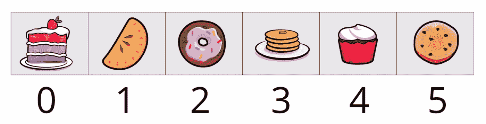

# Dart 学徒-第二部分

> 原文：<https://medium.com/codex/dart-apprentice-part-ii-ab00b7e8ee03?source=collection_archive---------7----------------------->

由于软件每天都在增长，开发人员需要更高水平的编程知识，以便在更短的时间内提供更好的解决方案。在这一部分中，我将向您展示 Dart 学徒手册的其余部分，包括 Dart 中的集合、函数和类。


如果你不熟悉 dart 编程的基础，我建议你先阅读下面链接中的第一部分，然后继续第二部分:

[](/@hseify69/dart-apprentice-part-i-2ba5aaaa0f4c) [## 飞镖学徒—第一部分

### 开发跨平台软件的最新技术之一是 Flutter，它不仅可以用来开发 IOS 系统，还可以用来开发跨平台软件

medium.com](/@hseify69/dart-apprentice-part-i-2ba5aaaa0f4c) 

下面我将介绍函数作为一种编写一次代码并多次使用的方法，集合作为一种可以保存一批特殊类型的变量，而类作为新类型的蓝图。准备一杯美味的饮料，开始吧。

# 功能:

一个函数是一个小任务，或者有时是几个更小的相关任务的集合，可以与其他函数结合使用来完成一个更大的任务。你可以把功能想象成机器；他们接受你提供给他们的东西(输入)，并产生不同的东西(输出)。


日常生活中有很多这样的例子。用苹果榨汁机，你放入苹果，你得到苹果汁。输入是苹果；输出的是果汁。

# Dart 功能剖析:

在 Dart 中，函数由返回类型、名称、圆括号中的参数列表和大括号中的主体组成。


下面是该函数的标记部分的简短摘要:

*   返回类型:这个先来；它会立即告诉你函数输出的类型。这个特定的函数将返回一个字符串，但是您的函数可以返回您喜欢的任何类型。如果函数不返回任何东西，也就是说，如果它执行一些工作，但不产生输出值，那么可以使用 void 作为返回类型。
*   函数名:您几乎可以给函数起任何您喜欢的名字，但是您应该遵循 lowerCamelCase 命名约定。在这一章的后面，你会学到更多的命名规则。
*   参数:参数是函数的输入；它们放在函数名后面的括号里。这个例子只有一个参数，但是如果有多个参数，可以用逗号分隔。对于每个参数，首先编写类型，然后是名称。正如变量名一样，参数名应该使用小写字母。
*   返回值:这是函数的输出，它应该与返回类型相匹配。在上面的示例中，函数使用 return 关键字返回一个字符串值。但是，如果返回类型是 void，则不返回任何内容。返回类型、函数名和参数统称为函数签名。大括号之间的代码称为函数体。

这是上面的函数在程序上下文中的样子:

```
void main() {
    const input = 12;
    final output = compliment(input);
    print(output);
}String compliment(int number) {
    return '$number is a very nice number.';
}
```

现在运行代码，您将看到以下结果:

```
12 is a very nice number.
```

# 关于参数的更多信息

Dart 中的参数非常灵活，因此它们应该有自己的部分。

# 使用多个参数

在 Dart 函数中，可以使用任意数量的参数。如果您的函数有多个参数，只需用逗号分隔即可。这是一个有两个参数的函数:

```
void helloPersonAndPet(String person, String pet) {
    print('Hello, $person, and your furry friend, $pet!');
}
```

类似上面的参数称为位置参数，因为您必须按照编写函数时定义参数的顺序来提供参数。如果您以错误的顺序调用带有参数的函数，您将得到一些明显错误的东西:

```
helloPersonAndPet('Fluffy', 'Chris');
// Hello, Fluffy, and your furry friend, Chris!
```

# 使参数可选

为了表示参数是可选的，可以用方括号将参数括起来，并在类型后添加一个问号，如下所示:

```
String fullName(String first, String last, [String? title]) {
    if (title != null) {
        return '$title $first $last';
    } else {
        return '$first $last';
    }
}
```

写作【字符串？title]使标题可选。如果您没有为 title 传入一个值，那么它的值将为 null，这意味着“没有值”。这里有两个例子来测试它:

```
print(fullName('Ray', 'Wenderlich'));
print(fullName('Albert', 'Einstein', 'Professor'));
```

现在运行它，您将看到以下内容:

```
Ray Wenderlic
Professor Albert Einsteinh
```

# 提供默认值

您甚至可以通过用默认值声明参数来为函数签名中的参数初始化值。看一下这个例子:

```
bool withinTolerance(int value, [int min = 0, int max = 10]) {
    return min <= value && value <= max;
}
```

这里有三个参数，其中两个是可选的:min 和 max。如果不为它们指定值，则最小值将为 0，最大值将为 10。这里有一些具体的例子来说明:

```
withinTolerance(5) // true
withinTolerance(15) // false
```

由于 5 介于 0 和 10 之间，因此计算结果为 true 但是由于 15 大于默认的最大值 10，所以它的计算结果为 false。如果您想指定默认值以外的值，也可以这样做:

```
withinTolerance(9, 7, 11) // true
```

因为 9 介于 7 和 11 之间，所以该函数返回 true。如果这还不够糟糕，下面的函数调用也返回 true:

```
withinTolerance(9, 7) // true
```

因为函数使用位置参数，所以提供的参数必须遵循您定义参数的顺序。这意味着值是 9，最小值是 7，最大值的默认值是 10。但是谁会记得呢？也许命名参数有助于更容易地阅读代码。

# 命名参数

Dart 允许您在函数调用中使用命名参数来使参数的含义更加清晰。要创建一个命名参数，需要用花括号而不是方括号将它括起来。下面是与上面相同的函数，但是使用了命名参数:

```
bool withinTolerance(int value, {int min = 0, int max = 10}) {
    return min <= value && value <= max;
}
```

请注意以下几点:

*   min 和 max 用大括号括起来，这意味着在向函数提供参数值时必须使用参数名。
*   像方括号一样，花括号使得里面的参数是可选的。因为 value 不在大括号内，所以它仍然是必需的。

要提供参数，可以使用参数名，后跟一个冒号，然后是参数值。下面是您现在调用该函数的方式:

```
withinTolerance(9, min: 7, max: 11); // true
```

命名参数的另一个好处是，您不必按照定义它们的确切顺序来使用它们。这两种调用函数的方法是等效的:

```
withinTolerance(9, min: 7, max: 11); // true
withinTolerance(9, max: 11, min: 7); // true
```

由于命名参数是可选的，这意味着以下函数调用也是有效的:

```
withinTolerance(5); // true
withinTolerance(15); // falsewithinTolerance(5, min: 7); // false
withinTolerance(15, max: 20); // true
```

# 使命名参数成为必需的；

您想要的是使 value 成为必需的而不是可选的，同时仍然保持它作为一个命名参数。您可以通过在大括号中包含 value 并在前面添加所需的关键字来实现这一点:

```
bool withinTolerance(required int value,int min = 0,int max = 10,}) {
    return min <= value && value <= max;
}
```

有了必需的关键字，如果您在调用函数时没有提供 value 的值，VS 代码将会警告您:


你可以在书中读到更多关于函数的内容，特别是匿名函数和箭头函数。

# 班级

在第一部分中，您使用了内置类型，如 int、String 和 bool。现在，您已经准备好学习一种更灵活的方法，通过使用类来创建自己的类型。

# Dart 类

类就像告诉系统如何制造对象的建筑蓝图，其中对象是存储在计算机内存中的实际数据。如果一个类是蓝图，那么你可以说对象就像蓝图所代表的房子。例如，String 类将其数据描述为 UTF-16 代码单元的集合，但 String 对象是类似“Hello，Dart！”的具体内容。

类是面向对象编程的核心组件。它们用于将数据和功能组合在一个结构中。


这些函数用于转换数据。类内部的函数称为方法，而构造函数是用于从类中创建对象的特殊方法。

# 定义类别

要定义一个新的类，必须使用' class '关键字，然后写下这个类的名字，然后用花括号把它的内容括起来。在 Dart 文件的顶层编写以下简单的类。你的类应该在 main 函数之外，在它的上面或者下面。

```
class User {
    int id = 0;
    String name = '';
}
```

这将创建一个名为 User 的类。它有两个属性:id 是 int，默认值为 0，name 是 String，默认值为空字符串。

# 从类创建对象

如上所述，您从类中创建的值称为对象。对象的另一个名字是实例，所以创建一个对象有时被称为实例化一个类。

由于像上面那样在 Dart 文件中编写类只是创建了蓝图，所以用户对象还不存在。您可以像调用函数一样调用类名来创建一个。在 main 函数中添加以下代码行:

```
final user = User();
```

这将创建用户类的一个实例，并将该实例或对象存储在 User 中。请注意 User 后面的空括号。看起来你在调用一个没有任何参数的函数。事实上，您调用的是一种叫做构造函数方法的函数。在这一章的后面，你会学到更多关于它们的知识。现在，简单地理解以这种方式使用你的类创建了你的类的一个实例。

# 为属性赋值

既然 user 中存储了一个 User 实例，就可以使用点标记法为该对象的属性分配新值。要访问 name 属性，请键入用户点名称，然后给它一个值:

```
user.name = 'Ray';
```

现在，以类似的方式设置 ID:

```
user.id = 42;
```

# 级联符号

Dart 提供了级联运算符(..)允许您将同一个对象上的多个赋值链接在一起，而不必重复对象名称。以下代码是等效的:

```
final user = User()
    ..name = 'Ray'
    ..id = 42;
```

注意分号只出现在最后一行。

# 构造器

构造函数是创建或构造类的实例的方法。也就是说，构造函数构建新的对象。构造函数与类同名，构造函数方法的隐式返回类型也是与类本身相同的类型。

# 默认构造函数

目前，用户类没有显式的构造函数。在这种情况下，Dart 提供了一个默认的构造函数，它不接受任何参数，只返回该类的一个实例。例如，像这样定义一个类:

```
class Address {
    var value = '';
}
```

相当于这样写:

```
class Address {
    Address();
    var value = '';
}
```

包含默认的 Address()构造函数是可选的。

# 自定义构造函数

与上面的默认构造函数一样，构造函数的名称应该与类名相同。这种类型的构造函数称为生成式构造函数，因为它直接生成同一类型的对象。

# 长格式构造函数

在类体的顶部添加以下创成式构造函数方法:

```
User(int id, String name) {
    this.id = id;
    this.name = name;
}
```

这是一个新的关键字。它是做什么的？

构造函数体中的关键字 this 允许你明确你所谈论的是哪个变量。意思是这个物体。所以 this.name 指的是名为 name 的对象属性，而 name(不带 this)指的是构造函数参数。对构造函数参数使用与类属性相同的名称称为隐藏。因此，上面的构造函数采用 id 和 name 参数，并用它来初始化对象的属性。

# 简式构造函数

Dart 还有一个短格式的构造函数，在这个构造函数中不提供函数体，而是列出要初始化的属性，以 this 关键字为前缀。发送给短格式构造函数的参数用于初始化相应的对象属性。最后一个代码段与下面的代码段完全相同:

```
User(this.id, this.name);
```

Dart 从类体中声明的属性本身推断出构造函数参数类型 int 和 String。

# 命名构造函数

Dart 还有第二种类型的生成构造函数，称为命名构造函数，您可以通过在类名上添加标识符来创建它。它采用以下模式:

```
ClassName.identifierName()
```

为什么你想要一个命名的构造函数而不是一个漂亮整洁的默认构造函数呢？嗯，有时你有一些常见的情况，你想提供一个方便的构造函数。或者，您可能有一些特殊的情况，需要用稍微不同的方法来构造某些类。

例如，假设您想要一个具有预设 ID 和名称的匿名用户。您可以通过创建命名构造函数来实现这一点。在短格式构造函数下添加以下命名构造函数:

```
User.anonymous() {
    id = 0;
    name = 'anonymous';
}
```

构造函数的标识符或命名部分是匿名的。命名构造函数可能有参数，但在这种情况下，没有参数。因为没有任何容易混淆的参数名，所以不需要使用 this.id 或 this.name，而是直接使用属性变量 id 和 name。像这样调用 main 中的命名构造函数:

```
final anonymousUser = User.anonymous();
print(anonymousUser);
```

# 静态成员

如果将 static 放在成员变量或方法的前面，会导致变量或方法属于类而不是实例:

```
class SomeClass {
    static int myProperty = 0;
    static void myMethod() {
        print('Hello, Dart!');
    }
}
```

你可以这样访问它们:

```
final value = SomeClass.myProperty;
SomeClass.myMethod();
```

在这种情况下，您不必实例化一个对象来访问 myProperty 或调用 myMethod。相反，您可以直接使用类名来获取值并调用方法。

# 收集

在您制作的几乎每个应用程序中，您都将处理数据集合。数据可以用多种方式组织，每种方式都有不同的用途。Dart 提供了多种解决方案来满足您的收藏需求，在本章中，您将了解三种主要的解决方案:列表、集合和地图。

# 列表

每当您有一个非常大的单一类型的对象集合，并且这些对象有一个相关的排序时，您可能会希望使用一个列表作为数据结构来对对象进行排序。Dart 中的列表类似于其他语言中的数组。

下图显示了一个包含六个元素的列表。列表是从零开始的，所以第一个元素在索引 0 处。第一个元素的值是 cake，第二个元素的值是 pie，依此类推，直到索引 5 处的最后一个元素，即 cookie。



列表的顺序很重要。馅饼在蛋糕之后，但在甜甜圈之前。如果多次遍历列表，可以确保元素保持在相同的位置和顺序。

# 创建列表

您可以通过在方括号中指定列表的初始元素来创建列表。这被称为列表文字。

```
var desserts = ['cookies', 'cupcakes', 'donuts', 'pie'];
```

由于这个列表中的所有元素都是字符串，Dart 推断这是一个字符串类型的列表。

你可以重新分配甜点(但是为什么会有人想要重新分配甜点呢？)带有一个空列表，如下所示:

```
desserts = [];
```

Dart 还是知道甜品是一串的。但是，如果您要像这样初始化一个新的空列表:

```
var snacks = [];
```

Dart 没有足够的信息来知道列表应该包含哪种对象。在这种情况下，Dart 简单地推断它是一个动态列表。这会导致您失去类型安全，这是您不希望的。如果您从一个空列表开始，您应该像这样指定类型:

```
List<String> snacks = [];
```

这里有几个细节需要注意:

*   List 是数据类型或类名，正如您之前所学的。
*   这里的尖括号< >是 Dart 中泛型类型的符号。通用列表意味着你可以有一个任何东西的列表；你只需把你想要的类型放在尖括号里。在这种情况下，您有一个字符串列表，但是您可以用任何其他类型替换 String。例如，List <int>将生成一个整数列表，List <bool>将生成一个布尔值列表，List <grievance>将生成一个不满列表——但是您必须自己定义该类型，因为默认情况下 Dart 没有附带任何类型。</grievance></bool></int>

创建空列表的一个稍微好一点的语法是使用 var 或 final 并将泛型类型移到右边:

```
var snacks = <String>[];
```

# 访问元素

要访问列表的元素，可以通过下标符号引用它的索引，其中索引号放在列表名称后面的方括号中。

```
final secondElement = desserts[1];
print(secondElement);
```

不要忘记列表是从零开始的，所以索引 1 获取第二个元素。运行该代码，您将看到预期的纸杯蛋糕。

如果知道值但不知道索引，可以使用 indexOf 方法来查找:

```
final index = desserts.indexOf('pie')
final value = desserts[index];;
```

因为“pie”是从零开始的列表中的第四项，所以 index 是 3，value 是 pie。

# 为列表元素赋值

正如访问元素一样，也可以使用下标符号为特定元素赋值:

```
desserts[1] = 'cake';
```

这会将索引 1 处的值从 cupcakes 更改为 cake。

# 向列表中添加元素

默认情况下，Dart 中的列表是可增长的，因此可以使用 add 方法添加元素。

```
desserts.add('brownies');
```

运行它，你会看到:

```
[cookies, cake, donuts, pie, brownies]
```

# 从列表中删除元素

可以使用 remove 方法删除元素。所以如果你有点饿了，吃了蛋糕，你可以写:

```
desserts.remove('cake');
print(desserts);
```

这留下了一个包含四个元素的列表:

```
[cookies, donuts, pie, brownies]
```

# 列表属性

List 之类的集合有许多属性。为了演示它们，使用下面的饮料列表。

```
const drinks = ['water', 'milk', 'juice', 'soda'];
```

您可以访问列表中的第一个和最后一个元素:

```
drinks.first   // water
drinks.last    // soda
```

您还可以检查列表是否为空:

```
drinks.isEmpty      // false
drinks.isNotEmpty   // true
```

这相当于以下内容:

```
drinks.length == 0   // false
drinks.length > 0    // true
```

# 遍历列表中的元素

在这一部分，你可以回到你的甜点清单:

```
const desserts = ['cookies', 'cupcakes', 'donuts', 'pie'];
```

在 for 循环部分，您看到了如何遍历列表，所以这是对 for-in 循环的回顾。

```
for (var dessert in desserts) {
    print(dessert);
}
```

每次循环时，甜点都被赋予一个来自甜点的元素。

您也可以使用 forEach 函数:

```
desserts.forEach((dessert) => print(dessert));
```

# 设置

集合用于创建唯一元素的集合。Dart 中的集合类似于它们的数学对应物。与允许重复的列表不同，集合中不允许重复。


# 创建集合

您可以在 Dart 中使用集合类型注释创建空集，如下所示:

```
final Set<int> someSet = {};
```

尖括号中带有 int 的通用语法告诉 Dart 在集合中只允许整数。以下形式较短，但结果相同:

```
final someSet = <int>{};
final anotherSet = {1, 2, 3};
```

# 集合上的运算

要查看一个集合是否包含一个项，可以使用 contains 方法，该方法返回一个 bool。添加以下两行，并再次运行代码:

```
print(anotherSet.contains(1)); // true
print(anotherSet.contains(99)); // false
```

因为 anotherSet 包含 1，所以该方法返回 true，而检查 99 返回 false。

与可增长列表一样，您可以在集合中添加和删除元素。若要添加元素，请使用 add 方法。

```
final someSet = <int>{};
someSet.add(42);
someSet.add(2112);
someSet.add(42);
print(someSet);
```

运行该程序以查看以下设置:

```
{42, 2112}
```

请注意,“42”被添加了一次。这是因为 set 保存每个项目一次，如果你试图添加重复的项目，set 会忽略它。

也可以使用 remove 方法删除元素:

```
someSet.remove(2112);
```

打印 someSet 以显示只剩下一个元素:

```
{42}
```

您可以使用 addAll 将列表中的元素添加到集合中:

```
someSet.addAll([1, 2, 3, 4]);
```

再次打印 someSet 以显示新内容:

```
{42, 1, 2, 3, 4}
```

# 地图

Dart 中的映射是用于保存键值对的数据结构。它们类似于其他语言中的散列表和字典。

但是，如果您不熟悉地图，您可以将它们视为包含数据的变量集合。键是变量名，值是变量保存的数据。查找特定值的方法是为映射提供映射到该值的键的名称。

在下图中，蛋糕映射到 500 卡路里，甜甜圈映射到 150 卡路里。蛋糕和甜甜圈是键，而 500 和 150 是值。


每对中的键和值用冒号分隔，连续的键-值对用逗号分隔。

# 创建空地图

像 List 和 Set 一样，Map 是一个泛型类型，但是 Map 有两个类型参数:一个用于键，一个用于值。您可以使用 map 并指定键和值的类型来创建空的 Map 变量:

```
final Map<String, int> emptyMap = {};
```

在本例中，String 是键的类型，int 是值的类型。做同样事情的一个稍微简单的方法是将泛型类型移到右边:

```
final emptyMap = <String, int>{};
```

可以使用大括号创建非空的 map 变量，其中 Dart 推断键和值类型。Dart 知道这是一个映射，因为每个元素都是由冒号分隔的一对。

```
final inventory = {
    'cakes': 20,
    'pies': 14,
    'donuts': 37,
    'cookies': 141,
};
```

# 唯一键

映射的键应该是唯一的。如下所示的地图不起作用:

```
final treasureMap = {
    'garbage': 'in the dumpster',
    'glasses': 'on your head',
    'gold': 'in the cave',
    'gold': 'under your mattress',
};
```

有两把钥匙叫黄金。你怎么知道去哪里找？你可能在想，“嘿，这是金子。我两个地方都看。”如果您真的想这样设置，那么您可以将 String 映射到 List:

```
final treasureMap = {
    'garbage': ['in the dumpster'],
    'glasses': ['on your head'],
    'gold': ['in the cave', 'under your mattress'],
};
```

现在每个键都包含一个条目列表，但是键本身是唯一的。值没有唯一性的限制。这很好:

```
final myHouse = {
    'bedroom': 'messy',
    'kitchen': 'messy',
    'living room': 'messy',
    'code': 'clean',
};
```

# 地图上的操作

除了使用键而不是索引的映射之外，您可以使用类似于列表的下标符号来访问映射中的单个元素。

```
final numberOfCakes = inventory['cakes'];
```

如果您回忆一下上面的内容，密钥 cakes 被映射到整数 20，因此打印 numberOfCakes 可以看到 20。如果键不存在，映射将返回 null。

只需将新元素分配给地图中尚不存在的元素，就可以将新元素添加到地图中。

```
inventory['brownies'] = 3;
```

打印库存以查看地图末尾的布朗尼及其价值:

```
{cakes: 20, pies: 14, donuts: 37, cookies: 141, brownies: 3}
```

请记住，映射的键是唯一的，因此如果您为已经存在的键赋值，将会覆盖现有的值。

```
inventory['cakes'] = 1;
```

打印库存以确认蛋糕原来是 20，但现在是 1:

```
{cakes: 1, pies: 14, donuts: 37, cookies: 141, brownies: 3}
```

您可以使用 remove 通过键从地图中移除元素。

```
inventory.remove('cookies');
```

和结果:

```
{cakes: 1, pies: 14, donuts: 37, brownies: 3}
```

# 地图属性

和列表一样，地图也有属性。例如，以下属性指示(使用不同的度量)地图是否为空:

```
inventory.isEmpty     // false
inventory.isNotEmpty  // true
inventory.length      // 4
```

还可以使用键和值属性分别访问键和值。

```
print(inventory.keys);
print(inventory.values);
```

当您将它打印出来时，您会看到以下内容:

```
(cakes, pies, donuts, brownies)
(1, 14, 37, 3)
```

要检查某个键是否在映射中，可以使用 containsKey 方法:

```
print(inventory.containsKey('pies'));
// true
```

您可以使用 containsValue 对值执行同样的操作。

```
print(inventory.containsValue(42));
// false
```

# 在地图元素上循环

映射的键和值属性是可迭代的，因此可以对它们进行循环。下面是一个迭代键的例子:

```
for (var item in inventory.keys) {
    print(inventory[item]);
}
```

您还可以使用 forEach 来迭代 map 的元素，这将为您提供键和值。

```
inventory.forEach((key, value) => print('$key -> $value'));
```

这个 for 循环做同样的事情:

```
for (final entry in inventory.entries) {
    print('${entry.key} -> ${entry.value}');
}
```

运行任一循环都会产生以下结果:

```
cakes -> 1
pies -> 14
donuts -> 37
brownies -> 3
```

# 集合上的映射

通过集合映射，您可以对集合中的每个元素执行操作，就像通过循环运行一样。为此，集合有一个 map 方法，该方法将匿名函数作为参数，并根据该函数对元素的操作返回另一个集合。编写以下代码:

```
const numbers = [1, 2, 3, 4];
final squares = numbers.map((number) => number * number);
```

在匿名函数体内，你可以做任何你想做的事情。在上面的例子中，你平方每个输入值。打印正方形以查看结果:

```
(1, 4, 9, 16)
```

# 过滤收藏

通过使用 where 方法，您可以过滤类似 List 的可迭代集合，并将其设置为另一个更短的集合。在您已经拥有的代码下面添加下面一行:

```
final evens = squares.where((square) => square.isEven);
```

该函数的输入也是列表中的每个元素，但是与 map 不同，该函数返回的值必须是布尔值。如果函数为特定元素返回 true，那么该元素将被添加到结果集合中，但是如果返回 false，那么该元素将被排除。使用 isEven 使偶数的条件为真，所以您已经将平方过滤为偶数值。打印 evens，您将获得:

```
(4, 16)
```

# 对列表进行排序

对列表调用 sort 会根据数据类型对元素进行排序。

```
final desserts = ['cookies', 'pie', 'donuts', 'brownies'];
desserts.sort();
```

打印甜点，你会看到以下内容:

```
[brownies, cookies, donuts, pie]
```

由于甜点保存字符串，调用列表上的 sort 会按字母顺序排列它们。排序是就地完成的，这意味着排序会改变输入列表本身。这也意味着如果你试图排序一个常量列表，你会得到一个错误。

您可以使用 reversed 以相反的顺序生成列表。

```
var dessertsReversed = desserts.reversed;
```

这会产生以下结果:

```
(pie, donuts, cookies, brownies)
```

# 高级课程

在许多情况下，您需要创建共享一些基本功能的类的层次结构。您可以通过扩展类来创建自己的层次结构。这也称为继承，因为这些类形成了一棵树，其中的子类继承父类。父类和子类也分别称为超类和子类。


# 创建您的第一个子类

这里我们有一个 Person 类，它有两个给定的字段 Name 和 surname:

```
class Person {
    Person(this.givenName, this.surname); String givenName;
    String surname;
    String get fullName => '$givenName $surname'; @override
    String toString() => fullName;
}
```

然后，我们添加与 Person 具有相同字段的 Student class，外加一个 grade 字段:

```
class Student {
    Student(this.givenName, this.surname); String givenName;
    String surname;
    String grade = 'F';
    String get fullName => '$givenName $surname'; @override
    String toString() => fullName;
}
```

通过让学生扩展 Person，可以消除学生和 Person 之间的重复。通过在类名后添加 extends Person，并删除除学生构造函数和等级之外的所有内容，可以做到这一点。用以下代码替换 Student 类:

```
class Student extends Person {
    Student(String givenName, String surname)
         : super(givenName, surname);
 String grade = 'F';
}
```

有几点需要注意:

*   构造函数参数名不再引用它。每当您看到关键字 this 时，您应该记住这是指当前对象，在本例中是 Student 类的一个实例。由于 Student 不再包含字段名称 givenName 和 surname，使用 this.givenName 或 this.surname 将没有任何引用。
*   与此相反，super 关键字用于引用层次结构中的上一级。类似于您在上面的中学习的转发构造函数，使用 super(givenName，surname)将构造函数参数传递给另一个构造函数。但是，因为您使用的是 super 而不是 this，所以您将参数转发给父类的构造函数，也就是 Person 的构造函数。

# 使用类

好，回到最初的例子。像这样创建人和学生对象:

```
final jon = Person('Jon', 'Snow');
final jane = Student('Jane', 'Snow');
print(jon.fullName);
print(jane.fullName);
```

运行并观察两者都有全名:

```
Jon Snow
Jane Snow
```

# 覆盖父方法

假设您希望学生的全名以不同于默认的方式打印出来。您可以通过重写全名 getter 来实现这一点。将以下两行添加到学生类的底部:

```
@override
String get fullName => '$surname, $givenName';
```

@override '告诉编译器使用这个实现而不是父函数。虽然在 Dart 中使用@override 在技术上是可选的，但它确实有所帮助，因为如果您认为您正在覆盖父类中实际上不存在的内容，编译器会给出一个错误。

现在运行代码，您会看到学生的全名与家长的不同。

```
Jon Snow
Snow, Jane
```

# 结论

感谢您花时间阅读这篇文章。我将努力帮助您更加熟悉 Dart 编程语言。我之前提到过，这本书是对原书的总结，给那些因为时间不够而想快速浏览这本书的人。如果你有足够的时间来学习更深入的主题，请花时间阅读这本书。谢谢你的鼓励，我期待着你的有用的评论。