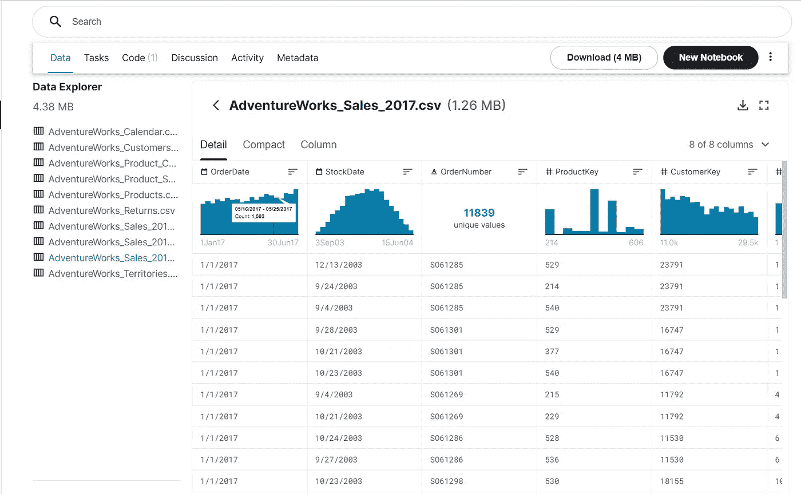
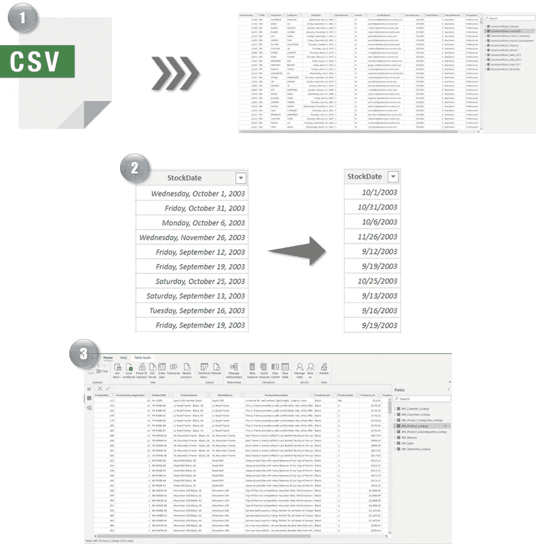
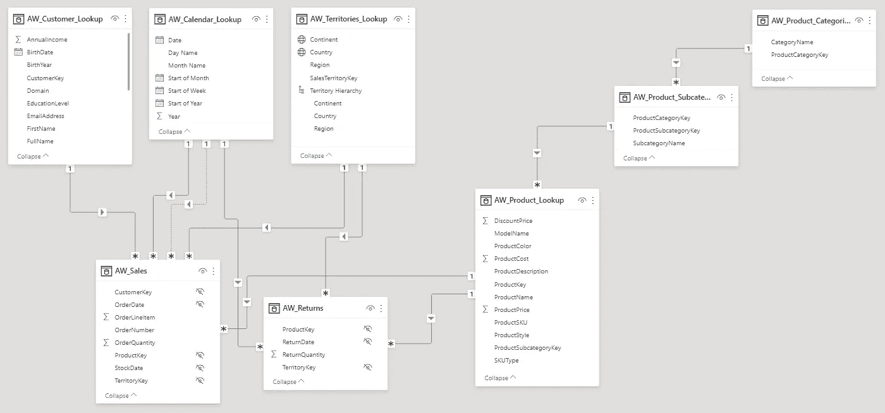
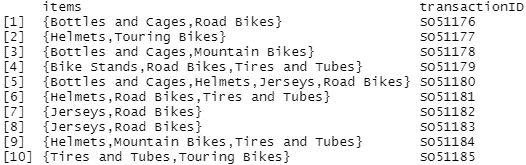
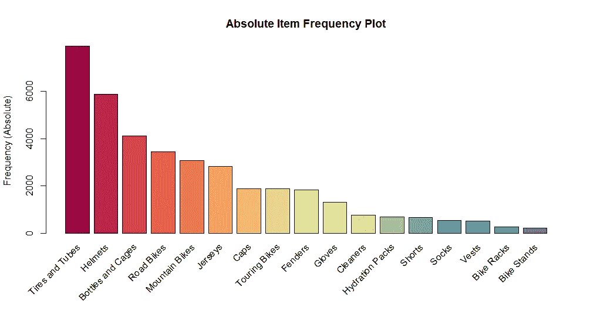
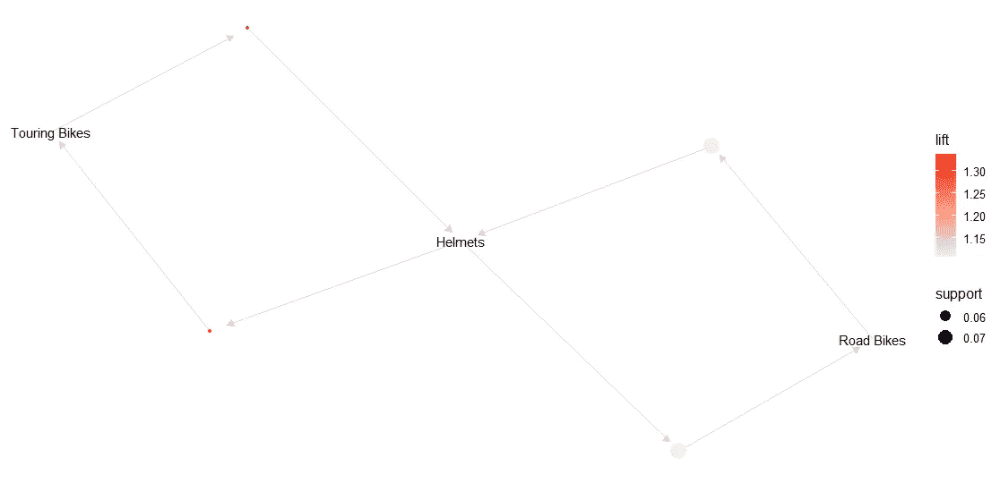

# 从头开始数据分析

> 原文：<https://medium.com/codex/data-analysis-from-scratch-a16e287f6e97?source=collection_archive---------10----------------------->

## 第一阶段—数据准备和分析

尼克·莫瑞森在 [Unsplash](https://unsplash.com?utm_source=medium&utm_medium=referral) 上拍摄的照片

# 介绍

最近一直在上微软 Power BI 培训。而且既然我已经有了一点 R 编程语言的技能，那我可以做什么项目把这两种技能结合起来呢？

我想到了一个主意，如果我们分析一家公司在 Kaggle 提供的样本数据会怎么样？所以我所学的一切不会凭空消失，但是我可以试着训练我使用 BI 和 r 的能力。

我将尝试使用 R 处理来自数据准备/清理、数据分析的数据，直到使用 Power BI 制作仪表板。你兴奋吗？

# 资料组

我将在 Kaggle 上使用一个数据集，它有一个有趣的模式，看看这个:[冒险作品| Kaggle](https://www.kaggle.com/ukveteran/adventure-works)

冒险工作循环数据集

Adventure Work Database 是一个 OLTP 数据库的 Microsoft 产品示例，它代表一家名为 Adventure Work Cycles 的全球制造公司。

# 提取、转换、加载(ETL)

## 步伐

从 CSV 文件中提取原始数据。

转换数据，例如，更改数据类型、更改格式、排序值、保留和删除列/行、分组和聚合等。

将转换后的数据加载到我们想要使用的工具中，我使用 Power BI 来规范化数据。

# 创建表关系

将所有的表混合在一个规范化的数据模型中。基于 *ProductKey* 字段，这些表通过关系连接。

我们将通过在关系数据库中组织表来规范化数据。因为将所有数据合并/缝合到一个表中会产生冗余，所以我们将只创建表之间的关系。

星型模式和雪花型模式

# 分析数据

我将对这些数据进行的分析是市场篮子分析(MBA)。简而言之，MBA 是一种分析，同时产生几种产品的包装建议和吸引客户的宣传片。
**目标**是**增加销售**和**减少仓库库存**。因此，在一次分析中，我们可以得到两种解决业务问题的方法。

我将使用以下数据进行市场篮分析:
AdventureWorks _ Sales
AdventureWorks _ Products
AdventureWorks _ Subcategories

将使用的算法是使用 R 编程语言的 Apriori 算法。

## 导入库，读取和显示数据

为了使用购物篮分析来分析数据，我们必须根据订单(订单号)对产品进行分组。在每个订单行中，都有一个在交易中购买的产品列表。这一行然后被转换成交易数据，其中每个订单被计为一个交易。

一些事务的显示被限制在 10 行，所以我们可以看一下数据表单。

10 行的数据样本

## 产品销售频率

在实现 Apriori 算法之前，我们必须识别已经售出的产品。通过寻找最高的购买频率，我们可以将这些产品与和主要产品有关联的配套产品包装在一起，以增加销售。

第 20 行中的代码将给出一个图表，按顺序显示畅销产品的产品子类别的销售频率。

## 关联规则— Apriori 算法

从这里开始，我们实际上可以使用 Apriori 算法实现查看畅销产品的关联。如果要确定一个产品的促销套餐，就要保证配套产品会带来收益。

有 3 个指标可用于计算多个产品的关联性:

1.  支持
    与发生的总交易相比，项目集交易的频率。支持数字是 0-1。越接近 1 意味着产品越受欢迎。
2.  置信度
    与 LHS 的项目集相比，规则中所有产品的支持度。该数字在 0-1 的范围内。越接近 1 表示产品经常一起购买。但是，它不能反映产品关联的强度，因为它只支持 LHS 中的项目集。
3.  与 LHS 和 RHS 中的项目集相比，提升
    对所有产品的支持。电梯号在 0-无穷大。强关联由最高的数字表示(最好大于 1)。

第 14 行的代码会给我们一个关于产品包的最佳组合的可视化。

关联规则可视化

圆圈的大小表示受欢迎程度，而颜色的强度表示提升程度。从图中可以看出**旅行车** & **头盔**虽然支撑不太大，但是升力还是比较高的。

# 结论

根据分析，可以提供一些业务建议:

1.  在线下商店，相关产品(旅行自行车和头盔)应该放在一起。目的是提高客户购物体验，解决仓库囤货问题。
2.  在网上商店，营销可以从这种关联关系中获益，通过对这些包装打折来鼓励顾客在购物篮上花更多的钱。这两个产品可以显示在网站的主页上，有一个特殊的捆绑促销。

就是这样。感谢您花时间阅读这篇文章，希望对您有用。请在下面评论，让我知道你的想法。下一节再见，关于冒险工作循环的仪表板！