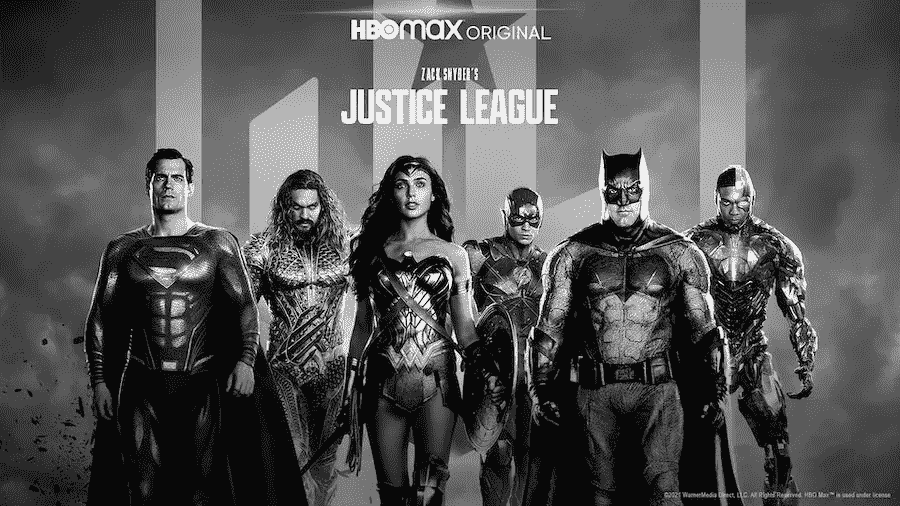

# 扎克·施奈德版正义联盟的数据分析和自然语言处理！

> 原文：<https://medium.com/codex/data-analysis-nlp-on-zack-snyders-justice-league-2b1fc9d63848?source=collection_archive---------15----------------------->

## [法典](http://medium.com/codex)

我们到了，扎克·施奈德版正义联盟在 2021 年 3 月 18 日刚刚上映。同一天，法国(至少是它的一部分)进入第三次封锁。

嗯，这是利用空闲时间进行基于数据的电影分析的最佳时机！

笔记本可以在 Kaggle 上的[这里找到。](https://www.kaggle.com/davidjmartins/zack-snyder-s-justice-league-analysis-lnp)

