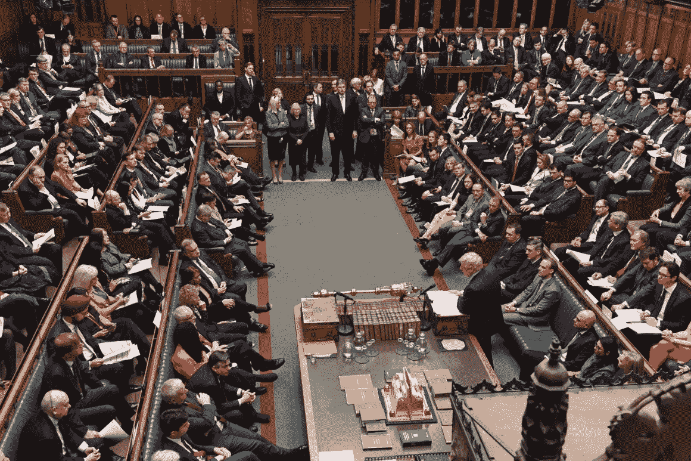
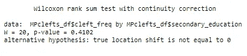

# 数据分析:英国国会议员的言语模式

> 原文：<https://medium.com/codex/data-analysis-of-speech-patterns-in-uk-members-of-parliament-e820f3c89e8c?source=collection_archive---------13----------------------->

# 一.导言

clefts 是英语中的一种结构，它将句子分开，以使句子成分之间的关系明确。*——石穴由四部分组成:*

*(1)介绍性的“它”，*

*(2)“be”的一种形式(例如，is，was)，*

*(3)焦点(例如，从句、名词或状语短语)，以及*

*④还有一个关系从句，以“that”、“who”、“which”等开头。[【2】](#_ftn2)*

*下面是一个例子:*

*我离开波士顿的那天是星期二。*

*在上面的句子中，重音在这个分句的焦点上，“在星期二”——这个分句引起注意并突出了“在星期二”，使它成为关系从句的明确焦点。分裂突出了句子的某个方面，引起了听者的注意。*

*因为分裂被用来以一种特定的和明确的方式框定焦点和关系从句之间的关系，分裂可以被用作一种修辞手段，把说话者想要的解释强加给听话者。合乎逻辑的假设是，为了提出有说服力的论点，职业演说家比非职业演说家更频繁地使用裂缝。在我的语料库语言学课程的这个项目中，我调查了一个假设，即英国国会议员(MPs)——职业公共演说家——比英国国家语料库(BNC)语料库中的演讲者使用分裂的频率更高。MP 语料库将用于调查专业从事语言修辞使用的人群中的分裂用法，而 BNC 口语语料库将用于模拟一般人群中的分裂用法。[【3】](#_ftn3)*

*在这个项目的第二部分，我调查了议员语料库中分裂用法的人口统计学差异(性别，政党)。我还增加了“中等教育”这个变量，它描述了一个议员小时候去的是国家资助的“文法”学校还是私立的“独立”学校。中等教育将代表议员父母的社会阶层。议员语料库中的所有文档都是 1990-1992 年的，因为我希望每个发言人都有一个任期长度，所以我添加了变量“1990 年以前作为议员的年数”。我增加了这个变量来调查是否有一个更长的 MP 任期与更高的裂隙使用率相关。*

*我假设男性议员比女性议员使用更多的裂隙。我预测男性议员会更多地使用裂缝，因为裂缝通常是对抗性的——他们纠正之前的陈述或将演讲者的解释强加给听众。在男女混合的会议中，男性主导了谈话。[【4】](#_ftn4)因此，我预测男性议员更喜欢使用攻击性、对抗性的修辞手法，比如裂缝。*

*我预测来自上层阶级背景的议员(上过私立学校，而不是公立学校)比来自下层阶级背景的议员使用裂缝的比率更高。分裂——尤其是状语或搁浅的名词短语分裂——是相对复杂的结构，需要说话者跟踪悬空从句。在生命早期获得高质量的教育，并让父母有能力支付这种教育，可能会增加复杂句法结构(如 clefts)的使用。高质量的教育也可能提供更多的修辞训练，让议员们准备好使用这些修辞手段。*

*最后，我假设，议员任期越长，使用裂隙越多。因为裂缝经常被用作对抗、说服或纠正听者的修辞手段，我怀疑议员在议会的时间越长，他或她就越有信心使用裂缝。或者，一名议员在议会任职的时间越长，他或她就越有可能接触到来自同僚的这种有说服力的修辞手段。*

*所有测试都是用 *R* 的统计软件进行的。研究发现，在 BNC 口语语料库中，议员们比说话者更多地使用分裂。他们也比在 BNC 口语语料库中更多地使用非事实分裂。在议员样本中，唯一接近显著性的标准化裂缝频率的预测因子是议员在 1990 年之前任职的时间长度。性别、政党和中等教育类型的标准化裂缝频率差异并不显著。*

# *二。方法学*

*为了收集数据，我使用了*AntConc*——一种用于在大量文本中寻找单词序列或模式的软件。我使用下面的正则表达式来定义我想要搜索的字符序列，取自我们之前的作业:*

*`\b[Ii]t\s+(is|was)(\s*n[o\’]t)?(\s+\b(?!(clear|essential|found|going|gonna|hoped|important|inevitable|interesting|like|made|necessary|obvious|possible|said|something|suggested|worth)) \w*\b)(\s+\w+){0,7}\s*(that|which)\s+\w+\b`*

*从英国国会议员议会发言的议事录中，我对以下 11 位议员的发言进行了正则表达式的搜索:*

*——克里斯托弗·乔普(保守党)*

*-麦克·莫里斯(保守派)*

*罗杰·弗里曼(保守派)*

*——托尼·马洛(保守党)*

*-大卫·梅洛尔(保守派)*

*——玛格丽特·撒切尔(保守党)*

*——特雷莎·戈尔曼(保守党)*

*-比尔·奥布赖恩(工党)*

*-奈杰尔·斯皮灵(工党)*

*贝蒂·布斯罗伊德(工党)*

*-保罗·弗林(工党)*

*最初的任务是只研究 8 名议员——最初给我的 8 名议员是克里斯托弗·乔普、麦克·莫里斯、罗杰·弗里曼、托尼·马洛、特雷莎·戈尔曼、比尔·奥布赖恩、奈杰尔·斯皮灵和贝蒂·布斯罗伊德。然而，用这 8 个 MP，我只能找到 19 个裂缝——太少了，无法进行任何有意义的统计分析。事实上，正则表达式没有检索到 Teresa Gorman 的任何裂缝(我没有将她从我的结果中排除，因为这仍然是一个有趣的观察)。我增加了 3 名议员——玛格丽特·撒切尔、大卫·梅洛尔和保罗·弗林——来寻找更多的裂缝。*

*我选择这些议员是为了保留我在原始样本中的社会变量的分布。原始样品的比率为:*

*- 6 名男议员对 2 名女议员*

*- 5 名保守党议员对 3 名工党议员*

*- 2 名 20 世纪 20 年代出生的议员到 3 名 30 年代出生的议员到 3 名 40 年代出生的议员。*

*在加上玛格丽特·撒切尔、大卫·梅洛尔和保罗·弗林之后，我得出了新的比率:*

*- 8 名男议员对 3 名女议员*

*- 7 名保守党议员对 4 名工党议员*

*- 3 名 20 世纪 20 年代出生的议员到 4 名 30 年代出生的议员到 4 名 40 年代出生的议员。*

*搜索表达式检索到的结果被我标注为裂缝、额外位置(例如:“您必须仔细聆听”)或噪音。我排除了多余的位置和噪音。这次搜索总共找到了 61 个裂缝。这里是包含裂口的数据框的前两行:*

**

*图一。在英国国会议员的演讲记录上运行的搜索表达式找到的包含裂缝的数据帧*

*首先，我计算了 clefts_BNC.csv 文件中的裂缝来自的 BNC 语料库子集的字数。我对文本类型为“口语 _ 人口统计”和文本类型为“口语 _ 上下文”(其中“上下文”列为“休闲”)的文档中的字数进行了求和。我选择这两个类别是因为 clefts_BNC.csv 文件中的 clefts(我将其与 MP 语料库中的 clefts 进行比较)都具有文本类型“口语 _ 人口统计”和“口语 _ 上下文”(其中“上下文”列是“休闲”)。“口语语境”文本类型是指独白和对话的文字记录，例如采访和广播，通常包括准备好的演讲。“口语 _ 人口统计”文本类型指的是自发对话的抄本(在该示例中，集中于“休闲”主题，例如体育和休闲活动)。*

*接下来，我计算了样本中 11 位议员的所有文件的字数，即我总结了克里斯托弗·乔普、麦克·莫里斯、大卫·梅洛尔等所有演讲的字数。*

*包含来自 11 名议员的文档的语料库和 BNC 语料库在大小上有很大不同。BNC 口语文本抄本语料库总共包含 5，766，760 个单词，而来自 11 名议员的演讲语料库总共仅包含 617，191 个单词。因此，比较一个语料库和另一个语料库中裂缝的原始数量是没有意义的。*

*相反，我将裂缝的标准化频率与讲座中定义的公式进行了比较:*

***归一化裂缝频率=裂缝数/语料库中的单词数* 1，000，000(固定数)***

*即每百万字中的裂缝数量。*

*在我的分析的第二部分，我把重点放在了 MP 语料库中标准化裂缝频率的变化，并调查了社会因素的影响。我编制了一个表格，其中包含了每位议员的性别、党派、出生年代、中等教育类型以及 1990 年以前担任议员的年限(该表格可在附录中找到)。*

*我包括了议员接受的中等教育的类型，作为议员成长的社会背景的代表。我无法找到这位议员父母的职业或社会阶层的数据，但我能找到中学教育的类型——独立(私立)或文法(国家资助)。与大学不同，孩子们通常不能决定他们接受哪种中等教育。上流社会的父母很可能把孩子送进独立/私立学校，工薪阶层的父母很可能把孩子送进国家资助的学校。*

*我还把 1990 年以前当议员的年数作为一个变量纳入了我的分析。我特别选择了 1990 年，因为所有的唇裂样本都来自 1990-1992 年。我不想计算每次分裂时作为议员的年数，而是希望每个议员都有一个单一的值，所以我使用议员当选的年份和 1990 年(数据收集开始的年份)之间的年数。*

# *三。结果的分析/解释*

# *第一部分——BNC 语料库和 MP 语料库中的裂隙频率比较*

*在计算了每个语料库中每百万单词的分裂频率后，很明显，平均而言，MPs 比非 MPs 使用更多的分裂。以下是 BNC 语料库和 11 位议员的讲话语料库中的标准化分裂频率的比较:*

**

**图二。比较在 BNC 和 MP 语料库中检索到的裂缝数量、每个语料库中的单词数量以及每个语料库中裂缝的标准化频率(每百万单词的裂缝数量)的表格。**

*样本中的议员使用分裂的频率约为每百万字 99 个，而 BNC 语料库中的说话者使用分裂的频率约为每百万字 31 个。这种分裂用法的差异似乎支持了一个假设，即专业从事语言修辞使用的人(如议员)使用分裂的比率更高。*

*然而，在 BNC 语料库中，不同文本类型之间的分裂使用率仍然存在显著差异。下面是口语上下文和口语人口统计文本类型中的标准化裂缝频率的比较:*

**

**图 3。比较 BNC 语料库中文本类型的裂缝数量、每种文本类型的字数以及文本类型的标准化裂缝频率(每百万字的裂缝数量)的表格。**

*文本类型“口语 _ 上下文”包含准备好的演讲，如独白和无线电广播，而“口语 _ 人口统计”包含自发的对话。在“口语语境”中使用分裂的比率约为每百万字 72 个分裂；远远高于自发对话中的裂缝使用率，约为每百万字 15 个裂缝。这种用法上的差异可能是因为，在口语对话中，与事先准备好的广播或采访相比，人们不太重视修辞上的说服力。*

*然而，文本类型“口语 _ 上下文”的归一化裂缝频率仍然比平均 MP 裂缝率低大约每百万字 30 个裂缝。这可能是因为口语语境“还包括采访和对话，其中的裂口和其他正式修辞手段听起来生硬和不自然的目标观众(一般公众)。另一方面，议员的发言并不打算让普通大众听到，而是让其他议员听到。*

# *第 2 部分—MP 语料库中裂隙频率的比较*

**

**图 4。柱状图对比了 MP 语料库中 11 个 MP 中每一个的归一化裂缝频率(每百万字的裂缝数量)。**

**

**图五。比较 MP 语料库中 11 个 MP 的总字数的柱状图。**

*议员语料库中议员之间的分裂用法存在显著的个体差异。例如，玛格丽特·撒切尔的归一化裂缝频率为每百万字 226.30503 个裂缝，而在特雷莎·戈尔曼或贝蒂·布斯罗伊德的演讲中没有发现裂缝。*

*玛格丽特·撒切尔也是迄今为止文集里最多产的演讲者。她在语料库中的总字数为 119，308 个单词。如此高的字数并不令人惊讶，因为她在 1990 年担任首相，那一年她的样本被记录下来。然而，字数不是标准化裂缝频率的重要预测指标。例如，麦克·莫里斯虽然总字数很低，只有 18，158 个单词，但其标准化分裂频率却位居第二，为每百万单词 165.21643 个。*

# *2A 区——按性别比较 MPs 中的标准化裂缝频率*

**

**图 6。比较女性和男性 MPs 中裂隙频率分布的箱线图。**

*标准化唇裂频率的箱线图显示，女性议员样本中唇裂的使用比男性议员样本中的使用更加多变——然而，女性的平均标准化唇裂频率似乎低于男性。*

*使用 Wilcoxon 秩和检验对这两个样本的均值进行比较，结果显示男性和女性议员在使用裂缝方面没有显著差异，因此反驳了本项目介绍中的假设。通过 Wilcoxon 秩和检验获得的 p 值远高于临界阈值 0.05，这意味着这两个样本可能来自相似的分布。因此，基于我的研究结果，性别本身并不能解释 MPs 中裂隙用法的变化。*

**

*图 7。在 R 对男性和女性 MP 样本进行的 Wilcoxon 秩和检验的结果。*

# *2B 区——按政党划分的国会议员标准化分裂频率比较*

**

**图 8。比较保守党和工党议员中标准化裂缝频率分布的箱线图。**

*这两个样本的分布看起来非常不同。工党议员的中值标准化裂缝频率约为每百万字 42 个裂缝，保守党议员约为每百万字 150 个裂缝。工党议员的差距似乎更小。*

*虽然这两个样本看起来不同，但 Wilcoxon 秩和检验显示，保守党议员和工党议员的平均归一化裂缝频率没有显著差异。通过 Wilcoxon 秩和检验获得的 p 值远高于临界阈值 0.05，这意味着这两个样本可能来自相似的分布，并且它们的均值没有显著差异。因此，根据我的研究结果，政党也不是一个可靠的分裂使用预测。*

**

*图九。在 R 对工党和保守党议员样本进行的 Wilcoxon 秩和检验的结果。*

# *第 2C 节——按中等教育类型比较 MPs 中的标准化裂缝频率*

**

**图 10。按中等教育类型比较标准化裂缝频率分布的箱线图。**

*这个箱线图似乎还表明，具有精英社会背景的议员——即，上过独立学校的议员——比上过公立学校的议员有更高的裂缝使用率。这将支持一个假设，即来自上层社会背景的议员比来自工人阶级背景的议员更频繁地使用裂缝。“国家”方框图中最上面的触须是属于玛格丽特·撒切尔的数据点，她来自工人阶级背景，曾就读于一所国家资助的文法学校。*

*然而，同样，在独立学校和公立学校就读的议员之间的标准化裂缝频率的明显差异并不显著。从 Wilcoxon 秩和检验中获得的大 p 值表明，来自“独立”和“国家”样本的标准化裂隙频率可能来自同一分布，并且它们的平均值没有显著差异。基于这些结果，中等教育也不是标准化裂缝频率的可靠预测指标。*

**

*图 11。在 R 对在公立和独立学校接受教育的议员样本进行的 Wilcoxon 秩和检验的结果。*

# *2D 区——标准化分裂频率和议员任期长度之间的关系*

**

**图 12。1990 年前作为议员任期长度函数的标准化分裂频率。**

*当标准化的分裂频率与议员在 1990 年任职的时间长度相对照时，一种关系似乎出现了。归一化裂缝频率的最低值来自任职仅几年的议员，而归一化裂缝频率的较高值来自任职多年的议员。*

*皮尔逊积差检验得出的相关系数在 0.5 到 0.7 之间，这意味着 1990 年之前议员在任的年数和他/她的标准化分裂频率适度相关。[【5】](#_ftn1)相关 p 值为 0.06722，接近显著性。*

**

**图十三。*在 R 中进行的皮尔逊积差相关检验的结果检验了议员任期长度和议员归一化分裂频率之间的相关性(进行夏皮罗-维尔克检验以确定两个被比较变量的正态性——任期长度和归一化分裂频率)。*

*当然，相关性并不意味着因果关系。经常使用裂缝的议员可能比不经常使用裂缝的议员任期更长。或者，任职时间较长的议员可能会获得必要的信心，在议会辩论中更频繁地使用像裂缝这样有力、自信的修辞手段。或者说，议员任职的时间越长，就越容易受到同僚的攻击，并养成相同的讲话习惯。*

# *不及物动词实验限制*

*这个项目的第一个问题是每个议员在使用裂隙方面的极端差异。语音模式是非常特殊的，标准化的分裂频率的变化很大程度上可能是由于个人习惯。解决这个问题的唯一方法是在样本中包括更多的 MPs，以调查人口统计学中标准化裂隙频率是否存在一致的差异。*

*虽然我的项目有一半是致力于调查人口统计学(出生年代，性别等)在 MPs 中使用裂隙的差异。)，我用的样本量可能太小，找不到任何有意义的人群差异。例如，当我对男性和女性议员的标准化裂隙频率进行 Wilcoxon 秩和检验时，比较了 3 名女性议员和 8 名男性议员的样本。测试结果表明，男性和女性样本的中枢倾向没有显著差异。Wilcoxon 秩和检验从这些样本量中可能找到的最小 p 值为 0.0121，刚好低于显著性阈值。同样，解决办法是增加更多的议员，以增加发现显著人口效应的可能性。*

*最后，议员们的发言记录只涵盖了 1990-1992 年这段时间。有限的时间范围内，从转录是模糊的重要信息，如何分裂使用可能会随着时间的推移而改变。没有这些信息，分析的 2D 部分是不完整的，增加更大范围的年份的文件将改进对土地使用权对土地分割使用的影响的分析。*

# *动词 （verb 的缩写）结论*

*这个项目的第一个假设是，在 BNC 口语语料库中，议员比说话者更频繁地使用切分。这些假设在分析中得到了支持——平均来说，议员比 BNC 的演讲者多使用近 70 个每百万字的裂口。*

*这个项目的第二个假设是男议员比女议员更经常使用裂缝。这一假设没有得到数据的支持——男性和女性样本的中心倾向没有显著差异。*

*这个项目的第三个假设是，来自较高社会阶层的议员在精英独立学校接受了更好的教育，因此比在公立学校上学的议员更容易使用复杂的语言结构，如裂缝。同样，这一假设没有得到支持，并且没有发现上过独立学校和公立学校的议员之间的标准化频率有显著差异。此外，按党派和出生年代划分的标准化裂缝频率差异并不显著。*

*该项目的第四个假设是，在议会中任职时间较长的议员比任职时间较短的议员使用裂缝的比率更高。统计分析显示，议员任职时间的长短与他/她的标准化分裂频率之间存在中度正相关，接近显著性(p 值= 0.06722)。*

*在这个项目中有许多主题没有被研究。例如，这些人口统计学之间的相互作用和它们对唇裂使用的影响没有被研究。人们可以研究诸如性别、任期长短和社会阶层等变量。互动影响议员使用裂缝的比率。这个项目的初步发现非常有趣，值得进一步研究。*

# *不及物动词附录*

**

*图 14。该表包含样本中每个议员的标准化分裂频率，以及他们的性别、党派、出生年代、中等教育类型和 1990 年之前的议员任期长度(参考文献包括在下面)。*

*丹尼斯·佩尔扎诺夫斯基和约翰·格尼，“信息技术在精选话语中的功能:媒介中的信息”，《世界》48 卷，第 2 期(1997):207–236，doi:10.1080/00437956 . 1997 . 1432468，第 207 页)*

*[【2】](#_ftnref2)阿曼达·l·帕滕，《英语信息技术裂缝:一个结构性的解释和一个历时性的调查》，编辑。Elizabeth Closs Traugott 和 Bernd Kortmann(柏林/波士顿，德国/美国:德格鲁埃特出版社，2013 年)，12，PDF。*

*[【3】](#_ftnref3)彼得·彼得雷，“语料库研究——讲座 3”(讲座，安特卫普大学，比利时安特卫普，2020 年 10 月 27 日)。*

*克里斯托夫·f·卡尔波维茨，程昕婷·门德尔伯格，李·沙克尔。议事参与中的性别不平等。《美国政治学评论》，2012 年；106 (03): 533 DOI: 10*

*[【5】](#_ftnref1)Keith g . Calkins，“应用统计学——第 5 课相关系数”，安德鲁斯大学，2005 年 7 月 18 日最后修改，[https://www.andrews.edu/~calkins/math/edrm611/edrm05.htm.](https://www.andrews.edu/~calkins/math/edrm611/edrm05.htm.)*

*[【6】](#_ftnref1)路易·奥斯皮纳·福雷罗，“威尔科克森-曼-惠特尼检验和小样本量”，牛津蛋白质信息学小组(博客)，2013 年 10 月 31 日发布的条目，[https://www . blo pig . com/blog/2013/10/威尔科克森-曼-惠特尼检验和小样本量。](https://www.blopig.com/blog/2013/10/wilcoxon-mann-whitney-test-and-a-small-sample-size/.)*

*[7]“克里斯托弗·乔普。”Politics.co.uk。2021 年 1 月 16 日。[https://www.politics.co.uk/reference/christopher-chope/.](https://www.politics.co.uk/reference/christopher-chope/.)*

*[8]“克赖斯特彻奇的克里斯托弗·乔普议员。”他们为你工作。[https://www . theyworkforyou . com/MP/10103/Christopher _ chope/Christ church。](https://www.theyworkforyou.com/mp/10103/christopher_chope/christchurch.)*

*[9]“纳斯比，主啊。”布里尔。https://reference works . brill online . com/entries/international-year-book-and-States mens-who-s-who/nase by-Lord-SIM _ person _ 19090。*

*[10]“纳斯比勋爵的议会生涯——国会议员和上议院议员——英国议会。”英国国会议员和上议院议员纳斯比勋爵的议会生涯。【https://members.parliament.uk/member/1251/career. 号*

*[11]“老埃尔姆赫斯特勋爵。”艾姆赫斯特男子学校。[https://www . elmhurstschool . net/school-life/latest-news/Lord-freeman-old-elmhurstian。](https://www.elmhurstschool.net/school-life/latest-news/lord-freeman-old-elmhurstian.)*

*[12]“弗里曼勋爵的议会生涯——国会议员和上议院议员——英国议会。”弗里曼勋爵的议会生涯-国会议员和上议院议员-英国议会。[https://members.parliament.uk/member/836/career.](https://members.parliament.uk/member/836/career.)*

*[13]“托尼·马洛。”维基百科。2020 年 6 月 20 日。[https://en.wikipedia.org/wiki/Tony_Marlow.](https://en.wikipedia.org/wiki/Tony_Marlow.)*

*[14]“托尼·马洛的议会生涯——国会议员和上议院议员——英国议会。”托尼·马洛的议会生涯——英国议会议员和上议院议员。[https://members.parliament.uk/member/913/career.](https://members.parliament.uk/member/913/career.)*

*[15]《大卫·梅洛尔演讲人简介》专家发言人。[https://www.specialistspeakers.com/?p=891.](https://www.specialistspeakers.com/?p=891.)*

*[16]“大卫·梅洛尔的议会生涯——国会议员和上议院议员——英国议会。”大卫·梅洛尔的议会生涯——议员和上议院——英国议会。[https://members.parliament.uk/member/1134/career.](https://members.parliament.uk/member/1134/career.)*

*[17]“校史。”凯斯文&格兰瑟姆女子学校。[http://www.kestevengrantham.lincs.sch.uk/history/.](http://www.kestevengrantham.lincs.sch.uk/history/.)*

*[18]“玛格丽特·撒切尔。”英国议会。[https://www . parliament . uk/about/parliament-and-women/history/Margaret-Thatcher/。](https://www.parliament.uk/about/parliament-and-women/history/margaret-thatcher/.)*

*[19]《特雷莎·戈尔曼讣告》卫报。2015 年 8 月 28 日。[https://www . the guardian . com/politics/2015/aug/28/Teresa-Gorman。](https://www.theguardian.com/politics/2015/aug/28/teresa-gorman.)*

*[20]“特蕾莎·戈尔曼:前领先的保守党反叛议员去世。”BBC 新闻。2015 年 8 月 28 日。https://www.bbc.com/news/uk-england-essex-34091184.*

*[21]“比尔·奥布莱恩(英国政治家)。”维基百科。2020 年 12 月 04 日。[https://en . Wikipedia . org/wiki/Bill _ O ' brien _(英国 _ 政治家)。](https://en.wikipedia.org/wiki/Bill_O'Brien_(British_politician).)*

*[22]“比尔·奥布赖恩先生，前议员，诺曼顿。”他们为你工作。[https://www . theyworkforyou . com/MP/10460/bill _ o ' brien/Norman ton。](https://www.theyworkforyou.com/mp/10460/bill_o'brien/normanton.)*

*[23]“Latymerian 2017 年 5 月—讣告。”Latymerian 学校简讯，2017 年 5 月。[https://issuu.com/latymer1624/docs/2017-05-latymerian.](https://issuu.com/latymer1624/docs/2017-05-latymerian.)*

*[24]“奈杰尔·斯皮灵的议会生涯——议员和上议院议员——英国议会。”Nigel Spearing 的议会生涯——英国议会议员和上议院议员。[https://members.parliament.uk/member/945/career.](https://members.parliament.uk/member/945/career.)*

*[25]“展览:贝蒂·布斯罗伊德。”展览:贝蒂·布斯罗伊德:政治生涯——开放大学数字档案馆。[https://www . open . AC . uk/library/digital-archive/exhibition/91/theme/1/page/1。](https://www.open.ac.uk/library/digital-archive/exhibition/91/theme/1/page/1.)*

*[26]“布斯罗伊德男爵夫人，前议员。”他们为你工作。[https://www . theyworkforyou . com/peer/10054/baroness _ boothroyd。](https://www.theyworkforyou.com/peer/10054/baroness_boothroyd.)*

*27 弗林，保罗。“新闺蜜。”保罗·弗林——阅读我的一天。2017 年 8 月。[https://paulflynnmp . typepad . com/my _ weblog/2017/08/new-best-friend . html](https://paulflynnmp.typepad.com/my_weblog/2017/08/new-best-friend.html.)*

*[28]“保罗·弗林的议会生涯——国会议员和上议院议员——英国议会。”保罗·弗林的议会生涯——议员和上议院——英国议会。[https://members.parliament.uk/member/545/career.](https://members.parliament.uk/member/545/career.)*