# 数据分析项目:用 Python 分析尼日利亚亿万富翁

> 原文：<https://medium.com/codex/data-analysis-project-nigerian-billionaires-analysis-with-python-184f919ccaa1?source=collection_archive---------11----------------------->

来自[非洲的图片解释](https://africaexplained.com.ng/wp-content/uploads/2021/01/20210123_154205_0000-1440x1152-1.png)

一个国家亿万富翁的数量很能说明这个国家的商业环境、创业成功率和许多其他经济特征。所以，如果你想了解更多关于我们如何在尼日利亚最富有的人之间找到关系，这篇文章是给你的。在本文中，我将带您完成用 Python 分析亿万富翁的任务。

# **数据**

我用来分析数据的数据集是我收集的。因为我从可靠和不可靠的网站上收集信息，所以有些值，尤其是净值一栏中的值可能不是 100%准确。我收集了我能找到的最富有的 100 名尼日利亚人的数据。该数据集包含 2022 年尼日利亚亿万富翁的信息，包括他们的:

1.  名称
2.  净资产(以十亿计)
3.  年龄
4.  产地国
5.  财富的来源
6.  工业

因此，让我们通过导入必要的 python 库和数据集来开始这项任务:

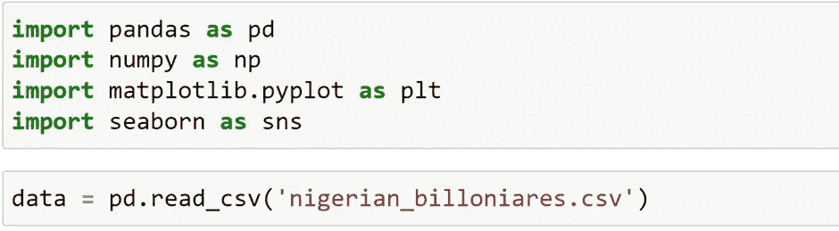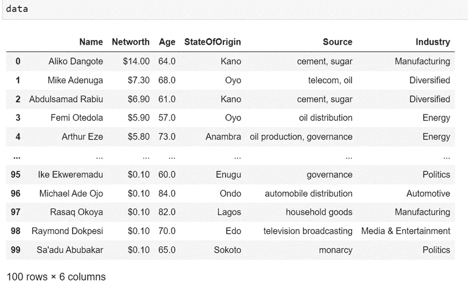

在我们继续之前，让我们看看这个数据集是否包含缺失值:

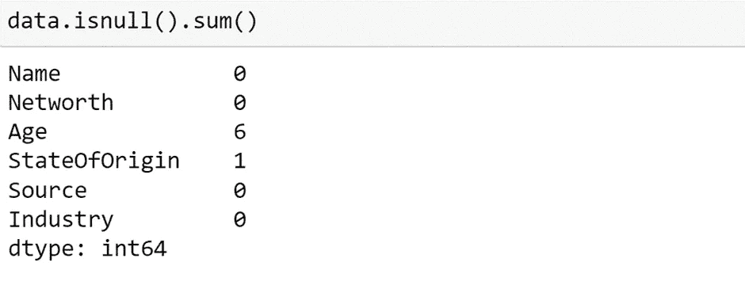

因此，该数据集在年龄列中有 6 个缺失值，在原籍州列中有 1 个缺失值。我找不到这些人的完整信息，所以我只是将其留空，而不是假设这些值。

# **解释性数据分析**

**最富有的个人**

让我们看看这个国家最富有的人。但在此之前，让我们使用 describe()方法来更好地理解数据

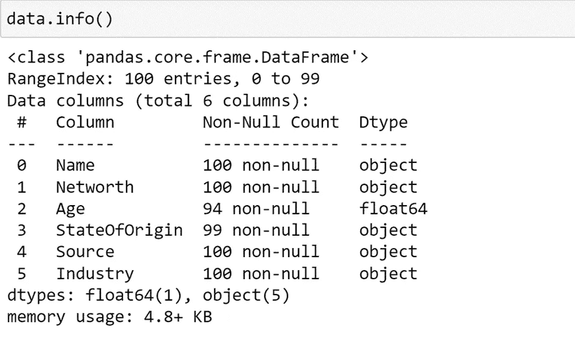

我们可以看到，由于美元符号，净值列被视为一个对象(字符串)。让我们纠正这一点

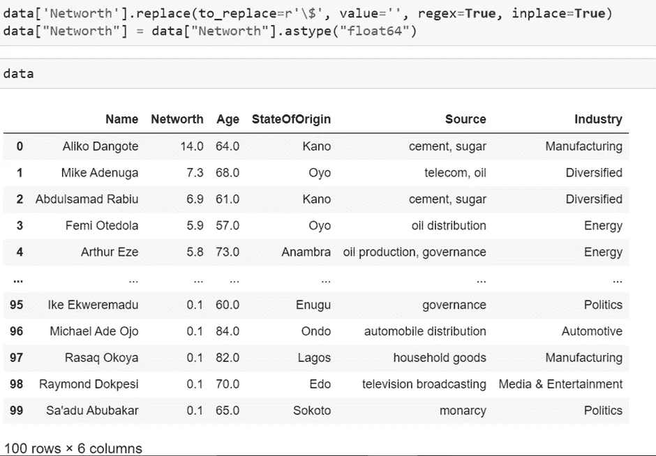

现在我们可以看到这个国家最富有的人

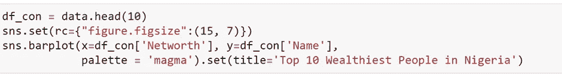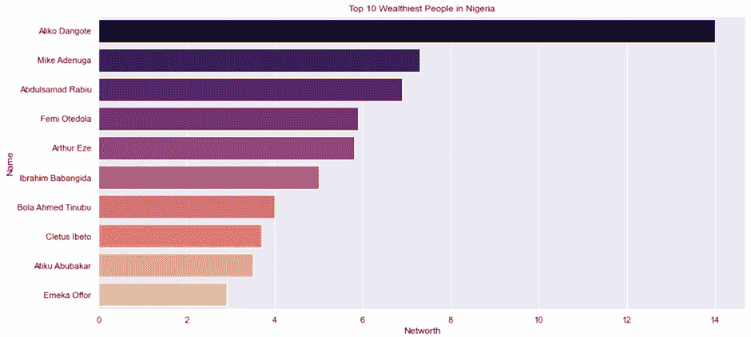

我们可以看到，阿里科·丹格特至今仍是最富有的尼日利亚人(遥遥领先)

**最富有人群的年龄**

现在让我们看看最富有的人的年龄分布

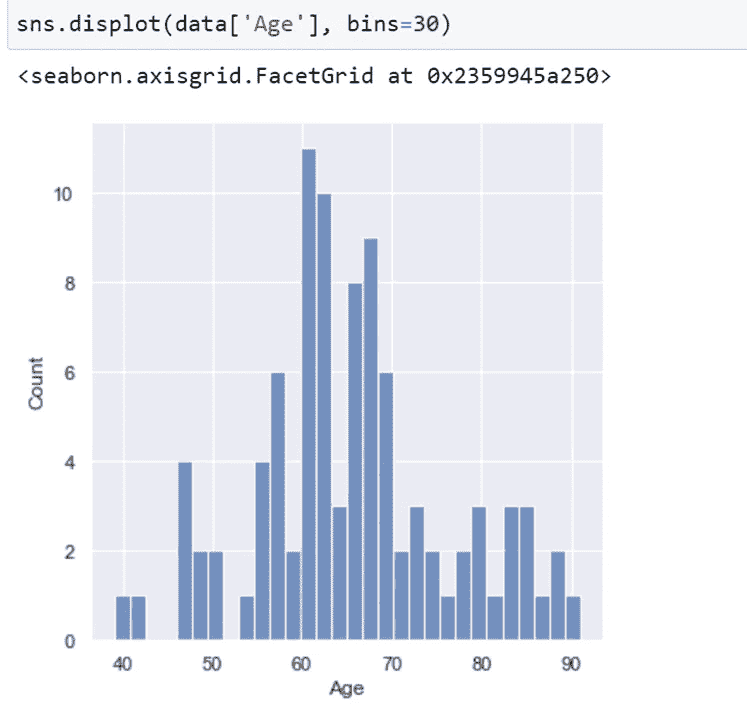

分布显示，尼日利亚最富有的人年龄在 40 岁至 90 岁之间。他们大多年龄在 60 到 70 岁之间。年轻人，不要给自己太大压力。一切最终都会水到渠成。

**最赚钱的财富来源**

现在让我们来看看拥有最多亿万富翁的五大领域:

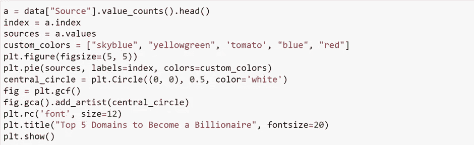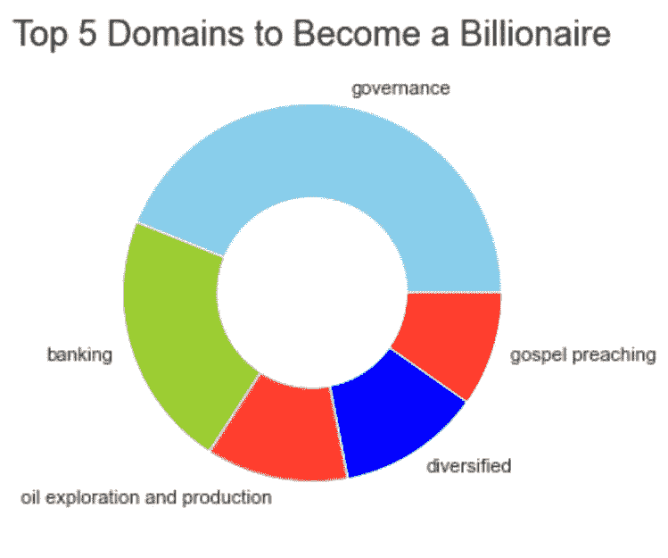

**最赚钱的行业**

现在让我们来看看亿万富翁人数最多的五大行业:

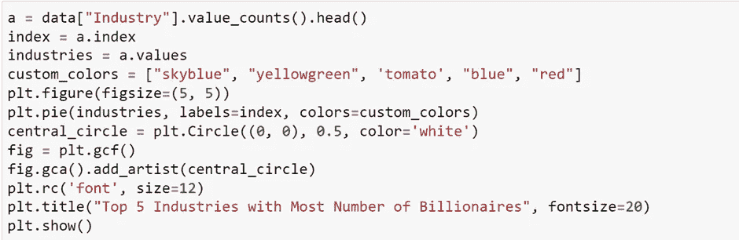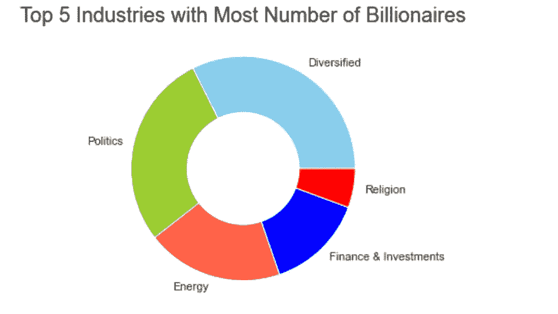

让我们看看所有让人们富裕起来的行业

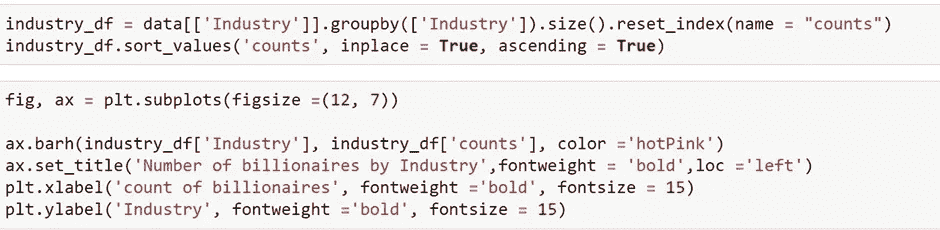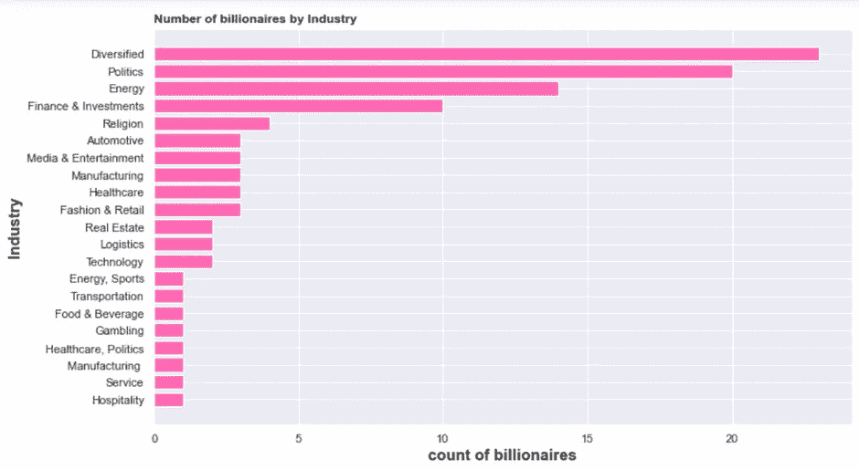

从我们目前所看到的，我们现在知道:

1.  试图拥有不同收入来源的人往往拥有最多的成功故事。
2.  政治是这个国家最赚钱的职业之一，对任何尼日利亚人来说都不应该感到惊讶。
3.  金融业还没有饱和。我看到很多人在 Twitter 上抱怨尼日利亚金融科技初创公司的数量，但数据显示，如果运营得当，如果它解决了一个问题，这是一个非常有利可图的收入来源。
4.  尼日利亚拥有丰富的液态黄金(石油)，因此投资该行业的人自然会大量套现。能源是文明的支柱。它永远不会过时。
5.  尼日利亚人是一群极端虔诚的人。这解释了为什么这个国家的一些宗教领袖进入了名单

**最贫穷的州**

现在让我们来看看亿万富翁人数最多的前 5 个州:

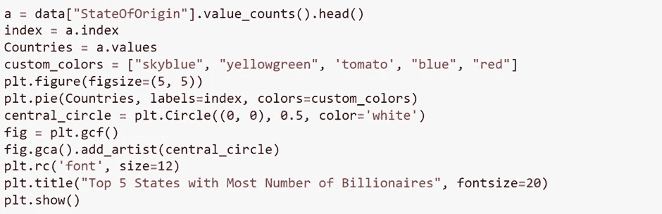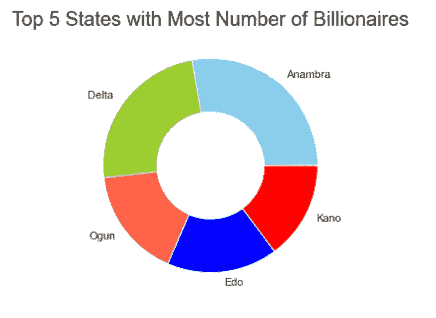

上图显示，阿南布拉州和三角洲州是大多数人成为亿万富翁的地方。因此，这要么意味着与该国其他地区相比，阿南布拉和三角洲地区的商业环境和创业成功率是/曾经是好的，要么意味着他们的当地人更倾向于成功。

# 摘要

因此，我们在尼日利亚的亿万富翁中发现了分析商业环境的模式。尼日利亚最富有的人所在的五个行业中有两个不应该被视为企业，这一事实令人担忧。

要查看这个项目的笔记本，请访问:【github.com】segun 7/尼日利亚亿万富翁分析

希望你喜欢这篇用 Python 分析亿万富翁的文章。请在评论区提出你有价值的问题。