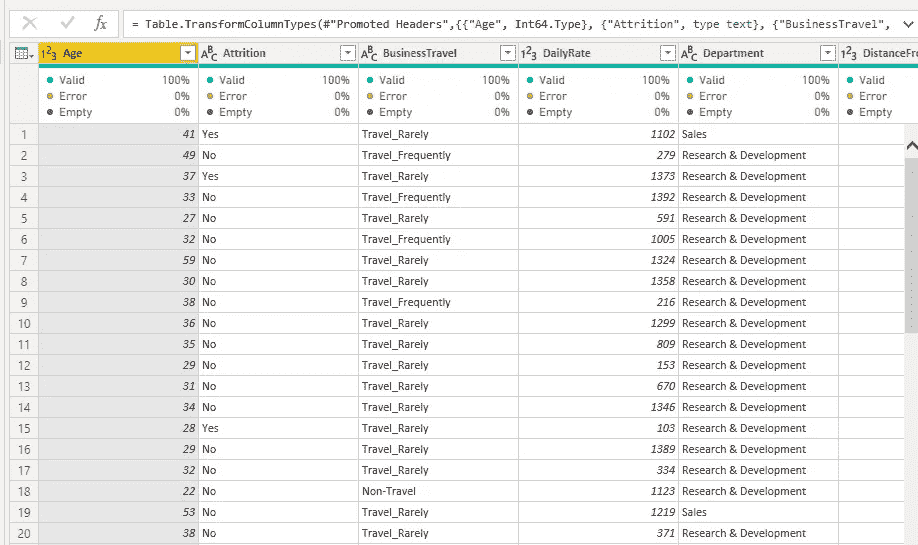
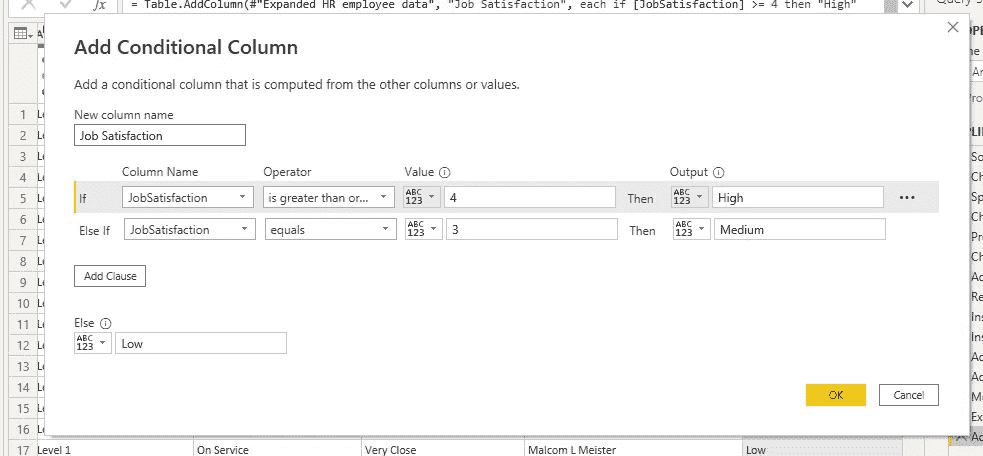
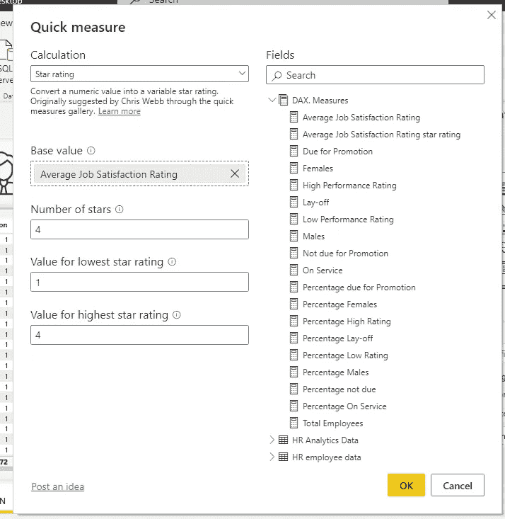
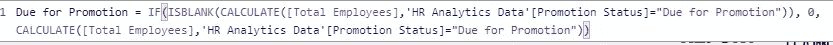
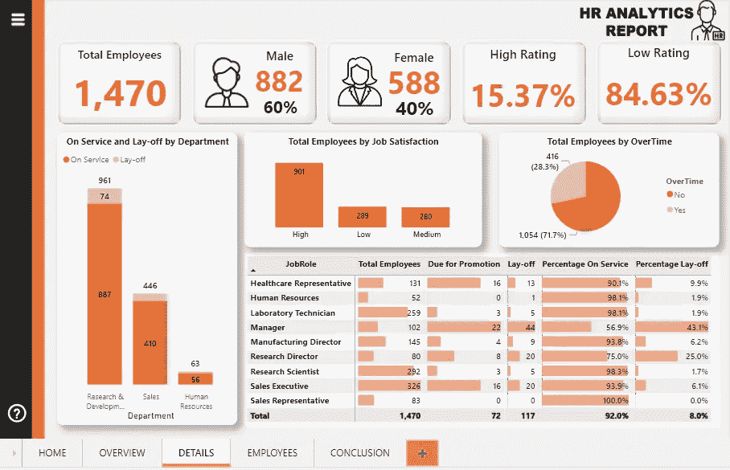
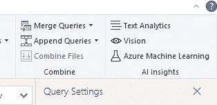

# 使用 Power BI 进行数据分析。

> 原文：<https://medium.com/codex/data-analysis-with-power-bi-ae8277ab4027?source=collection_archive---------1----------------------->

## 用 Power BI 分析 HR 数据集。

图片来自 [Borgenproject](https://borgenproject.org/topic-1-introduction-to-human-resources-management/)

人力资源(HR)是企业的一个部门，负责寻找、筛选、招聘和培训求职者。它还管理员工福利项目。

人力资源在帮助公司应对快速变化的商业环境和 21 世纪对高素质员工的更大需求方面发挥着关键作用。资料来源: [Investopedia](https://www.investopedia.com/terms/h/humanresources.asp)

**分析背景**

这项分析是在互联网上一个流行的数据集上进行的，这个数据集就是人力资源分析数据集。
我从 YouTube 频道的 [Data with Decision 上观看的视频中获得了这个数据集，导师试图用这个数据集工作，我发现它很好，并决定也对它进行分析。](https://www.youtube.com/c/DatawithDecision)

**数据分析过程**

在分析数据集之前，您必须经历一些步骤才能做出明智的决策，我所遵循的一些流程如下:

*   数据概述
*   数据准备
*   数据可视化
*   见解和建议

**数据概述**

这是我在进一步分析之前采取的第一步，基本上是浏览一下我的数据集，了解这是关于什么的，即数据包含的行数和列数，缺少多少记录，每列的值是否遵循特定的顺序等等。

这是一个重要的步骤，因为它使您能够在进行可视化分析之前真正了解您的数据集，以避免错误。

作者图片:数据集概述。

**数据准备**

在对我的数据有了一个总体的了解之后，我开始使用 Power BI 进行下一步的分析，也就是“数据准备”。

我将我的数据集导入到 Power BI 中，并使用文本/CSV 方式导入，因为数据集是 CSV 格式的。

作者图片:导入数据。

按作者分类的图像:导入后的数据集。

导入数据集后，它在一个单独的列中，我无法处理它，因为数据没有任何意义，这使得分析的第一步很重要。我继续拆分该列，方法是单击 Power query 的 Home 部分下的 split 列，按分隔符进行拆分，在此过程之后，我的数据比以前更有意义。

作者图片:分裂的过程。

按作者分类的图像:拆分列后的数据集。

从上面的图片中，我们可以看到数据看起来不错，但标题在第一行，所以我想进一步使第一行成为我的标题，方法是转到 Power query 主页菜单上的转换部分，然后单击使用第一行作为标题，见下图。

作者图片:制作首行标题。

作者图片:数据集看起来更好看。

在这一点上，我对我的数据集感到满意，已经检查了每一列以确保数据类型是正确的，然后我单击 close 并应用以将数据导入到 Power BI 中。数据已成功导入。

成功导入数据后，我必须使用 DAX 创建一些度量来帮助我的分析，创建的一些度量是:

**公司员工总数**，

作者图片:员工总数

**公司男员工人数**，

作者图片:男性工人数量

**公司女职工人数**，

作者图片:女工人数

**男性工人的百分比**，

按作者分类的图片:男性工人的百分比

女性员工的百分比:我创建了这个指标，就像我创建男性员工的百分比一样。

**到期晋升&未到期晋升:**在我创建这两个衡量标准之前，没有明确的方法来了解哪些人到期晋升，哪些人未到期晋升，因为我们只有一列显示每个员工最后一次晋升的年份。

作者图片:自上次升级以来的年份

在看到该列后，我决定通过条件格式创建一个列，这样，10 年前最后一次晋升的员工“应该晋升”，10 岁以下的员工“不应该晋升”。

按作者排序的图像:条件列

作者图片:条件格式后

作者图片:DAX measure

**到期晋升的百分比&到期未晋升的百分比:**就像我计算男性员工的百分比一样。我还计算了未到期晋升的百分比。

**下岗&在职:**为了创建它，我还必须创建一个条件列，因为没有列明确说明哪些人将被解雇，哪些人仍将在职。

按作者分类的图片:条件栏，用于确定哪些人将被解雇，哪些人将留下。

图片作者:算计工人要下岗

图片作者:计算工人继续服务

此外，我创建了一个条件列来确定员工的家是远离工作、靠近工作还是非常近。

按作者排序的图像:用于确定 n 名员工是离工作地点远还是近的条件列

我还创建了另一个列来确定每个员工的工作满意度是高、中还是低。

按作者排序的图像:确定工作满意度评级的条件列

在创建了所有的度量并确保我的 DAX。测量已准备就绪，我想使用星级显示评级，因此我使用“新测量”按钮旁边的“快速测量”按钮创建了一个快速测量，然后在“计算”部分选择星级，然后输入值，如下图所示:

作者图片:创建星级

**数据可视化**

在对我的数据进行了验证(确保它是干净的，每一列都有正确的数据类型，等等)并创建了有助于我的分析的方法之后，我继续创建用于分析的视觉效果，但我首先做的是将画布背景更改为我之前在 Microsoft PowerPoint 上创建的图像。

作者图片:画布背景

我进一步添加了菜单按钮，帮助按钮，一些我想加入书签的页面(那时，我不太确定我要给那些页面取什么名字)。

图片作者:添加按钮后的背景。

在使我的背景看起来不错之后，我开始插入一些视觉效果，比如:卡片、堆积条形图、堆积柱形图和圆环图，我的报告的第一页就是这样出来的，带有一些见解。

作者图片:报告首页

当在我的第一个页面上通过一些参数过滤时，我之前创建的一些度量标准的一些卡片显示为空白，所以我必须对 DAX 做一点修改。公式和例子有:

作者图片:修改后的公式

作者图片:修改后的公式

我添加了带有 ISBLANK 函数的 IF 语句，以便消除(空白)并用 0 替换。

我进一步在第二页上创建了一些视觉效果，除了第一页上的卡片和堆积柱形图之外，我还用饼图、100%堆积柱形图和矩阵表示了一些数据集，这些图表显示了一些深刻的见解。见下图:

作者图片:我的报告第 2 页

现在，我来到最后一页，在包含见解和建议的最后一页之前插入视觉效果。在此页面中，我使用了一个来表示该公司员工的一些信息，但在此之前，我必须导入另一个包含员工姓名和编号的数据集，然后我将查询合并在一起，并过滤特定的列以仅显示员工姓名。见下图:

作者图片:点击合并查询

按作者分类的图像:用于确定连接类型的页面。

图片作者:合并后。

按作者排序的图像:按雇员姓名筛选列。

作者图片:过滤后的栏目。

说了这么多，做了这么多，我的视觉(一个表格)更有意义了，如下图所示:

按作者分类的图像:用表格表示的员工详细信息。

最后一页包含对公司的见解和建议，如下图。

作者图片:洞察与推荐。

**结论**

我有一个使用这个数据集的美妙经历，因为我从来没有使用过书签，但是我使用这个数据集/项目学习了它。

**注:**所有分析均使用 Power BI 完成。

前面已经提到了从该仪表板得出的许多见解，但是您可以通过访问 Power BI 服务 [**上托管的仪表板此处**](https://app.powerbi.com/view?r=eyJrIjoiOTg2ZTM4OWEtNDRiZS00MjU4LWE3YTUtYzQ2MDBjZjQ5MDk4IiwidCI6Ijk2MDJlZTA2LWVlZWUtNDRlMC05YWMxLTc0N2JkMWU3ZDg1MiJ9&pageName=ReportSectionfe82d62d90e3b35640bd) 进一步得出更多分析。

欢迎在评论区修改和投稿，我们也可以通过 [**LinkedIn**](http://www.linkedin.com/in/oluwaferanmi-amole) **联系。**此外，您可以关注我的 [**Medium**](/@Feranmi_Amole) 页面，在我记录我的旅程时，了解更多作为数据分析师您需要了解和做的事情。

项目灵感来自[数据和](https://www.youtube.com/c/DatawithDecision)决策。

书签设计灵感来源于 [ExcelFort](https://www.youtube.com/c/ExcelFort) 。

继续学习！