# 数据分析师 vs 数据科学家。

> 原文：<https://medium.com/codex/data-analyst-vs-data-scientist-dd0f009f2ca1?source=collection_archive---------3----------------------->

## 为该领域的进一步分析和研究奠定了基础！！

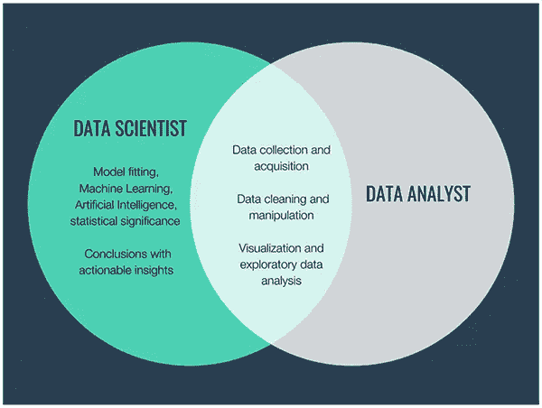

来自商业-科学. io

你好。！在这篇文章中，我将向你简要介绍你在申请/寻找工作时可能听说过或遇到过的角色。因此，我将通过介绍数据分析师和数据科学家等术语来帮助您，并解释数据分析师和数据科学家之间的主要区别。我们开始吧。

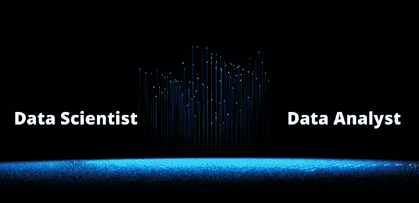

作者照片: [TechFitLab](https://medium.com/u/b827ee89d985?source=post_page-----a28e23549eb3--------------------------------)

数据科学家也可以是数据分析师，但反之则不可能。数据科学是一个广阔的领域，包括数据的研究、收集、处理、分析和可视化。数据分析师是以下人员的子集

# **数据分析师:**

数据分析师检索、收集数据并组织这些数据，以得出有意义的结论，同时识别模式和趋势，并将这些见解呈现给数据科学家。

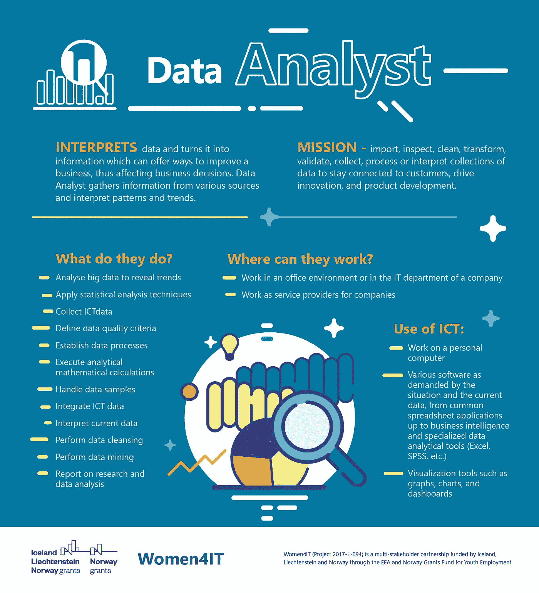

资料来源:妇女 4IT

# **数据分析师角色:**

让我们看看下图，以便更好地理解数据分析师的角色。

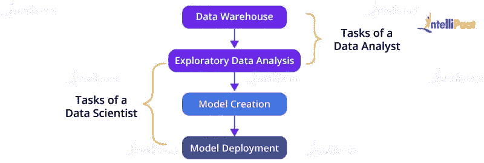

资料来源:intellipaat.com

数据分析师从数据仓库(Azure、AWS、Google 云平台)中过滤并提取相关数据。提取数据后，他们执行 EDA(**E**exploration**D**ATA**A**analysis)以获得形式上的洞察力，并将数据转换为结构化形式(图表、报告、表格等)。)供数据科学家建立机器学习模型。

# 数据分析师的职责:

1.  使用自动化工具和技术从一手和二手资料中提取数据。
2.  开发和维护数据库，并将数据转换成可读格式。
3.  对数据库执行 EDA(**E**exploration**D**ATA**A**analysis)以提取见解并准备数据的摘要(概要)。
4.  定义数据质量标准。
5.  执行数据挖掘。
6.  使用统计工具来分析和解释模式或趋势有助于预测和从数据中获得洞察力。

# **数据分析师必备技能:**

1.  很强的分析数据的数学技能。
2.  精通数据库编程语言，如 Python，R，MATLAB 等。
3.  了解数据可视化软件，如 Tableau，Qlik，PowerBi 等。
4.  熟悉 Excel，PowerPoint，MS Office，SPSS 等软件。
5.  解决问题的技巧。
6.  项目管理技能。

# 对数据分析师的期望是什么:

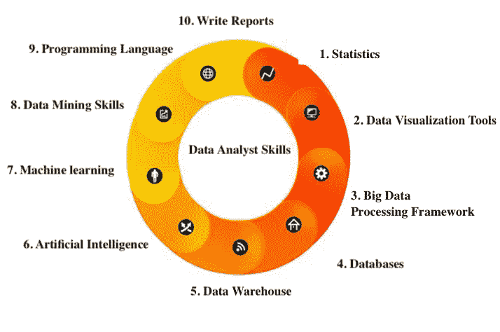

资料来源:finereport.com

# **数据科学家:**

数据科学家是处理非结构化和结构化数据的专业人士/专家，他们使用更先进的数据技术，根据数据显示的过去模式预测未来结果。数据科学家还为预测建模过程创建了自己的机器学习算法。简而言之，数据科学家的职责是评估未知事物、编写算法和构建统计模型，并与利益相关方合作确定业务需求。

卢克·切瑟在 [Unsplash](https://unsplash.com?utm_source=medium&utm_medium=referral) 上的照片

# 对数据科学家的期望:

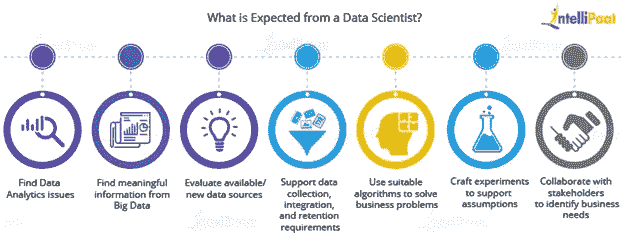

资料来源:finereport.com

# 数据科学家角色:

数据科学家是一名专业人员/专家，他需要大量的信息来处理逻辑能力、可衡量能力方面的问题，并促进猜测，做出与业务问题相关的推导和模式，例如，客户模式、市场模式、产品的购买和销售模式，以及在数据集之间建立联系。

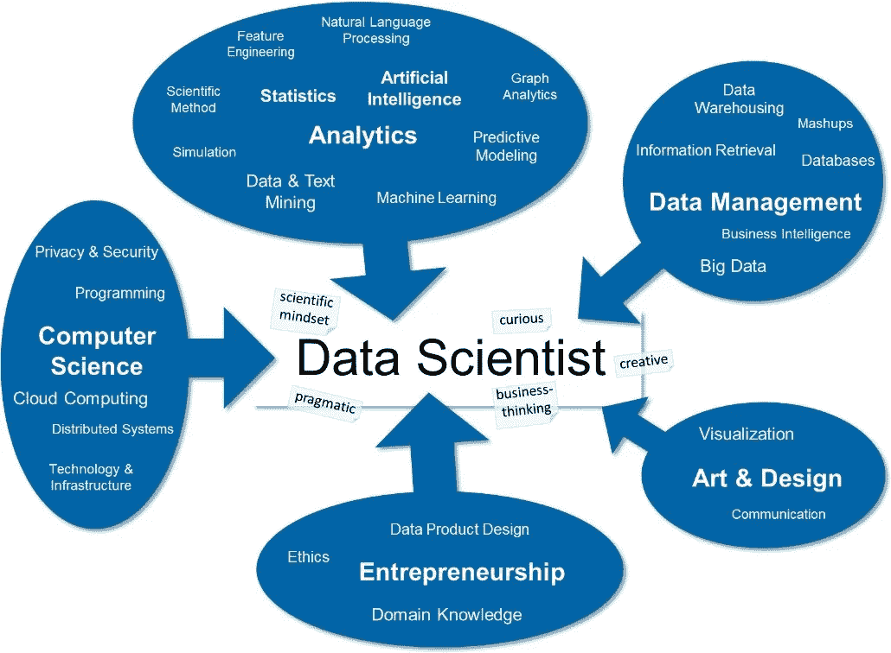

资料来源:inlab.fib.upc.edu

# 数据科学家的职责:

1.  清理数据
2.  数据挖掘技术
3.  构建模型以处理大数据
4.  大数据的推断和分析
5.  提供具有可操作见解的结论

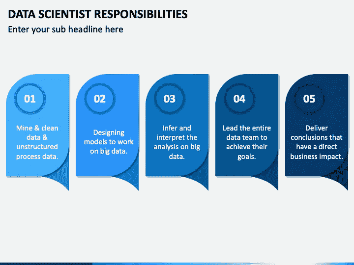

来自 sketchbubble.com

# 数据科学家必备的技能:

1.  机器学习
2.  数学建模
3.  统计数字
4.  编程；编排
5.  数据库管理
6.  深度学习
7.  大数据知识
8.  模型部署
9.  云计算服务

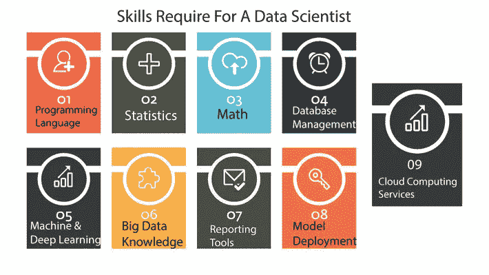

资料来源:datasciencecentral.com

# **数据分析师 vs 数据科学家:**

下图显示了数据分析师和数据科学家之间的主要区别

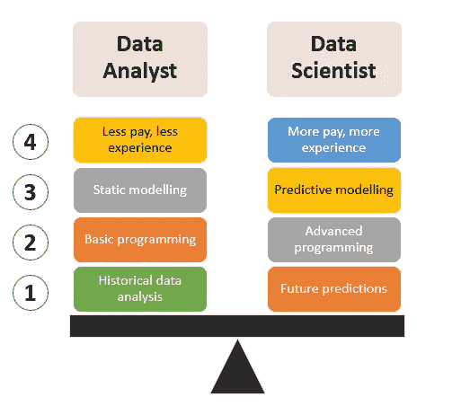

资料来源:towardsdatascience.com

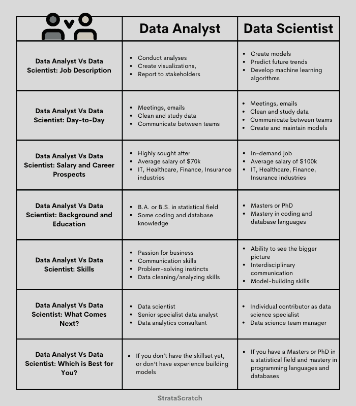

资料来源:stratascratch.com

# 结论:

最后，我想重申一点，数据分析师为业务问题提供解决方案，并为其创建报告、图表和表格；另一方面，数据科学家创建业务问题，并找到最合理可行的解决方案，因为它取决于每个阶段的数据分析和其他信息。从数据中提取洞察力是一回事，然而，解读这些洞察力以得出商业解决方案是完全不同的。成为一名数据科学家与成为一名数据分析师是完全不同的，需要承担更多的责任。理解数据分析师的整体形象是很棒的，目标是你可以在任何需要的时候爬上职业阶梯。

# 最后…

我真的希望这篇文章是一个很好的阅读材料，也是每个人的灵感来源，他们想通过数据分析师或数据科学家的职业生涯来发展和创新。

建议和反馈请**评论**。我还在学习。请帮助我提高，这样我可以通过提升我的写作技能和知识来帮助你，并通过我随后的文章发布以更好的方式向你展示我自己。

下一篇文章将讨论数据分析、数据科学和机器学习之间的区别。

谢谢大家，编码快乐:)