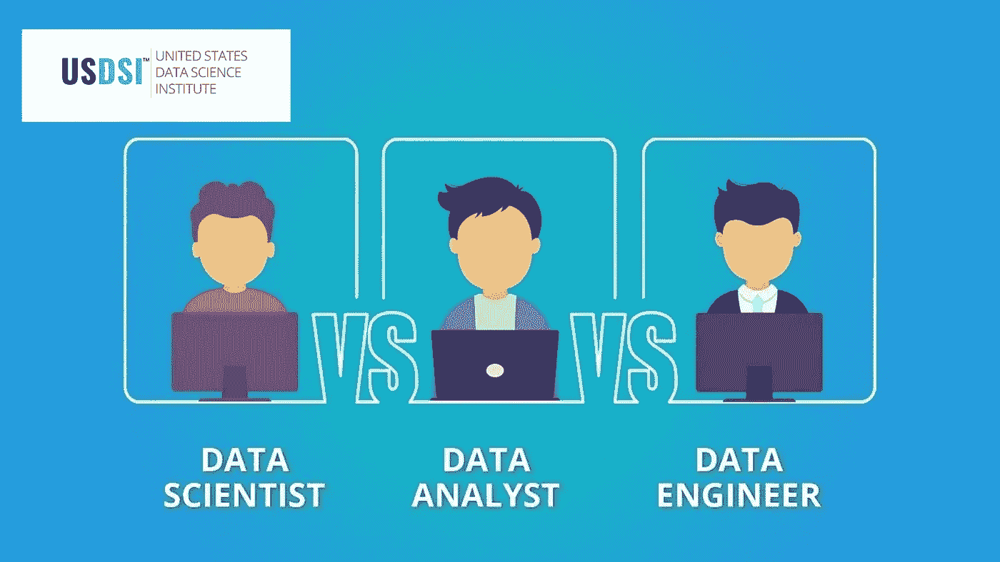
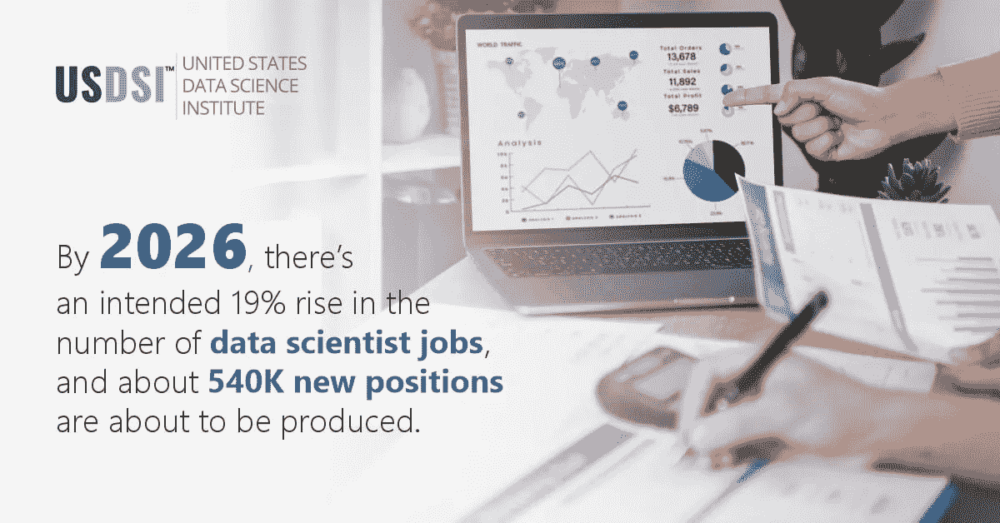
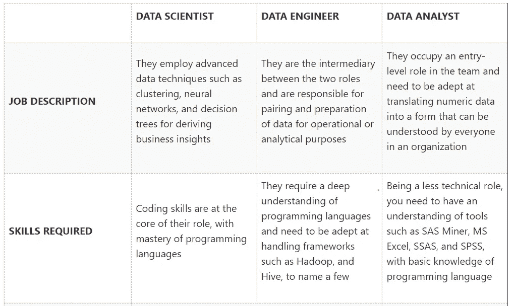
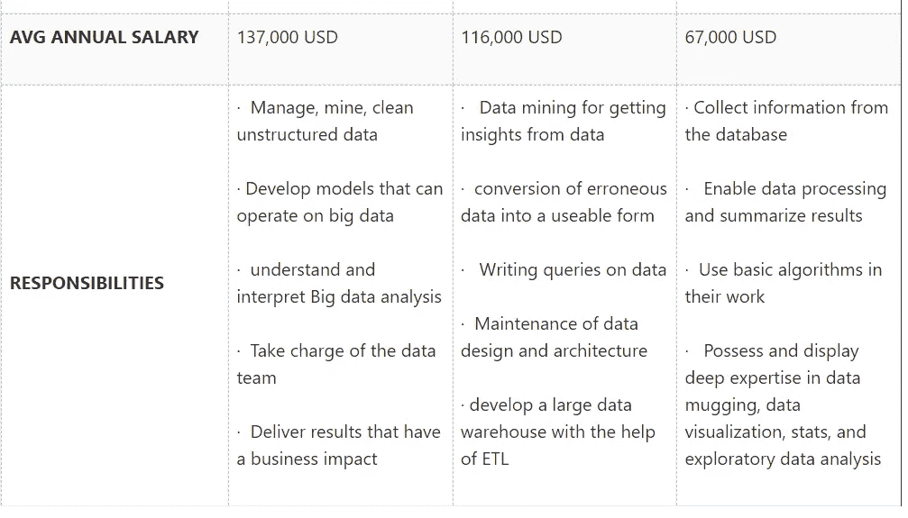
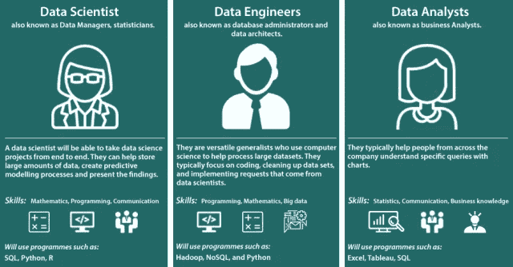

# 数据分析师 Vs 数据科学家 Vs 数据工程师:有什么区别？

> 原文：<https://medium.com/codex/data-analyst-vs-data-scientist-vs-data-engineer-what-is-the-difference-68528f93e7b0?source=collection_archive---------4----------------------->

> 作为数据科学家，我们的工作是从噪音中提取信号
> 
> *丹尼尔·通克朗*

C 数据科学领域的研究人员最近引起了不小的轰动，这并非空穴来风。数据科学已经从仅仅是分析和统计发展到推动世界的决策、预测和行动。 [**数据科学专业人士**](https://www.usdsi.org/data-science-certifications) 不再仅限于信息技术行业。从零售到金融，从供应链到娱乐，从运输到政府，**认证数据科学家**使用数据并继续解决现实世界的问题。全球越来越需要数据专业人员来帮助驾驭由大数据主导的颠覆性市场。

如今，数据推动着业务决策。在疫情期间，大多数业务转移到跨业务的数字平台，这刺激了电子商务和数据量。小型和大型企业都需要处理所有这些数据，找到高效的数据收集策略，并组织和分析数据以规划未来的突发事件。随着数据的大量增长，一些与数据相关的工作角色和机会在全球范围内脱颖而出。随着这一巨大需求而来的是当今世界面临的人才短缺。这种懈怠背后的主要原因是缺乏对各种数据角色所需技能的清晰认识。公司寻找专业化的技能组合，而不是多面手。

如果您需要在数据科学职业生涯中有一个突破性的开端，请避免成为多面手。业内比较出名的三个最受欢迎的角色是- ***数据科学家、数据工程师、数据分析师*** 。这里提到的角色是可以互换的，这是一个常见的误解。让我们根据不同的参数来探索这些关键的数据科学工作角色，以帮助您为自己的职业生涯铺平更清晰的道路。

毫无疑问，需要各种有学问的数据科学专业人士来帮助企业理解他们的数据。 [***数据科学家***](https://www.usdsi.org/data-science-certifications/certified-senior-data-scientist) 在脸书、花旗银行、英特尔、亚马逊等公司非常吃香。作为一名 ***数据分析师*** ，你可以在印孚瑟斯、甲骨文、沃尔玛等公司获得一个初级职位。一名 ***数据工程师*** 可以从谷歌、苹果、Cognizant、微软等大公司雇佣。

众所周知，在当今的商业环境中，数据是必需品，如果利用得当，它可以迅速成为竞争优势。越来越多的公司正在雇用数据科学专业人员，以最大限度地提高业务收入、预测销售和降低成本。Web 和移动应用程序、物联网(IoT)和人工智能技术的进步已经实现了如此简单的大数据解决方案，甚至中小型公司也能够从中受益。它显然有助于客户细分、销售预测、消费者忠诚度预测、更好的推荐系统和情感分析。

用来自***USDSI******、斯坦福大学、麻省理工学院、哈佛大学或类似在线课程*** 的 [**最佳数据科学认证** **来武装自己，是一个让前方的数据科学之路变得轻松的好方法。如今，数据科学是一个非常受欢迎的科学领域，围绕该领域有很多炒作。也有其他数据科学职业发展迅速，在薪资和需求方面同样有前途。无论你选择哪条**数据科学职业**道路，数据角色都非常有利可图，并且只会从未来人工智能和人工智能等新兴技术的影响中获益。因此，不要满足于一个多面手的角色，你可以是成功的数据科学家、数据工程师或数据分析师。是时候为未来的数据科学工作挑选最佳角色了！**](https://www.usdsi.org/data-science-certifications)