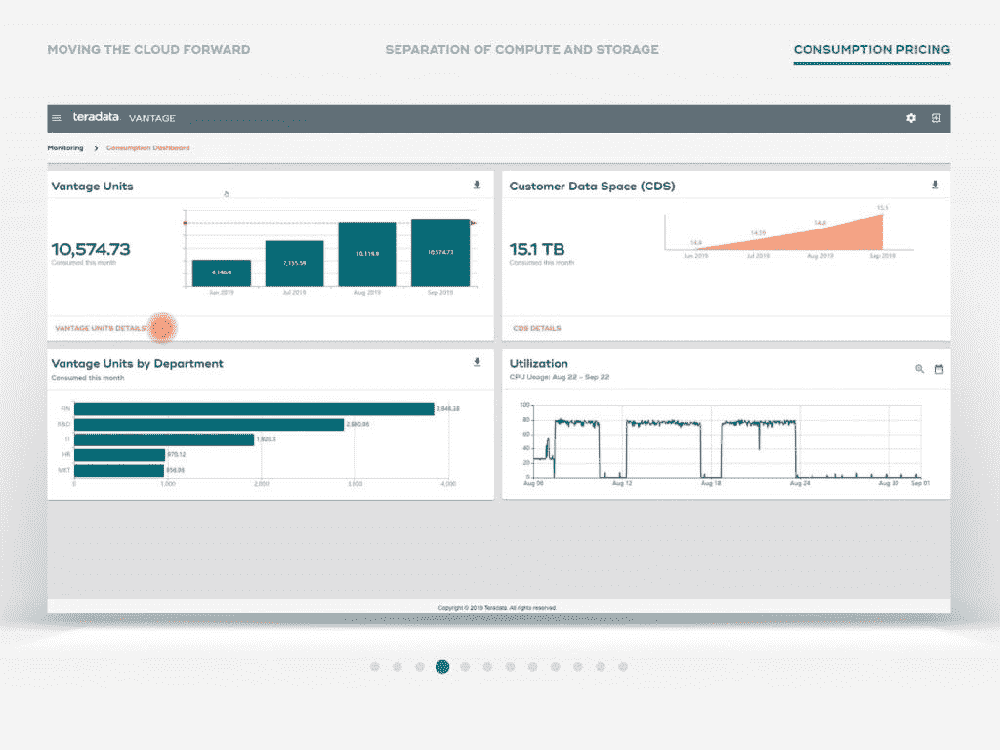

# 银行和金融中的数据分析和 ML

> 原文：<https://medium.com/codex/data-analytics-ml-in-banking-finance-6832255d55a5?source=collection_archive---------10----------------------->

## [法典](http://medium.com/codex)

来源:[https://elearningindustry . com/4-移动-学习-福利-银行-金融-服务-行业](https://elearningindustry.com/4-mobile-learning-benefits-banking-financial-services-industry)

> 一辆**美国运通？**一家金融服务提供商面临着留住客户的挑战。管理客户流失对他们来说至关重要。因此，在 2017 年，他们使用机器学习进行了预测分析实验，并开发了一个潜在客户流失的预测模型。据信，**模型确定了 24%的澳大利亚账户将在未来四个月内关闭！**

在数据驱动的世界中，银行和金融服务领域的数据分析和机器学习有可能发挥至关重要的作用。由于这些以前的机构可以访问庞大而多样的客户数据集，集成数据分析变得非常方便。

数据分析的一个非常简单的用例是，分析特定收入群体客户的购买趋势，并根据他们的购买力和支付方式为他们提供促销优惠和折扣

嗯，这就是旅程开始的地方！
如果客户选择促销优惠，可以对客户的回应交易进行跟进分析&这可以提升到了解客户购买行为的微观层面！

让我们研究银行和金融领域中“数据分析和机器学习”的几个具体用例。

## 欺诈检测和网络安全:

来源:[https://www.teradata.com/Resources/Demos/Cloud](https://www.teradata.com/Resources/Demos/Cloud)

**根据 AI Opportunity Landscape Research 的数据，在银行业为 AI 筹集的风险资金中，约有 26%用于欺诈&网络安全应用。**欺诈可以是任何形式的- >支付欺诈、贷款欺诈和客户入职欺诈
Teradata 是一家人工智能公司，为银行提供欺诈检测解决方案。

该公司声称，其机器学习平台可以增强欺诈检测的能力，这反过来有助于数据分析软件识别潜在的欺诈案件
Teradata 帮助 **Danske Bank** 进行欺诈检测。

**该平台帮助欺诈检测的误报率降低了 60%&,真正的欺诈检测率提高了近 50%!**

## 信用风险建模:

来源:[https://www . dexlabanalytics . com/blog/credit-risk-modeling-a-comprehensive-guide](https://www.dexlabanalytics.com/blog/credit-risk-modeling-a-comprehensive-guide)

信用风险建模允许银行预测贷款的偿还，以及根据历史数据和信用报告预测违约者。计算每个案例的信用风险值&各个部门只根据这个值批准贷款

## **HDFC——按市值计算，印度最大的私人银行使用信用风险模型，以尽可能低的风险获得最佳回报。为了创建风险模型，HDFC 使用微软 SQL Server 2017 机器学习服务为贷款申请建立记分卡。**

## 个性化营销:

来源:[https://www . persado . com/press-releases/jp Morgan-chase-announced-与 persado 进行为期五年的交易，以获得人工智能驱动的营销能力/](https://www.persado.com/press-releases/jpmorgan-chase-announces-five-year-deal-with-persado-for-ai-powered-marketing-capabilities/)

完美的营销成功是做出符合客户需求和偏好的报价。数据分析和机器学习帮助我们在正确的时间通过正确的设备将正确的产品交付给正确的人。

**2019 年，金融服务巨头摩根大通宣布与 Persado 达成为期 5 年的企业协议。**在成功的试点项目后，使用人工智能产生最高绩效营销创意的领导者。**在试点项目中，Persado 广告的点击率提高了 450%。**
珀萨多使用机器学习的技术&改写了营销人员使用主观判断和经验可能不会有的文案和标题。这些广告被证明是对个人客户和客户群最有吸引力的信息。

这些只是一小部分应用程序，在不久的将来还会有更多的应用程序出现！一个非常近的未来，最多 5 年！

> "我们的目标是将数据转化为信息，将信息转化为洞察力."——惠普前首席执行官卡莉·菲奥莉娜