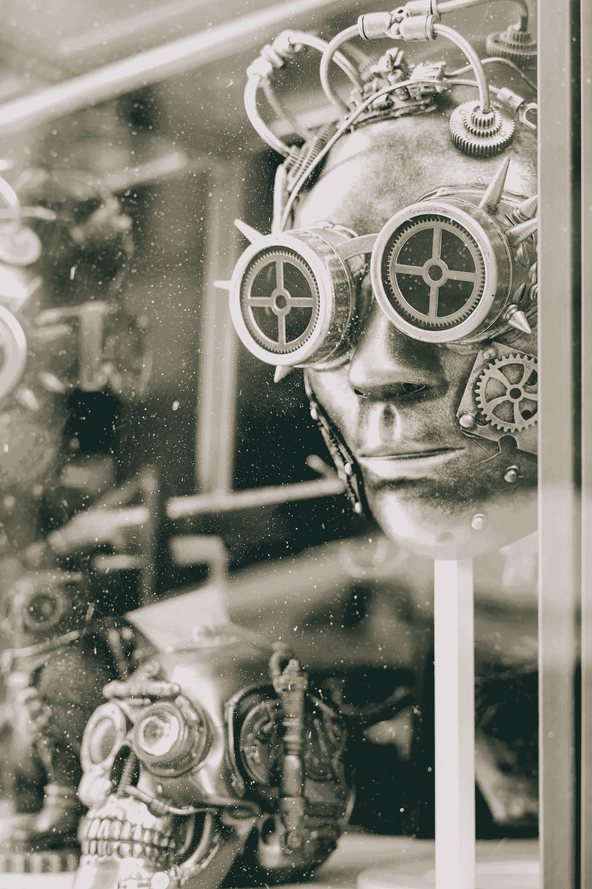

# 数据和人工智能:21 世纪新的无所不能的神。

> 原文：<https://medium.com/codex/data-and-ai-the-new-all-conquering-gods-of-the-twenty-first-century-ad6076ab198e?source=collection_archive---------7----------------------->

它是无所不能的，无所不知的，它对我们生活的影响比其他任何东西都大。但是它是一种好的还是坏的力量呢？

Gabriella Claire Marino via Unsplash

我们生活在算法和数据的世界里。在这个世界上，从金融到医学的一切都高度依赖于算法产生的分析，以至于我们开始相信这种判断…