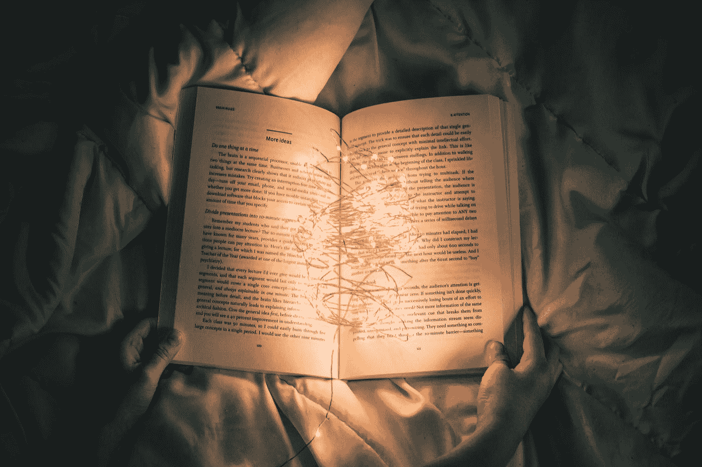

# 数据和讲故事:原始与现代

> 原文：<https://medium.com/codex/data-and-story-telling-primitive-vs-modern-274b25e4c35b?source=collection_archive---------14----------------------->

[农旺](https://unsplash.com/@californong?utm_source=medium&utm_medium=referral)在 [Unsplash](https://unsplash.com?utm_source=medium&utm_medium=referral) 上的照片

人类在很多方面都比其他动物强。人类学家、心理学家和其他社会科学家可以从他们的研究中告诉你，我们作为普通人可以从我们的观察中告诉你。我们拥有的一个很棒的东西是讲故事的能力。像所有其他特征一样，这肯定会进化，但我总是着迷于它会有多重要…