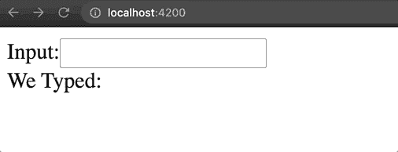
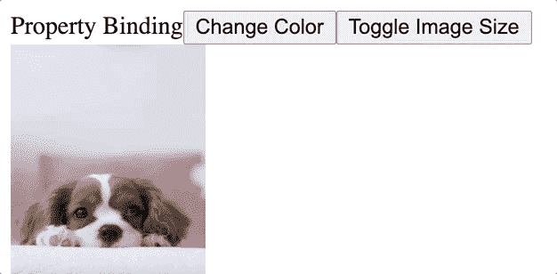

# 角度数据绑定

> 原文：<https://medium.com/codex/data-binding-in-angular-ecb206deb7d0?source=collection_archive---------1----------------------->

Angular 中的数据绑定是保持视图与应用程序状态一致的一种方式。您可以将模板中的属性和事件绑定到 TypeScript 组件，以便在输入数据、单击按钮或触发任何其他事件时更新视图。在下面的示例中，数据绑定用于允许 TypeScript 组件跟踪输入文本，并在视图中实时显示它。

数据绑定的一个例子

在 Angular 中，有许多方法可以绑定数据，但是我们将重点关注属性绑定、类绑定、事件绑定和双向绑定。在这篇博客中，我们将回顾一系列的例子来展示我们使用数据绑定的方法。您可以在这里导航到 GitHub 库查看完整代码[。](https://github.com/AidanMcB/data-binding-blog)

# 属性绑定

您可以使用带有属性绑定的 TypeScript 组件的属性为 HTML 元素的指令设置值。使用属性使您可以在组件中有条件地更改动态值。属性绑定可以通过元素属性、组件属性或指令属性来完成。下面是一个元素属性绑定的例子。

img 标记的 src 属性绑定到组件的“puppyImagePath”属性

image 标记的 src 属性设置为组件中定义的属性:

此处的图像使用“资产”文件夹的本地路径

除了 src 属性，您可以看到我们使用样式绑定来定义图像的宽度和高度(以像素为单位)。将这些属性设置为组件属性的主要优点是能够随意操作这些值。

# 类绑定

我们可以用类绑定来修改 html 元素的类名。最基本的例子是使用['class.className']将一个 CSS 类绑定到一个元素，并将其赋给一个布尔值，以确定是否应该应用该类。例如，我们可以添加以下代码来将“isRed”类绑定到文本。

请注意[class.className]语法

当组件中的布尔值“labelIsRed”为真时，该类将被视为“isRed”。通过添加一个 CSS 规则来将文本设置为红色，并在组件中添加一个开关来更改“isRed”的值以切换 true 和 false，我们可以创建以下效果。

toggle 方法绑定到更改颜色按钮上的 Click 事件

还可以通过绑定一个类名字符串、一个以类名键和布尔表达式为值的对象或一个类名数组，将多个类绑定到一个元素。以下是绑定多个类的每种方法的示例:

在模板中，使用这些属性作为您的类，如下所示:

# 事件绑定

事件绑定允许您的组件对用户操作(如按钮单击、击键或任何其他事件)做出反应。我们可以添加前面的组件 a 函数来切换高度和宽度属性，并将其添加到模板中的按钮 click。通过使用(click)=“my function”语法，Angular 会将按钮的点击绑定到我们绑定的函数。模板中的代码如下所示:

(click)事件被绑定到组件

我们可以将此函数添加到 TypeScript 组件中:

定义单击按钮时调用的函数

此示例中的(单击)是目标事件或模板事件名称，而“toggleImageSize()”函数调用是模板语句。Click 可能是您需要绑定的最常用的事件，但是这种事件绑定适用于任何形式的事件，甚至是自定义事件。

# *双向绑定*

Angular 中的双向绑定提供了一种在组件之间共享数据的方式，以监听事件和更新值。我们可以使用 EventEmitter 来执行组件中的自定义事件，并将事件发送到父组件。首先，该指令创建一个向属性公开的 EventEmitter，然后调用“emit(exampleData)”函数，向其传递某种类型的数据，并且父指令侦听$event 对象。

为了形象化，我们可以看一个通过组件的父组件删除一个组件实例的例子。假设我们有一个待办事项列表，每个列表由一个子组件表示。它们被呈现在父组件中，并被传递代表每件要做的事情的字符串。它们还被传递了一个允许删除该项的函数。但是，待办事项本身并不执行删除操作，而是向执行逻辑的父组件发出“删除”事件。

父 HTML 组件模板将如下所示:

注意,[todoItem]是如何将每个项目传递给子组件的每个实例的

子 TS 组件将在单击按钮时调用一个函数，并发出事件。这将发送回父组件，父组件将执行删除待办事项的逻辑。下面是子 TS 组件:

@Input()允许组件从其父组件获取输入

# 在使用中

习惯这些概念的最简单方法是在您的应用程序中实践它们。考虑构建一个新的应用程序，或者使用 Angular 重新构建一个现有的应用程序，并使用数据绑定来管理组件的状态。您可以参考下面链接的资源，以及包含这些组件的 GitHub repo。如果您有任何问题或疑虑，请随时留下您的评论。编码快乐！

资源:

 [## 有角的

### Angular 是一个构建移动和桌面 web 应用程序的平台。加入数百万开发者的社区…

angular.io](https://angular.io/guide/binding-syntax) 

[https://github.com/AidanMcB/data-binding-blog](https://github.com/AidanMcB/data-binding-blog)