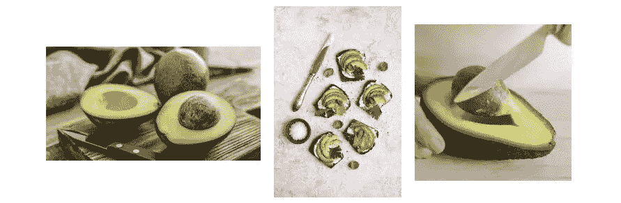

# 数据，数据，数据。

> 原文：<https://medium.com/codex/data-data-data-32376be378b0?source=collection_archive---------6----------------------->

## 机器学习不是魔法。

一个人(97%)和一个网球拍(60%)😂。这个物体识别模型是不是把彩虹衫的条纹识别成网球拍线了？这可能是神经网络的**纹理偏向**的一个例子。这篇[论文](https://arxiv.org/abs/1811.12231)正在研究通过引入**形状偏差**来修正这一点。(照片认证:我穿着[最好待在一起](https://www.betterstaytogether.com/) ♥️)

# 思想的转变

在我机器学习经历的早期阶段，我的问题解决哲学是专注于建模。由于我进入机器学习是从深度学习开始的，来自最先进的研究论文的复杂神经网络架构显示出了非凡的结果。穿越时间；然而，随着我作为一名人工智能初创公司的员工和一名 ML 硕士学生在现实世界中工作，我开始将注意力转移到机器学习管道中的一个不同组件:**数据**。​

人类“学习”的东西来自他们的生活经历。我们很大程度上是由我们所处的环境、我们看到的事物、我们遇到的人和我们进行的对话塑造的。同样的事情也适用于机器学习模型。输入要素和标注的类型和质量在很大程度上决定了模型的性能。因此，在优化模型性能时，我会问自己一些重要的问题:

*   数据是如何分布的？
*   我如何扩充数据，使模型变得更加稳健？
*   一些特征不是信息性的，而只是造成噪音吗？
*   如何提取最佳特征？
*   最能提供信息的特征的数量是多少？
*   我如何制定标签，以便模型可以最有效地学习？
*   对于给定的特征和标签，我应该使用什么类型的损失进行优化？

# 迭代过程

反复问这样的问题**也很重要**。在机器学习管道中，我们制定特征和标签，将它们放入模型，优化权重，并检查模型性能。在观察结果的同时，我们可以开始提问。模型对哪些方面最困惑？减少输入要素的数量会减少数据中的噪声吗？输入数据中的某些特征是我在造成模型性能恶化之前没有注意到的吗？

这里有一个有趣的例子，说明转向数据如何拯救了我的生命。在我使用 CNN 的图像识别项目中，我看到一个特定类别的分类精度很差:*刀*。在意识到数据的重要性之前，我会简单地认为模型容量不够大，也许会将模型放大两倍。但这一次，我使用 [t-SNE 图](/@lucrece.shin/chapter-4-using-t-sne-plots-as-human-ai-translator-c5ef9c2f2fa4)检查了输入图像特征编码的分布(=最终卷积层的输出)。这些图表明，*刀*类图像的编码实际上与另一类、*鳄梨有一些**重叠分布🥑***，从而导致**次优决策边界**。当我查看*鳄梨*类的训练图像时，我确实发现了一些包含一把刀的图像。我忽略了一个事实，那就是这两个班级可以一起出现在厨房里。为了解决这个问题，我用以下方法调整了我的数据:

*   从鳄梨图像中裁剪出刀部分
*   收集更多不同类型刀具的图像

包含另一个类对象“刀”的“鳄梨”类的图像示例

# 作为函数的机器学习模型

我越关注数据而不是模型，机器学习模型的“[黑盒](https://www.quora.com/Why-do-many-research-studies-claim-that-deep-learning-is-a-black-box)”开始变得越来越透明。机器学习模型是一个“函数”。应该和 11 年级数学课 y = f(x)最基本的函数形式差不了太多。只是 x 和/或 y 可能是高维的，可能会导致更复杂的关系。我也不能用一个简单的 y = ax + b 函数来求解一张纸上的重量(如果你喜欢的话，可以用斜率)。可能有几百个砝码，如果不是几百万的话。所以我让电脑计算出最佳重量。但是这些权重只是我告诉它去做的数字输出。它试图将我给定的数据(x)映射到一种特殊形式的标签(y)，这也是我给定的。我负责布置环境和道具。计算机只是计算硬件。​

# 好奇心是关键

任何人都可以下载开源数据集，并使用开源库训练模型。但是真正的好奇心**是提出为什么模型会这样做的问题，并分析数据以找到答案**是理解机器如何“学习”的关键。我学会了不去想当然地看待模型的任何特殊结果，或者对模型的行为失去控制。失败的模型不是真正的失败，而是最终优化模型的垫脚石。我新的机器学习理念，通过反复试验积累了多年的个人经验，就是*迭代分析和优化数据*。

感谢阅读！♥️

-☾₊˚.