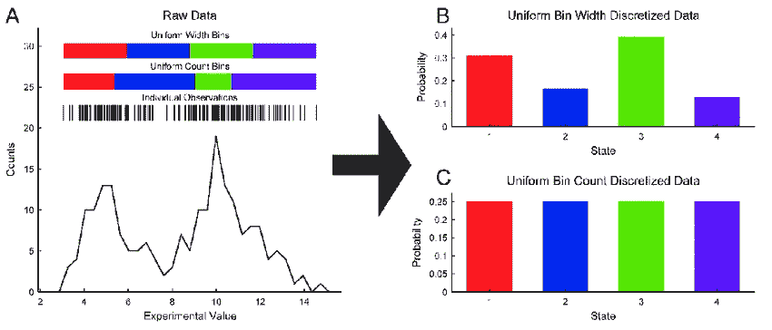
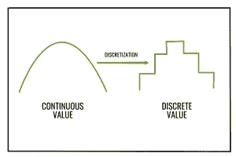

# 数据离散化

> 原文：<https://medium.com/codex/data-discretization-b5faa2b77f06?source=collection_archive---------6----------------------->

图片来自[谷歌](https://www.researchgate.net/figure/Example-data-discretization-A-200-example-data-points-were-randomly_fig1_326073432)

# **什么事？**

根据[维基百科](https://en.wikipedia.org/wiki/Discretization)，**离散化**是将连续函数、模型、变量和方程转换成离散副本的过程。这一过程通常作为第一步进行，以使它们适合于在数字计算机上进行数值计算和实施。

*数据离散化定义为将连续的数据属性值转换为有限的一组区间，并以最小的信息损失，将每个区间与一些特定的数据值或概念标签相关联的过程。*

图片来自[谷歌](https://www.google.com/search?q=types+of+data+discretization&tbm=isch&ved=2ahUKEwi-kpuu95j3AhUwzaACHTOyDb8Q2-cCegQIABAA&oq=types+of+data+discretization&gs_lcp=CgNpbWcQAzIECAAQGDoHCCMQ7wMQJ1C8CFiUEGC8EmgAcAB4AIAB5gGIAcMGkgEFMC41LjGYAQCgAQGqAQtnd3Mtd2l6LWltZ8ABAQ&sclient=img&ei=VOVaYr6YB7Cag8UPs-S2-As&bih=714&biw=1536#imgrc=lqEDE2RrnNNsCM)

# **为什么需要？**

1.  提高发现知识的质量。
2.  数据易于维护。
3.  许多只能处理离散属性的数据挖掘算法需要使用离散化数据。
4.  减少各种数据挖掘任务(如关联规则发现、分类和预测)的运行时间。
5.  为进一步分析准备数据，例如分类。
6.  离散化被认为是一种数据缩减机制，因为它将数据从大量数值缩减为分类值的子集。

# **离散化的步骤**

**第一步:**对待
离散化特征的连续值进行排序。

**步骤 2:** 评估分割的切割点或合并的相邻
区间。

**第三步:**根据一些定义的标准拆分或合并连续值的区间
。

**第四步:**在某一点停止。

# **数据离散化的典型方法**

*   扔掉
*   直方图分析
*   聚类分析
*   决策树分析
*   相关分析

# **宁滨**

*   宁滨是一种基于指定数量的箱的自上而下的分裂技术。
*   宁滨是一种无监督的离散化技术。
*   这种离散化的主要挑战是选择间隔或仓的数量以及如何决定它们的宽度。
*   宁滨方法通过参考它的“邻域”(即它周围的值)来平滑已排序的数据值。排序后的值被分配到几个“桶”或箱中。因为宁滨方法会查询值的邻域，所以它们会执行局部平滑。
*   属性值可通过应用等宽或等频宁滨离散化，然后用条柱平均值或中值替换每个条柱值，分别如按条柱平均值平滑或按条柱中值平滑。

# 直方图分析

*   直方图分析是一种无监督的离散化技术，因为它不使用类信息。
*   直方图将属性 A 的值划分为不相交的范围，称为桶或箱。
*   如果每个存储桶仅代表一个属性-值/频率对，则这些存储桶称为单个存储桶。单一存储桶对于存储高频异常值非常有用。
*   直方图在逼近稀疏数据、密集数据以及高度倾斜和均匀数据时非常有效。
*   前面针对单个属性描述的直方图可以扩展到多个属性。多维直方图可以捕捉属性之间的依赖关系。已经发现这些直方图在逼近具有多达五个属性的数据方面是有效的。
*   直方图有两种类型:等宽(或距离)和等频(或等深)。
*   在**等宽直方图**中，每个桶范围的宽度是一致的。它将范围划分为 N 个大小相等的区间。如果 A 和 B 是该属性的最低值和最高值，则区间宽度将为:W =(B–A)/N，区间边界为:A+w，A+2w，…，A+(k-1)w。
*   在**等频率直方图**中，创建桶，使得每个桶的频率大致恒定(即，每个桶包含大致相同数量的连续数据样本)。它将范围分为 N 个区间，每个区间包含大约相同数量的样本。这有利于数据缩放，但管理分类属性可能会很棘手。

# 聚类分析

*   聚类分析是一种流行的数据离散化方法。
*   通过基于相似性将 A 的值划分成聚类或组，可以应用聚类算法来离散化数值属性 A，并且仅存储聚类表示(例如，质心和直径)。
*   它将数据集划分成簇。
*   有许多聚类定义和聚类算法可供选择。例如:K-Means 和 K-Medoid 算法。
*   聚类的性质:(I)一个聚类中的所有数据点应该彼此相似。(二)不同类别的数据点应尽可能不同。
*   聚类的评价指标包括 Interia 和 Dunn 指数。

# 相关分析

*   这是一种有监督的离散化方法，即使用类别信息。
*   它使用自底向上的合并，即找到最佳相邻区间(具有相似类别分布的区间，即低χ2 值)进行合并。
*   它也被称为 Chi 合并算法。
*   通过寻找具有相似类别分布的最佳相邻区间并合并它们，直到预定义的停止条件，递归地执行该算法。
*   步骤包括:(I)数值属性 A 的每个不同值被认为是一个区间。对每对相邻区间进行卡方检验。(ii)具有最小χ2 值的相邻区间被合并，因为一对区间的低χ2 值表示相似的类别分布。(iii)该合并过程递归地进行，直到满足预定的停止标准。

***感谢阅读！***