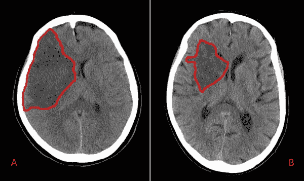
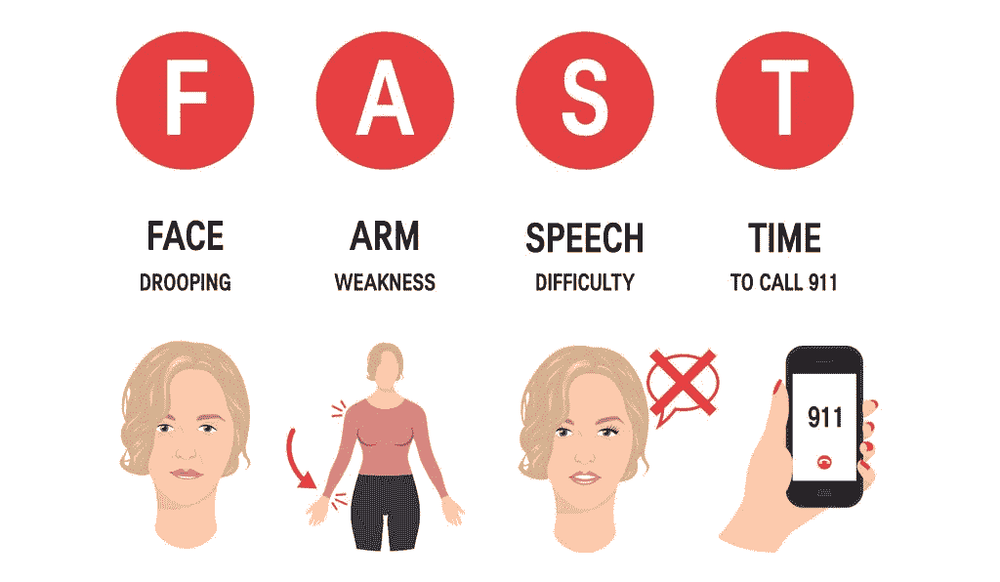
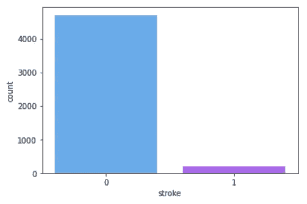
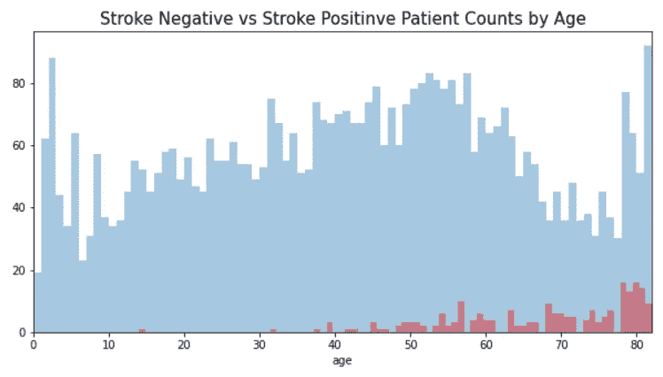
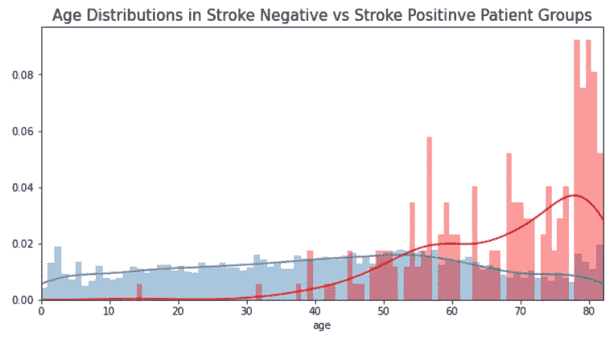
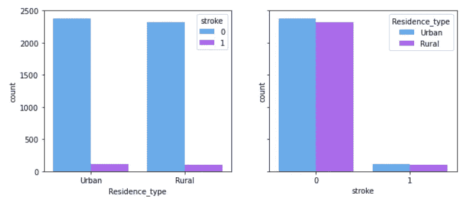
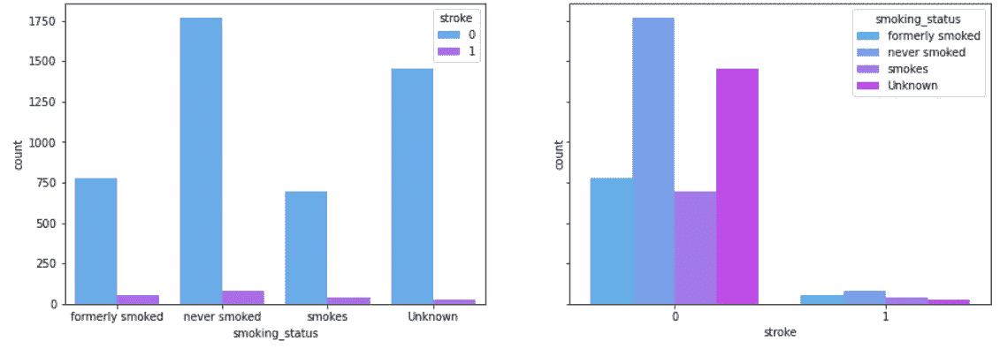

# 基于数据的中风病因神话分析

> 原文：<https://medium.com/codex/data-driven-analysis-of-mythes-about-stroke-causes-dd347899bba5?source=collection_archive---------7----------------------->

## 一种基于数据的方法，使用 2021 年的中风预测数据。



两位中风患者脑部 CT 扫描的中风区域。(图片来自[https://bit.ly/3bnKGbP](https://bit.ly/3bnKGbP))

中风是一种严重威胁生命的疾病，当大脑某个区域的血液供应被切断时就会发生。当脑组织的血液供应受到限制或中断时，细胞就无法获得氧气和营养。脑细胞在几分钟内开始死亡，这损害了大脑的功能。

中风是一种急症。早期干预减少了组织损伤，患者受到的影响较小。

在开始数据分析之前，作为一名医生，我想先说一下中风的症状。因为中风的并发症可以通过早期干预大规模减少，提高认识可以改变你周围许多人的生活。



中风的症状

# 关于中风的假设:

关于中风有几个误区。我们将测试其中一些的有效性:

1.  *“中风只是老年人的问题吗？”*
2.  *“生活在城市的人中风风险高？”*
3.  *“吸烟者更容易中风？”*

我们将使用@ [fedesoriano](https://www.kaggle.com/fedesoriano) 提供的“中风预测数据集”。您可以通过以下链接到达:[中风预测数据集| Kaggle](https://www.kaggle.com/fedesoriano/stroke-prediction-dataset)

数据包含 12 个属性的 5110 个观察值。

特征是 ID、性别、年龄、高血压、心脏病、是否结过婚、工作类型、居住类型、平均葡萄糖水平、身体质量指数、吸烟状况、中风。

首先，分析数据帧中的空值:

```
id                     0
gender                 0
age                    0
hypertension           0
heart_disease          0
ever_married           0
work_type              0
Residence_type         0
avg_glucose_level      0
bmi                  201
smoking_status         0
stroke                 0
```

在身体质量指数列中，我们只有 201 个空值。这在所有值中并不是一个巨大的百分比，所以我更愿意把它们全部删除。

# 第一部分:*“年龄对中风有直接影响吗？”*


关于中风的一个普遍看法是，老年人更容易面临中风的问题。真的是这样吗？

在我们的数据集中，有和没有中风的患者人数如下:



这两组的比值分别为 0.04、0.96。



根据上面的图，我们在卒中阴性组中有平衡的年龄分布。但是中风阳性患者排在左边。让我们看看各组的年龄比例分布:



我们可以说，在各个年龄段的中风比率中，老年人更容易患中风。但即使是青少年也可能中风。因此，年龄对中风有直接影响，但年轻并不意味着你不会中风。

# 第二部分:“生活在城市的人中风风险高？”


大多数人认为城市生活会带来压力、不良饮食习惯和睡眠问题。由于这个原因，人们普遍认为城市里各种疾病都很常见。中风就是这些疾病之一。

让我们来看看城市和农村生活的数据:



第一个图显示，在两种定位类型中，中风和非中风患者的数量和比率非常相似。

第二个情节也支持这一点。

住在城市不会增加中风的风险，但并不意味着不会增加其他问题的风险:)

# 第三部分:“吸烟者*更易中风？*

在受吸烟影响的系统中，血管系统首当其冲。大多数人认为吸烟会增加中风的风险。吸烟和中风真的有正相关吗？



在非中风患者组中；最常见的吸烟状态是从不吸烟，其次是以前吸烟和吸烟者。这是一个预期的结果。但是吸烟者的情况完全不像预期的那样。

根据吸烟者的数据，中风组中最常见的模式是非吸烟者。奇怪却真实。这可能是由于影响中风的其他因素和有偏见的评估。

# 结论:

在这篇文章中，我们根据 Kaggle 的 2021 年中风预测数据，研究了中风预测因素。

1.  我们分析了“*中风只是老年人的问题*”神话的数据，这表明**虽然中风在老年患者中很常见，但也见于年轻患者。**
2.  我们接着看了一下*“生活在城市里的人是中风的高危人群”的神话。数据显示两组之间没有显著差异。*
3.  最后，我们看了“吸烟者更容易中风”的文章。令人惊讶的是，我们发现**非吸烟人群更容易患中风**。由于其他因素，这可能是一个有偏见的评估。

在这项研究中，我们分析了中风的原因，并对大多数人误解的三个项目提出了质疑。我们的分析可能有偏差，因为我们有 5000 名患者的数据。真正的问题仍然是:

> 为了避免中风，你应该做哪些生活改变？

要了解更多关于这一分析的信息，请点击这里查看我的 GitHub repo 可用链接[。](https://github.com/sahikabetul/Stroke-Prediction)