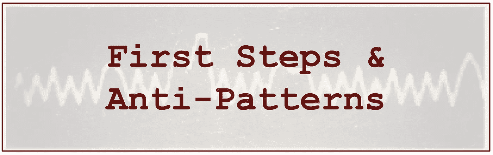
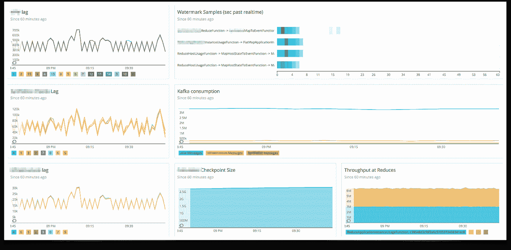
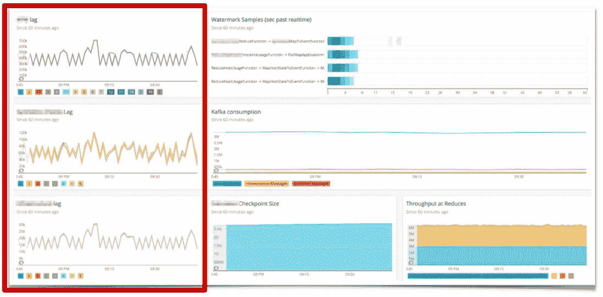
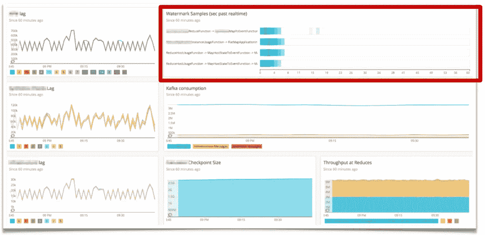
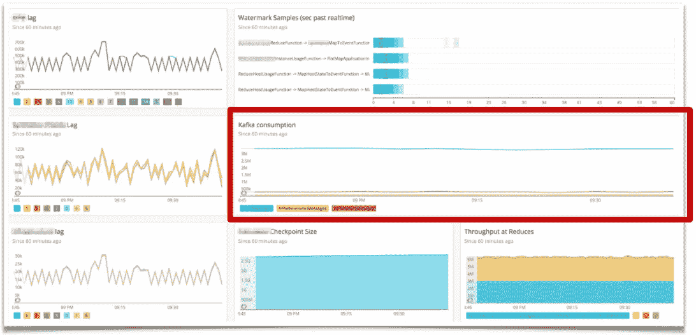
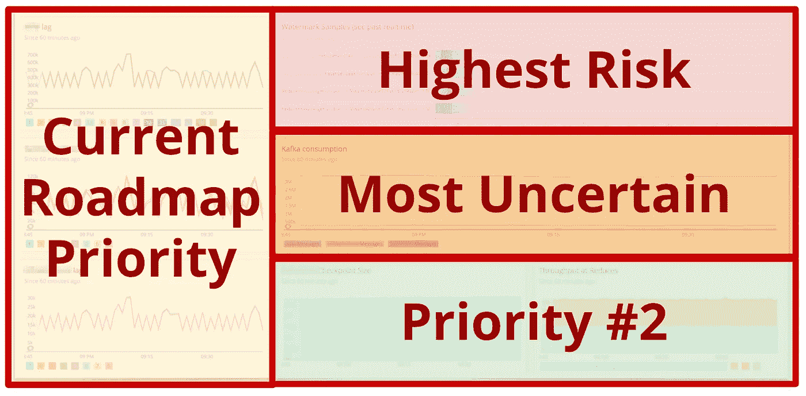

# 面向流处理的数据驱动开发

> 原文：<https://medium.com/codex/data-driven-development-for-stream-processing-36b8d5d9e8ec?source=collection_archive---------3----------------------->

## 第 2 部分，共 4 部分:反模式和“度量驱动的度量”循环

*注意:这是系列文章的第二篇——查看* [*第一部分:简介*](/@caito/data-driven-development-for-stream-processing-e4aeb6eaf4a3) *了解更多上下文。*

这篇文章回顾了我开玩笑地(现在是认真的，因为它卡住了)称之为“度量驱动的度量周期”这本质上是一组围绕健康的可观察性周期在数据驱动的开发过程中所扮演的角色的最佳实践。

这篇文章将涵盖这些实践，使用每个组件的真实例子。这些例子使用了流处理(特别是 Apache Flink)，但是这些概念适用于任何构建或组合具有复杂集成点的系统的场景。

首先，使用流处理——尤其是当您真正充分利用它的优势时——意味着您可能会通过系统非常快速地推送大量数据，并进行复杂的数据转换。您可能会接收多个数据流，可能会将它们拆分或合并在一起。这当然是一个强大、灵活的流处理框架大放异彩的地方。

但是，这也意味着您现在有了一个复杂的附加物，您的技术生态系统的其余部分可能没有准备好处理它；无论是您的下游应用程序或接收器，还是拥有它们的团队。或者，可能是对共享资源(如存储或内部部署工具)的影响，这些资源并未针对如此强大或复杂的功能进行配置。也许重新配置它们在技术上并不复杂，但它可能需要其他受影响的团队的认可和协商，所有这些都会增加开发时间和复杂性。

我看到人们在构建复杂的流处理系统(尤其是需要集成到现有的非流环境中的系统)时最常犯的一个错误是像对待任何其他新的“传统”或批处理框架一样对待它。此外，任何在其集成点中涉及到这种复杂程度的事情，也需要其他团队甚至利益相关者之间更详细的沟通。

出于所有这些原因，以前可以松散地遵守或忽略的最佳实践可能突然需要更多的形式化，以避免常见的陷阱。

第一步:固化“仪表盘卫生”。有些人喜欢这种任务，但对于我们大多数人来说，当有所有主要的编程工作要做时，很难坐下来做这件事。因此，当我们开始组织仪表板时，很容易陷入某些反模式。

为了抵消这一点，我想以这个提醒开始:

> “你几乎可以测量任何东西，但你不可能关注所有东西”
> *——佚名*

我喜欢这句话，因为——我也讨厌它。

就我个人而言，这是我最常陷入的陷阱，因为我只想衡量所有的事情，所有的时间。

当然，想要大量关于系统的数据并没有什么错。但是，如果您想真正利用您的指标，一些良好的仪表板卫生成为一个必要的基线。

这就是为什么我很欣赏我的一个同事的观点，他说:

> “任何情况下，人们创建自己的仪表板，没有结构，很快就开始看起来像 747 的驾驶舱”

[https://www . Reddit . com/r/pics/comments/5v V8 Qt/the _ pilots _ seat _ and _ cockpit _ of _ a _ Boeing _ 747/](https://www.reddit.com/r/pics/comments/5vv8qt/the_pilots_seat_and_cockpit_of_a_boeing_747/)

我很欣赏这个特别的例子，因为它提供了一个很好的图像，说明这是一个什么样的反模式。

不幸的是，我很少和没有经历过这种情况的人交谈。对于像我这样经常陷入这种陷阱的人来说，这听起来很有说服力，但这真的不应该成为常态。

这让我们想到，如何为流处理(以及其他类型的复杂)系统组织一个真正“干净”的仪表板，而不必在前期或维护上花费大量精力？这就是“度量驱动的度量”循环的由来。

# 高级目标

包含应用程序或系统指标的仪表板应该始终:

1.  优先考虑有意义的数据
2.  易于迭代
3.  数据应该非常容易获取。

# 履行

仪表板**优先级**应反映:

1.  您团队的路线图
2.  您的应用程序的最高风险组件
3.  您的应用程序中最不确定的组件。

# 例子

下面的仪表板来自我之前公司的一个团队。这是该公司生产的第一个 Apache Flink 应用程序，也是那里的第一个流处理应用程序之一。此外，它还涉及到集成到一个大型且高度复杂的非流式技术生态系统中。

这个例子仍然具有很高的相关性，因为它确实清楚地包含了这些目标的实现。

# 反映路线图

这张截图是在开发过程的早期拍摄的。这个应用程序有多个输入数据流，每个数据流都来自一个独立的自治团队的应用程序。我们的应用程序通过一个 Kafka 主题来摄取这些内容。我们此时的路线图重点是确保每个流都被正确摄取，并有足够的警报和其他保护措施。

这是**“了解你的常态”**发挥作用的一个很好的例子。正如我在[上一篇文章中提到的，](/@caito/data-driven-development-for-stream-processing-e4aeb6eaf4a3)一旦你的度量足够有意义、可迭代和可访问，这就是下一步。这就是为什么您的仪表板对您的团队来说是如此清晰和熟悉，以至于异常对您的开发人员来说就像对您的警报系统一样显而易见。

我对这种练习的使用很大程度上要归功于我以前的一个[队友](http://nikdav.is/)。这位队友竭尽全力确保整个团队将这一点恰当地融入到我们的日常生活和个人习惯中。他将这个仪表板添加到我们团队空间的每个可用屏幕上，并确保我们在每个 sprint 计划期间都审查和迭代它。我提到这些例子是因为它们是灌输这些实践的如此直接和有效的方法。

由于对我们的度量标准的这种熟悉程度现在已经深深地扎根于团队中，一个“形状奇怪”的图表会很快激励我们做进一步的调查。在这个例子中，根据我们的警报(已经通过与上游团队和架构师的会议完全建立了)，一切看起来都很正常。然而，我们的卡夫卡滞后图表有一半呈现一种形状，另一半呈现另一种形状。这让我们对数据流进行了额外的测量。在查看输出的结构时，我们能够确定我们的一些上游团队聚集和转换他们的数据与我们预期的非常不同。

这就是我们的度量真正成为一个循环的地方:这个信息引导我们不断地调整我们的监控，以更好地反映我们继续调查所有差异时数据的行为。此外，这个特殊的度量影响了我们的路线图和设计:它使我们以一种更准确地基于整个系统本身的行为的方式完全重新定义了集成点的责任。

**注意**:这些实践可以捕捉到许多这种差异。然而，它们应该被用来作为一种补充，而不是作为正式模式的替代品，这些正式模式被很好地定义，定期测试，并且可以被整个过程中的团队访问。

# 最高风险

接下来，我们有最高的风险指标。在这个例子中，它是水印。通常，这不是一个特别高的风险因素。然而，这是这个团队在这个发展阶段。

此时，我们的水印配置实际上是基于关于我们全新传入数据的 *no* 信息。此外，由于水印的性质——对于事件时间操作者、后期记录处理等非常重要——在这个时候将它们放在最前面和中心位置对于我们能够构建一个强大而高效的流处理系统是不可或缺的。也就是说，在那个时刻它是重要的**，直到我们的团队可以确信它与我们的传入数据的正常和预期的行为充分协调。**

**仪表板的这一部分应该反映出*您*、*此时*的最高风险，知道这可能会随着您的流应用程序的开发而改变和发展。**

# 最不确定

正如我提到的，在这个例子中，我们刚刚开始从各种不相关的上游应用程序中加入许多不同的 Kafka 主题。因此，在这个时候，我们的卡夫卡消费有很多不确定性，是我们需要保持可见的东西，直到它的行为变得足够熟悉。这意味着卡夫卡消费将成为这个时间段仪表板上下一个最明显的面板。

# 摘要

在这个例子中，我们有一个仪表板，它反映了工程团队路线图上的当前优先级、当前团队的最高风险部分*、*以及这个开发阶段最不确定的元素。在此之后的任何事情都将是这些类别的重复，用于下一个优先级。

更重要的是，我们有一个仪表板，它的面板是有意义的、迭代的和可访问的。这个仪表板也是可观察性循环的一个活跃部分，也是路线图影响循环的一个活跃部分。

所有这些都旨在帮助避免采用新技术系统时固有的许多障碍，这些障碍会增加复杂性或额外的集成点。这些实践当然也有助于其他系统或应用程序，因为它们为任何想要创建更可持续和可靠的数据驱动开发过程的人提供了一个清单。

也就是说，这些实践仍然需要与其他健康的团队和团队间基线相结合，如可靠的架构计划、可访问的模式以及整个管道中组织良好的沟通渠道。还有一些额外的步骤来利用这里介绍的内容来简化非编程挑战，这将在下一篇博文中介绍。

# 在这个系列中

*   前— [**第一部分:简介+基础概念**](/@caito/data-driven-development-for-stream-processing-e4aeb6eaf4a3)
*   **第 3 部分:作为共享语言的指标**—2021 年 3 月 18 日发布
*   **第四部分:流处理的实际监控**—2021 年 4 月到达

# 相关会谈

*   [“甜蜜的溪流由这些组成:将度量驱动的开发应用于 Apache Flink”](https://www.youtube.com/watch?v=_PolaklvKtc&ab_channel=FlinkForward)| Flink Forward EU/Virtual | 10.19–22.2020
*   “甜蜜的溪流由这些组成:闪电版”| DDD EU | 02/05/2021[录制中]

# 找到我

推特:@ Caito _ 200 _ OK【http://caito-200-ok.com/ 网: