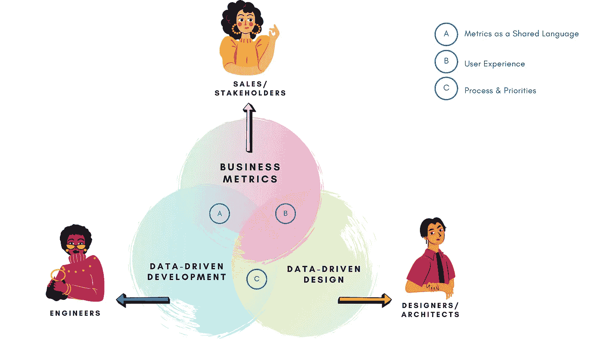
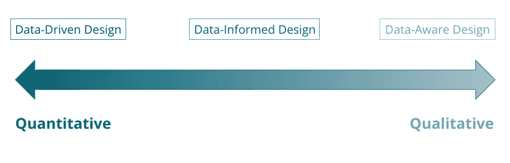

# 面向流处理的数据驱动开发

> 原文：<https://medium.com/codex/data-driven-development-for-stream-processing-e4aeb6eaf4a3?source=collection_archive---------6----------------------->

## 第 1 部分，共 4 部分:简介+基本概念

对我们大多数人来说，如果某件事是普通的常识，我们就不太可能在生活中用心去实现它。这可能是一个模糊的、我们试图采纳的个人健康习惯，比如多散步，也可能是我们软件开发过程中的某些最佳实践。

我们都知道，如果你的生活不太忙碌，开始散步会容易得多。你的生活变得越复杂，尤其是如果这种复杂性涉及到与他人的时间表相结合——日常生活就越需要正规化。就像当你到了需要开始在日历上划掉“行走”的时候，你的软件也是一样。你与其他人或团队的集成点越复杂，你的开发过程越结构化就越重要。

你现在可能会想“是的，这是非常明显的，那么你为什么要写一整个关于这个的博客系列呢？?"

…这让我们想到了…

这个系列是我在过去几年里收集的自己和他人的综合经验的结果。

**这种经验来自于我们与数据和度量驱动的开发的关系中的成功和有时令人捧腹的失败。**

这些帖子以及其中的例子都是围绕高级流处理应用程序展开的。然而，我将介绍的概念和最佳实践也适用于其他软件开发场景——无论它们也有高度复杂的集成点，还是简单得多。

所以，如果你想的话，这个系列适合你:

*   回顾一些用于流处理的最佳数据和度量驱动的开发策略，以及如何有效地利用它们。
*   使用这些策略来简化和自动化这类开发场景中的大量非编码开销。
*   如果你需要说服你的老板让你的团队实施这些实践，给他们一些量化的投资回报。

首先，数据和度量驱动的开发对不同的人来说可能意味着很多不同的事情，所以，我将从我将使用的一些基本概念和术语开始。接下来，我将讨论流处理的两个具体原则。

# 基本概念+术语

如果你搜索数据驱动开发，你会发现大多数关于**数据驱动*设计*** 和**业务指标的信息。**这两者之间有很大的重叠，因为本质上这里的主要焦点是使用数据来驱动客户实际想要购买和使用的产品的**设计**。

尽管如此，注意到差异是很重要的，因为这改变了你如何使用你的指标以及谁在内部使用你的指标。

*   **业务度量**是指任何与内部测量的成功相关的东西(比如团队速度、冲刺消耗、交付时间等)。但它们也可以包括外部信息，比如许多人所说的“虚荣指标”虚荣心指标通常是“我们的应用程序每天处理 300 万条消息”，通常用于新闻稿和博客帖子。
*   **数据驱动*设计*** 将*特别是*与最终用户体验联系起来。顾名思义，这里的重点是使用数据——通常是涉及使用模式和用户反馈的数据——以便更好地理解和设计*用户的需求。*
*   **数据驱动开发**通常与其中一个放在一起，或者作为一个总括术语使用。我**不**认为它作为一个总括术语仍然是合适的，但是我在本系列中的重点是它表示关于您的系统的可观察性数据，这些数据**用于改变开发过程或路线图。**

使用 [Canva](https://www.canva.com/) 设计

## 数据驱动、数据知情、数据感知

其次，有一组原则更直接地来自数据驱动设计，但是也适用于数据驱动开发，并且将在本系列的后面出现。

这是一个 3 层方法的想法，它定义了策略的**类型**，以及你使用的度量标准，以及它们如何指导你的产品。这些方法根据它们与定量或定性数据的关系进行分类。

*   **数据驱动** **设计**除了作为一个总括术语使用之外，这是一种纯粹以量化数据为中心的具体方法。这个过程适用于软件设计的各个方面，如性能改进。
*   **数据** - **知情** **设计**平等地权衡并利用定性和定量数据，通常一起做出设计决策。
*   **数据** - **感知** **设计**通常更关注直接的定性信息。然而，定量分析仍然经常被用作基础，或者与客户使用案例、详细反馈或基于讨论的风险/回报分析配合使用。这一类也经常被认为是考虑大局的一类，这就是为什么你会经常看到这个图[被描绘成一个圆](https://uxdesign.cc/becoming-a-data-aware-designer-1d7614ebc3ed)。

# 下一级原则

本系列的核心是三个数据驱动的原则。第一个是通用概念，我将在如何最好地利用这些用例的上下文中回顾它。另外两个原则是在更广泛的数据驱动开发/设计团队中存在的其他概念和想法的融合和重组。这些策略的一个大目标是利用它们作为可持续的、低强度的循环。

*   了解自己的常态:根据我的经验，这是一种投资回报率很高，但经常被忽视的做法。这本质上是保持您的度量有意义、可迭代和可访问的实践，以便异常对您的开发人员来说就像对您的警报系统一样清楚。
    *关于这个我不会有一整篇的帖子，但会是后面文章的一个重要方面。*
*   **度量驱动的度量周期**:我一开始把这个术语当成一个笑话，但是它被记住了，因为它确实是这个概念最准确的描述。这指的是持续使用关于你的应用程序行为的当前观察来改进**你如何**观察你的应用程序的实践。因此，在这些指标和您的开发优先级之间创建一个更可持续的关系。
*   **作为共享语言的度量标准**:这是指围绕您的度量标准周期建立一个特定的流程。该过程旨在利用这些模块化的、有意义的度量标准，帮助简化具有复杂集成点和依赖性的系统中固有的许多与人相关的挑战。

接下来的文章将通过真实世界的例子更深入地讨论“度量驱动的度量”周期和“作为共享语言的度量”。最后一篇文章将更深入地探讨这些例子。

# 本系列的下一篇

*   **第二部分:指标驱动的指标周期**—2021 年 3 月 11 日到来
*   **第 3 部分:作为共享语言的度量标准**—2021 年 3 月 18 日发布
*   **第四部分:流处理的实际监控**—2021 年 4 月到达

# **相关会谈**

*   ["Sweet Streams 由这些组成:将度量驱动的开发应用于 Apache Flink "](https://www.youtube.com/watch?v=_PolaklvKtc&ab_channel=FlinkForward)| Flink Forward EU/Virtual | 10.19–22.2020
*   “甜蜜的溪流由这些组成:闪电版”| DDD EU | 02/05/2021[录制中]

# 找到我

推特:@Caito_200_OK
网页:[http://caito-200-ok.com/](http://caito-200-ok.com/)