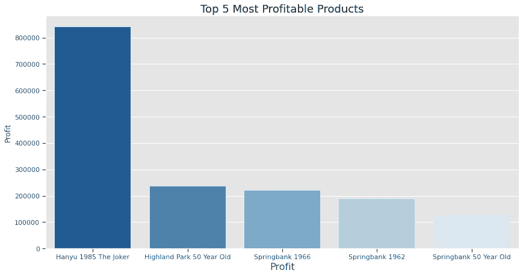
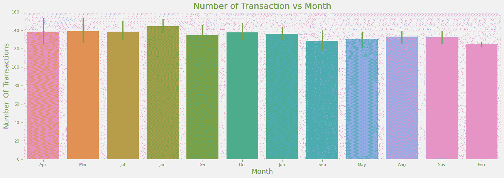
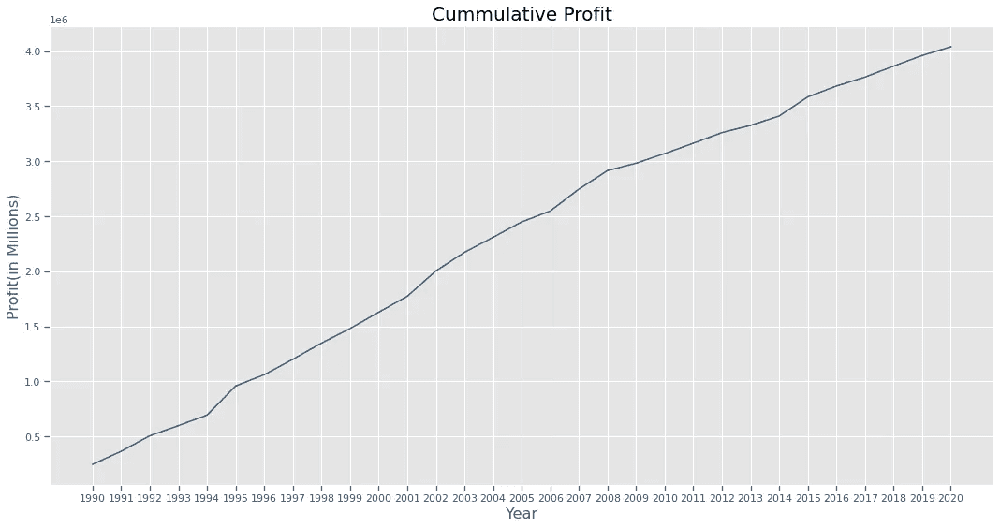
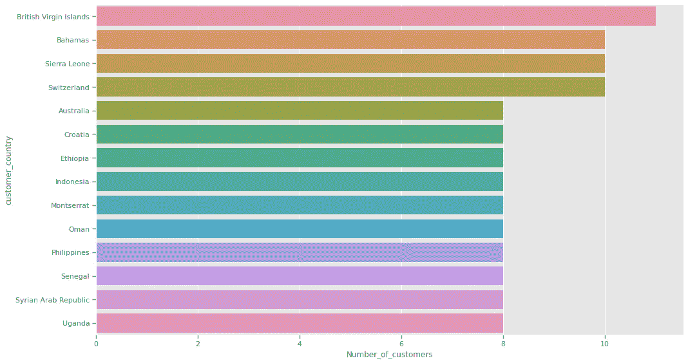

# 数据工程项目零售店—第 4 部分—分析数据

> 原文：<https://medium.com/codex/data-engineering-project-retail-store-part-4-analyzing-the-data-630efad6e09a?source=collection_archive---------2----------------------->

艾萨克·史密斯在 [Unsplash](https://unsplash.com?utm_source=medium&utm_medium=referral) 上拍摄的照片

# 介绍

本文是“数据工程—零售店”系列的第四部分，也是最后一部分。在前面的文章中，我提取了威士忌数据，并使用 MySQL 为一个虚构的组织设计和实现了一个中央 RDBMS 和一个数据仓库。

这一部分将重点分析数据仓库中的数据。更具体地说，数据仓库包含一个用作单点数据的事实表，它存储组织所做的所有事务。

事实表是集中分析和创建可视化的好地方。

# 项目步骤

1.  将 Python 连接到 MySQL 数据仓库
2.  提取事实表数据
3.  分析数据

## 导入和功能

> 第一步。将 Python 连接到 MySQL 数据仓库

我将使用 pymysql 库创建一个连接对象。我需要收集关于我使用的 MySQL 数据库的必要细节。

**详情如下:**

***主机***——谁在运行服务器。

***端口*** —在哪个端口上。

***用户*** —数据库的用户名是什么。

***密码*** —数据库的密码是什么。

***DB*** —数据库模式的名称是什么。

收集了这些详细信息后，我可以像这样连接到 MySQL:

> 第二步。提取事实表数据

为了从 MySQL 中提取数据，我将使用 panda 的库函数:read_sql_query。

这个有用函数的输入是:

1.  SQL 查询用于从 MySQL 中提取数据。
2.  上一步中的连接对象。

让我们来看一个演示，我将提取事实表数据，并将其连接到其他几个表，以获得组织事务的完整图片。

就是这样；现在我有了一个 Pandas 数据框架，其中包含了该组织所做的所有交易的相关数据。让我们看一个例子:

> 第三步。分析数据

## 1.预处理

首先，进行一些预处理以准备好数据。当前的数据类型有:

让我们将一些数据类型更改为更合适的类型:

现在，让我们检查新的数据类型:

## 2.描述性分析和可视化

在开始分析之前，我们需要了解可以对数据提出哪些有趣的问题。管理层感兴趣的是什么，我们如何通过回答这些问题来获取利润。

由于该项目处理关于销售威士忌的零售店的数据，一些有趣的问题可能是:

1.  哪些产品产生的利润最大？
2.  人们通常会购买哪些产品？
3.  关于顾客什么时候喜欢买威士忌，有什么有趣的模式吗？如果有，它们是什么？
4.  就利润而言，我们公司是否在成长？
5.  大部分客户来自哪些县？

用数据回答这些问题会有一些非常有趣和有益的结果。如果数据支持，管理层可以选择将营销预算集中在某些产品、国家或日期上。他们可以选择放弃一些卖得不好的产品，或者提高卖得好的产品的价格。

拥有这种关于组织的知识对于优化企业的绩效和利润至关重要。

注意，这个数据是我在之前的文章中随机生成的。所以我不指望在数据中发现太多有趣的行为。

Q1——哪种产品利润最高？

提取利润最高的 5 种产品:

绘制条形图

**Q2——人们通常会购买哪些产品？**

提取最常见的销售产品

创建概率质量函数

正如我们所看到的，这些是最常销售的前 1%的产品。我们可以这样解释这张表。例如，产品“七印”是最畅销的商品。每当一个随机的顾客进入商店，他们会有 0.6%的机会购买该产品。

**Q3——顾客喜欢购买威士忌有什么有趣的规律吗？如果有，它们是什么？**

让我们检查每天销售的产品数量是否有差异:

所以日子之间没有什么大的区别，让我们按日子和月份来检查一下:

月和日没有明显的模式或差异。看起来客户并不真的介意他们购买威士忌的日期或月份。

**Q4——就利润而言，我们公司是否在增长？**

让我们计算并画出这些年的累计利润总额。

利润的增长是线性的。这些年来，销售威士忌的收入流似乎一直在持续。看起来这家公司并没有真正成长。

**Q5 —大部分客户来自哪些县**

看来英属维尔京群岛、巴哈马群岛、塞拉利昂和瑞士是顾客最多的国家。

“数据工程—零售商店”系列到此结束。希望你读得有趣。