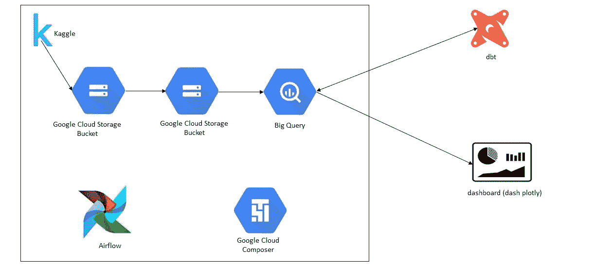
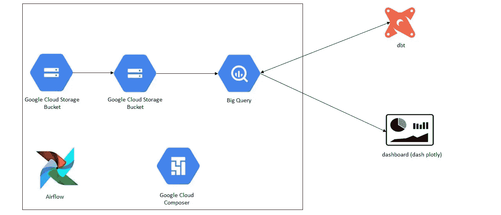
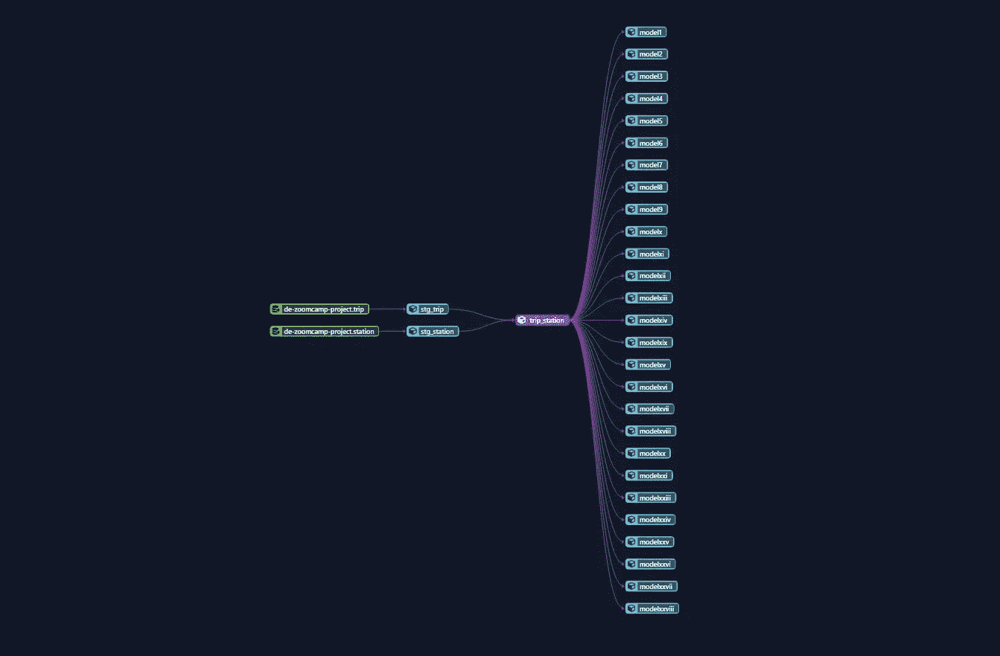
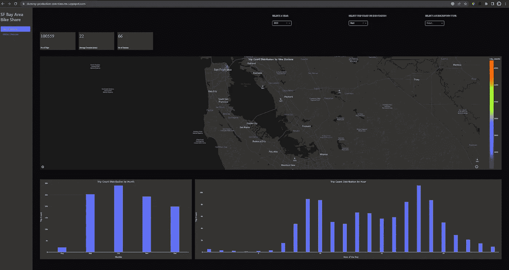

# 数据工程 Zoomcamp 项目

> 原文：<https://medium.com/codex/data-engineering-zoomcamp-project-f55ad4ecc532?source=collection_archive---------5----------------------->

大家好，节日快乐，

在过去的两个月里，我一直从 YouTube 上 DataTalksClub 频道的 Zoomcamp 视频播放列表中学习数据工程。

为什么是数据工程？我参与的每个项目都涉及提取、转换和加载某种类型的数据，我逐渐意识到这是数据工程师的主要职责之一。

我还在那些项目上使用了云服务(工具)，如云存储、云功能、云调度器和应用引擎，这些都是数据工程师所需的一些技能。

也就是说，我想分享我参与的项目。

## 资料组

我在 Kaggle 上使用了旧金山湾区自行车共享服务。可以在下面找到；

 [## 旧金山湾区自行车共享

### 2013 年 8 月至 2015 年 8 月的匿名自行车出行数据

www.kaggle.com](https://www.kaggle.com/datasets/benhamner/sf-bay-area-bike-share) 

## 项目架构

该项目的理想架构应该如下所示，但事实并非如此；

**理想的项目架构**

我遇到的挑战是无法使用 python 脚本下载数据集中的 CSV 文件。所以经过多次尝试，我决定通过手动下载文件并将其存储在谷歌云存储桶中来绕过这一步。

**数据工程 Zoomcamp 项目的项目架构**

*   第一个存储桶:我存储手动下载的 CSV 文件的地方。
*   第二个存储桶:存储相同的文件，但这次是作为 parquet 文件扩展名，而不是 CSV。将文件作为拼花文件的优点是，与 CSV 文件相比，文件占用的存储空间更少，查询运行速度更快。你可以在下面阅读更多相关内容；

 [## 用于存储的 CSV 文件？不用了，谢谢。有更好的选择

### 将数据保存到 CSV 文件中既浪费金钱又浪费磁盘空间。是时候结束了。

towardsdatascience.com](https://towardsdatascience.com/csv-files-for-storage-no-thanks-theres-a-better-option-72c78a414d1d) 

*   BigQuery:数据仓库，第二个存储桶中的 parquet 文件被移动到这里进行存储(加载)和转换。

整个工作流(将文件(数据)从第一个存储桶移动到 BigQuery)是使用 Google Cloud Composer 中的 Airflow 环境编排的。

在气流环境中使用 Google Composer 的优势在于，我可以轻松地编排工作流，而不必担心底层基础设施的需求。

有了 BigQuery 中的数据，我使用 dbt cloud 将数据集转换成仪表板需要的模型(表)。数据沿袭看起来像这样

**转换的数据谱系**

我使用 Plotly 库进行数据可视化，使用 Dash 库构建 web 框架。最后，我将 web 应用程序(dashboard)部署到 Google 应用程序引擎。

可以通过下面的链接查看仪表板；目前最好在大屏幕上观看。尝试解决这个问题，以便它可以灵活地适应不同的屏幕尺寸。

 [## 年度概览

### 编辑描述

dummy-production-overview.nw.r.appspot.com](https://dummy-production-overview.nw.r.appspot.com/) 

**网页应用截图**

项目的存储库可以在下面找到；

 [## GitHub-0 ladayo/数据工程-Zoomcamp-Project

### 此时您不能执行该操作。您已使用另一个标签页或窗口登录。您已在另一个选项卡中注销，或者…

github.com](https://github.com/0ladayo/Data-Engineering-Zoomcamp-Project) 

我在推特上发布了这个项目。你可以在这里看到线；

【https://twitter.com/oladii1/status/1596128470748352514? t = 3 lgxdxckxzgv 6-beKmQQRw&s = 03

感谢您的阅读。