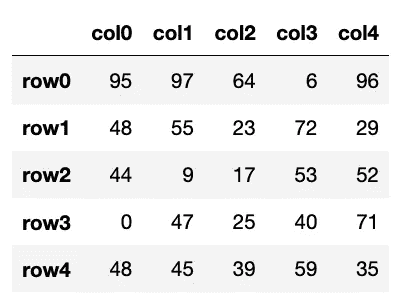

# 熊猫中的数据框

> 原文：<https://medium.com/codex/data-frames-in-pandas-146abdb03180?source=collection_archive---------10----------------------->

## 引用

## *摘自鲁文·勒纳的* [*熊猫健身*](https://www.manning.com/books/pandas-workout?utm_source=medium&utm_medium=referral&utm_campaign=book_lerner2_pandas_8_3_21)

**本文讨论在 Pandas 中使用数据帧。**

*在[manning.com](https://www.manning.com/books/pandas-workout?utm_source=medium&utm_medium=referral&utm_campaign=book_lerner2_pandas_8_3_21)结账时，将 **fcclerner2** 输入折扣代码框，即可享受 [*熊猫健身*](https://www.manning.com/books/pandas-workout?utm_source=medium&utm_medium=referral&utm_campaign=book_lerner2_pandas_8_3_21)35%的折扣。*

*在`pandas`中，人们使用和想要使用的主要数据结构是数据帧。数据框是二维表格，其外观和工作方式类似于 Excel 电子表格。可以通过索引访问这些行。只要您使用`.loc`和`.iloc`通过索引检索元素，就不会有问题。*

*但是当然，数据帧也有**列**，每个列都有名字。每个列实际上都是自己的系列，这意味着它有一个独立于其他列的`dtype`。*

**

*图一。具有五行(`'row0'`到`'row4'`)和五列(`'col0'`到`'col4'`)的简单数据帧*

*在典型的数据框中，每一列代表数据的一个特征或属性，而每一行代表一个样本。因此，在描述公司雇员的数据框中，每个雇员占一行，名、姓、ID 号、电子邮件地址和薪水列。*

*在本文中，我们将练习在各种设置下使用数据框。我们将练习创建、修改、选择和更新数据框。我们还将了解几乎所有的 series 方法如何在数据框上工作，为每个数据框列返回一个值。*

***有用的参考资料***

*`s.loc`通过标签或布尔数组`s.loc['a']` [访问系列的元素 https://pandas . pydata . org/pandas-docs/stable/reference/API/pandas。Series.loc.html](https://pandas.pydata.org/pandas-docs/stable/reference/api/pandas.Series.loc.html)*

*`s.iloc`*

*按位置访问系列的元素*

*`s.iloc[0]`*

*[https://pandas . pydata . org/pandas-docs/stable/reference/API/pandas。Series.iloc.html](https://pandas.pydata.org/pandas-docs/stable/reference/api/pandas.Series.iloc.html)*

*`s.quantile`*

*获取特定百分比值的值*

*`s.quantile(0.25)`*

*[https://pandas . pydata . org/pandas-docs/stable/reference/API/pandas。Series.quantile.html](https://pandas.pydata.org/pandas-docs/stable/reference/api/pandas.Series.quantile.html)*

*`pd.concat`*

*将两个数据框连接在一起*

*`df = pd.concat([df, new_products])`*

*[https://pandas . pydata . org/pandas-docs/stable/reference/API/pandas . concat . html](https://pandas.pydata.org/pandas-docs/stable/reference/api/pandas.concat.html)*

*`df.query`*

*编写一个类似 SQL 的查询*

*`df.query('v > 300')`*

*[https://pandas . pydata . org/pandas-docs/stable/reference/API/pandas。DataFrame.query.html](https://pandas.pydata.org/pandas-docs/stable/reference/api/pandas.DataFrame.query.html)*

*`pd.read_csv`*

*返回基于单列文件的新系列*

*`s = pd.read_csv('filename.csv', squeeze=True)`*

*[https://pandas . pydata . org/pandas-docs/stable/reference/API/pandas . read _ CSV . html](https://pandas.pydata.org/pandas-docs/stable/reference/api/pandas.read_csv.html)*

*`interpolate`*

*返回内插了`NaN`值的新数据帧*

*`df = df.interpolate()`*

*[https://pandas . pydata . org/pandas-docs/stable/reference/API/pandas。DataFrame.interpolate.html](https://pandas.pydata.org/pandas-docs/stable/reference/api/pandas.DataFrame.interpolate.html)*

***括号还是圆点？***

*当我们处理一个系列时，我们可以用几种不同的方法来检索值:使用索引(和`loc`)，使用位置(和`iloc`)，还可以使用普通的 ol '方括号，这基本上相当于`loc`。*

*当我们处理数据帧时，我们必须使用`loc`或`iloc`。那是因为方括号指的是列。如果您尝试使用方括号通过索引检索一行，您将得到一条错误消息，指出不存在这样的列。*

*因此，许多人习惯于使用方括号来检索列就不足为奇了。通常，我们将把列名作为字符串放在方括号内传递。例如:*

```
*df['a']  ❶
 df['first name']  ❷
 df[['a', 'b']] ❸
 df['c':'d'] ❹*
```

*❶ **返回一个数列，列** `a` **。***

*❷ **返回一个数列，列** `'first name'` **。请注意，列名包含一个空格。***

*❸ **返回两列数据帧，列** `a` **和** `b` **从** `df`开始。*

*❹ **返回** **行** `'c'` **到** `'d'` **、** **包含在内。***

*注意上面的最后一个例子:方括号总是指向列，而不是行。除非，当你传递给他们一个切片，在这种情况下，他们看行。如果您想要检索多个列，那么您必须使用高级索引。您不能使用切片。*

*所有这些都很好，但事实证明还有另一种处理列的方法，即“点标记法”也就是说，如果你想从数据帧`df`中检索列`colname`，你可以说`df.colname`。*

*出于各种原因，这种语法吸引了许多人:它更容易键入，字符更少，因此更容易阅读，而且看起来更自然一些。*

*但是也有不喜欢它的理由:包含空格和其他非法的 Python 标识符字符的列将不起作用。我个人发现很难记住`df.whatever`是名为`whatever`的列还是名为`whatever`的`pandas`方法。有太多的方法需要记忆，我会尽我所能帮助你。*

*我个人使用括号符号。如果你更喜欢点符号，你是一个很好的公司——但要意识到有些地方你将无法使用它。*

***练习 8:净收入***

*对于许多在工作中使用`pandas`的人来说，从头创建一个新的数据框是很少见的。您将从 CSV 文件创建它，或者对现有数据框(或多个现有系列)执行一些变换。但是有时您需要创建一个新的数据框，知道如何做是非常有用的。*

*在本练习中，我希望您创建一个数据框，代表一家公司销售的五种不同产品。对于每个产品，我们需要知道产品 ID 号(任何唯一的两位整数都可以)、产品名称、批发价、零售价以及该产品上个月的销售数量。我们只是在这里弥补，所以如果你一直想成为一个有利可图的星舰经销商，这是你的机会！*

*这个练习的任务是计算你从所有这些销售中获得了多少净收入。*

***讨论***

*此任务的第一部分涉及创建新的数据框。有许多方法可以做到这一点，包括:*

*   *列表/系列的列表，其中每个内部列表代表一行，列名按位置取值*
*   *dict 列表，其中的 dict 键表示每行设置了哪些列*
*   *列表/系列的字典，其中字典键确定列名，然后垂直赋值*
*   *二维数字阵列*

*哪一种最合适取决于手头的任务。在这种情况下，因为我想创建和描述单个产品，所以我决定使用字典列表。*

*注意，多亏了字典键，我不必定义或传递任何列名。这个索引是默认的位置索引，所以我不需要设置它。*

*有了数据框，我如何计算总收入？这就要求我们从每件产品的零售价中减去批发价，也就是净收入:*

```
*df['retail_price'] - df['wholesale_price']*
```

*这里，我们正在检索序列`df['retail_price']`并从中减去序列`df['wholesale_price']`。因为这两个序列彼此平行，具有相同的索引，所以将对每一行进行减法，并将返回一个具有相同索引的新序列，但它们之间存在差异。*

*一旦我们有了这个系列，我们将把它乘以每个产品的销售数量:*

```
*(df['retail_price'] - df['wholesale_price']) * df['sales'] ❶*
```

*❶ **如果没有括号，*操作符就会有优先权，从而打乱计算***

*这将产生一个新的序列，它与`df`共享一个索引，但是它的值代表每种产品的总销售额。我们可以用`sum`法将这些加在一起:*

```
*((df['retail_price'] - df['wholesale_price']) * df['sales']).sum() ❶*
```

*❶ **现在我用括号表示我想对从这组操作中得到的序列调用 sum，而不是直接对 df['sales']调用。***

*解决办法*

```
*df = DataFrame([{'product_id':23, 'name':'computer', 'wholesale_price': 500,
                  'retail_price':1000, 'sales':100},
                {'product_id':96, 'name':'Python Workout', 'wholesale_price': 35,
                 'retail_price':75, 'sales':1000},
                {'product_id':97, 'name':'Pandas Workout', 'wholesale_price': 35,
                 'retail_price':75, 'sales':500},
                {'product_id':15, 'name':'banana', 'wholesale_price': 0.5,
                 'retail_price':1, 'sales':200},
                {'product_id':87, 'name':'sandwich', 'wholesale_price': 3,
                 'retail_price':5, 'sales':300},
                ])

 ((df['retail_price'] - df['wholesale_price']) * df['sales']).sum() ❶
 (df['price'] * df['sales']).sum()❶*
```

*❶ **返回 110700***

***超越锻炼***

*   *在哪些产品上我们的零售价是批发价的两倍以上？*
*   *这家商店从食物、电脑和书籍中赚了多少钱？(您可以只基于索引值进行检索，而不是任何更复杂的东西。)*
*   *因为你的商店做得很好，你可以在商品批发价的基础上打 7 折。计算新的净收入。*

*本文到此为止。如果你想了解更多，请在曼宁的 liveBook 平台[点击](https://livebook.manning.com/book/pandas-workout?origin=product-look-inside)查看这本书。*