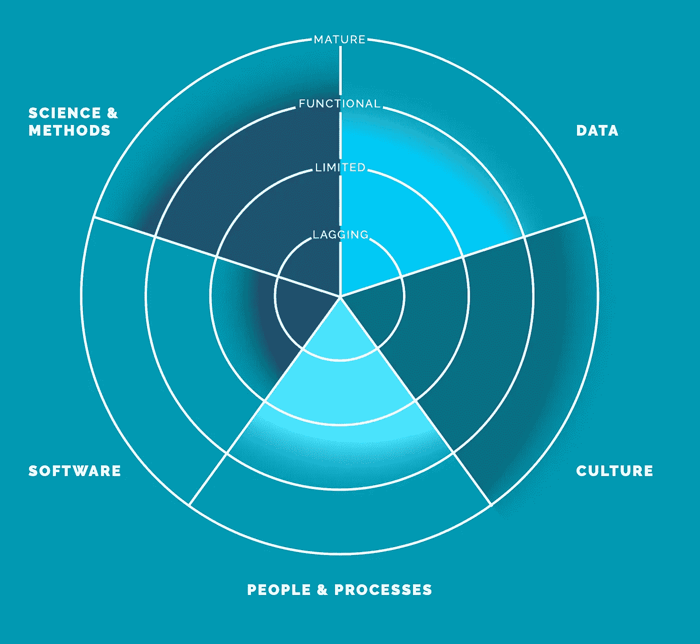

# 来自数据科学家的数据治理

> 原文：<https://medium.com/codex/data-governance-from-a-data-scientist-dab4a80cd551?source=collection_archive---------4----------------------->

暴风雨中的光在哪里

什么是数据治理，为什么它如此受欢迎？数据科学如何在数据治理中发挥作用？为什么组织改变了他们对数据资产的看法？下面，我从一个数据科学家的角度提供答案。

图片作者:约翰·福克斯沃西

确保组织中数据资产管理的实践和流程的集合就是**数据治理**。通过在企业视图中规划、监控和实施数据资产管理来行使权力，定义了组织的数据治理。更不用说，为数据治理带来价值的是一个决策权和信息相关流程责任的系统。这里还有更多，但长话短说，让我们继续。。。

数据数量的指数级增长、相对自由的访问以及客户对质量的压力将数据治理推到了今天的位置。换句话说，几十年前，客户很少或根本无法访问数据，无论是免费还是订阅，因此对数据治理的需求很弱。然而，如今，客户通常会在会议前准备大量的数据分析，并要求**数据完整性**。因此，数量和访问产生了数据治理的需求和质量。

数据治理的好处包括成本、质量等等。给定数据资产从最初创建到最终报废的整个生命周期是数据管理的主要部分，是数据治理的主要子集。**数据治理的执行是数据管理**，成本是任何组织的热门话题。数据资产内部和外部的进展和变更都有可能带来不必要的成本，包括财务成本和耗时的解决方案。正确或精确的程序、透明性、提高组织数据的价值、标准化流程以及改进监控是数据治理带来的一些好处，这些好处会带来企业整体收入的增长。

数据驱动的业务在**人员、数据和技术**的混合基础上发展。成功的结果各不相同，但直觉反应或轶事证据的时代已经过去了。**数据科学，即利用更多计算资源对统计数据进行重新打包**，已经到来，并且无疑将在未来继续发展。几十年前，公司少，竞争少，信息少，每个人的数据少。**今天，唯一不变的是变化**。

伟大的数据集是在数据驱动的组织中构建、维护和使用的，这些组织培养了一种欣赏和优先考虑数据的文化。工作是通过使用软件产生的，而不是落后组织的糟糕的数据整理。科学被用来帮助一个组织，甚至更多的去适应变化。

一个**滞后的数据治理**已经捕获了部分没有数据指标的数据，并且业务不了解它拥有什么数据。当数据孤岛无法合并、对数据质量缺乏信心，以及整个组织的可见性较弱时，这是一个小小的改进**有限的数据治理**。下一个级别是**功能数据治理**，它就数据对业务的重要性以及提高数据质量的努力达成一致。数据架构对于业务流来说是次优的，一些数据科学家可以合作尝试新的方法和工作流。最后，**成熟的数据治理**是记录良好的业务逻辑、业务流程的平滑数据架构和高数据质量。

弗拉基米尔·库什的《海浪私语》

数据科学通过描述性分析帮助数据治理，例如**无监督学习**方法和**数据工程**技术。通过降维来降低数据集的质量和成本，或者通过聚类方法来测量数据频率，这些都是数据科学的好处。换句话说，少即是多，描述高数据活动来定义数据资产管理的业务价值。数据工程是数据科学的一个主要分支，它将数据转化为有用的数据，以提高成本效益，并为数据管理创造商业价值。设计和构建可能来自不同来源的管道、清理和检查来自供应商的数据的 Python 脚本以及为企业设想新的数据架构是数据工程师的常见任务。更不用说，数据科学家和数据工程师可以通过从产品定价到基础设施完整性的预测分析为数据治理增值。

这里还有更多的内容需要详细说明，但我希望这是您和您的组织的一个良好开端。如果您有任何问题或意见，请告诉我。欢迎在 Medium.com 上关注我或给我发消息。

 [## 约翰·T·福克斯沃西-西北大学-洛杉矶大都市区| LinkedIn

### 土生土长的西洛杉矶人，拥有超过 15 年的企业最终用户经验，曾获得十大排名…

linkedin.com](http://linkedin.com/in/john-t-foxworthy-1718073) 

[https://foxworthy-8036.medium.com](https://foxworthy-8036.medium.com/)