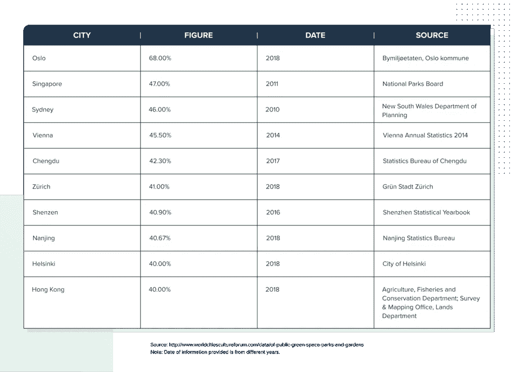
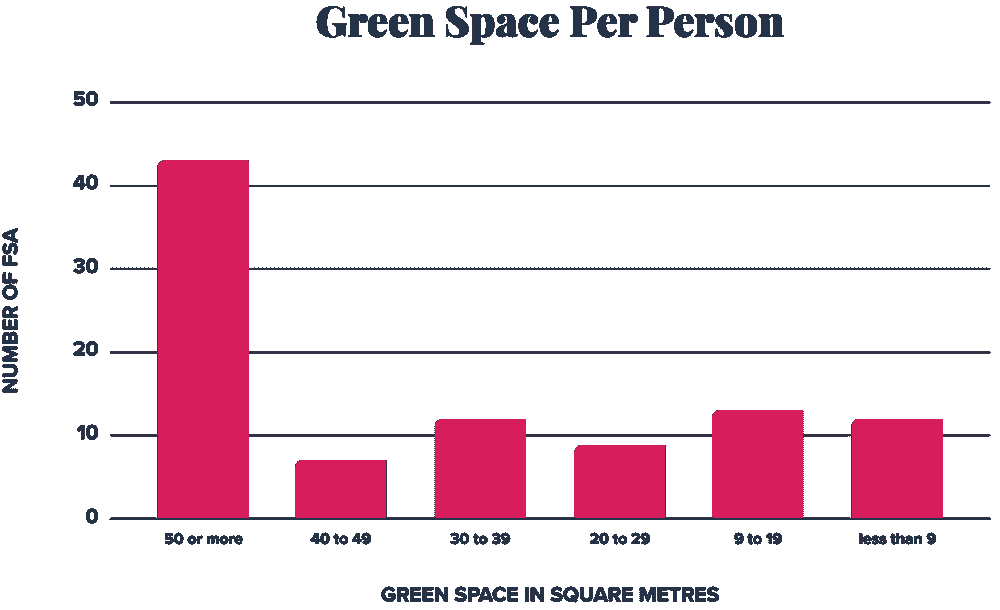
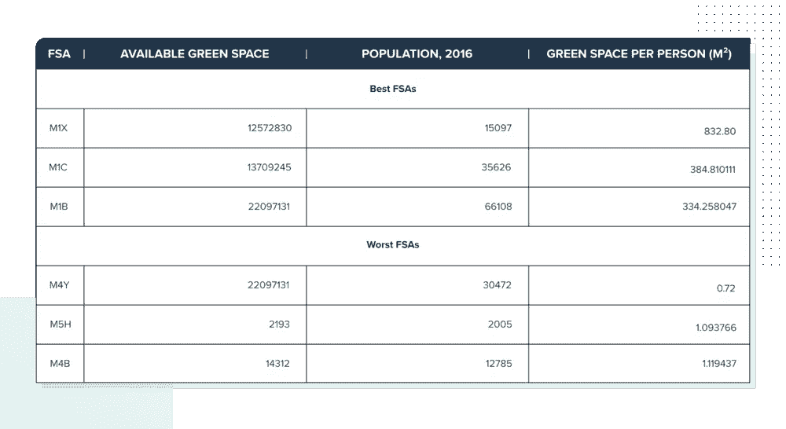
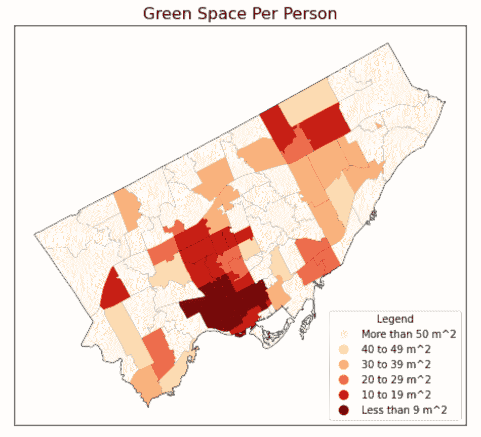

# 数据调查:多伦多有多绿？

> 原文：<https://medium.com/codex/data-investigation-how-green-is-toronto-4527d1384f0?source=collection_archive---------13----------------------->

# active to # cycle to # cafe to # physical distanding。这些都是我们夏天在多伦多看到的熟悉的标签。传达的信息很明确:“走出去，但保持物理距离。”这的确是一个合理的建议。户外活动有助于提高注意力，缓解焦虑，鼓励积极的生活方式。

鉴于加拿大的夏天短暂而宝贵，户外活动可以让我们吸收急需的维生素 D！与此同时，鉴于正在进行的疫情，我们必须继续保持 6 英尺的距离，以帮助平坦的曲线，延迟和/或减少第二波的影响。

安大略省在 2020 年的大部分时间里一直处于紧急状态，迫使许多企业和餐馆暂时或永久关闭。许多人选择参加户外活动，如骑自行车和使用多伦多公园和设施，以此来应对我们的新现实。因此，当地公园的游客数量有所上升，以至于几乎不可能在享受新鲜空气的同时保持至少 2 米的物理距离。

这让我怀疑是否有足够的公园空间让人们安全地享受多伦多的公园和设施？

## 多伦多真的像我们宣称的那样“绿色”吗？

虽然很难估计在任何给定的时间有多少人会去公园，尤其是现在，世界卫生组织(世卫组织)已经制定了一些非常明确的指导方针。具体来说，[世卫组织建议](https://www.ncbi.nlm.nih.gov/pmc/articles/PMC6209905/)每个人至少应该有 9m 2 的绿地，最好是 50m 2。[许多欧洲国家](https://www.witpress.com/Secure/elibrary/papers/SDP16/SDP16031FU1.pdf)将该建议纳入其城市规划中。

鉴于多伦多素以“绿色”著称，我们如何与世界其他主要城市相比呢？

根据[世界城市文化论坛报告](http://worldcitiescultureforum.com)，多伦多在 41 个城市中排名第 31 位，拥有 13%的绿色空间。绿地最多的地区是奥斯陆、新加坡和悉尼，绿地率分别为 68%、47%和 46%。

来源:[http://www . worldcitiescultureforum . com/data/of-public-green-space-parks-and-gardens](http://www.worldcitiescultureforum.com/data/of-public-green-space-parks-and-gardens)
注:提供的资料日期来自不同年份。

多伦多是否像世卫组织建议的那样提供了足够的绿色空间？此外，鉴于多伦多的城市景观从一个街区到另一个街区变化很大，多伦多有没有在绿地方面做得更好的地区？如果有，它们在哪里，谁住在那里？

## 使用案例

为了开始这一分析，我从多伦多市开放数据门户网站访问了多伦多公园和绿地 shapefile，从加拿大统计局访问了前进分拣区(FSA) shapefile 和 FSA 的人口——所有这些都可以通过 Namara 获得(滚动到本博客底部的链接)。

作为参考，FSA 是一个地理区域；它构成了加拿大邮政编码的前三个字符。例如:在邮政编码 A0A 0A0 中，FSA 是 A0A。

## 这些问题

1.  作为一个城市，多伦多是否提供了人均绿地的最低推荐量？

多伦多人均绿地=多伦多公园总面积(m2) /多伦多人口
多伦多人均绿地= 121123085m2/ 2732094
多伦多人均绿地= 44.33 m2

**回答:**是的！总的来说，如果我们假设绿色空间平均分布在所有街区，那么多伦多的人均绿色空间约为 44.33 平方米。然而，如果你曾经在多伦多市中心步行或开车，一个平均值并不能完美地代表事物。这引出了我的下一个问题:

**2。多伦多的土地面积中有均匀分布的绿色空间吗？**

一眼看去，我们已经可以看出，并不是多伦多的所有地方都有享受人均 44 平方米绿地的奢侈。虽然大多数选择将多伦多称为家的人能够享受人均超过 9 平方米的绿色空间，但对于居住在多伦多 96 个 FSA 中 12 个 FSA 的人来说，绿色空间是稀缺的。最缺乏绿色空间的地区位于多伦多市中心。

下表列出了多伦多可用绿地的最佳和最差区域:

查看地图，很容易假设人口密度最高的 FSA 也是绿地最少的区域。如果这是真的，那么人口密度最高的 FSA 也是绿色空间最少的地区。然而，如果我们在地图上按 FSA 绘制人口密度，人口密度最高的 FSA 不一定与绿色空间最少的区域相匹配:

**回答:**是的，多伦多有比别人更能进入绿地的口袋。特别是市中心核心区外有几个 FSA，缺少绿地，但不是特别密集。现在我们有一个新问题要回答:

**3。居住在绿地稀缺地区的人都是些什么人？这些区域看起来像什么？**

为了更多地了解谁是多伦多绿色空间光谱的极端，我从 Namara 下载了加拿大人口普查资料数据集。然后，我开始描绘生活在这些地区的人们:

以这种方式来看数据，我们开始看到居住在绿色空间最好和最差的 FSA 中的人们开始有所不同。

**回答**:居住在绿色空间最多的 FSA 的人往往年龄稍大，家庭规模稍大，平均家庭收入较高。但是这两个群体之间最显著的区别是独立住宅的数量。绿色程度最高的金融服务区平均每个金融服务区有 3581 套独立住宅，而绿色程度最低的金融服务区平均只有 622 套。

## 数据告诉我们关于绿色空间的什么

[**绿色空间是必不可少的**](https://www.euro.who.int/en/health-topics/environment-and-health/pages/news/news/2016/11/who-report-shows-urban-green-spaces-deliver-multiple-health-benefits) 对于心理放松和减压，促进身体活动，以及尽量减少城市生活的有害影响。

可持续城市规划的倡导者说，城市必须遵循世卫组织的指导方针，每人至少 900 万平方米的绿色空间，每人 500 万平方米的理想空间，因为，根据前面提到的 [**WIT 论文**](https://www.witpress.com/Secure/elibrary/papers/SDP16/SDP16031FU1.pdf) ，“最适宜居住的城市是那些为其人口提供最多绿色空间的城市。”多伦多人平均每人享有 4400 平方米的绿地，但有些地区远远低于这个数字。

这对非绿色地区的人口意味着什么？坦率地说，他们将不得不更加努力地工作，才能在与他人保持安全距离的情况下享受大自然。由于保持身体距离仍然是最好的做法，多伦多人将不得不在这个冬天保持活跃、参与和放松的方式上有所创新。也许我们会开始看到#ActiveTOintheSnow。

如果你想对多伦多绿地进行你自己的分析，你可以访问这里的文件:

*   [**多伦多公园绿地形状文件**](https://marketplace.ee.namara.io/datasets/6e59cc6a-f852-43e1-a9a2-abbd1e908efe?__hstc=82057097.c44170329b0f6a24ca43003f609ef893.1609787358702.1612817544120.1612881396670.87&__hssc=82057097.28.1612881396670&__hsfp=2940426566)
*   [**FSA 边界— 2016 年人口普查**](https://marketplace.ee.namara.io/datasets/6423fc07-60e5-44a7-9c31-f51ca4bc1025?__hstc=82057097.c44170329b0f6a24ca43003f609ef893.1609787358702.1612817544120.1612881396670.87&__hssc=82057097.28.1612881396670&__hsfp=2940426566)
*   [**人口和居住统计重点表— 2016 年人口普查**](https://marketplace.ee.namara.io/datasets/aadfb722-bf87-4686-9b63-1892c32bbf42?__hstc=82057097.c44170329b0f6a24ca43003f609ef893.1609787358702.1612817544120.1612881396670.87&__hssc=82057097.28.1612881396670&__hsfp=2940426566)
*   [**安大略省新冠肺炎确诊阳性病例**](https://marketplace.ee.namara.io/datasets/bd92ba33-f83b-41eb-a1ae-87cc1d68eaf9?__hstc=82057097.c44170329b0f6a24ca43003f609ef893.1609787358702.1612817544120.1612881396670.87&__hssc=82057097.28.1612881396670&__hsfp=2940426566)

ThinkData 提供的数据远不止这些——来自全球超过 75 个国家的超过 25 万个数据集。现在浏览[**Namara market place**](https://marketplace.namara.io/)或 [**向我们的数据专家咨询**](https://meetings.hubspot.com/eugene) 有关外部数据的问题。

*原载于【https://blog.thinkdataworks.com】**。***