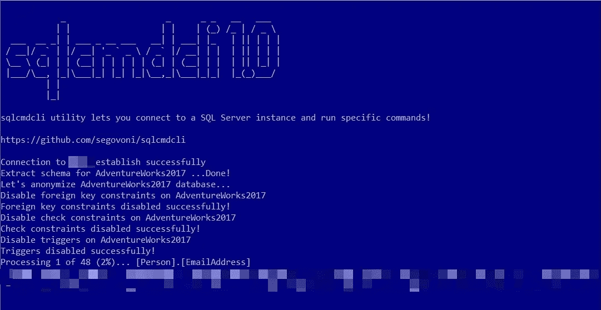

# 使用 sqlcmdcli 进行数据屏蔽

> 原文：<https://medium.com/codex/data-masking-with-sqlcmdcli-975924f2935d?source=collection_archive---------5----------------------->

## sqlcmdcli 实用工具是一个命令行实用工具，用于在 SQL Server 上以特定的交互式方式执行命令，以模拟特定的工作负载、匿名敏感数据等！

开发复杂应用程序(如 ERP、物流管理解决方案、CRM 或其他需要 OLTP 数据库的软件)的人，迟早需要在真实数据上验证应用程序的特性。可能有必要使用生产数据库的备份，通过开发环境提供的调试工具来验证应用程序。有些 bug 是您无法在测试环境中重现的！可能需要生产数据库的副本来进行故障排除或验证查询是如何在具有数百万条记录的表上的真实数据上执行的。

您是否曾经问过您最重要的客户之一:“我可以备份生产数据库来执行测试吗？”

他/她回答了什么？考虑到关于个人数据保护的新[欧洲法规 679/2016](https://www.eugdpr.org/) (被称为 GDPR)，他/她会如何回答？在最好的情况下，答案将是:“你可以根据法律进行备份，但数据必须是匿名的！”。

它包括在生产数据库的备份中屏蔽数据，并要求客户在获得最终授权进行处理之前进行适当的检查。SQL Server 的最新版本提供了有趣的[数据屏蔽服务](https://docs.microsoft.com/it-it/sql/relational-databases/security/dynamic-data-masking?WT.mc_id=DP-MVP-4029181)，但是它们必须被启用，并且不是在 SQL Server 的所有版本中都可用。

我有这个需求，我不能使用 SQL Server 的数据屏蔽服务，所以我在 **sqlcmdcli** 中实现了一个特定的命令，这个命令行实用程序可以在[这个 GitHub 存储库](https://github.com/segovoni/sqlcmdcli)中找到。

[anonymizedb](https://github.com/segovoni/sqlcmdcli/wiki#anonymizedb-anondb) 命令匿名化数据库中作为参数传递的长度超过两个字符的所有文本列(char、nchar、varchar、nvarchar、text、ntext );它执行以下步骤:

*   数据库模式分析
*   禁用文本列上的活动外键
*   禁用文本列上的活动检查约束
*   禁用活动触发器
*   执行数据屏蔽算法
*   启用外键(以前被禁用)
*   启用检查约束(以前已禁用)
*   启用触发器(之前已禁用)

最后，您将得到一个数据库，其中的文本列已被匿名化。

数据屏蔽算法的第一个实现非常简单；对于少于或等于 2000 个字符的文本列，每个字符移动一个范围内的随机数量的字符。对于大于 2000 个字符的文本列，执行相反的功能。未来发布的 [sqlcmdcli](https://github.com/segovoni/sqlcmdcli) 将实现更复杂的算法。

以下是对 AdventureWorks2017 数据库调用 anonymizedb 命令的示例:

```
sqlcmdcli.exe anonymizedb -servername:YourTestServer -databasename:AdventureWorks2017 -username:YourSQLLogin -password:YourPassword -verbose
```

该执行将产生类似于下图所示的输出。



sqlcmdcli 是用 Delphi 编写的，它是一个开源项目，欢迎任何人贡献自己的力量，sqlcmdcli.exe 可以在资源库的[版本](https://github.com/segovoni/sqlcmdcli/releases)部分获得。

这个项目的官方维基可以在[这里](https://github.com/segovoni/sqlcmdcli/wiki)找到。

尽情享受吧！