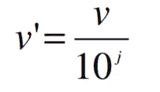

# 数据标准化技术

> 原文：<https://medium.com/codex/data-normalization-techniques-4148b69876b0?source=collection_archive---------10----------------------->

它是什么，为什么需要它，怎么做？


克里斯·利维拉尼在 [Unsplash](https://unsplash.com?utm_source=medium&utm_medium=referral) 上的照片

*编辑:用于规范化的 Python 库*

# ***什么是数据规范化？***

根据[维基百科](https://en.wikipedia.org/wiki/Normalization_(statistics)#:~:text=In%20statistics%20and%20applications%20of,scale%2C%20often%20prior%20to%20averaging.)，**规范化**可以有一系列含义。在最简单的情况下，标准化意味着将不同尺度上测量的值调整到一个概念上的共同尺度。

> 规范化是重新调整数据比例以使其具有相同比例的过程。

使用的测量单位会影响数据分析。因此，数据被缩放到较小的范围内，如 0.0 到 1.0。这种转换或者将数据映射到一个更小或公共的范围将有助于所有属性获得相同的权重。这就是所谓的规范化。

# **为什么需要标准化？**

*需要标准化:*

1.  如果数据没有标准化，一个特征可能会完全支配其他特征。归一化使每个数据点都具有相同的比例，因此每个特征都同等重要。
2.  它避免了对测量单位选择的依赖。
3.  数据挖掘算法的应用变得更加容易、有效和高效。
4.  更具体的数据分析方法可以应用于标准化数据。
5.  它防止初始范围较大的属性(例如，收入)超过初始范围较小的属性(例如，二进制属性)。

# **怎么做？**


我们将讨论三种类型的标准化技术:

1.  z 分数标准化/规范化
2.  最小-最大归一化
3.  十进制标度

*注:我使用了 Kaggle 的* [*波士顿房价*](https://www.kaggle.com/datasets/altavish/boston-housing-dataset) *数据集进行代码演示。*

**I. Z 分数归一化**

z 值归一化是重新调整要素的过程，使其具有均值(μ)为 0、标准差(σ)为 1 的标准正态分布属性。

同样的公式是:


z 分数公式

其中:

*   x 是数据点
*   μ是属性值的平均值
*   σ是属性值的标准偏差

***特性:***

*   它将方差缩放为 1。
*   它将平均值集中在 0。
*   它保留了原始分布的形状。
*   如果存在异常值，它会保留异常值。
*   最小值和最大值不同。

***例如:***

假设属性 A 的平均值和标准偏差分别为 18 和 4.5。使用 Z 得分归一化对值 27 进行归一化。

解决方案:


***代号:***

```
# Applying z-score on attribute AGEmean = df["AGE"].mean()     
std_dev = df["AGE"].std()
df["z_score"] = (df['AGE'] - mean)/std_dev
```

*使用 python 库*

```
from scipy.stats import zscoredf["AGE"] = zscore(df["AGE"])
```

**二。最小-最大标准化**

最小-最大归一化对范围[0，1]或[1，1]内的原始数据执行线性变换。目标范围的选择取决于数据的性质。

如果 minA 和 maxA 是属性 A 的最小值和最大值，最小-最大归一化通过计算将 A 的值 vi 映射到范围[new-minA，new-maxA]中的 VI ’:


最小-最大公式

最小-最大归一化保留了原始数据值之间的关系。如果规范化的未来输入事例超出了。

***功能:***

*   它不会将平均值集中在 0。
*   它使得变量之间的方差不同。
*   它可能不会保持原始分布的形状。
*   最小值和最大值在[0，1]的范围内。
*   这种方法对异常值非常敏感。

***举例:***

让收入范围从 12 到 98。将收入映射到范围[0.0，1.0]。通过最小-最大归一化，收入值 73 转换为？

解决方案:


***代号:***

```
# Applying min-max on attribute TAXmax_tax = df["TAX"].max()
min_tax = df["TAX"].min()
new_max = 1
new_min = 0
df["min_max"]=((df["TAX"] - min_tax)/(max_tax - min_tax))*(new_max-new_min) + new_min
```

*使用 python 库*

```
from sklearn.preprocessing import MinMaxScaler# define min max scaler
scaler = MinMaxScaler()# transform data
scaled = scaler.fit_transform(df["TAX"])
```

**三。十进制标度**

十进制缩放通过移动值中的小数点来规范化属性 A 的值。小数点的移动取决于属性的最大绝对值。



十进制比例公式

其中:

*   j 是使 max(|vᵢ/10ʲ|最小的整数)< 1

***例如:***

属性 A 的观察值在-986 到 917 的范围内，属性 A 的最大绝对值是 986。使用十进制标度对数据进行标准化。

解决方案:

在这里，为了使用十进制来归一化属性 A 的每个值，我们有
将属性 A 的每个值除以 1000，即 j=3。

因此，值-986 将被规范化为-0.986，917 将被规范化为 0.917。

***代码:***

```
# Applying decimal scaling on attribute Bmax_b = str(int(df["B"].max()))
df["decimal_scaling"] = df["B"]/(10**len(max_b))
```

***感谢阅读！***