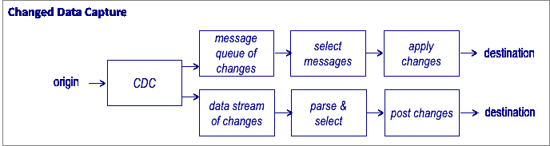

# 数据管道架构:构建数据管道的多种方式

> 原文：<https://medium.com/codex/data-pipeline-architecture-variety-of-ways-you-can-build-your-data-pipeline-66b3dd456df1?source=collection_archive---------1----------------------->

## 数据工程 101:

## 数据工程:超越宣传#2

数据管道是数据生命周期管理的主要构件。

[数据工程师](/codex/how-to-become-a-data-engineer-905686dee7ce)将 80%的时间花在数据管道、设计开发和解决问题上。

因为这对任何数据工程工作负载都非常重要，所以让我们尝试更深入地研究所有不同的架构，以构建数据管道。

**重述**

在上一集[中](/codex/7-best-practices-for-data-ingestion-f336c6b5128c)，我们学习了什么是数据工程，以及什么是数据摄取的最佳实践。

我们讨论了用于数据处理的批处理、流和 lambda 架构。

我们讨论了 [**数据摄取**](/codex/7-best-practices-for-data-ingestion-f336c6b5128c) 的 7 个最佳实践。

在这一集里，我们将整体谈论**数据管道**。

**为何选择数据管道:**

管道是用来把东西从一点转移到另一点的。

然而，数据管道做得更多。

数据管道是收集原始数据并将其转换为可操作的见解或业务信息的一系列步骤。

**但是我们为什么需要数据管道呢？**

大型企业中的源系统非常多样。例如，一家大型企业可能从 1。不同的交易系统，2。社交媒体，3。文件 4。视频 5。ERP 系统。营销系统，例如轮毂点 7。第三方分析平台，如谷歌分析。

因此，来自这些系统的原始数据可能有不同的协议和不同的结构。试图将它们标准化以便分析是极其复杂的。

数据管道用于将不同来源的所有数据收集到一个统一的系统中。

一旦数据得到统一，数据管道也有助于数据标准化，删除无效数据，净化数据，并根据后续的下游需求执行聚合和转换。

**数据管道的类型**

数据管道分类可以基于不同的参数来完成。然而，让我们考虑基于时间表、数据新鲜度和数据处理架构的不同类型。

*   **批处理**:数据流水线按特定的时间间隔进行调度。对于每日仪表板或定期报告非常有用。数据新鲜度低。
*   **流处理**:数据流水线在数据流动时连续执行。当事件时间和处理时间之间的差异需要最小化时使用，例如，跟踪异常、欺诈、动态定价等。数据是新的，但往往不准确。
*   **批处理+流处理**:将长时间运行的批处理模型与流分析相结合。数据仍然是新的，并且通过使用批处理的输出消除了不一致。

**数据管道的主要组成部分是什么？**

1.  来源
2.  目标/接收器
3.  数据和业务逻辑的转换
4.  数据质量验证

可以有更多的组件，例如:数据建模，数据可视化，但是，这 4 个是基本的构建模块。

那么在 ETL 中如何使用这些构建块来解决不同的用例呢？

## 原始数据加载

顾名思义，这些管道用于传输原始格式的数据。数据不变。仅涉及提取和加载，不应用任何转换。这些通常只运行一次，或者每天按照特定的计划运行。

[图片来源:作者](https://www.linkedin.com/in/saikatdt/)

**优点:**

1.  从一个数据库到数据湖的数据移动，从本地数据存储到云上的对象存储。
2.  数据通常以压缩的开放文件格式加载，如 Parque/ORC/Deltalke/Iceberg 等。因此，Datalake 中占用的存储空间较少。
3.  有助于使数据转换管道幂等。《出埃及记》即使后续的数据转换管道在一天中运行多次或重新运行，它们也会产生相同的数据。
4.  有助于调试源数据问题，而无需多次引用源数据。
5.  适合数据湖工作负载，并且大多仅在云上。

**缺点:**

1.  在另一层复制数据。
2.  不适合本地数据仓库工作负载。

**提取转换负载(ETL ) :**

提取-转换-加载(ETL)是最广泛使用的数据管道模式。从 20 世纪 90 年代早期开始，将数据集成到数据仓库中就成了标准。

从运营数据存储中提取数据，然后根据业务需求进行统一、清理和转换。数据也被建模以复制真实世界的实体。

[图片来源:作者](https://www.linkedin.com/in/saikatdt/)

《出埃及记》贷款申请数据来自贷款发放平台，贷款支付、交易来自应收贷款平台，信贷和其他第三方数据来自平面文件和数据馈送。

所有这些数据然后被分离以形成贷款事实、贷款交易事实、贷款支付事实、与贷款相关的不同维度表等。

**优点:**

1.  适合数据仓库工作负载。
2.  当需要复杂的数据转换时工作良好。
3.  由于不需要冗余的原始数据层，因此仅产生一个副本*。*
4.  *如果所有的源没有同时准备好，ETL 会很有用。只有当所有数据都可用时，转换才会发生。*

*缺点:*

1.  *非常耗时并且具有高延迟。可以进行微批处理，但延迟仍然是不可避免的。*

*2.复杂转换需要高计算能力。*

*3.由于 1 和 2，大数据不实用。*

*4.您经常有 ETL 工具和数据仓库提供者的供应商锁定。*

***提取负载转换(ELT ):***

*随着数据量的增加，提取-加载-转换作为 ETL 的替代变得流行起来。等待所有转换工作完成会延迟业务数据的可用性。因此，数据在提取后会立即加载。AI/ML 处理可以在没有数据建模的情况下发生。*

**

*[图片来源:作者](https://www.linkedin.com/in/saikatdt/)*

***优点:***

1.  *合适的数据湖实现*
2.  *减少延迟，因为数据可以更快地用于处理。*
3.  *可以加载各种数据结构、指令等。*

***缺点:***

1.  *不同层中数据的重复增加。结果在 ***两个+拷贝*** (原始和变换层/可选服务层)*

*2.数据质量受到影响，数据未经重复数据消除和清理就暴露出来。*

*3.通常会造成数据沼泽。*

*4.人们经常忘记或忽略 T-变换。*

***提取转换加载转换(ETLT ):***

*提取-转换-加载-转换(ETLT)模式是 ETL 和 ELT 的混合。转换的第一阶段是光转换，独立于所有其他数据源。数据清理、格式标准化和敏感数据屏蔽是第一阶段光转换的典型类型。*

**

***优点:***

1.  *提取数据时进行较小的转换、数据清理和过滤。*
2.  *非常实用的流水线设计，通过屏蔽解决了数据隐私问题。*
3.  *由于最初进行了一些过滤或转换，数据变成沼泽的机会就少了。*
4.  *启用湖边小屋架构。*

***缺点:***

1.  *仍然受到处理能力和延迟的限制。*
2.  *仍然生成**两个副本。***

*ELT/ETL 和数据湖或数据仓库的所有变化都受到以下因素的限制*

1.  *集中式数据团队*
2.  *增加调配新数据源的时间*
3.  *较低的灵活性服务于不同的部门和用例(ML/AI/Marketing/Sales/HR 等。)*

*数据网格和数据结构体系结构是基于集中式处理的数据湖/数据仓库/湖库的现代替代方案。数据网格/结构的关键促成因素是数据虚拟化和专用链路。*

## *数据虚拟化:*

*如图 6 所示，数据虚拟化为数据管道提供不同于其他模式的服务。大多数管道创建数据的物理副本。*

*虚拟化以视图的形式提供数据，而无需物理存储单独的版本。*

*虚拟化与数据抽象层一起工作。源层是最不抽象的。集成层组合和连接来自不同来源的数据，提供类似于 ETL 处理的转换结果的视图。*

**

*[数据虚拟化](https://www.eckerson.com/articles/data-pipeline-design-patterns#:~:text=Subscribe%20to%20the%20Data%20Management,translate%20directly%20into%20executable%20code.)*

*业务层用语义上下文表示数据，应用层为特定用例构建语义视图。*

1.  *与 ETL 处理不同，虚拟化过程是由查询启动的。*
2.  *查询在应用程序和语义上下文中发出，并通过集成层和源层进行转换，以连接正确的数据源。*
3.  *响应以相反的方向遍历路径，以获取源数据、转换和集成、呈现语义视图，并交付数据的应用程序视图。*

***优点:***

1.  *当人们想要尽可能最新的数据时，虚拟化可以很好地工作。*
2.  *虚拟化仅集成和转换请求和使用的数据*
3.  *零拷贝架构，无数据复制。*

***缺点:***

1.  *仅适用于适度的数据量*
2.  *可能难以处理复杂的转换或大量数据。*

## *数据流处理*

*低延迟 ETL 的最佳选择是数据流处理。*

*数据流处理包括数据流源，例如。传感器和 IOT 设备的日志、位置和来自物流中移动车辆的行程数据等。*

*流处理包括过滤和转换连续的数据流。*

**

*数据流处理([源](https://www.eckerson.com/articles/data-pipeline-design-patterns#:~:text=Subscribe%20to%20the%20Data%20Management,translate%20directly%20into%20executable%20code.))*

*处理从解析事件开始，将每个独特的事件隔离为不同的记录，并且只有与用例相关的事件被进一步处理。*

*在数据流的目的端，出现了两种不同的模式。*

*对于某些用例，事件被发布到消息队列、事件日志或事件档案中。一旦发布或存储，下游数据管道稍后进行数据消费。*

*对于其他用例，事件被*推送到*监控或警告应用程序。《出埃及记》货运公司实时异常、基于需求的动态定价等。*

***优点:***

1.  *流处理管道与传感器和物联网(IoT)设备一起工作。*
2.  *这种模式对于机器学习特别有用。*
3.  *对日志分析有用*
4.  *数据新鲜度高*

***缺点:***

1.  *在没有 Lambda 架构的情况下，数据精度不高。*

## *变更数据捕获*

*CDC 和 OLAP 用例可以解决数据延迟问题。CDC 允许新数据可用于 ETL 管道中的处理。*

*CDC 应用主要有两种类型:*

1.  *基于交易日期*
2.  *基于数据库日志*
3.  *基于触发器的*
4.  *基于差分方法(Diff)*

**

*更改数据捕获([源](https://www.eckerson.com/articles/data-pipeline-design-patterns#:~:text=Subscribe%20to%20the%20Data%20Management,translate%20directly%20into%20executable%20code.))*

***优点:***

1.  *降低数据仓库工作负载的延迟。*
2.  *提高数据新鲜度，接近实时或微批量 ETL。*

***缺点:***

1.  *复杂性增加。*
2.  *CDC 应用程序会增加额外成本。*

*既然我们已经介绍了不同类型和架构的管道，那么有几个通用的设计模式适用于几乎所有的处理技术。*

## ***可重复且相同:***

*重要的是 ETL 管道能够从固定的时间线重新运行，并产生相同的结果。*

1.  *以一种不可变的方式存储数据，作为带有日期时间的事务列表。*
2.  *这将允许计算是幂等的，并且不管是否回溯运行，都产生相同的结果。*

## ***自动化框架—模板化***

*使用编排工具/ Dags / corn jobs 实现数据管道自动化极其重要。管道应该解析所有的依赖关系并独立运行。*

*如果没有自动化，手动错误和延迟将加重工作人员的负担，并降低数据质量。*

*模板是不同数据管道的必备工具。这允许更快地提供新的资源，减少数据管道的开发和测试周期。*

## *可审计—(监控和记录)*

*重要的是在任何时间点了解什么管道正在运行，什么成功完成，什么失败。如果出现任何故障，应进行清除记录。*

*这将大大减少调试和错误处理的时间和工作量。*

*这还应该考虑到数据可观测性和数据沿袭，以允许每个人看到通过哪些管道应用了什么转换。*

## *可靠和安全(数据验证和质量保证)*

*数据质量是验证数据管道结果的一个关键参数。管道的设计应确保输出可靠，并实现最高的数据质量。*

*必须在源和目标中都进行 DQ 检查，并且必须配置警报。*

*这将建立利益相关者使用数据进行下游报告的信心。*

## *结论:*

*这可能是一篇博客中涵盖的数据管道架构的极其详尽的列表。我将在以后的另一篇文章中讨论其中一些的实际实现。*

*对于初学者来说，这似乎太多了。因此，一定要慢慢来，一次写一篇，当你需要任何参考资料的时候再回到博客上来。*

*然而，这些是数据管道的基本构建结构，是工具不可知的。如果我们对每一个都建立了坚实的基础知识，并能够区分利弊，这将有助于我们在任何 ETL/ELT/DI/编排工具中建立管道。*

## ***参考文献和进一步研究:***

1.  *[*数据虚拟化——工作原理。*](https://www.denodo.com/en/data-virtualization/how-it-works)*
2.  *[*数据管道设计模式。*](https://www.eckerson.com/articles/data-pipeline-design-patterns#:~:text=Subscribe%20to%20the%20Data%20Management,translate%20directly%20into%20executable%20code.)*

*3. [*《数据管道设计原则》*](https://towardsdatascience.com/data-pipeline-design-principles-e7fbba070b4a) 作者:Kovid Rathee*

*4.*[*3 工程数据设计原则*](https://blog.usebutton.com/3-design-principles-for-engineering-data)*作者[刘嘉琦](https://blog.usebutton.com/author/jiaqi-liu)***

***5.Terada 的数据网格和数据虚拟化不是一回事。***

***下周再见。***

***无论何时你准备好了，我有 3 种方法可以帮助你的职业发展***

1.  ***让我在这里 帮你辅导你的职业旅程 [**。**](https://topmate.io/saikatdutta)***
2.  ***在此 **下载详尽的数据工程路线图 [**。**](https://withsaikatdt.gumroad.com/l/DE2022)*****
3.  ***发展你的 LinkedIn 品牌，在这里 **获得多样化的 [**。**](https://topmate.io/saikatdutta/35302)*****

***在这里关注每周简讯 [**。**](https://withsaikatdt.gumroad.com/l/DEBH101)***