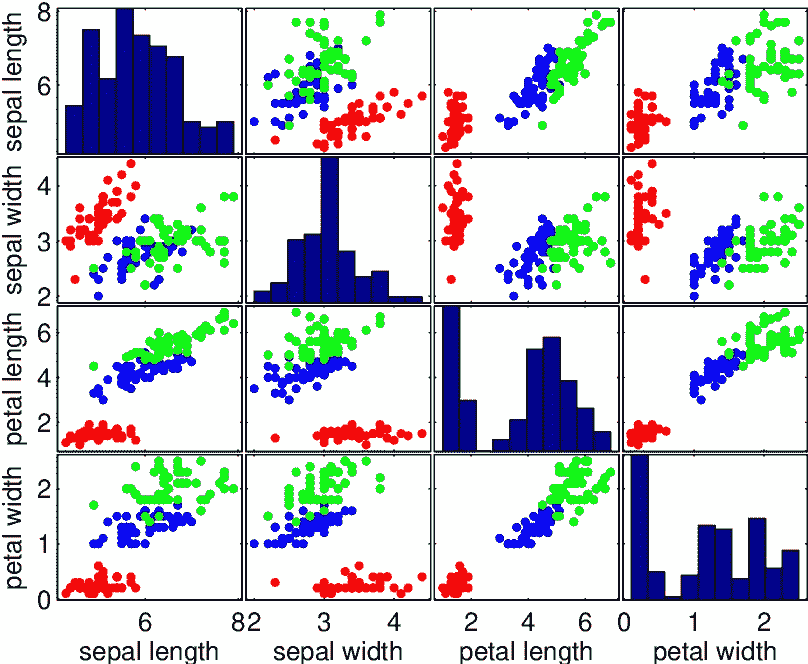
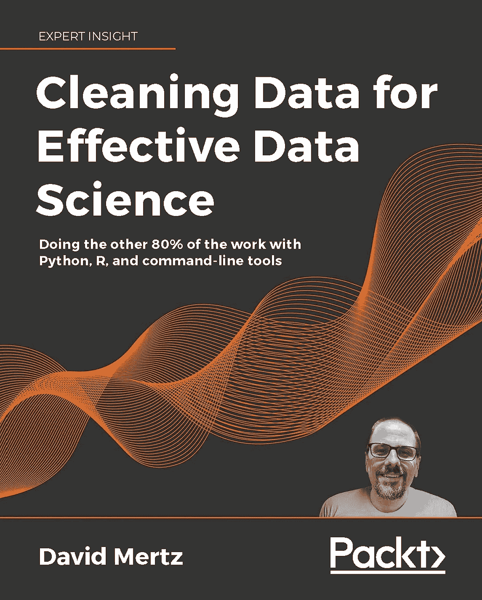
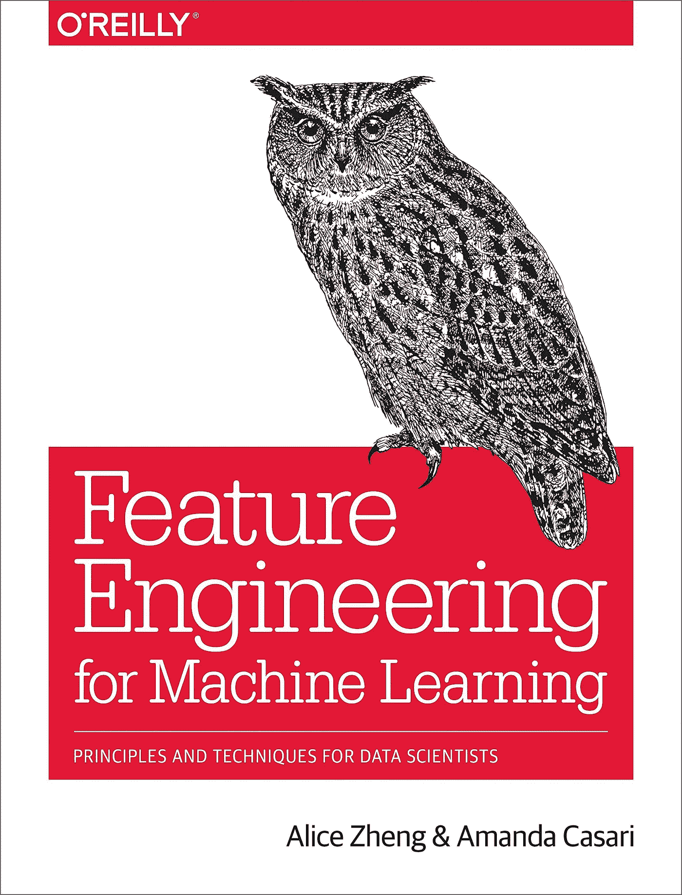

# 数据分析—与您的数据进行第一次约会

> 原文：<https://medium.com/codex/data-profiling-having-that-first-date-with-your-data-2e05de50fca7?source=collection_archive---------3----------------------->

来源:https://analyticsinsights.io/

“ [*知其数据*](https://www.brighttalk.com/webcast/679/162265/data-preparation-for-fast-insights-right-from-the-start) ”是声音数据科学的基本原则之一。另一个名称是数据分析。我简单的称之为*[*和你的数据*](https://www.digitalistmag.com/cio-knowledge/2019/06/27/data-strategy-that-first-date-with-your-data-06199224/) *第一次约会。”*我们在这里通过阐明以下四个了解数据的步骤来扩展数据剖析:(1)数据预览和选择；(2)数据清理和准备；(3)特征选择和工程化；以及(4)用于标准化和转换的数据分类。*

***数据预览和选择***

*对数据的了解始于对数据收集中好的、坏的和丑陋的部分的全面预览，并最终决定您将选择数据集的哪些部分进行数据科学分析。此活动包括检查数字属性，以查看它们的值是否在预期范围内(例如，每个属性的最小值和最大值都是可感知的)。它还包括检查离散分类属性的唯一值集(以查看值是否符合您的预期)-例如，如果属性是地址字段，值是否具有地址的格式？如果地址包含邮政编码(ZIPcode)，该编码的格式是否正确？如果属性是分类标注，那么标注是只有一个唯一的拼写，还是有多个拼写错误？*

*调用简单的 SQL 命令“SELECT UNIQUE *”可以在现实世界的数据库中发现令人惊讶的结果。数据的汇总和聚合也可以提供信息(例如，通过在数据库上执行 SQL“GROUP BY”聚合函数)。例如，对于连续的数字数据或离散的非数字数据值，数据分布(直方图)图可能很有启发性:数据直方图是否具有合理的分布？它有一条长尾巴吗？对称吗？*

*此外，属性的许多不同成对组合的多个 X-Y 散点图是数据的简单视觉总结，其可以快速暴露异常值、热点、趋势或者甚至退化的属性，其中或者对于给定属性，所有条目都是相同的，或者两个不同属性的值是完全相关的(例如，一百万客户的出生日期列表与客户的年龄列表具有完全一对一的相关性)。此外，如果可能的话，通过跨数据库比较执行外部检查(其中一些数据值可能被复制)可以用于验证数据值的一致性。*

**

*来源:[https://www . semantic scholar . org/paper/dimensionally-reduction-for-visual-exploration-of-Venna/05f 543 c 04 f 4 e 7c 570769 c9d 79 AC 4175 b 97146 FFB](https://www.semanticscholar.org/paper/Dimensionality-reduction-for-visual-exploration-of-Venna/05f543c04f4e7c570769c9d79ac4175b97146ffb)*

***数据清理和准备***

*为您的分析或机器学习项目选择属性后，您必须准备和清理这些数据值以供使用。教科书作者经常告诉我们，花在数据科学项目上的 40–60%的时间都花在了清理和准备上。我们中大多数从事这项工作足够长时间的人都会知道，这样的估计可能是非常错误的—事实上，90–95%的时间都花在数据清理和准备上并不罕见。这不是“浪费时间”相反，这种“数据日期”是时间的“良好投资”——通过使用尽可能干净的数据，您将对您的分析项目结果产生更大的信心和支持。*

**

*记住:数据科学家花 80%的时间清理数据，另外 20%的时间抱怨清理数据！:)*

*在[数据清理和准备](http://amzn.to/3xQCvhY)期间，你可能会惊讶地发现，你将比在数据预览阶段做更多的数据剖析。例如，您将发现数据的许多方面需要以某种方式进行“处理”(清理、删除或“修复”)，包括:空值、缺失值、错误、噪音或意外的数据工件。数据准备还包括数据标准化和转换，这将在下面单独讨论，因为这些活动通常需要主题和领域专业知识(例如，将属性转换为一些特定的物理单位，或根据两个特定属性的比率创建新的解释变量，或将 IP 地址转换为地理位置，如纬度/经度对)。*

*注意:一些项目特别关注异常值，即数据库中新奇和令人惊讶的部分——有意搜索异常行为——在这些情况下，您最想确定的是异常数据值是正在研究的对象的属性，而不是数据收集过程或数据管道中的工件。*

**

*来源:http://amzn.to/3xQCvhY*

***特征选择和特征工程***

*在选择并清理要使用的数据属性之后，是时候选择将用于针对数据提出的每个问题的属性子集了(即，测试您的数据科学假设)。不同的问题需要不同的属性才能得到最准确的答案。在数据分析的这一阶段，您选择将输入到您的数据科学任务(例如，预测分析、细分、建议或链接分析)中的输入(特征向量属性)。选择最具信息性和预测性的属性对于每个特定数据科学任务的有效性和成功至关重要。特征向量可能包含整个数据属性集的一个非常小的子集，这种简约的模型通常是首选的(即，如果您不能用简单、透明、可解释的模型来解释客户的行为，那么谁会相信一个非常复杂的模型呢？).*

*有些模型必然要复杂得多，比如赢得[网飞 100 万美元挑战赛](https://www.techdirt.com/articles/20120409/03412518422/why-netflix-never-implemented-algorithm-that-won-netflix-1-million-challenge.shtml)的推荐算法——在这种情况下，特征选择甚至更为关键(以避免过于臃肿的模型)。然而，为不同的分析问题选择不同的解释变量组合是至关重要的(例如，这是[随机森林算法](https://towardsdatascience.com/explaining-feature-importance-by-example-of-a-random-forest-d9166011959e)的定义特征)。*

*寻找数据属性的最佳组合是[特征工程](http://amzn.to/2CtCrd5)的一个例子。我在最近的一篇[媒体文章](/@kirk.borne/the-importance-of-location-in-real-estate-weather-and-machine-learning-8b12627c5744) : *中这样描述:“数据科学家面临的挑战是找到区分、理清和消除不同类别行为的最佳特征空间。有时(虽然不经常)那些最佳特征是我们在开始时测量的，但是我们通常可以在探索初始测量属性的不同组合(线性和非线性)时发现改进的分类特征。然后，改进的工程特征表示一个阶段空间，在该阶段空间中，先前未见过的数据项将简单地基于该项在改进的特征空间中的位置而得到更准确的分类。”**

**

*来源:[http://amzn.to/2CtCrd5](https://t.co/4gMmdYBxU8?amp=1)*

***用于标准化和转换的数据类型***

*数据科学算法的实际使用需要进一步调整数据值，特别是对于具有不同测量单位(如货币、物理、时间、空间)的属性。将此类属性转换为无量纲单位(例如，除以属性的特征值)或将一组相似的属性(例如，货币)转换为通用单位，可使算法发现数据中的真实趋势和模式，而不是由单位的简单不一致导致的虚假相关性。*

**

*给数据科学家上一堂简单的数据素养课:[https://www.youtube.com/watch?v=PTem6fRZzLs](https://www.youtube.com/watch?v=PTem6fRZzLs)*

*同样，使用归一化的值往往是非常方便和科学合理的，例如:将所有数值从最小值到最大值缩放到 0 到 1 的比例，或 0 到 100 的比例；或者将值缩放到零均值和单位方差( [Z 值归一化](https://en.wikipedia.org/wiki/Feature_scaling#Standardization_(Z-score_Normalization)))；或者将离散的分类数据转换成数值或排序列表(这对于有序的数据值尤其有效)；或将连续数据离散化成箱。在缩放的情况下，许多不同的属性因此在模型中被民主地加权，而不是给自然具有大数值的属性不公平的加权。这在距离度量(或相似性)计算中尤其重要，其中一个属性可能会不公平地支配和扭曲度量计算。*

*最后，当使用期望某种类型的数据输入的算法时，数据类型很重要，例如:回归模型的连续数值数据；用于贝叶斯、图形、关联或链接分析的离散数据值；逻辑回归的二元数据；或马尔可夫模型的序列数据。*

***结论***

*对数据的透彻了解有助于建立准确有效的数据科学模型。最终，数据分析是您的分析和机器学习项目“了解您的数据”的最佳途径。*

*在推特上关注我，地址:[@柯克伯恩](https://twitter.com/KirkDBorne)*

*了解更多关于我的自由职业咨询/培训业务:[数据领导集团有限责任公司](https://www.dataleadershipgroup.ai/)*

*看看我们在人工智能启动时在做什么*