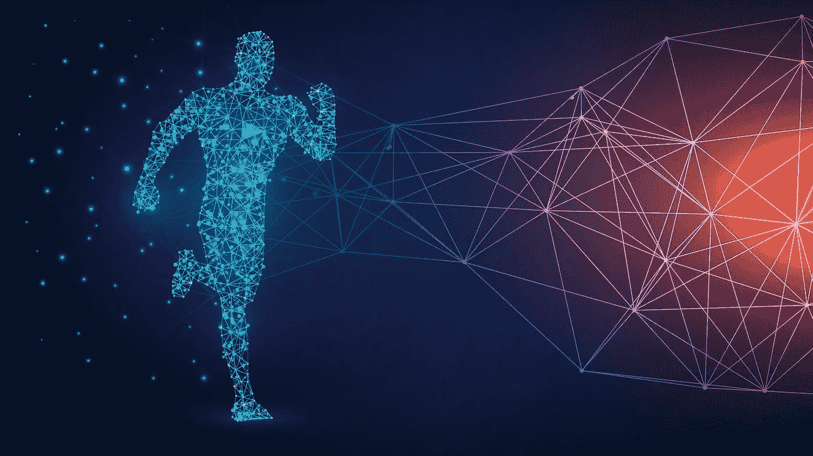
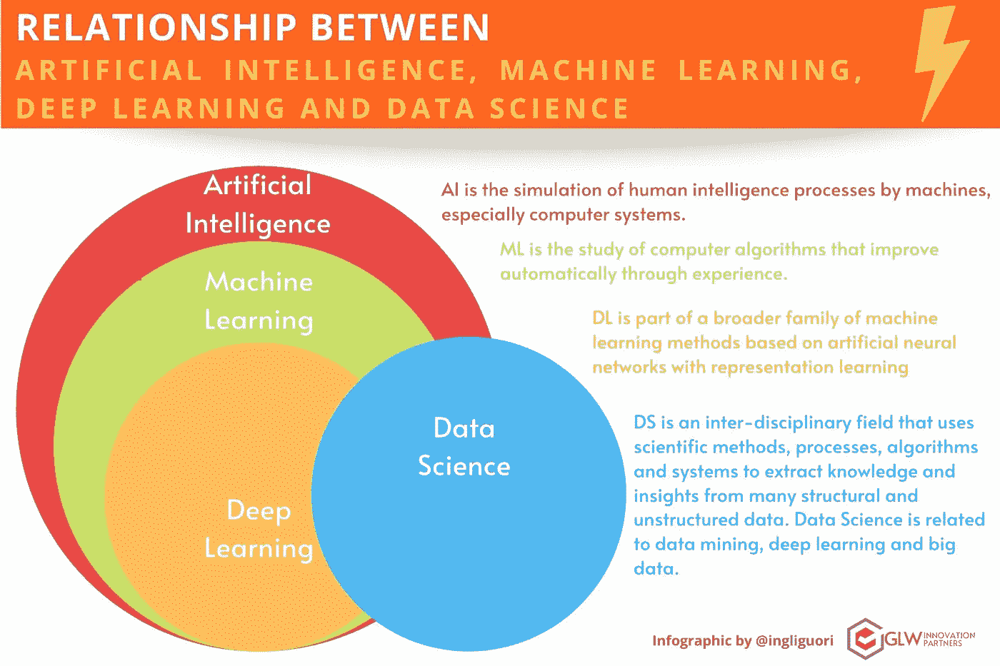
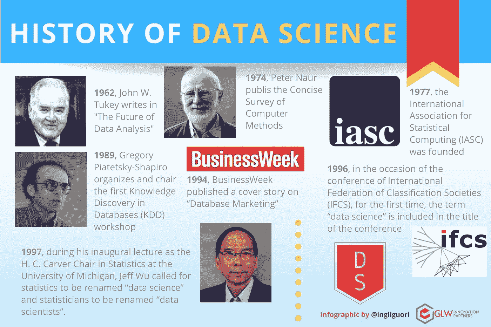
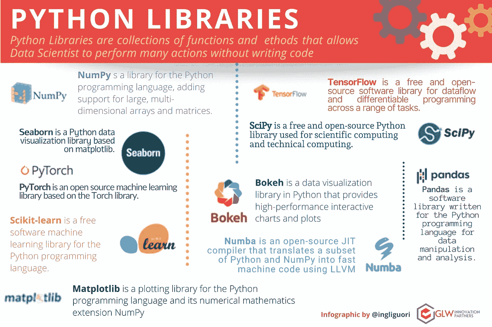

# 数据科学:高级概述

> 原文：<https://medium.com/codex/data-science-a-high-level-overview-cb076619cad2?source=collection_archive---------10----------------------->

在这个收集和存储来自不同领域的大量信息的时代，对这些信息的分析和价值提取已经成为公司和整个社会最具吸引力的任务之一。

*   简单来说什么是数据科学？
*   数据科学简史。
*   实践数据科学的挑战。
*   谁是数据科学家？
*   数据科学家的数据科学工具。
*   我们要去哪里？视角。

**简单来说，什么是数据科学？**

“数据科学”一词最近才出现，专门用来指代一种新的职业，这种职业有望理解海量数据的含义。但是理解数据有很长的历史，并且已经被科学家、统计学家、图书管理员、计算机科学家和其他人讨论了很多年。

如今，数据科学作为一个商业领域确实非常复杂，由于其显著的受欢迎程度，有许多关于数据科学的描述，例如:

数据科学关注的是分析数据并从中提取有用的知识。构建预测模型通常是数据科学家最重要的活动(Gregory Piatetsky，KDnuggets，【https://www.kdnuggets.com/tag/data-science】T4)

数据科学关注分析大数据，以提取与可能性和误差估计值的相关性。(布罗迪，2015 年 a)

数据科学是一门新兴学科，它利用统计方法和计算机科学的知识，为广泛的传统学术领域创造有影响力的预测和见解(哈佛数据科学倡议[https://datascience.harvard.edu)](https://datascience.harvard.edu))

然而，简单地说，**数据科学家只是试图从海量数据中获得洞察力，帮助公司做出更明智的商业决策**。我们还将数据科学定义为一种方法，通过这种方法可以从数据中推断出可行的见解。

数据科学使用各种面向数据的技术，包括 SQL、Python、R 和 Hadoop 等。然而，它也广泛使用统计分析、数据可视化、分布式架构等来从数据集提取意义。通过数据科学应用程序提取的信息用于指导业务流程和实现组织目标。

为了完成这一部分，我们还将提供数据挖掘、人工智能、机器学习和深度学习概念的简单定义，因为这些概念与数据科学相关，并且彼此相关。

*   数据挖掘旨在理解和发现数据中新的、以前未见过的知识。
*   人工智能(AI)关注的是让机器变得智能，旨在创造一个行为像人的系统。
*   机器学习是人工智能的一个子集。机器学习旨在开发能够从历史数据中学习的算法，并利用经验改进系统。
*   深度学习是 ML 的一个子集，其中数据通过多次非线性转换来计算输出。

图 1 人工智能、机器学习、深度学习和数据科学之间的关系

数据科学利用数据挖掘、机器学习、人工智能技术。

例如，深度学习需要在更强大的环境中运行 Jupyter。幸运的是，像 **Saturn Cloud** 这样的平台让用户可以方便地管理 Jupyter 开发环境。事实上，通过管理环境资源，用户可以在必要时在 CPU、GPU 和内存方面实现更多功能。因此，为云计算设计的平台可以保持较低的环境成本，允许数据科学家只为他使用的资源付费。

**数据科学简史**

数据科学已经彻底改变了我们世界的几个不同方面。让我们看看数据科学是何时何地产生的。

*   在 **1962** 年，约翰·w·图基在《数据分析的未来》中写道——对于聪明的美国数学家约翰·图基来说，这是数据科学史上的第一个里程碑。约翰·图基在统计学方面的影响是巨大的，但归功于他的最著名的新词与计算机科学有关。事实上，应该提到的是，他是第一个引入术语“比特”作为“二进制数字”的缩写。
*   1974 年，彼得·诺尔出版了《计算机方法简明调查》,调查了各种应用中的数据处理方法。“数据科学”这个术语变得越来越清晰，他给它下了自己的定义:“一旦数据被建立起来，处理数据的科学，而数据与它们所代表的东西之间的关系被委托给其他领域和科学。”
*   在 1977 年，国际统计计算协会(IASC)成立。
*   1989 年，Gregory Piatetsky-Shapiro 组织并主持了第一届数据库知识发现(KDD)研讨会。
*   1994 年，商业周刊发表了一篇关于“数据库营销”的封面故事
*   在 **1996** 年，在国际船级社联合会(IFCS)的会议上，术语“数据科学”第一次包含在会议的名称中(“数据科学、分类和相关方法”)。同年，乌萨马·法耶兹、格雷戈里·皮亚泰茨基-夏皮罗和帕德赖克·史密斯出版了《从数据挖掘到数据库中的知识发现》。
*   1997 年，在担任密歇根大学统计学 H. C. Carver 讲座教授的就职演讲中，Jeff Wu 呼吁将统计学更名为“数据科学”，将统计学家更名为“数据科学家”。

图 2 数据科学的历史

自 21 世纪初以来，数据储存量呈指数级增长，这在很大程度上要归功于处理和存储方面的优势，这种优势在规模上既高效又经济。“实时”收集、处理、分析和显示数据和信息的能力，给了我们进行新形式的知识发现的前所未有的机会。为了处理如此大量的数据，数据科学家还需要大量技术组合的高性能，以在几秒钟内加快任务和数据处理。

由于像**土星云**这样强大的平台，像人工智能、机器学习和深度学习这样的颠覆性技术如今对数据科学家来说是可用的。

**实践数据科学的挑战**

虽然分析的采用有所增加，但它也带来了自身的一系列挑战。Kaggle 在 2017 年对 16000 名数据专业人员进行了一项研究，向我们展示了他们在职业中面临的最困难的 10 项挑战:

1.  脏数据(报告了 36%)
2.  缺乏数据科学人才(30%)
3.  公司政治(27%)
4.  缺乏明确的问题(22%)
5.  数据不可访问(22%)
6.  决策者不使用的结果(18%)
7.  向他人解释数据科学(16%)
8.  隐私问题(14%)
9.  缺乏领域专业知识(14%)
10.  组织规模小，负担不起数据科学团队的费用(13%)

这些似乎是需要应对的巨大挑战。然而，我们需要认识到，在一个新的学科中，每向前迈出一步，都需要应对新的挑战。我们必须接受变革，我们必须确信变革有助于我们确保持续改进、获取新技能、扩展知识和探索新方法。

**谁是数据科学家？**

如上所述，随着运营数据的不断增长和新技术的不断涌现，我们越来越需要具备敏锐分析能力的专业人士，他们能够从海量数据中提取有价值的信息和见解，并做出准确的决策。我们称这类专家为“数据科学团队”，简称“数据科学家”。

数据科学家是一名分析数据专家，他应该熟练掌握必要的技术技能，以解决现代世界中的复杂问题。当今的新兴技术，如人工智能、物联网、5G、机器人、区块链等，都严重依赖数据，只有那些能够利用数据进行操作并将其转化为盈利产品的技术，才能引导未来的数字业务。

因此，数据科学家在每个公司和组织的业务发展战略中发挥着重要作用。正如 Thomas H. Devenport 和 D.J. Patil 所说，数据科学家是 21 世纪最性感的工作。

**数据科学家的数据科学工具**

大量软件工具可用于支持数据科学家深入数据科学世界。强大的在线平台，如 SaaS 或 PaaS，使数据科学家能够使用他们最熟悉的工具进行大规模工作:Python、Jupyter 和 Dask，它为在 AWS 环境中运行数据科学和机器学习工作负载提供了安全和可扩展的基础设施。数据团队可以利用自动化 DevOps 和 ML 基础设施工程大规模开发和部署 Python 中的数据科学模型。这些服务支持许多有用的 Python 库。

*“Python 库是函数和方法的集合，允许数据科学家在不编写代码的情况下执行许多操作。”*

*   **NumPy** s 是 Python 编程语言的库，增加了对大型多维数组和矩阵的支持。
*   **Seaborn** 是基于 matplotlib 的 Python 数据可视化库。
*   **TensorFlow** 是一个免费的开源软件库，用于数据流和一系列任务的差异化编程。
*   **PyTorch** 是基于 Torch 库的开源机器学习库。
*   Numba 是一个开源的 JIT 编译器，它使用 LLVM 将 Python 和 NumPy 的子集翻译成快速的机器代码
*   SciPy 是一个免费的开源 Python 库，用于科学计算和技术计算。
*   **Pandas** 是一个为 Python 编程语言编写的软件库，用于数据操作和分析。
*   Scikit-learn 是一个免费的 Python 编程语言的机器学习库。
*   Matplotlib 是 Python 编程语言及其数字数学扩展 NumPy 的绘图库
*   **Bokeh** 是 Python 中的数据可视化库，提供高性能的交互式图表和绘图。

图 3 Python 库

因此，这些平台提供了一个端到端的分析平台，所有这些都是用 Python 在 AWS 上实现的。这包括:

*   Dask 允许组织横向扩展 Python 并大幅减少运行时间。
*   一套**协作工具**，模型部署能力，以及机器学习生命周期的工具。
*   Prefect 提供了一个工作流程编排框架，消除了开发人员和数据科学家的手动工作。
*   与 Docker T1 和 T2 Kubernetes T3 等服务相集成，以便数据科学家可以构建自定义映像来满足他们的最佳开发预期。
*   **Jupyter 笔记本电脑**用于部署、管理和扩展 PyData 堆栈。

我们要去哪里？视角。

正如 John Tukey 所预测的那样:“*数据分析的未来可能会涉及巨大的进步、实际困难的克服以及为所有科学和技术领域提供巨大的服务*”。在过去的几年里，我们见证了许多数据驱动的技术创新，5G 闪电般的互联网速度，机器学习，云计算，区块链概念，值得注意的清单远非详尽无遗。数据的爆炸以及不断增长的技术能力仅仅是一个开始，随着技术创新，我们的生活变得越来越“智能”，它们可能会融入人类生活的方方面面。

**关注我的每日技术和创新更新**

[https://bit.ly/m/ingliguori](https://bit.ly/m/ingliguori)