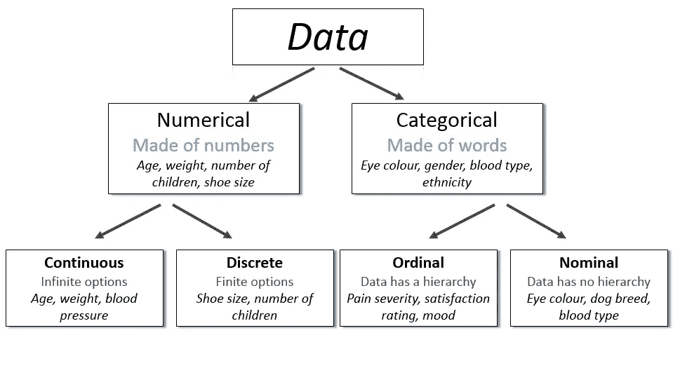

# 数据科学基础

> 原文：<https://medium.com/codex/data-science-basics-13d6109fe36e?source=collection_archive---------8----------------------->

## 数据科学术语的基本定义和常见问题

## **机器学习**

“机器学习是一种数据分析方法，可以自动创建分析模型。它是人工智能的一个子领域，基于这样一种想法，即系统可以从数据中学习，识别模式，并在很少或没有人工干预的情况下做出决策。”[5]

## **数据科学**

“数据科学是一个结合了领域经验、编程能力、数学和统计理解的研究领域，旨在从数据中提取有意义的见解。”[6]

## **监督学习 vs 非监督学习**

监督学习使用带标签的输入和输出数据，而无监督学习算法不使用标签。无监督学习从未标记的数据中创建模型，然而数据科学家仍然调整和修改算法，这意味着某种形式的监督。

## **回归 vs 分类**

回归算法和分类算法的主要区别在于，回归算法用于预测连续值，如价格、工资、年龄以及类似的数值。而分类算法用于分类(预测)离散值，例如男性/女性、真/假、垃圾邮件/非垃圾邮件以及类似的分类值。不要忘记，我们的模型预测所有情况下的数值，即使它是一个分类算法。

## **我们应该选择哪个型号？**

这个问题没有正确答案。从关于哪种算法在不同环境下效果最好的既定信息开始。最后，理想的选择是用大量的模型和调进行实验，以找到最优的解决方案。

## **常见数据类型**

常见数据类型[2]

## **连续数据是理论上的**

我们的数据是通过工具收集的，因此它具有精确性，这意味着数字不会永远跟在逗号后面。这意味着我们的数据实际上不是连续的。

## **预测**

用表示的“预测”是指在对历史数据集进行训练并在预测特定结果的可能性(如是否)时应用于新数据后，算法的输出。

**我们在机器学习方面的主要目标是让我们的训练模型的预测尽可能接近实际数据。**

## **过拟合与欠拟合**

“过度拟合是数据科学中的一个概念，当统计模型完全符合其训练数据时就会出现这种情况。…当模型记住了噪声并且与训练集过于接近时，模型就会“过度拟合”，并且无法很好地推广到新数据。”[3]

欠拟合是数据科学中的一种情况，数据模型无法准确捕捉输入和输出变量之间的关系，从而在训练集和测试数据上产生很高的错误率[4]

## 我们应该怎么做才能不过度节食？

作为最简单的解决方案，我们将数据分成三部分。这些部分是训练、验证和测试。我们用训练部分训练我们的模型，通过验证来检查(我们调整我们的模型以减少误差)。我们只在最后使用测试部分来测试我们的模型(就像现实生活中的测试一样)。验证和测试部分必须是我们实际期望作为输入的数据。例如，如果我们正在等待来自手机的猫图片，我们不能将 4k 或 144p 的猫图片放入我们的测试部分。

## **偏向**

偏差是指由于机器学习过程中的错误假设，算法系统地产生有偏差的结果。

偏差可能是因为数据形成过程中人的偏差，也可能是实际事实有偏差。因此，我们冒着降低模型成功的风险使模型保持中立，这对我们来说是道德的。

让不同背景的人参与数据收集、分析和预测等过程是减少偏见的好方法。

## **使用别人的数据**

最理想的做法是创建自己的数据。但是由于时间或经济原因，我们可能会使用其他人的数据。我们不应该忘记这些数据中可能存在偏差。如果数据收集者试图证明什么，他们收集的数据可能有偏见。此外，我们应该注意数据的文档化程度。

喜欢我的帖子请别忘了鼓掌。谢谢你。

**参考文献**

[1]Patika.dev，(2021 年)，Veri bilimine giri:

[https://app.patika.dev/moduller/veri-bilimine-giris](https://app.patika.dev/moduller/veri-bilimine-giris)

[2]AskDataScience，(2020 年 2 月 19 日)，数据科学中最常见的数据类型是什么:

 [## 数据科学中最常见的数据类型是什么？

### 主要的数据类型有哪些？

askdatascience.com](https://askdatascience.com/834/what-are-the-most-common-data-types-in-data-science) 

[3] [**IBM 云教育**](https://www.ibm.com/cloud/learn/education) ，(2021 年 3 月 3 日)，什么是过度拟合？

 [## 什么是过度拟合？

### 了解如何避免过度拟合，以便能够准确地概括模型之外的数据。

www.ibm.com](https://www.ibm.com/cloud/learn/overfitting) 

[4]IBM 云教育(2021 年 3 月 23 日)，不足:

 [## 什么是不合身？

### 了解如何避免欠拟合，以便您可以在模型之外准确地概括数据。

www.ibm.com](https://www.ibm.com/cloud/learn/underfitting) 

[5]SAS 印度，(？)，机器学习:

 [## 机器学习:它是什么，为什么重要

### 机器学习是一种自动建立分析模型的数据分析方法…

www.sas.com](https://www.sas.com/en_in/insights/analytics/machine-learning.html) 

[6]datarobot，(？)，数据科学:

[https://www.datarobot.com/wiki/data-science/](https://www.datarobot.com/wiki/data-science/)