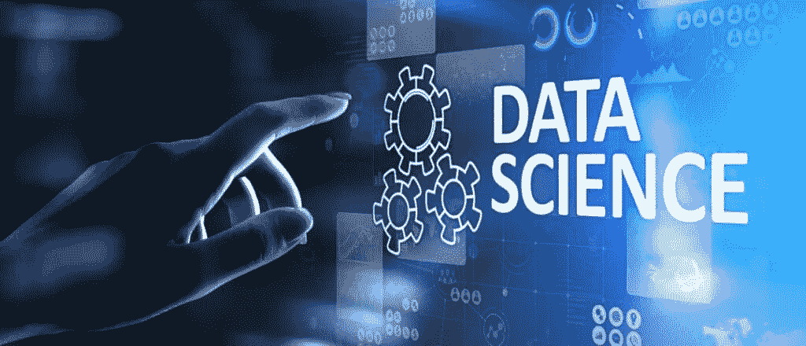

# 数据分析的数据科学:数据科学初学者指南

> 原文：<https://medium.com/codex/data-science-for-data-analytics-a-beginners-guide-to-data-science-95a0ec3a5cae?source=collection_archive---------18----------------------->

## 你需要知道的。

数据科学是从数据中提取知识或见解的过程。这可以通过统计分析、机器学习或自然语言处理来完成。

数据科学用于各种行业，包括金融、医疗保健和零售。