# 数据科学面试准备系列:朴素贝叶斯

> 原文：<https://medium.com/codex/data-science-interview-preparation-series-part-2-naive-bayes-9b93b1bef16e?source=collection_archive---------8----------------------->

> 这是数据科学面试准备系列的第 2 部分。这是第一部分的链接。

摘自 [Unsplash](https://unsplash.com/photos/eF7HN40WbAQ)

这篇文章的结构与大多数文章不同。一般来说，文章包括副标题和描述。在本文中，我积累了关于朴素贝叶斯的最基本的问题，并以一种使文章详尽和自给自足的方式回答了这些问题。这些问题是有序的，因此每个后续问题都建立在前一个问题的基础上，模拟面试官如何测试你的朴素贝叶斯知识。为了更好的理解，我还在中间插入了图片，如果你还想满足你的好奇心，我还提供了链接参考。

**那么让我们开始吧！！！:)))**

# 什么是朴素贝叶斯？能简单介绍一下算法吗？

朴素贝叶斯是一种受监督的机器学习算法，可以通过训练将数据分类到多类类别中。朴素贝叶斯算法的核心是概率模型，它计算输入要素的条件概率，并将概率分布分配给每个可能的类。

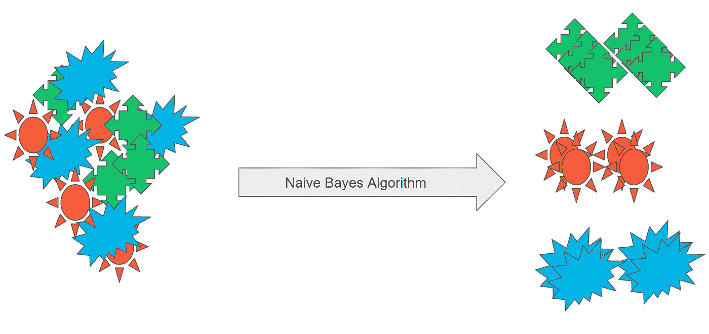

图片取自 [Udacity 数据科学纳米学位](https://www.udacity.com/course/data-scientist-nanodegree--nd025)

# 你谈到这个模型是一个概率模型。能否详细阐述一下背后的数学概念，朴素贝叶斯是一个什么样的模型？

让我们把这个问题分成两部分:

1.  **朴素贝叶斯**中使用的数学概念，**贝叶斯定理**
2.  **朴素贝叶斯属于被称为生成模型的模型类别**

**巴耶定理:**

朴素贝叶斯基于统计学中的贝叶斯定理。它基于条件和无条件独立计算每一类的概率，然后预测结果。让我们更详细地解释一下:

最初，我们从一个事件开始，这个事件可能是 A 或 B。每个事件的概率显示为 P(A)和 P(B)。现在，我们观察第三个事件，对于 A 和 B，该事件可能发生，也可能不发生。R 将帮助我们通过以下方式找到 A 和 B 的更精确的概率。

计算给定 a 的 r 的概率(记为 P(R|A))，以及给定 a 的 r 补的概率(记为 P(Rᶜ|A)).)类似地，P(R|B)和 P(Rᶜ|B).

这四组场景是:

*   P(R ∩ A)
*   P(Rᶜ ∩ A)
*   P(R ∩ B)
*   p(rᶜb)

但是既然我们知道 R 发生了，我们知道第二个和第四个事件是不可能的。我们的新宇宙由两个事件组成，P(R ∩ A)和 P(R ∩ B)。

*   P(R ∩ A) = P(A)P(R|A)
*   P(R ∩ B) = P(B)P(R|B)

因为这些概率加起来不等于 1，所以我们将它们除以它们的和，这样新的归一化概率现在就等于 1 了。

标准化概率:

因此，我们得到了 P(A|R)和 P(B|R)的公式

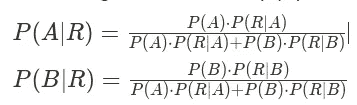

在我们知道 R 发生后，这些是我们新的和改进的 A 和 B 的概率。

最后，我们有了贝叶定理的完整公式。

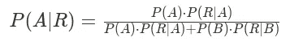

**生成模型:**

朴素贝叶斯是一种生成分类器。它通过对数据集执行操作来学习数据集的实际分布。它不像在判别模型中那样创建决策边界来对数据进行分类。这些模型使用**概率估计**和**可能性**来模拟数据点，并区分数据集中的不同类别标签。要了解更多关于生成和判别模型的信息，请参考我在 Twitter 上写的这条帖子:

# 你能从似然、先验和证据的角度定义贝叶斯定理吗？

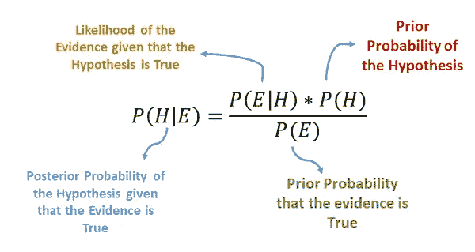

图片描述了贝叶斯定理，摘自另一篇[媒体文章](/analytics-vidhya/naïve-bayes-algorithm-5bf31e9032a2)。

# 朴素贝叶斯只对离散数据有效吗？如果不是，可以用于什么样的数据？

朴素贝叶斯可以适用于离散的、连续的和不能用数字表示的数据。我们有不同类型的朴素贝叶斯分类器:

1.  高斯朴素贝叶斯
2.  伯努利朴素贝叶斯
3.  多项式朴素贝叶斯

让我们更深入地了解每一种类型:

**高斯朴素贝叶斯:**

高斯朴素贝叶斯是遵循高斯正态分布并支持连续数据的朴素贝叶斯的变体。

假设特征的可能性为:

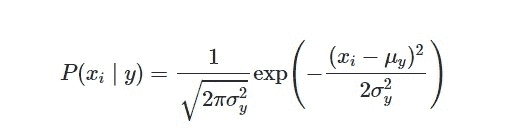

有时假设方差

*   独立于 Y(即σi)，
*   或者独立于 Xi(即σk)
*   或者两者都有(即σ)

高斯朴素贝叶斯支持连续值的要素和模型，每个要素和模型都符合高斯(正态)分布。

一种创建简单模型的方法假设高斯分布描述了维度之间没有共方差(独立维度)的数据。该模型可以通过简单地找到每个标签内的点的平均值和标准偏差来拟合，这是定义这种分布所需要的。

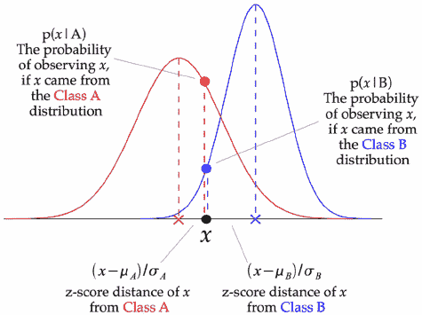

图片摘自关于[高斯 NB](https://iq.opengenus.org/gaussian-naive-bayes/) 的文章

上图显示了高斯朴素贝叶斯(GNB)分类器的工作原理。在每个数据点，计算该点与每个类平均值之间的 z 得分距离，即与类平均值的距离除以该类的标准差。

因此，我们看到高斯朴素贝叶斯有一个稍微不同的方法，可以有效地使用。以上内容摘自这篇[文章](https://iq.opengenus.org/gaussian-naive-bayes/)。

**伯努利朴素贝叶斯:**

这用于离散数据，适用于伯努利分布。Bernoulli Naive Bayes 的主要特征是，它只接受二进制值形式的特征，如真或假、是或否、成功或失败、0 或 1 等等。所以当特征值是二进制的时候，我们知道我们必须使用伯努利朴素贝叶斯分类器。

当我们处理二进制值时，让我们考虑' p '是成功的概率，' q '是失败的概率，q=1-p .对于伯努利分布中的一个随机变量' X ',

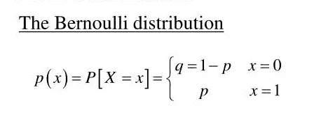

图片摘自关于[伯努利 NB](https://iq.opengenus.org/bernoulli-naive-bayes/) 的文章

*其中“x”只能有两个值，要么是 0，要么是 1*

**伯努利朴素贝叶斯分类器基于以下规则(可能性):**

p(xᵢ∣y)= p(∣y)xᵢ+(1 p(∣y))(1xᵢ)

以上内容摘自[篇](https://iq.opengenus.org/bernoulli-naive-bayes/)。最初的文章也展示了它使用表格数据的工作方式。

**多项朴素贝叶斯:**

多项式模型提供了对无法用数字表示的数据进行分类的能力。它的主要优点是大大降低了复杂性。它提供了使用小训练集来执行分类的能力，而不需要连续地重新训练。

多项式朴素贝叶斯广泛用于根据文档内容的统计分析将文档分配到类别中。它为“繁重的”基于人工智能的语义分析提供了一种替代方案，并大大简化了文本数据分类。它被广泛用作基于距离的 K-Means 聚类和决策树森林的替代方法。它将概率视为数据属于特定类别的“可能性”。

算法:

让𝑺 —一个输入字符串，𝑫 —一个𝒛-documents 语料库，𝑪 —一个𝒎-classes:集

**计算样本** 𝑺 **的类别** 𝑪ₛ **如下:**

1.  将样本𝑺分割成一组𝒏-terms
2.  对于每个𝒌-th 级𝑪ₖ 𝒌=𝟭..𝒎，请执行以下操作:

*   计算𝒏-features ∀𝒘ₖᵢ ∈ 𝑾的向量𝑾，其中𝒘ₖᵢ是相应的𝒊-th 术语在𝑪ₖ.的文档中出现的频率
*   评估先前的𝒑(𝑪ₖ)作为文档出现在来自𝑪ₖ.类别的文档中的全概率
*   计算后验𝐏𝐫(𝑪ₖ | 𝑾)的方法是将先验𝒑(𝑪ₖ)加到每项𝒘ᵢ的总和上，给定𝑪ₖ，概率𝒑(𝒘ᵢ | 𝑪ₖ):

后验𝐏𝐫(𝑪ₖ | 𝑾)公式

3.确定𝑪ₛ为𝑺的一类，其中𝐏𝐫(𝑪ₖ | 𝑾) 𝒌=𝟭..𝒎是最高的:

𝑺计算的𝑪ₛ类

该算法的复杂度 **𝜎** 被评估为:

多项式贝叶斯分类器复杂度( **𝜎**

𝒛—𝒏𝑫的文档总数—𝒎𝑺样本中的术语数—𝑪的类数

作者的上述表达方式在原文[这里](https://towardsdatascience.com/multinomial-na%C3%AFve-bayes-for-documents-classification-and-natural-language-processing-nlp-e08cc848ce6)中得到了精美的推导。:)

# 以上所有方法都是在监督下进行的。你认为朴素贝叶斯可以用其他方式训练吗？

朴素贝叶斯算法可以调整为在半监督设置中进行训练。半监督学习提供了提高多项式模型性能的能力。此外，它允许通过基于已经分类的文档的语料库训练模型来提高分类的质量。

半监督学习算法相当直观简单且公式化，例如:

1.  使用上面讨论的多项式模型计算𝑺的𝑪ₛ等级。
2.  将标有𝑪ₛ的𝑺加入𝐷.文献集
3.  重新评估分类模型。

按照以下流程对每个新的𝑺.样本进行分类

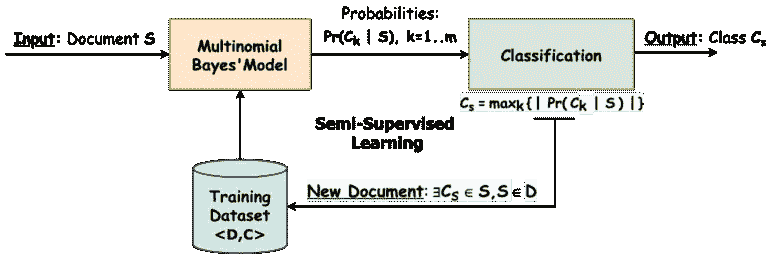

半监督学习过程([来源](https://towardsdatascience.com/multinomial-na%C3%AFve-bayes-for-documents-classification-and-natural-language-processing-nlp-e08cc848ce6))

# 朴素贝叶斯算法有什么好处？

它比逻辑回归等简单算法更有效。它还可以很好地处理分类数据和数值数据。此外，使用朴素贝叶斯分类器非常简单快捷。复杂的高维数据非常适合朴素贝叶斯分类器。它也可以使用带有半监督学习的小标签数据集来训练。

换句话说:

*   它对干净和有噪声的数据都有很好的表现。除了一些实验观察，我找不到对这种行为的任何好的解释，但这里有一个关于 quora[的好答案，可能会对此有所启发。](https://www.quora.com/Which-is-more-robust-to-noisy-data-a-Decision-Tree-or-Naive-Bayes)
*   训练需要几个样本，但基本假设是训练数据集是总体的真实表示。
*   获得预测的可能性很简单。

# 朴素贝叶斯比逻辑回归这样的简单算法更好有什么确定的原因吗？它总是正确的吗，或者有什么特别的地方吗？

吴恩达教授和迈克尔一世·乔丹教授的这篇论文提供了这两个模型的误差性质的数学证明。他们得出结论，当训练规模达到无穷大时，判别模型:逻辑回归比生成模型朴素贝叶斯表现更好。然而，生成模型比判别模型(O (n))更快地达到其渐近解(O(log n))，即，生成模型(朴素贝叶斯)比判别模型(逻辑回归)更少的训练集达到渐近解。

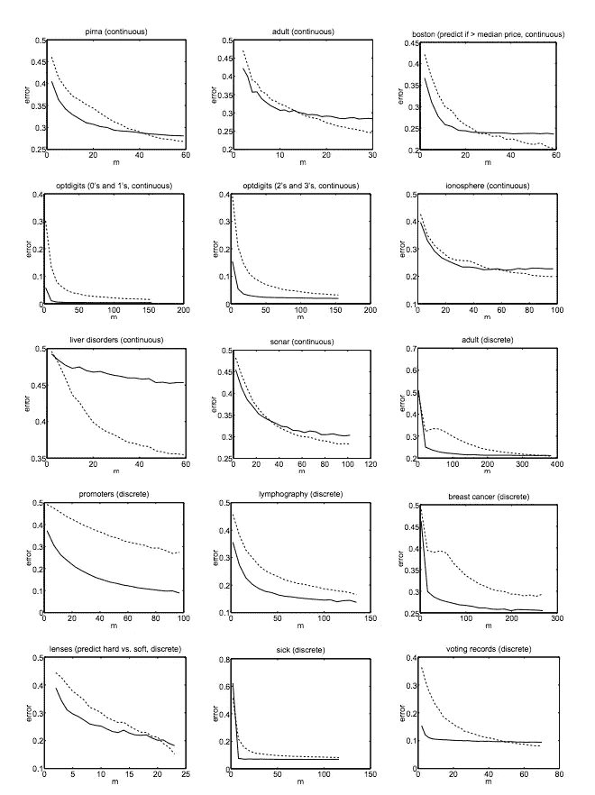

显示 NB 和逻辑回归性能的图像([来源](/@sangha_deb/naive-bayes-vs-logistic-regression-a319b07a5d4c)

朴素贝叶斯还假设特征是条件独立的。真实的数据集从来都不是完全独立的，但是它们可以很接近。简而言之，**与逻辑回归相比，朴素贝叶斯具有更高的偏差但更低的方差。如果数据集遵循偏差，朴素贝叶斯将是更好的分类器。**朴素贝叶斯和逻辑回归都是线性分类器。逻辑回归使用直接函数形式预测概率，而朴素贝叶斯则根据结果计算出数据是如何生成的。

# 你能详细阐述一下你对偏差和方差的理解吗？

要回答这个问题，最好把它分解成更基本的问题，比如:

1.  什么是偏差和方差？
2.  欠拟合和过拟合与偏差和方差有什么关系？
3.  从数学公式上来说，偏倚和方差是如何构成模型的总误差的？

所有这些问题都可以在我写的关于 Twitter⬇️的帖子中找到答案

# 为什么认为复杂高维数据很适合朴素贝叶斯分类器？

朴素贝叶斯隐式地将所有特征视为彼此独立。因此，当处理高维数据时，各种维数灾难问题通常不会出现。

如果您的数据具有 k 维，那么尝试学习这些特征之间所有可能的相关性的完全通用的 ML 算法必须处理 2ᵏ可能的特征相互作用，因此需要 2ᵏ数量级的许多数据点来执行。然而，因为朴素贝叶斯假设特征之间是独立的，所以它只需要 k 数量级的数据点，指数级地更少。

然而，这是以只能捕获输入变量和输出类之间更简单的映射为代价的，因此当涉及到图像识别等任务时，朴素贝叶斯永远无法与在大型数据集上训练的大型神经网络竞争，尽管它可能在非常小的数据集上表现更好(但具有更多功能)。

这是我写的一篇关于维数灾难的 Twitter 帖子。随意参考。:)

# 朴素贝叶斯分类器有哪些缺点？

朴素贝叶斯分类器遭受“[零频率](https://www.atoti.io/how-to-solve-the-zero-frequency-problem-in-naive-bayes/)问题。当某个类别不在训练集中时，就会发生这种情况。它会给它 0 的概率。

它最大的缺点是认为特征是相互独立的，因为在现实生活中，不可能得到独立的特征。所有的特征在某种程度上都是相互关联的。

# 你知道解决“零频率”问题的方法吗？

克服这种“零频率问题”的一种方法是，当一个属性值不是与每个类值一起出现时，为每个属性值-类组合的计数加 1。

这将导致从类中移除所有零值，同时不会影响类的整体相对频率。

在上面的例子中，我们将垃圾邮件和垃圾邮件的字数都增加了 1。然后，我们计算一封带有“办公室”、“富人”、“富人”和“金钱”字样的新邮件是垃圾邮件或火腿的概率。

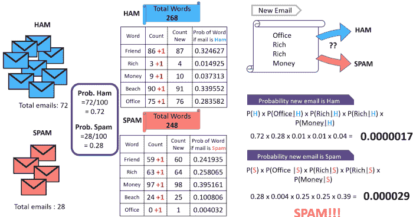

该图显示了添加一个常数来解决 NB( [源](https://www.atoti.io/how-to-solve-the-zero-frequency-problem-in-naive-bayes/))中的零频率问题的效果

当分子中特定情况的概率为零时，我们可能会遇到零除法误差。为了减轻这种情况，我们可以使用拉普拉斯平滑，即在分子中增加一个数字，在分母中增加另一个数字。

这篇文章的下两个问题不像其他问题那样笼统。他们专注于使用我们讨论的主要算法解决的问题。我故意这样做是为了指出探索和调查是好的。如果你用自己做过的例子来解释概念，面试官会很感激。 *会显示你喜欢深挖事物；基本上，你是个书呆子，会成为公司的资产。*

# 你能举个例子解释一下朴素贝叶斯的整体分类过程吗？

我们以**垃圾邮件分类**为例。特定单词在垃圾邮件和合法邮件中出现的概率特定。过滤器事先不知道这些概率，并且必须首先被训练，以便它可以建立它们。为了训练过滤器，用户必须手动指示新电子邮件是否是垃圾邮件。对于每个训练电子邮件中的所有单词，过滤器将调整每个单词在其数据库中出现在垃圾邮件或合法电子邮件中的概率。

训练后，单词概率(也称为似然函数)用于计算包含特定单词集的电子邮件属于任一类别的概率。电子邮件中的每个单词都会影响垃圾邮件的概率，或者只影响最感兴趣的单词。这种贡献被称为后验概率，并使用贝叶斯定理计算。然后，计算电子邮件中所有单词的垃圾邮件概率，如果总数超过某个阈值(比如 95%)，过滤器会将该电子邮件标记为垃圾邮件。

如果我们要总结将邮件分类为垃圾邮件或 ham 的整个过程，我们可以这样做:

1.  计算单个单词的垃圾邮件数量。
2.  把所有的单词概率结合起来，得到一个分数。
3.  将分数与阈值进行比较，并给出最终结论。

**计算单个单词的垃圾信息**

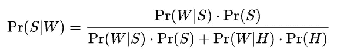

其中:

*   Pr(S|W)是一条消息是垃圾邮件的概率，知道这个词在里面；
*   Pr(S)是任何给定消息是垃圾邮件的总体概率；
*   Pr(W|S)是该词出现在垃圾短信中的概率；
*   Pr(H)是任何给定消息不是垃圾邮件(是“ham”)的总概率；
*   Pr(W|H)是该单词出现在 ham 消息中的概率。

此公式中使用的数字 Pr(W|S)近似于在学习阶段识别为垃圾邮件的消息中包含特定单词的消息的频率。类似地，Pr(W|H)近似于在学习阶段识别为 ham 的消息中包含特定单词的消息的频率。为了使这些近似有意义，学习到的信息集需要足够大和有代表性。

当然，仅根据单个单词的存在来确定一条消息是垃圾邮件还是 ham 是容易出错的。贝叶斯垃圾邮件软件试图考虑几个词，并结合它们的垃圾邮件，以确定邮件是垃圾邮件的总体概率。

**综合所有单词概率得到一个分数**

消息中出现的单词是[独立事件](https://en.wikipedia.org/wiki/Statistical_independence)。这个条件一般不满足(例如，在英语这样的自然语言中，找到一个形容词的概率受到拥有一个名词的概率的影响)。尽管如此，这仍然是一种有用的理想化，尤其是因为单个单词之间的统计相关性通常是未知的。在此基础上，可以从贝叶斯定理推导出以下公式:

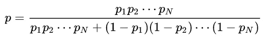

其中:

*   p 是可疑消息是垃圾邮件的概率；
*   p₁是第一个单词(例如，“副本”)出现的概率 p(W₁|S)，假定该消息是垃圾邮件；
*   p₂是第二个单词(例如，“手表”)出现的概率 p(W₂|S)，假定该消息是垃圾邮件；
*   等等..…

通常将结果 *p* 与给定的阈值进行比较，以决定该消息是否是垃圾邮件。**如果 *p* 低于阈值，则认为该消息可能是 ham 否则，它被视为可能的垃圾邮件。**

# 你能告诉我使用基于贝叶斯的垃圾邮件过滤模型的优点和缺点吗？

**优点:**

可以在每个用户的基础上训练朴素贝叶斯垃圾邮件过滤模型。用户的垃圾邮件通常与在线用户的活动有关。例如，用户可能已经订阅了被用户视为垃圾邮件的在线时事通讯。该在线简讯可能包含所有简讯通用的词语，例如简讯的名称及其原始电子邮件地址。贝叶斯垃圾邮件过滤器最终会根据用户的特定模式分配更高的概率。

单词概率对每个用户来说都是唯一的，并且每当过滤器对电子邮件进行错误分类时，单词概率会随着时间的推移而随着纠正训练而演变。因此，训练后的贝叶斯垃圾邮件过滤准确性通常优于预定义的规则。

由于同样的原因，**它可以很好地避免误报**，即合法的电子邮件被错误地归类为垃圾邮件。例如，如果电子邮件包含单词“Nigeria”，预定义的规则过滤器可能会直接拒绝它，这是预付费用欺诈垃圾邮件中常用的单词。贝叶斯过滤器会将单词“尼日利亚”标记为可能的垃圾邮件单词，但会考虑通常表示合法电子邮件的其他重要单词。例如，配偶的名字可能强烈表明该电子邮件不是垃圾邮件，这可能会克服“尼日利亚”一词的使用

**缺点:**

NB 垃圾邮件过滤模型可能容易受到[贝叶斯中毒](https://en.wikipedia.org/wiki/Bayesian_poisoning)的影响，这是垃圾邮件制造者用来降低依赖贝叶斯过滤的垃圾邮件过滤器效率的一种技术。实践贝叶斯中毒的垃圾邮件发送者将发送带有大量合法文本(从合法新闻或文学来源收集)的电子邮件。[垃圾邮件制造者](https://en.wikipedia.org/wiki/E-mail_spam)的策略包括插入通常与垃圾邮件无关的随机无害单词，降低电子邮件的垃圾邮件分数，并使其更有可能逃过贝叶斯垃圾邮件过滤器。

解决这个问题的一个办法是使用保罗·格拉厄姆的方案，其中只使用最重要的概率。用非垃圾邮件相关的单词填充文本不会显著影响检测概率。

# 总结全文

这篇文章到此为止！

当在面试中被问到上述所有问题时，这些问题足以解决任何关于朴素贝叶斯的讨论。当然，如果你要进入一家研究公司，你需要对算法有更深刻的理解，以及如何使用它来解决你试图解决的研究问题。

作为结束语，我想宣布我是**专业书呆子**。事实上，我想成为一个书呆子，并鼓励你也成为一个！！！！

对某件事成为一个书呆子表明你热爱你所做的事情，会让你过上更满意的生活。工作看起来不再像工作；这意味着，在某个时候，如果我们的手艺足够好，我们将会得到报酬去享受乐趣！但是成为一个书呆子并不容易。在开始的时候，你必须强迫自己利用你的休息时间来做你的手艺，并且痴迷于它！关于这个我已经在本系列的 [**第一篇**](/@rohit18115/data-science-interview-preparation-series-part-1-perspective-shift-237e79ffd555) 中写的比较多了。请去看看！:)

最后但同样重要的是，你可能已经注意到，我把你们带到了各种 Twitter 帖子，这些帖子在文章的很多地方都涉及到了更基本的概念。我希望它能帮助你快速入门这些主题，如果你想查看更多这样的线程，这里有一个链接到我的🔥主线程🔥，这是我迄今为止编写的所有 DS、ML 和 python 线程的集合。

# 感谢

如果没有其他人写的大量关于朴素贝叶斯和其他基本概念的文章和博客，这篇文章是不可能完成的。我想衷心感谢各自的作者做了如此伟大的工作！

我不得不承认，整理问题并找到这些问题的最佳答案需要花费大量时间。所以大部分答案都是直接从文章/博客中摘抄而来，稍加编辑或转述。

# 参考

(排名不分先后)

[保罗·格拉厄姆改进贝叶斯垃圾邮件过滤的方案](http://www.paulgraham.com/spam.html)

[为什么朴素贝叶斯这么幼稚？](https://towardsdatascience.com/whats-so-naive-about-naive-bayes-58166a6a9eba)

[高斯朴素贝叶斯](https://iq.opengenus.org/gaussian-naive-bayes/)

[伯努利朴素贝叶斯](https://iq.opengenus.org/bernoulli-naive-bayes/)

[多项式朴素贝叶斯](https://towardsdatascience.com/multinomial-na%C3%AFve-bayes-for-documents-classification-and-natural-language-processing-nlp-e08cc848ce6)

[逻辑回归和朴素贝叶斯的比较](/@sangha_deb/naive-bayes-vs-logistic-regression-a319b07a5d4c)

[朴素贝叶斯中的半监督学习](https://towardsdatascience.com/multinomial-na%C3%AFve-bayes-for-documents-classification-and-natural-language-processing-nlp-e08cc848ce6#:~:text=number%20of%20classes%20%F0%9D%91%AA-,Semi%2DSupervised%20Learning,-Semi%2Dsupervised%20learning)

[还有许多其他重要的环节，详见我对这篇文章的粗略注释。](https://www.notion.so/Naive-bayes-from-interview-perspective-f91b7a065c274f26925270e5826c397f)