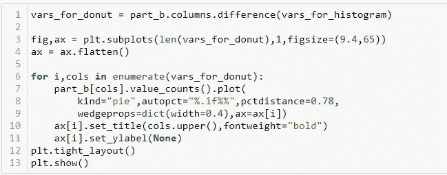
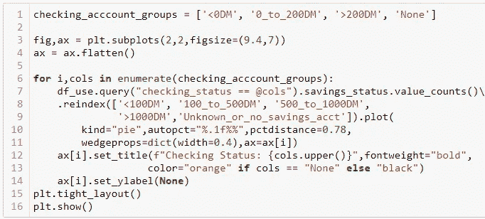

# 贷款申请的数据科学实践

> 原文：<https://medium.com/codex/data-science-practice-for-loan-applications-f3f53ae145eb?source=collection_archive---------4----------------------->

以下是数据科学实践，涉及数据争论、探索性数据分析、预测建模和贷款申请数据集的结果评估。

图片取自:[https://www . template . net/business/letters/sample-loan-application-letters/](https://www.template.net/business/letters/sample-loan-application-letters/)

本文包含 Jupyter 笔记本细胞，以帮助数据科学家重现结果，并可能了解新的 numpy，pandas，seaborn，sklearn 包技巧。

# 资料组

数据集是著名的“Statlog 德国信用数据”的修改版本，可通过以下链接访问:

[*https://archive . ics . UCI . edu/ml/datasets/statlog+(德语+信用+数据)*](https://archive.ics.uci.edu/ml/datasets/statlog+(german+credit+data))

数据集是德国贷款申请的 CSV 文件格式，由汉斯·霍夫曼教授的团队于 1994 年提供。

数据是结构化的表格形式，每一行代表一个贷款申请，其中个人因各种原因申请贷款。它包含 1003 行，关于申请人及其贷款历史的 22 个变量。

# 探索性数据分析

下一步是探索数据集。我们有一个名为“accepted”的目标类，表示应用程序是被拒绝还是被接受。原始数据集中给出的目标变量实际上衡量了对申请人的信用风险；值为**“好”**或**“坏”。**“好”表示申请人值得接受信贷，“坏”则相反。原始数据中 70%的目标变量属于“好”类，其余 30%属于“坏”类。在我们的例子中，0 代表 70%，1 代表 30%。因此，我们应该改变修改后的数据集，将 0 映射到“好”,这意味着贷款批准，将 1 映射到“坏”,这意味着贷款拒绝。我们将使用熊猫图书馆的地图功能，Python。

更正后，贷款批准和拒绝的分布显示在下面 Matplotlib 库的圆环图中。

让我们利用熊猫独有的()函数来探索***personal _ status***字段。它似乎有四个独特的不同的分类值。值以“男性”或“女性”开头，后跟下划线。

现在让我们从字符串中取出“男性”和“女性”部分，并创建一个名为“性别”的新变量。我们将结合使用 split()和 apply()函数。

通过使用 pandas 的 pivot_table()函数，我们可以按性别对目标值进行分组和聚合。

男性支持率为 72.4%，女性为 64.8%。Seaborn barplot()函数有助于显示结果。Matplotlib text()函数也用于在图形中嵌入百分比。

## 数据插补

现在让我们填写缺失的数据(如果有的话)。为了检查丢失的数据，我们将使用 pandas 的 isnull()函数。“age”和“asnm”列都有 50 个缺失值，而“credit_amount”列只有一个。

在输入缺失数据之前，最好先看看变量的直方图。我们将使用 Seaborn 包的 distplot()函数。Matplotlib 的 vlines()函数也用于图表中的垂直线(年龄变量的平均值、中值和众数)。均值、中值和众数是最常用的集中趋势指标。均值度量适合用于非偏斜分布，如正态/高斯分布。在我们的例子中，由于年龄变量是**正偏态**，我们将不得不消除平均指标。

因此，人们可以在中位数和众数之间选择这样的偏态分布。我们将选择**模式**，因为它不会像均值和中值那样扭曲分布形状。均值、中值和众数插补方案在下面的比较图中显示。

现在让我们创建一个因素 ***age_group*** 来分组:25 岁以下、25–34 岁、35–49 岁、50 岁以上。为此，我们将使用 numpy 的 select()函数。

Credit_amount 是应用程序中请求的金额。让我们画出变量的直方图。

因为有**异常值**，直方图是如此无用。由于异常值和其余数据之间的巨大差异，单个箱必须代表几乎全部人口。

现在让我们来看看 credit_amount 字段中的异常值，并剔除它们。在下面的箱线图中可以看到异常值。一些候选人似乎有兴趣获得超过 1000 万德国马克的贷款。在图中，x 轴选择对数刻度，以获得更好的视觉效果。四分位距(IQR)是已知的过滤掉异常值的方法之一。超出**Q1-1.5 iqr 和 Q3+1.5IQR** 范围的值被视为异常值。

让我们计算 25%和 75%的百分位数，并测量范围。该范围将通过乘以 1.5 来扩展，然后 1.5*IQR 之外的值将被视为异常值并从数据集中移除

剔除异常值后，直方图看起来更好。信贷金额变量具有正偏态分布，这意味着尾部在右侧，或者数据更偏向下侧。对于这些类型的分布，平均值大于中值

关于申请人的年龄和所申请的信用额度之间的关系，我们可以知道如下。

首先，我们计算数据集中 age 和 credit_amount 变量之间的相关值。这两者之间的相关性被计算为 **~0.036 一个正值，但是仍然意味着这两者之间非常弱的线性关系**。

两者之间的散点图也给出了变量之间关系的概念。该图表明这两个变量之间没有线性关系。

不过，最好也检查一下我们之前创建的**“age group”**变量。从表面上看，20 岁以下的申请人比其他申请人要求的要少一些。我们来进行一个 T 检验，看上面的假设是否正确。

我们的无效假设如下:

H0:25 岁以下和 25 岁以上的申请人申请的平均信用额度**没有差别**

让我们将显著性水平设置为 0.05，这将在拒绝或未能拒绝零假设时将我们的**置信水平设置为 95%**

基于此的 t 检验结果是:

*   统计:-2.17
*   p 值:0.03

p 值小于我们的显著性水平(0.05)，这意味着我们可以拒绝零假设。因此我们可以有 95%的把握说:与其他申请人相比，20 岁以下的申请人要求稍低。

现在我们来看看年龄和这个叫做“asnm”的变量之间的关系。

以散点图开始来形象化这种关系总是一个好主意。正如我们在下图中，两个变量似乎有抛物线关系(不是线性关系)。因此皮尔逊相关值会误导我们。正如所料，观察到误导性的结果。皮尔逊相关值计算为-0.093，这意味着弱负相关，但是如果我们看图表:

*   当申请人年龄大于 42 岁时，ASNM 值倾向于以指数方式随年龄增长，因此具有很强的正相关性
*   另一方面，当申请人年龄小于 42 岁时，ASNM 和年龄的相关性变成强负相关

总之，这两个参数有很强的相关性。不止如此；下图显示了通过将年龄值放入函数中获得的 ASNM 值。

对于这些类型的非线性相关，**距离相关**度量可用于获得相关值。

## 假设检验

让我们通过构建一个假设并对其进行测试来尝试找到以下问题的答案:

> 拥有一部电话对信用申请被接受的可能性有什么影响？

当实验试图进行比较或找出两个分类随机变量之间的差异时，我们可以使用**卡方检验**，来检验统计差异。

拥有手机(是&无)和信用审批(0 & 1)变量都是分类变量，或者说是非连续变量。因此，我们的目的是提出一个假设，并用卡方检验机制对其进行检验。

所以我们的无效假设如下:

*   H0:“拥有一部手机对获得信贷审批没有任何影响”

由于二元测试只有两种结果(批准或拒绝),自由度为 1。另一种假设也只有一种，那就是:

*   H1:“拥有一部手机**会影响**获得信贷批准”

下表给出了每种组合的计数。在拥有手机的 351 名候选人中，只有 82 人获得了批准，大约 23%的支持率。相反，没有电话的候选人似乎有更高的支持率(~31%)。几乎三分之二的申请人没有手机，这表明数据是在 90 年代收集的。如今，由于几乎每个人都有电话，这种分析可能不会反映到我们的时代。让我们继续进一步测试我们的假设。

让我们将显著性水平设置为 0.05，这将在拒绝或未能拒绝零假设时将我们的**置信水平设置为 95%** 。

计算卡方得分

给定置信度和自由度，计算**临界值**:

如果计算的卡方值大于临界值，那么我们拒绝零假设。因此，我们拒绝零假设。这意味着**“拥有一部手机影响获得信贷审批”**。根据我们之前计算的批准率，可以说拥有一部手机降低了获得批准的机会。

在我们深入研究建模部分之前，让我们更多地探索变量。

现在，我们将变量的分布可视化，并绘制直方图。最初的想法和有趣的事实:

*   这四个变量取大范围的数值(整数值),因此最好使用直方图来显示数值的分布
*   数据集中剩余的变量要么是分类变量，要么是顺序变量，因此我们将使用圆环图来查看分布情况

信贷金额和还款期限如预期相关。它们之间的正相关值被计算为 0.62。

让我们想象分类变量的分布。在特征工程和建模改进阶段，最好不时地回到这个图表，以便对变量分布有一个坚实的掌握。

# 系统模型化

因为我们有:

*   训练我们的模型的目标变量(接受列)
*   目标变量只接受二进制值(1 & 0)

这就变成了二元分类问题。如果我们将奥卡姆剃刀原理应用于机器学习，那么与复杂的黑盒模型相比，“如果它们的性能相似”，选择更简单的模型会更好。然而，如果复杂/高级模型比简单模型表现得好得多，那么我们将不得不选择表现最好的模型。

逻辑回归可能是最适合的(更简单的模型)开始。易于理解其建模方式，也易于解释其参数变化的结果

为了在我们的模型中使用分类变量，我们必须首先将它们转换为 one-hot-encoded 版本:

让我们找出与目标值最相关的特性。注意，前两个最相关的特征来自于**检查状态**变量。这告诉我们检查状态变量对我们的 ML 模型是一个有价值的输入。

如果我们比较每个组对 checking_status 变量的批准率，那么 checking_account 余额为负的组的批准率最低。批准率随着支票账户余额的增加而增加。然而，没有流水账的申请人似乎有最高的批准率。

让我们进一步挖掘。下图显示，如果您的储蓄账户余额超过 1000 元，那么无论您的支票状态如何，您都非常接近获得批准的比率(下面的紫色条)。这个图表仍然不能很好地解释为什么没有流水账的申请者有更高的批准率。

当我们在 checking_status 上检查 savings_status 的分布时，我们可以看到没有流水账的申请人在他们的储蓄账户中有更高的余额。对于这个特定的数据集，这可能是有偏差的，因此最好用其他信用数据集来检查这一现象

数据集的标准化是许多机器学习估计器(如逻辑回归)的常见要求:如果单个特征或多或少看起来不像标准的正态分布数据(例如，均值和单位方差为 0 的高斯数据)，它们可能表现不佳。

现在让我们初始化一个逻辑回归模型

成本矩阵与原始数据集一起提供，为正类的每个误分类错误提供不同的惩罚。正类是目标变量中值为 1 的类，这也意味着申请人没有信用。

*假阴性代价>假阳性代价*

这表明正面类是预测任务的焦点，并且对于银行或金融机构来说，把钱给坏客户比不给好客户更昂贵。在选择性能指标时，我们会考虑这一点。

因此，我们将使用 scikit-learn 中的 **fbeta 分数**，这是已知 F1 分数指标的更通用版本。F-beta 分数是精确度和召回率的加权调和平均值，在 1 处达到其最佳值，在 0 处达到其最差值。beta 参数决定了**召回**在综合得分中的权重。beta < 1 更重视**精度**，而 beta > 1 更倾向于召回。由于我们对更高的召回值感兴趣，我们将设置 **beta=2**

为了避免抽样偏差效应和随机性，我们将使用分层 k-fold 交叉验证技术动态分割数据。我们将拆分数量设置为 10，将数据集拆分为 10 组；在每一轮中，9 个组将用于训练模型，其余的组将用于测试目的。与常规 k-fold 相反，分层 k-fold 以某种方式划分组，以确保基于值的分布，组之间没有显著差异

总之，逻辑回归模型(具有默认参数)得到测试组平均约 0.50 的 F2 分数，这是不足的性能。没有过度拟合的迹象，因为性能已经很低，训练和测试结果也没有明显不同。在下一节中，我们将尝试提高模型性能。

## 我们如何提高性能？

逻辑回归有一个名为 **class_weight** 的超参数，用于处理类别不平衡问题。由于我们的目标变量分布在 30%到 70%之间，调整这个参数将有助于获得更好的回忆值。当我们将 class_weight 参数设置为“平衡”模式时，它使用目标值来自动调整与输入数据中的类频率成反比的权重。这意味着少数阶级(没有信用的候选人)的权重按比例增加。

让我们也尝试优化模型的超参数。为此，我们将使用网格搜索算法，旨在获得我们之前定义的定制 f2 分数的高分:

现在，我们将使用优化的参数来获得最终结果和性能。

如果我们比较调整前后的结果，我们可以说我们取得了进步:

*   test_results 的 F2 分数**从 0.50 提高到 0.72** ，这是一个显著的进步
*   此外，对这类问题非常重要的回忆参数显著增加(**从 0.47 增加到 0.81** )

# 进一步的工作

还有许多其他步骤可以用来获得更好的结果，其中一些是:

*   **特征工程**:这是指从数据中创造出最有用的特征。例如，可以使用领域专业知识从现有数据中提取新特征。还可以进行特征选择，即选择最重要的特征或其他降维方法(例如 PCA)。我们可以使用许多技术来提取特征和选择特征
*   **更高级的模型**:基于决策树的集成模型，如 bagging 和 boosting，也可用于提高性能。众所周知，随机森林、XGBoost、轻量级 GBM 模型对于结构化数据问题表现良好