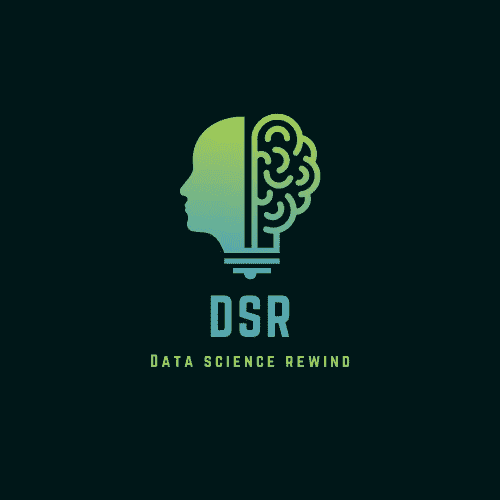

# 数据科学回放#1

> 原文：<https://medium.com/codex/data-science-rewind-1-5dcca68ba0df?source=collection_archive---------6----------------------->

## 过去几周最好的面试准备、教程和趋势

作者图片

本周，脱颖而出的文章围绕着在数据科学中脱颖而出的软技能。

第一篇文章强调了作为数据科学家写作的重要性。虽然数据科学已经变得越来越普遍，但您向其提供解决方案的受众仍然不知道该领域的具体情况，也不知道您是如何获得支持业务决策的数据的。这通常意味着制作演示文稿和撰写文档，用通俗的术语(或者深入的技术术语)交流您的解决方案(数据准备、尝试的方法、最终设计、可能的缺点等)。).查看弗兰克·安德拉德的这篇文章，了解他对讲故事的看法。

 [## 写作可以帮助你成为更好的数据科学家

### 少数人拥有但许多数据科学家需要的技能。

towardsdatascience.com](https://towardsdatascience.com/writing-can-help-you-become-a-better-data-scientist-8b0f8adf74a5) 

第二篇文章会引起在数据科学领域工作了一段时间的人们的共鸣。你可能已经注意到，你的一些“数据调查”或“研究建议”从未真正在任何地方结束。或者甚至可能是一个成熟的项目，没有得到你所期望的牵引力。可能有很多原因，比如没有问正确的问题，没有与正确的利益相关者合作等等。理解这些原因有助于减轻它们。所以看看这篇由 [Brijj](https://medium.com/u/c2951330b4a2?source=post_page-----5dcca68ba0df--------------------------------) 撰写的文章吧

 [## 80%的数据和洞察项目失败的 5 个原因

### 仅在英国，我们每年就在数据项目上花费 240 亿英镑。然而，根据最近的研究，组织…

medium.com](/@brijj.io/5-reasons-why-80-of-data-and-insight-projects-fail-177c68e11461) 

# 面试准备

在本期《数据科学回放》中，我们推荐两篇来自最受欢迎的数据科学出版物《走向数据科学》的文章。

首先，我们重点关注[Soner yld rum](https://medium.com/u/2cf6b549448?source=post_page-----5dcca68ba0df--------------------------------)的一篇文章，内容涵盖了你应该普遍了解的基本统计概念，并在面试前复习一下。归根结底，数据科学在很大程度上是扩展的统计学。

 [## 数据科学家必须知道的 10 个统计概念

### 统计学是数据科学的组成部分

towardsdatascience.com](https://towardsdatascience.com/10-must-know-statistical-concepts-for-data-scientists-645619783c08) 

接下来，我们将介绍一份全面的机器学习面试指南，作者是 [Aliaksei Mikhailiuk](https://medium.com/u/30bef13bba71?source=post_page-----5dcca68ba0df--------------------------------) 。它概述了你在 ML 面试中可能遇到的不同类型的问题，以及不同领域中可能出现的问题类型(NLP、CV、一般理论等)。).

 [## 应对机器学习面试

### 机器学习面试准备指南和资源。

towardsdatascience.com](https://towardsdatascience.com/acing-machine-learning-interviews-aa73d6d7b07b) 

# 教程/实践指南

对于本期《数据科学回顾》，我们推荐两篇关于数据科学不太“性感”的方面的文章，即数据可视化和理解评估指标

数据可视化是使用数据传达有影响力的信息的关键部分。因此，理解数据美学的元素、给定数据集的直观图表、最小化都是有助于建立成功的数据科学职业生涯的技能。查看由 [Fernando Delgado](https://medium.com/u/bf2dc4a15fef?source=post_page-----5dcca68ba0df--------------------------------) 撰写的文章了解更多详情。

 [## 美学数据可视化 101

### 如何(以及如何不)构建优雅精致的剧情

medium.com](/mlearning-ai/aesthetic-data-visualization-101-3f833a27c059) 

第二篇推荐的文章来自《走向数据科学》，讲述了为正确的用例选择正确的指标的重要性。它侧重于混淆矩阵/精度/召回/f1 进行分类。然而，在 [Bex T.](https://medium.com/u/39db050c2ac2?source=post_page-----5dcca68ba0df--------------------------------) 撰写的《端到端数据科学指南》中，将指标与业务成果联系起来以提出正确问题的观点得到了充分的阐述

 [## 关于在分类中使用混淆矩阵的综合教程

### 学习使用混淆矩阵，根据问题的重要性来控制模型输出

towardsdatascience.com](https://towardsdatascience.com/comprehensive-tutorial-on-using-confusion-matrix-in-classification-92be4d70ea18) 

那都是科学家！如果你想看到更多类似的内容，请留下赞。