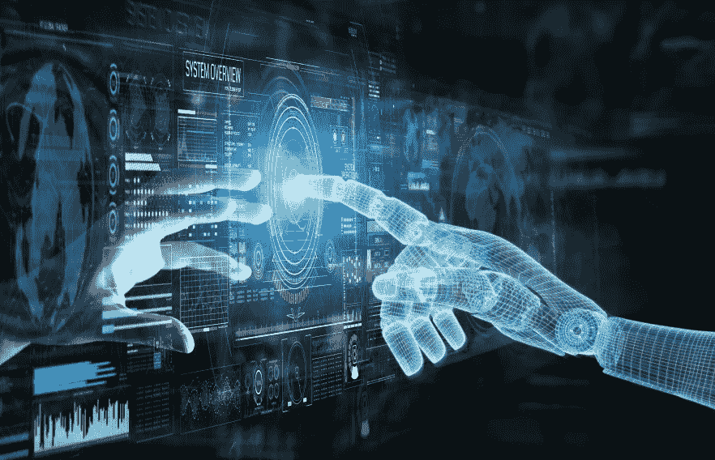

# 数据科学与机器学习:大辩论

> 原文：<https://medium.com/codex/data-science-vs-machine-learning-the-great-debate-5ed7004903cf?source=collection_archive---------22----------------------->

## 数据科学和机器学习的区别

数据科学是一个研究领域，包括应用数据分析和建模技术来解决业务问题。

机器学习是数据科学的一个子集，它应用算法从数据集学习。