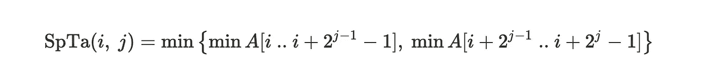
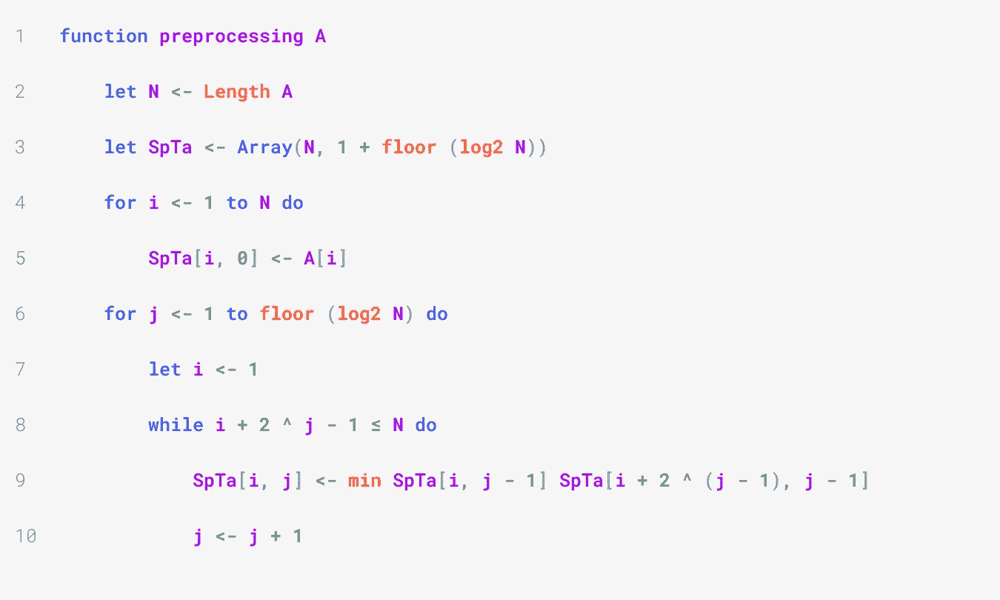
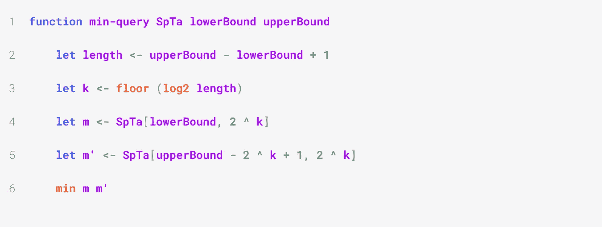

# 数据结构和算法:如何在恒定时间内执行最小查询

> 原文：<https://medium.com/codex/data-structure-algorithms-how-to-perform-minimum-queries-in-constant-time-73e59cdca19a?source=collection_archive---------15----------------------->

马里奥·卡尔沃在 [Unsplash](https://unsplash.com?utm_source=medium&utm_medium=referral) 上的照片

这篇短文描述了稀疏表方法。它能够在给定阵列的子阵列上有效地执行许多最小查询(或最大查询)，即找到子阵列的最小值(或最大值)。

如果我们只有少量的查询要执行，我们可以采用一种简单的方法，遍历我们考虑的所有子数组。然而，如果我们有许多查询要做，这种方法将会非常慢。

我们将从在线性时间内预处理输入数组开始。这个预处理步骤产生一个辅助数组，我们将使用它来计算任何子数组在常数时间内的最小值。

在本文中，我们将使用字母 *A* 来表示输入数组，使用 *N* 来表示它包含的元素数量。索引从 1 开始。

# 预处理

预处理步骤计算长度为 2 的幂的每个子数组的最小值。

我们将使用动态规划来计算θ(N log N)时间和空间中的预计算值。

我们将预先计算的结果存储在一个二维数组中，表示为 *SpTa* (用于稀疏表)。对于所有有意义的索引 *i* ， *j* ， *SpTa* (i，j)将对应于从索引 *i* 开始并且正好包含 2^j 元素的子数组的最小值: *A* [ *i* ..*我* + 2^j - 1】。 *i* 可以是 *A* 的任意一个指数(即在 1 和 *N* 之间)并且 *j* 必须满足 2^j ≤ *N* ，所以 *j* ≤ log₂ *N* 。因此 *SpTa* 的形状为 *N* × (⎣log₂ N⎦+ 1)。(“+ 1”是因为 *j* 可以取值 0。)

为了填充这个数组，我们首先为 *A* 的所有索引 *i* 设置 *SpTa* (i，0)=*A*【I】。这是因为子阵*A**I*.. *i* + 2⁰ - 1】只包含 *A* [ *i* ]，所以它的最小元素确实是 *A* [ *i* ]。

最佳子结构来自简单的观察:两个子阵列的最小值之间的最小值是它们的并集的最小值。因此，*A**I*的最小值.. *i* + 2^j - 1】是 *m* 和 *m'* 之间的最小值，其中 *m* 是 *A* [ *i* 的最小值.. *i* + 2^{j - 1} - 1]和 *m'* 是*a*[*I*+2^{j-1]的最小值..*我* + 2^{ *j* } - 1]:

代入先前计算并存储在 *SpTa* 中的值，我们得到:

为了实现上述方法，需要注意的是， *SpTa* ( *i* ， *j* )的计算依赖于 *i* 较低，而 *j* 较高的计算。因此，算法的外环对应于 *j* ，内环对应于 *i* 。

下面的伪代码定义了一个算法，该算法计算给定数组的稀疏表。

上述算法在θ(*N*log*N*)时间内运行。

# 计算子数组的最小值

我们可以想到任何一个子数组 *A* [ *i* .. *j* 为两个子数组*U*:=*A*[*I*.. *i* + 2^ *k* — 1】和*v*:= a[*j*—2^*k*+1..长度为 2 的幂的 j。我们选择 *k* 使得 2^ *k* 是不超过 *A* [ *i* 长度的 2 的最大幂.. *j* :

我们需要证明一个[I]的所有值..j]属于两个子数组 *U* 和 *V* 中的一个。首先，我们观察到两个子数组具有相同的长度。假设有一个值 *A* [ *p* ](其中*I*≤*p*≤*j*)不在 *U* 或 *V* 中。那么 2 * 2^ *k* 严格小于 a[I]的长度..j】。因此，存在一个大于 2^k 的 2 的幂，但仍不超过 a[I]的长度..j】。

使用这种方法，我们可以实现一个函数，该函数采用一个稀疏表和一个子数组的上下界，并在 O(1)时间内返回该子数组的最小值:

因为 2^k 是不超过子阵列长度的 2 的最大幂。

# 支持我

感谢阅读！我是数学和计算机科学的学生，写的文章涵盖了计算和编程的各个领域。如果你想在我发表新故事时收到邮件或者成为我的推荐会员，你可以点击这个链接来订阅:[https://medium.com/subscribe/@alouizakarie](/subscribe/@alouizakarie)。