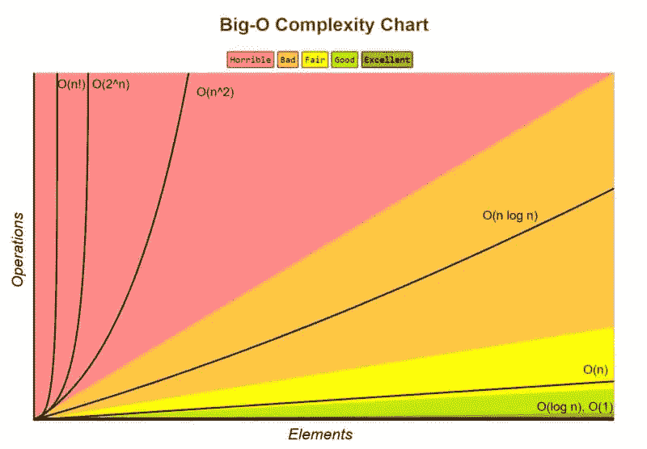

# 数据结构与算法:大 O

> 原文：<https://medium.com/codex/data-structure-and-algorithm-big-o-fd8f906c602?source=collection_archive---------25----------------------->

作为开发人员，解决问题是我们旅程中的一个重要方面，当涉及到解决问题时，我们可以给自己一个很大提升的最好方法之一是通过学习**数据结构和算法**。

## **什么是数据结构？**

数据结构只是存储数据的一种编程方式，因此可以有效地使用它。

## **什么是算法？**

算法是一个循序渐进的过程，总体上是为了达到预期的目标。算法独立于编程语言，它们可以为任何语言编写。

# **大 O**

在可以将代码分类为好代码之前，可以赋予代码两个主要特征。这些特征是:

1.  可读性。
2.  可扩展性。

**大 O 渐近分析**帮助我们确定代码的可伸缩性。说到大 O，我们可以问自己一些问题，比如:

1.  运行一个问题或任务需要多长时间？。这可以认为是一个问题的(**时间复杂度**)。
2.  问题运行时消耗的内存量是多少？这被认为是问题的(**空间复杂度**)。

在考虑大 O 时，有一些关键的符号需要注意:



来自[大 O cheatsheet](https://www.bigocheatsheet.com) 的大 O 图表

1.  **O(1) —常数时间:**

就时间和空间而言，这具有最小的复杂性，这意味着您的代码占用更少的内存空间，并且在尽可能短的时间内执行。一个例子可以是:

```
 function LogElement(array) {   
      console.log(array[0]);
}
```

上面的 javascript 函数可以被认为是 O(1 ),因为它总是在运行时打印索引 0 的元素，这使得它在尽可能短的时间内执行。

2. **O(n) —线性时间:**

线性时间可以描述为随着元素的增加而增加的操作。就时间和空间复杂性而言，线性时间是第二有效的大 O 符号。一个例子是:

```
function LoopThroughBoxesArrayAndFindBlue(boxes) {
   for (var i = 0; i < boxes.length; i++) {
      if(boxes[i] === 'Blue') {
         console.log("Found Blue")
      }
   }
}
```

上面可以认为是 O(n)因为这个循环运行了 n 次，我们无法确定在找到“BLUE”之前循环会运行多少次。

3. **O(n ) —二次:**

当我们有嵌套循环时，就会发生这种情况。当我们遇到这种情况时，我们必须想出有效的方法来将我们的解转化为 O(n)。白板访谈中的 O(n)解决方案可以被认为是我们解决问题的第一个也是最低效的解决方案。

```
function printPairs(boxes) {

  for (var i = 0; i < boxes.length; i++){
    for (var j = 0; j < boxes.length; j++){
      console.log (boxes[i] , boxes[j])
    }
  }
}const x = [1,2,3,4,5]printPairs(x)
```

大 O 的一个骗术就是总知道一个循环总是被当做 O(n)，有嵌套循环就变成 O(n * n)就变成 O(n)。

**其他大 O 记法有:** 1。O(n ) —立方
2。O(log n) —对数
3。O(n！)—阶乘时间(这也被称为哦不哈哈)

# **大魔神的规则**

1.**最坏的情况** —每当我们遇到问题时，我们必须总是考虑和讨论程序执行所需的最坏的可能时间，然后我们可以进一步思考如何将解决方案优化成可能的最佳执行时间。

2.**去掉常数** —我们在寻找一个函数的大 O 时，找到了消除所有常数的方法，把大 O 符号化简为 O(n)。
在我们得到 O(1 + n + 100)的情况下，我们可以说 n 具有更大的值，因为 n 可以是任何值，当这种情况发生时，我们丢弃常数，得到 O(n)。

3.**不同的输入术语** —当被问及不同术语的大 O 时，大多数人往往会在面试中失败，在这种情况下，我们需要注意输入术语…下面的示例代码解释了这一点

```
function LoopThroughArray(boxes) {
  boxes.forEach(boxes1 => {
    console.log(boxes1)
  }) boxes.forEach(boxes1 => {
    console.log(boxes1)
  })
}
```

上述函数的大 O 将是 O(n + n ),即 O(2n ),当我们去掉常数时，它将变成 O(n)。当我们看不同的术语时。

```
function LoopThroughArray(box, boxes) {
  box.forEach(boxes1 => {
    console.log(boxes1)
  }) boxes.forEach(boxes1 => {
    console.log(boxes1)
  })
}
```

注意命名。大多数人将其称为 O(n ),这是非常错误的，这种情况下的大 O 变成 O(a + b ),因为每个输入的大小可以不同，盒子的大小可以是 100，盒子的大小可以是 1000。因为我们有两个 for 循环，并不意味着它们循环相同的项。

4.**舍弃非主导术语** —当谈到大 O 时，我们倾向于舍弃最不主导的术语。例如，我们得到一个大 O 符号 O(x +3x + 100 + x/2 ),在这种情况下，x 比 3x、100 和 x/2 更占优势，因为当谈到大 O 时，我们考虑可伸缩性。

有关 Big O 的更多信息，请查看这篇[文章](https://www.freecodecamp.org/news/big-o-notation-why-it-matters-and-why-it-doesnt-1674cfa8a23c/)和这个伟大的[课程](https://www.udemy.com/course/master-the-coding-interview-data-structures-algorithms/)。

希望你学习愉快！！！