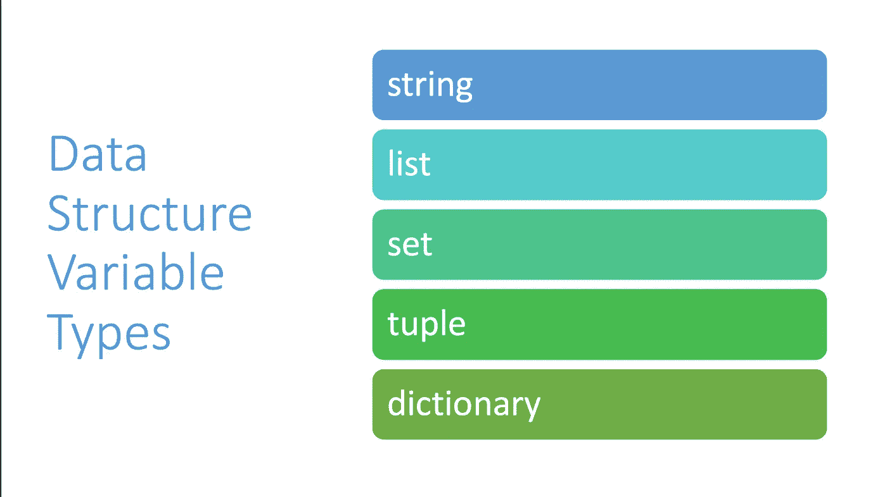

# 数据结构变量类型

> 原文：<https://medium.com/codex/data-structure-variable-types-666c837bec0f?source=collection_archive---------10----------------------->

本书面课程是香蕉芯片技术公司 Python 速成班的一部分。视频讲座、编程作业作业等内容请访问我们的 [*网站*](https://www.bananachiptech.com/products/codingcourses/python/) *。*

变量允许程序员存储信息，供以后在程序中使用。正如我们在上一篇关于 python 中的[基本变量类型的文章中所提到的，了解您正在使用的变量类型对于获得预期的结果至关重要。在…](/codex/basic-variable-types-in-python-4a121326cfe4)