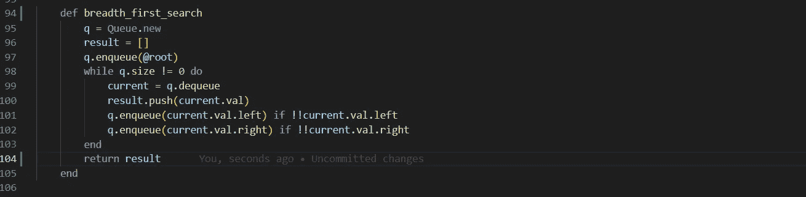

# Ruby 中的数据结构和算法:二叉树的广度优先搜索

> 原文：<https://medium.com/codex/data-structures-algorithms-in-ruby-breadth-first-search-for-binary-trees-6bcbb48bd88b?source=collection_archive---------5----------------------->

使用我们的自定义队列类的解决方案

上周，我们为二叉查找树实现了一个 *#find* 方法，该方法返回布尔值 *true/false* ，表明我们的值是否被找到。如果我们想返回二叉查找树中的所有节点呢？看看任何二叉树的表示(它甚至不一定是二叉查找树)。如果你被要求写一些代码来返回…