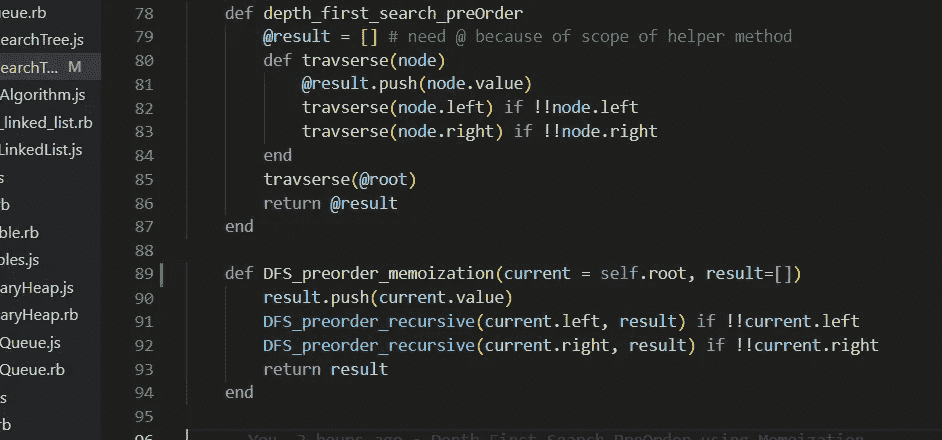

# Ruby 中的数据结构和算法:二叉树的深度优先搜索(前序)

> 原文：<https://medium.com/codex/data-structures-algorithms-in-ruby-depth-first-search-pre-order-for-binary-trees-e2c836e44c08?source=collection_archive---------5----------------------->

继续我们当前的主题**二叉树**在 Ruby 中的遍历，本周我们将介绍**深度优先搜索**。如果您还记得上一篇关于广度优先搜索的文章，遍历二叉树应该通过只访问树上的每个节点*一次*来完成。树遍历的这一部分应该保持…