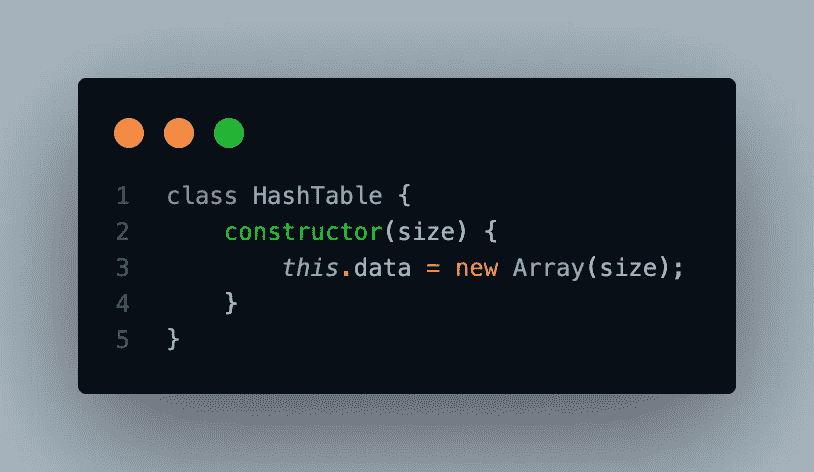
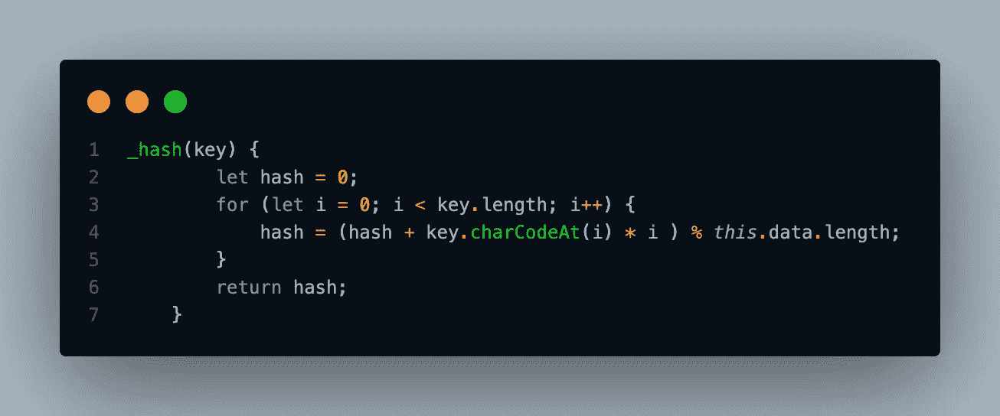
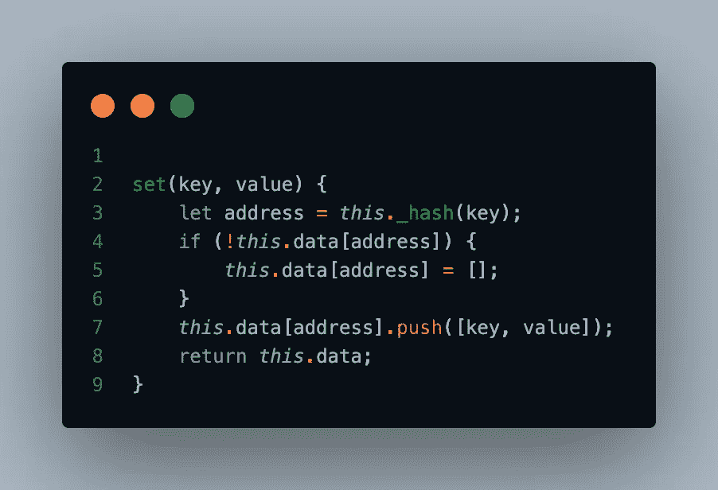
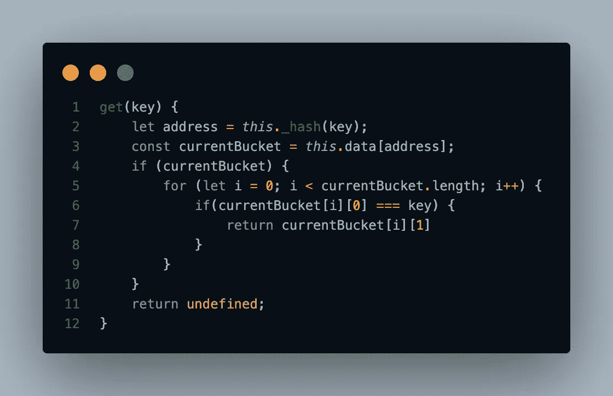
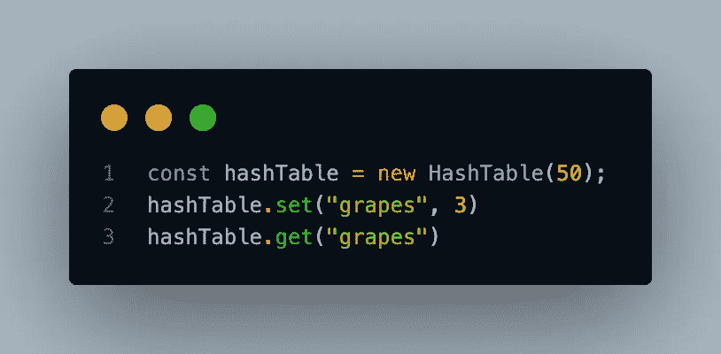
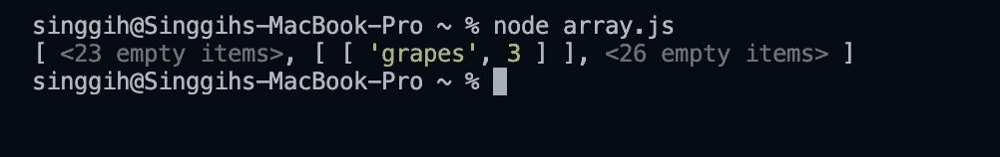
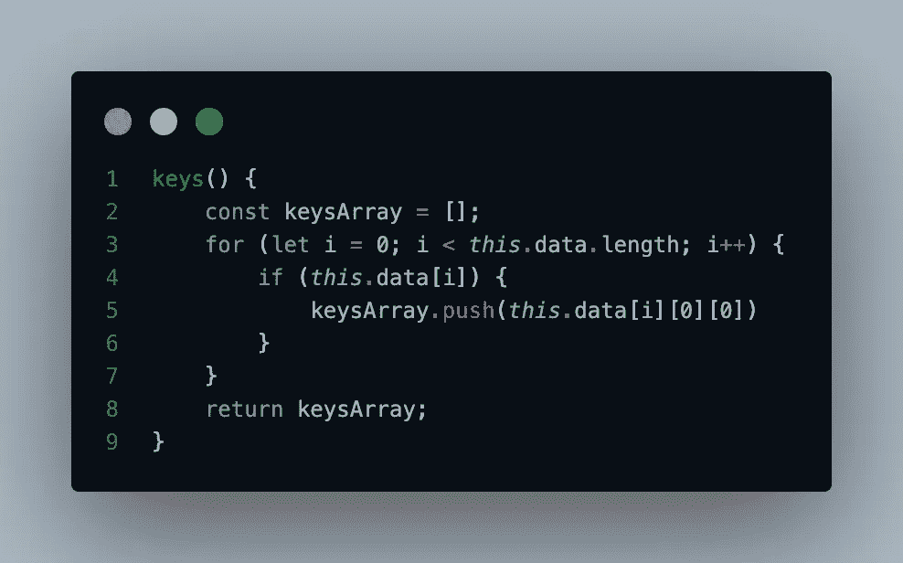
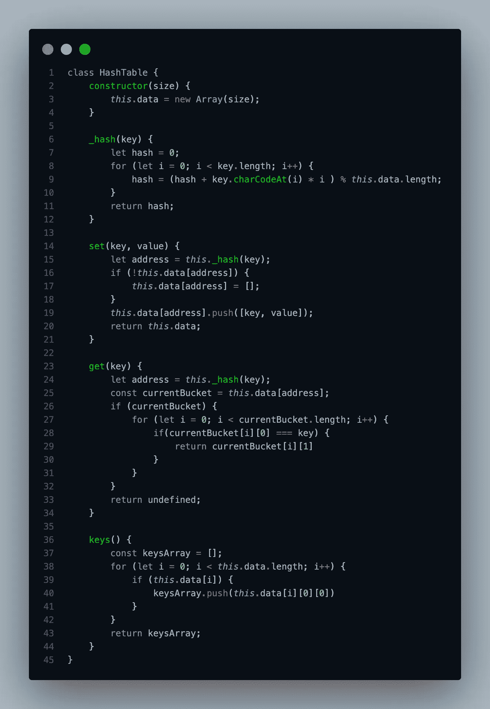

# 数据结构以及如何从头开始构建它(哈希表)#2

> 原文：<https://medium.com/codex/data-structures-and-how-to-build-it-from-scratch-hash-table-2-95158a7883fc?source=collection_archive---------22----------------------->

**哈希表**是一种数据结构，可以用来将键映射到它们的特定值，它也被称为**哈希表。**哈希表高效地执行键值对的插入和删除操作，并在哈希表中搜索键值。顺便说一下，JavaScript 提供了内置函数来制作哈希表。它们被称为 Map()和 Set()。

> *琐事:集合是需要由唯一值组成的集合数据集，当我们将键映射到值*时，映射是当你有成对的关联数据时

JavaScript 中的哈希表有两个组成部分，对象和哈希函数。

- Object 包含存储数据的哈希表，它保存哈希表的所有“键-值”对。

-哈希函数是为哈希表定义的，用于确定给定键值对的“索引”。

所以我们要创建一个名为 HashTable 的类，它包含四个方法:hash()、set()、get()和 keys()。

首先，我们必须创建一个类及其构造函数。我们需要创建一个名为 data 的属性来确定我们将要创建的散列映射的大小。

类哈希表及其构造函数。

然后我们会做一个叫 _hash()的方法。这个方法基本上返回一个随机整数(比如给定的参数是“grapes”，构造函数的大小是 50，就返回 23)。我们需要这个方法作为其他方法的地址(我们稍后会看到)。

_ 哈希方法

之后，我们将创建一个名为 set()的方法，将数据插入到一个散列表中，并将键和值作为参数。

永久变形测定法

首先，我们需要创建一个地址，并使用 _hash()方法来确定值本身。那么如果 this.data[address]为空，我们将分配一个空数组。然后我们将[键，值]推送到 this . data[地址]。最后，我们必须返回 this.data。

接下来我们要做一个叫 get()的方法，这个方法，如果基于给定键的数据存在，它会返回一个基于那个键的值，否则会返回 undefined。

获取方法

和往常一样，我们必须将地址确定为 _hash 方法的返回。我们必须创建一个名为 currentBucket 的变量作为 this.data[address]变量。我们要确保 currentBucket 不为 null，如果为 null，就作为 undefined 返回。

为了更好地理解循环内部的情况，我们必须查看 currentBucket 值。

console . log(current bucket)

在循环内部，如果 currentBucket[i][0]或 **grapes** 是===给定的 params key，我们将返回 currentBucket [i][1]或 **3** 。为什么我们需要这样做？因为即使密钥不同，地址也有可能相同。

最后一个方法是 keys()。keys()将返回 this.data 中的所有键

keys 方法

首先，我们将一个变量作为临时数组，然后我们循环 this.data.length，如果 this.data[i]不为空，我们将把 this.data 中的每个键都推送到 keyArray。

所以，就这样了。我们刚刚用 class 做了自己的哈希表。这是哈希表类的完整代码。

哈希表的完整代码

[数据结构和如何从头构建(链表)上见#3！](https://singgihaji.medium.com/data-structures-and-how-to-build-it-from-scratch-linked-list-3-c7f609950a60)