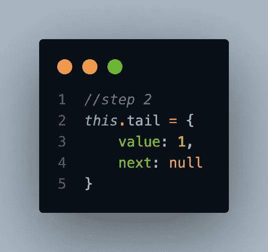
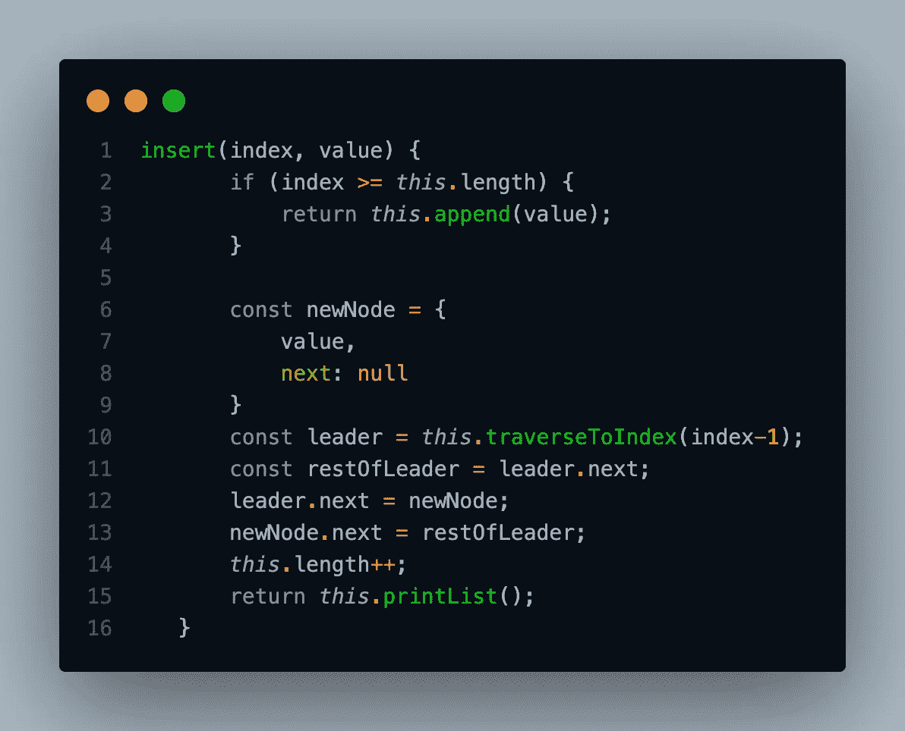

# 数据结构和如何从头构建它(链表)#3

> 原文：<https://medium.com/codex/data-structures-and-how-to-build-it-from-scratch-linked-list-3-c7f609950a60?source=collection_archive---------8----------------------->

LinkedList 是动态数据结构，因为我们可以轻松地添加或删除元素，它甚至可以根据需要增长。就像数组一样，链表按顺序存储元素，但不像数组那样连续存储元素。

因此，我们将创建一个名为 LinkedList 的类，它包含四个主要方法:append()、prepend()、insert()和 remove()。

首先，我们必须创建一个类及其构造函数。我们需要创建头部、尾部和长度等属性。

linkedlist 的类和构造函数

head 是一个带有**值**和**下一个**的对象，**值**将用构造函数的一个参数的值初始化。Tail 将等于 head，因为当它第一次初始化时，它只有 1 个数据，这使得 tail 和 head 相同。长度自动为 1。

接下来，我们要创建我们的第一个方法，append。Append 是一种向最后一个节点添加新节点的方法。

附加方法

我们制作一个名为 newNode 的变量，它是一个带有值和 next 的对象。然后我们将 this.tail.next 设置为 newNode，this.tail 设置为 newNode。并增加长度，因为我们刚刚在 LinkedList 中添加了 1 个数据。看到第 1 步和第 2 步可能会让你感到困惑，我会解释更多。

追加方法的步骤 1

在步骤 1 中，我们将 this.tail.next 设置到一个变量 newNode 或一个带有值的对象(假设方法 append 参数的值为 1)和 next。因为 this.tail 是对 this.head 的引用，所以在我们将 this.tail.next 设置到变量 newNode 之后，它看起来会是这样。

追加方法的步骤 2

在第 2 步中，我们只需将 this.tail 设置为变量 newNode(假设方法 append 参数的值为 1 ),因为它将是 LinkedList 的最后一个数据。

下一个方法是 prepend()。Prepend 是向第一个数据添加新节点的方法。

前置方法

与 append()一样，我们必须创建一个名为 newNode 的变量。之后，我们将 newNode.next 设置为 this.head，并将 this.head 设置为 newNode。然后我们要增加这个长度，最后我们要返回这个。我将解释更多的步骤 1 和步骤 2。

让我们假设我们有这个。head 值为 1，next 为 null。所以第一步会是这样的。

prepend 方法的步骤 1

对于步骤 2，我们将 this.head 设置为一个新节点，并在步骤 1 之前对其进行了修改。所以会是这个样子。

prepend 方法的步骤 2

为了能够更清楚地想象我们的数据，我们需要创建一个名为 printList()的 helper 方法，这个方法将打印 node 中的所有值，它将是一个数组。示例:[1，3，4，10]

printList 方法

下一个方法是 insert()，与只能在第一个或最后一个数据处插入节点的 prepend 和 append 不同，insert()将根据给定的索引添加一个节点。

插入方法

首先，我们需要有两个参数索引和值。然后我们需要一个条件，如果给定的索引大于或等于我们节点的长度，我们将把节点加在最后一个数据上。和其他方法一样，我们必须创建一个名为 newNode 的变量。之后，我们有了一个叫做 traverseToIndex 的帮助器方法。

基本上，traverseToIndex 将返回给定索引之前的数据。假设我们调用了 LinkedList(1)和 append() 3 次，给定值为 3、6 和 10。如果我们调用我们的方法 printList()，它将是[1，3，6，10]。

遍历索引方法

如果我们有数据[1，3，6，10]并且给定的索引是 2，它将返回 1 和 3 或[1，3]的节点。所以变量 leader 会有一个值节点 1 和 3(当然还有节点 3 的 next 的值)。

然后，我们让一个名为 restOfLeader 的变量等于 leader.next，这意味着它将是数据[6，10]的其余部分。之后，我们将 leader.next 设置到我们的 newNode(不再是[6，10]，而是[givenValue])，并将 newNode.next 设置到 restOfLeader。在 insert(2，givenValue)方法的结尾，它将是[1，3，givenValue，6，10]。

最后一个方法是 remove，remove 将删除基于给定索引的数据。

移除方法

所以我们有了最终数据[1，3，给定值，6，10]。如果给定的索引是 2，变量 leader 将是[1，3]。之后，我们将 leader.next (givenValue)设置为 leader.next.next (6)。所以最后的数据会是[1，3，6，10]。

我们最终的代码将如下所示。

链接列表的最终代码

你意识到我们所做的一切只是为了一个链表吗？(它没有以前的)。双向链表呢？那么，我们必须修改我们的代码。

首先，我们必须修改我们的类和构造函数。我们添加 prev 作为空值。

双重链接列表的类和构造函数

接下来是 append()，我们必须在 newNode 中添加 prev，并将 newNode.prev 设置为 this.tail。

双向链表的追加方法

之后，我们必须修改我们的 prepend()。我们必须在 newNode 中添加 prev，并将 this.head.prev 设置为 newNode。

双向链表的前置方法

最后一个是 insert()。所以我们必须在 newNode 中添加 prev。之后，我们将 newNode.prev 设置为 leader，将 restOfLeader.prev 设置为 newNode。

双向链表的插入方法

双向链表的最终代码。

双向链表的最终码

我们将在“数据结构和如何从头构建数据结构(堆栈)”上再见#4！