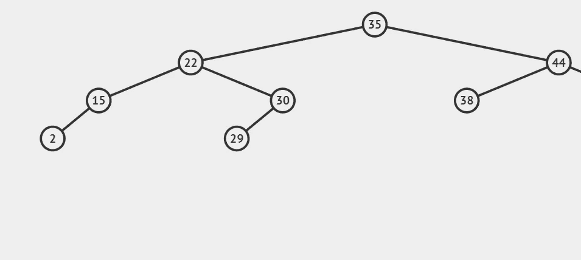

# Ruby 中的数据结构:二叉查找树—第二部分

> 原文：<https://medium.com/codex/data-structures-in-ruby-binary-search-tree-part-ii-87c1de71ed25?source=collection_archive---------8----------------------->

## …以及递归方法的介绍

上周，我们开始介绍二叉查找树。在 Ruby 中，我们设置了我们的*节点类*和我们的 *BinarySearchTree 类*，并实现了#insert 方法。今天，我们将编写#find 方法，它将让我们更好地了解如何遍历二叉查找树。然而…