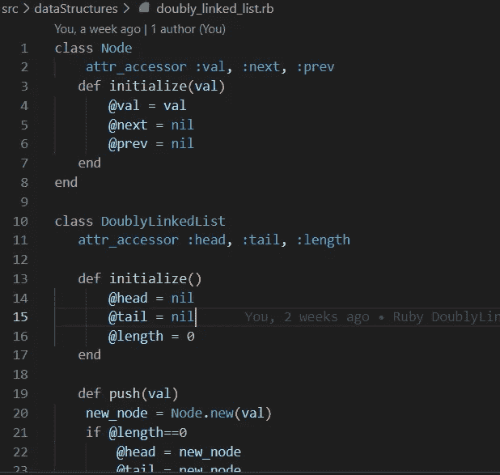

# Ruby 中的数据结构:双向链表

> 原文：<https://medium.com/codex/data-structures-in-ruby-doubly-linked-list-f4d27e432f7c?source=collection_archive---------6----------------------->

上周我们看了 Ruby 中的单链表，并举例说明了如何建立类结构，以及探索一些常见的方法。今天，我们将继续讨论带有双向链表的 Ruby 中的数据结构。

单链表和双链表的主要区别在于单链表中的节点只有一个指针， *next* …