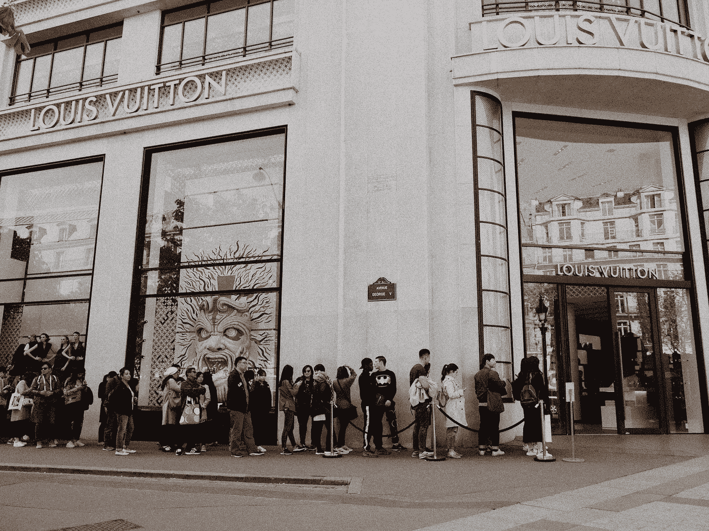

# Ruby: Queue 中的数据结构

> 原文：<https://medium.com/codex/data-structures-in-ruby-queue-8953ee895559?source=collection_archive---------5----------------------->

Melanie Pongratz 在 [Unsplash](https://unsplash.com/s/photos/queue?utm_source=unsplash&utm_medium=referral&utm_content=creditCopyText) 上的照片

我来自剧院背景，当舞台经理说“准备灯光提示 7 和声音提示 g”时，我对队列的概念围绕着执行什么灯光模式或播放什么声音设计文件。当我听到舞台经理说“开始”时，我要执行适当的灯光和声音设计模式。2003 年，我发现自己在苏格兰爱丁堡艺术节上表演。我被告知的第一件事是当我得到…